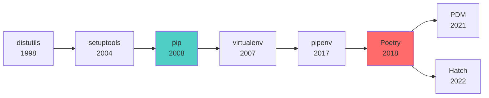
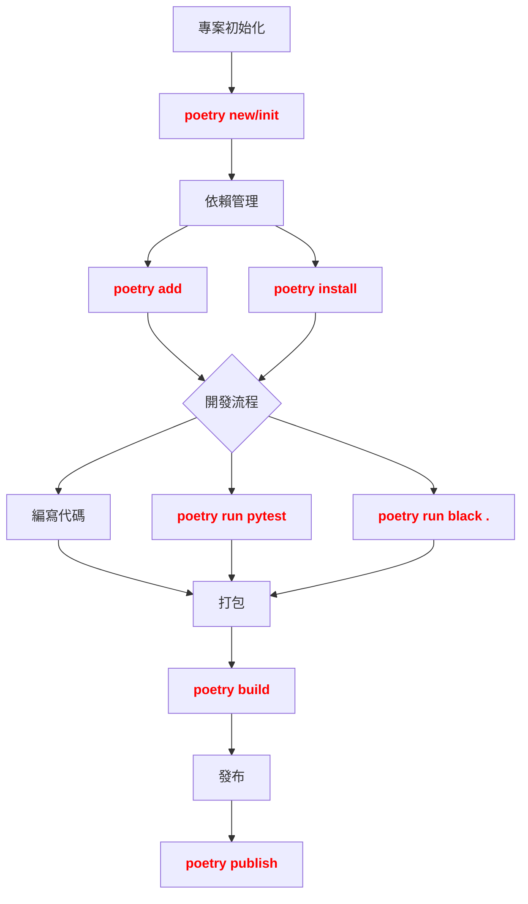

# 第 1.1 章:Poetry 安裝與配置完全指南

本章旨在為您提供一份教科書級別的教學講義,深入探討 **Poetry** 這個現代 Python 依賴管理工具的核心概念、安裝方法與最佳實踐。我們將從基礎理論出發,深入第一原理,最終將 Poetry 置於 Python 生態系統的宏觀知識體系中進行審視。

| 概念 | 中文譯名 | 典型用途 | 優點 | 侷限 |
| :--- | :--- | :--- | :--- | :--- |
| **Fundamentals** | 基礎理論 | 快速掌握 Poetry 的安裝、初始化專案與基本指令。 | 直觀易懂,能快速建立開發環境。 | 易忽略依賴鎖定機制與虛擬環境隔離的本質。 |
| **First Principles** | 第一原理 | 從依賴解析演算法 (Dependency Resolution) 與語義化版本 (Semantic Versioning) 的本質,理解為何 Poetry 優於 pip。 | 深入本質,有助於解決複雜的依賴衝突問題。 | 理論性強,需要理解版本約束與依賴圖的數學概念。 |
| **Body of Knowledge** | 知識體系 | 將 Poetry 置於 Python 打包生態演化史與 CI/CD 工作流的完整框架中。 | 結構完備,能理解 requirements.txt/setup.py/pyproject.toml 的差異。 | 內容龐雜,不適合快速入門。 |

---

## 1. Fundamentals (基礎理論)

在 Python 開發的歷史中,**依賴管理 (Dependency Management)** 長期由 `pip` 與 `virtualenv` 主導,但它們面臨**三大挑戰**:
1. **依賴地獄 (Dependency Hell)**: 手動管理 `requirements.txt`,容易出現版本衝突。
2. **環境不一致**: 開發環境與生產環境的套件版本不同,導致「在我機器上可以跑」的問題。
3. **打包混亂**: `setup.py`、`setup.cfg`、`MANIFEST.in` 等多個配置檔案,難以維護。

**Poetry** (2018 年發布) 徹底解決了這些問題,提供了**單一配置檔案** (`pyproject.toml`) 與**確定性依賴鎖定** (`poetry.lock`)。

### Poetry 的核心思想

**Poetry = 依賴管理 + 虛擬環境 + 打包工具**

```
核心功能:
1. 依賴解析: 自動解決套件版本衝突
2. 鎖定檔案: poetry.lock 確保環境一致性
3. 虛擬環境: 自動創建與管理隔離環境
4. 打包發布: 一鍵發布到 PyPI
```

**直觀理解**:
假設你在組裝電腦:
- **pip**: 你需要自己查詢每個零件的相容性 (手動管理 requirements.txt)
- **Poetry**: 給你一個相容性列表,自動選擇最佳組合 (自動解析依賴)

### Poetry vs pip 對比

| 特性 | pip + virtualenv | Poetry |
|:---|:---|:---|
| **配置檔案** | requirements.txt (多個) | pyproject.toml (單一) |
| **依賴鎖定** | ❌ 需手動 pip freeze | ✅ 自動生成 poetry.lock |
| **依賴解析** | ❌ 不解決衝突,直接報錯 | ✅ 自動解析最佳版本組合 |
| **虛擬環境** | 手動 virtualenv 創建 | ✅ 自動創建與啟動 |
| **打包發布** | setup.py + twine | ✅ poetry build && poetry publish |
| **開發依賴分離** | requirements-dev.txt | ✅ [tool.poetry.dev-dependencies] |

---

## 安裝 Poetry (跨平台)

### Windows 安裝

**方法 1: 官方安裝腳本 (推薦)**

```powershell
# PowerShell (以系統管理員身分執行)
(Invoke-WebRequest -Uri https://install.python-poetry.org -UseBasicParsing).Content | python -

# 設定環境變數 (將 Poetry 加入 PATH)
$Env:Path += ";$Env:APPDATA\Python\Scripts"

# 驗證安裝
poetry --version
```

**方法 2: pipx 安裝 (推薦用於隔離環境)**

```powershell
# 先安裝 pipx
python -m pip install --user pipx
python -m pipx ensurepath

# 用 pipx 安裝 Poetry
pipx install poetry

# 驗證安裝
poetry --version
```

**方法 3: pip 安裝 (不推薦,可能污染系統環境)**

```powershell
pip install poetry
```

### macOS/Linux 安裝

**官方安裝腳本 (推薦)**

```bash
# 下載並執行安裝腳本
curl -sSL https://install.python-poetry.org | python3 -

# 將 Poetry 加入 PATH (bash/zsh)
echo 'export PATH="$HOME/.local/bin:$PATH"' >> ~/.bashrc
source ~/.bashrc  # 或 source ~/.zshrc

# 驗證安裝
poetry --version
```

**Homebrew 安裝 (macOS)**

```bash
brew install poetry
```

### 配置 Poetry

**設定虛擬環境在專案目錄內 (推薦)**

```bash
# 將 .venv 資料夾建立在專案目錄內,方便 IDE 辨識
poetry config virtualenvs.in-project true

# 查看所有配置
poetry config --list
```

**其他實用配置**

```bash
# 設定 PyPI 鏡像源 (中國大陸用戶)
poetry source add --priority=primary tsinghua https://pypi.tuna.tsinghua.edu.cn/simple

# 設定平行下載 (加速安裝)
poetry config installer.max-workers 10

# 禁用虛擬環境創建 (在 Docker 等容器環境)
poetry config virtualenvs.create false
```

---

## 快速實作: 初始化 NLP 專案

### 創建新專案

```bash
# 創建名為 nlp-project 的新專案
poetry new nlp-project

# 專案結構:
nlp-project/
├── pyproject.toml         # 專案配置檔案
├── README.md              # 專案說明
├── nlp_project/           # 原始碼目錄
│   └── __init__.py
└── tests/                 # 測試目錄
    └── __init__.py
```

### 初始化現有專案

```bash
# 在現有專案目錄中初始化 Poetry
cd my-existing-project
poetry init

# 互動式問答:
# 1. 專案名稱: my-nlp-app
# 2. 版本: 0.1.0
# 3. 作者: Your Name <your@email.com>
# 4. Python 版本: ^3.10
# 5. 依賴套件: (稍後手動添加)
```

### 安裝 NLP 核心套件

```bash
# 啟動專案虛擬環境
cd nlp-project
poetry shell

# 安裝 NLP 核心套件
poetry add jieba               # 中文分詞
poetry add nltk                # 自然語言處理工具包
poetry add spacy               # 工業級 NLP 函式庫
poetry add transformers        # Hugging Face Transformers

# 安裝深度學習框架
poetry add tensorflow          # TensorFlow
poetry add torch torchvision   # PyTorch

# 安裝開發依賴 (不會打包到生產環境)
poetry add --group dev pytest  # 測試框架
poetry add --group dev black   # 代碼格式化
poetry add --group dev flake8  # 代碼檢查
```

**生成的 pyproject.toml**:

```toml
[tool.poetry]
name = "nlp-project"
version = "0.1.0"
description = "NLP 專案範例"
authors = ["Your Name <your@email.com>"]

[tool.poetry.dependencies]
python = "^3.10"
jieba = "^0.42.1"
nltk = "^3.8.1"
spacy = "^3.7.2"
transformers = "^4.35.0"
tensorflow = "^2.14.0"
torch = "^2.1.0"

[tool.poetry.group.dev.dependencies]
pytest = "^7.4.3"
black = "^23.11.0"
flake8 = "^6.1.0"

[build-system]
requires = ["poetry-core"]
build-backend = "poetry.core.masonry.api"
```

### 常用 Poetry 指令

```bash
# 安裝所有依賴 (根據 poetry.lock)
poetry install

# 更新所有套件到最新版本
poetry update

# 顯示已安裝套件
poetry show

# 顯示套件依賴樹
poetry show --tree

# 移除套件
poetry remove jieba

# 執行 Python 腳本
poetry run python script.py

# 執行測試
poetry run pytest

# 啟動虛擬環境的 Shell
poetry shell

# 退出虛擬環境
exit  # 或 Ctrl+D
```

---

## 2. First Principles (第一原理)

從第一原理出發,Poetry 的有效性根植於對**依賴解析演算法 (Dependency Resolution)** 的深刻理解。

### 為什麼 pip 無法解決依賴衝突?

**問題: pip 的「貪婪演算法」侷限**

假設你的專案需要:
```
你的專案:
├─ Package A (需要 Package C >= 1.0, < 2.0)
└─ Package B (需要 Package C >= 1.5, < 3.0)

pip 的行為:
1. 安裝 Package A (同時安裝 C == 1.9)
2. 安裝 Package B (發現 C 已存在,跳過)
3. 執行時 Package B 要求 C >= 1.5,剛好符合 ✅

但如果順序相反:
1. 安裝 Package B (同時安裝 C == 2.5)
2. 安裝 Package A (發現 C 已存在,跳過)
3. 執行時 Package A 要求 C < 2.0,衝突 ❌
```

**pip 的問題**: 安裝順序影響結果,無法保證一致性。

### Poetry 的依賴解析演算法

**SAT Solver (布林可滿足性問題求解器)**

Poetry 使用 **PubGrub 演算法** (Dart/Pub 包管理器的演算法):

```
步驟 1: 將依賴約束轉換為布林表達式
Package A 需要 C >= 1.0 AND C < 2.0   → (C_1.0 OR C_1.5 OR C_1.9) AND NOT C_2.0
Package B 需要 C >= 1.5 AND C < 3.0   → (C_1.5 OR C_1.9 OR C_2.5) AND NOT C_3.0

步驟 2: 求解滿足所有約束的版本組合
交集: C_1.5 OR C_1.9  (兩個都滿足所有約束)

步驟 3: 選擇最新的穩定版本
最終選擇: C == 1.9
```

**優勢**:
- **確定性**: 無論安裝順序,結果永遠相同
- **最佳化**: 自動選擇最新的相容版本
- **衝突檢測**: 安裝前就發現衝突,而非執行時報錯

### poetry.lock 的數學原理

**哈希值確保完整性**

```toml
# poetry.lock 的內容
[[package]]
name = "jieba"
version = "0.42.1"
description = "Chinese text segmentation"
category = "main"
optional = false
python-versions = "*"
files = [
    {file = "jieba-0.42.1-py2.py3-none-any.whl", hash = "sha256:xxx"},
    {file = "jieba-0.42.1.tar.gz", hash = "sha256:yyy"},
]
```

**為什麼需要 hash?**

1. **防篡改**: 確保套件未被中間人攻擊修改
2. **可重現性**: 即使套件從 PyPI 移除,仍可驗證本地快取
3. **審計追蹤**: 記錄每個套件的確切來源

**驗證流程**:
```
步驟 1: 下載 jieba-0.42.1.tar.gz
步驟 2: 計算檔案的 SHA-256 哈希值
步驟 3: 與 poetry.lock 中的 hash 比對
步驟 4: 不一致則拒絕安裝,警告用戶
```

### 語義化版本 (Semantic Versioning)

**版本格式: MAJOR.MINOR.PATCH**

```
範例: 1.2.3
- MAJOR (1): 重大改版,不向後相容
- MINOR (2): 新增功能,向後相容
- PATCH (3): Bug 修復,向後相容

Poetry 的版本約束符號:
^1.2.3  → >=1.2.3, <2.0.0  (允許 MINOR 與 PATCH 更新)
~1.2.3  → >=1.2.3, <1.3.0  (只允許 PATCH 更新)
>=1.2.3 → 大於等於 1.2.3  (無上限)
==1.2.3 → 精確版本 1.2.3  (鎖定版本)
```

**實驗: 依賴衝突模擬**

```python
# 創建測試專案
import subprocess

# 專案 A 需要 requests ^2.28.0 (允許 2.28.x ~ 2.99.x)
subprocess.run(["poetry", "add", "requests@^2.28.0"])

# 專案 A 同時需要 Package X,而 X 需要 requests ^2.25.0
# Poetry 會自動找出交集: requests >= 2.28.0, < 3.0.0
# 最終安裝 requests == 2.31.0 (最新的 2.x 版本)
```

---

## 3. Body of Knowledge (知識體系)

在 Python 生態系統的演化史中,Poetry 標誌著依賴管理的典範轉移。它不僅是一項獨立工具,更是現代 Python 專案的基石。

### Python 打包工具演化史



### Poetry 在 Python 專案生命週期的位置



### 配置檔案對比

| 工具 | 配置檔案 | 依賴鎖定 | 虛擬環境 | 打包發布 |
|:---|:---|:---|:---|:---|
| **pip** | requirements.txt | ❌ pip freeze (手動) | ❌ 需 virtualenv | ❌ 需 setup.py + twine |
| **pipenv** | Pipfile + Pipfile.lock | ✅ 自動 | ✅ 自動 | ❌ 不支援 |
| **Poetry** | pyproject.toml + poetry.lock | ✅ 自動 | ✅ 自動 | ✅ 一鍵發布 |
| **PDM** | pyproject.toml + pdm.lock | ✅ 自動 | ✅ 自動 (PEP 582) | ✅ 支援 |

### 完整 pyproject.toml 範例 (生產級)

```toml
[tool.poetry]
name = "ispan-nlp-project"
version = "1.0.0"
description = "iSpan NLP 課程專案"
authors = ["iSpan Team <team@ispan.com>"]
license = "MIT"
readme = "README.md"
homepage = "https://github.com/ispan/nlp-project"
repository = "https://github.com/ispan/nlp-project"
keywords = ["nlp", "transformers", "bert"]

# Python 版本約束
[tool.poetry.dependencies]
python = "^3.10"

# NLP 核心套件
jieba = "^0.42.1"
nltk = "^3.8.1"
spacy = "^3.7.2"
transformers = {version = "^4.35.0", extras = ["torch"]}

# 深度學習框架 (條件依賴)
tensorflow = {version = "^2.14.0", optional = true}
torch = {version = "^2.1.0", optional = true}

# 工具套件
numpy = "^1.24.0"
pandas = "^2.1.0"
scikit-learn = "^1.3.0"

# 可選功能 (extras)
[tool.poetry.extras]
tensorflow = ["tensorflow"]
pytorch = ["torch", "torchvision"]

# 開發依賴
[tool.poetry.group.dev.dependencies]
pytest = "^7.4.3"
pytest-cov = "^4.1.0"
black = "^23.11.0"
flake8 = "^6.1.0"
mypy = "^1.7.0"

# 文檔工具
[tool.poetry.group.docs.dependencies]
sphinx = "^7.2.6"
sphinx-rtd-theme = "^2.0.0"

# 腳本別名
[tool.poetry.scripts]
nlp-train = "nlp_project.train:main"
nlp-infer = "nlp_project.inference:main"

# Black 配置
[tool.black]
line-length = 100
target-version = ["py310"]

# Pytest 配置
[tool.pytest.ini_options]
testpaths = ["tests"]
python_files = ["test_*.py"]
python_functions = ["test_*"]

[build-system]
requires = ["poetry-core>=1.0.0"]
build-backend = "poetry.core.masonry.api"
```

### CI/CD 整合 (GitHub Actions)

```yaml
# .github/workflows/ci.yml
name: CI

on: [push, pull_request]

jobs:
  test:
    runs-on: ubuntu-latest
    strategy:
      matrix:
        python-version: ["3.10", "3.11", "3.12"]

    steps:
      - uses: actions/checkout@v4

      - name: 安裝 Poetry
        run: pipx install poetry

      - name: 設定 Python
        uses: actions/setup-python@v4
        with:
          python-version: ${{ matrix.python-version }}
          cache: 'poetry'

      - name: 安裝依賴
        run: poetry install

      - name: 執行測試
        run: poetry run pytest --cov

      - name: 代碼檢查
        run: |
          poetry run black --check .
          poetry run flake8 .
```

### 方法選擇指引

| 場景 | 推薦工具 | 原因 |
| :--- | :--- | :--- |
| **新手入門** | Poetry | 學習曲線平緩,文檔完善 |
| **企業專案** | Poetry | 生產級穩定性,社群支援 |
| **科學計算** | pip + conda | Conda 處理非 Python 依賴 |
| **微服務/容器化** | Poetry + Docker | 單一配置檔案,易於 CI/CD |
| **需要 PEP 582** | PDM | 無需虛擬環境 (實驗性) |

### 決策樹

```
是否需要依賴管理工具?
│
├─ 簡單腳本,無依賴
│   └─ 使用 pip + requirements.txt
│
├─ 中型專案,需要穩定性
│   └─ 推薦 Poetry
│
├─ 大型專案,複雜依賴
│   └─ 推薦 Poetry + Docker
│
└─ 科學計算,需要 C/C++ 函式庫
    └─ 推薦 conda + pip
```

---

## 常見問題與疑難排解

### Q1: poetry install 速度慢?

**解決方案**:
```bash
# 方法 1: 設定平行下載
poetry config installer.max-workers 10

# 方法 2: 使用國內鏡像源
poetry source add --priority=primary tsinghua https://pypi.tuna.tsinghua.edu.cn/simple

# 方法 3: 禁用 keyring (Windows 用戶)
poetry config keyring.enabled false
```

### Q2: ModuleNotFoundError: No module named 'xxx'?

**原因**: 未啟動 Poetry 的虛擬環境

**解決方案**:
```bash
# 方法 1: 啟動虛擬環境
poetry shell

# 方法 2: 使用 poetry run
poetry run python script.py

# 方法 3: 在 IDE 中選擇 Poetry 虛擬環境
# VS Code: Ctrl+Shift+P → Python: Select Interpreter → 選擇 .venv/bin/python
```

### Q3: poetry.lock 衝突 (Git Merge)?

**解決方案**:
```bash
# 步驟 1: 接受其中一方的 poetry.lock
git checkout --ours poetry.lock  # 或 --theirs

# 步驟 2: 重新鎖定依賴
poetry lock --no-update

# 步驟 3: 提交合併
git add poetry.lock && git commit
```

### Q4: 如何遷移 requirements.txt 到 Poetry?

**解決方案**:
```bash
# 步驟 1: 初始化 Poetry
poetry init

# 步驟 2: 逐行安裝 requirements.txt 中的套件
cat requirements.txt | grep -v '#' | xargs -n 1 poetry add

# 或使用工具自動轉換
pip install poetry-plugin-export
poetry add `cat requirements.txt`
```

---

## 結論與建議

1. **日常溝通與實作**: 優先掌握 **Fundamentals** 中的 **Poetry 基本指令** (`add`, `install`, `shell`),它們是日常開發的核心操作。

2. **強調方法論與創新**: 從 **First Principles** 出發,理解依賴解析演算法與語義化版本,有助於您在面對複雜依賴衝突時,設計或選擇更合適的解決方案。

3. **構建宏觀視野**: 將 Poetry 放入 **Body of Knowledge** 的框架中,可以清晰地看到它在 Python 生態演化史中的戰略位置,以及如何與 CI/CD、Docker、測試框架協同工作。

**核心要點**: Poetry 通過單一配置檔案 (`pyproject.toml`) 與確定性依賴鎖定 (`poetry.lock`),解決了 Python 依賴管理的核心問題,是現代 Python 專案的最佳實踐。

透過本章的學習,您應當已經掌握了 Poetry 的安裝、配置與基本使用,並能從更宏觀的視角理解其在現代 Python 開發中的關鍵作用。

---

## 延伸閱讀 (Further Reading)

### 官方文檔 (Official Documentation)
1. **Poetry 官方文檔**: https://python-poetry.org/docs/
2. **pyproject.toml 規範**: https://peps.python.org/pep-0518/
3. **語義化版本規範**: https://semver.org/lang/zh-TW/

### 工具與資源 (Tools & Resources)
- **Poetry 官網**: https://python-poetry.org/
- **Poetry GitHub**: https://github.com/python-poetry/poetry
- **Poetry 插件生態**: https://github.com/python-poetry/poetry-plugin-export

### 學習資源 (Learning Resources)
- **Python Packaging Guide**: https://packaging.python.org/
- **Poetry 中文教程**: https://python-poetry.org/docs/zh/
- **依賴解析演算法 (PubGrub)**: https://github.com/dart-lang/pub/blob/master/doc/solver.md

---

**下一章節**: [1.2 必要套件安裝與配置](./02_必要套件安裝與配置完全指南.md)
