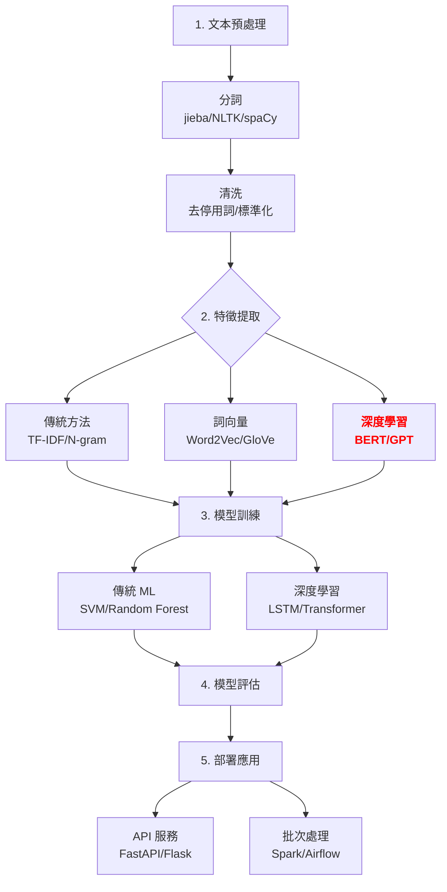

# 第 1.2 章:必要套件安裝與配置完全指南

本章旨在為您提供一份教科書級別的教學講義,深入探討 **NLP 必要套件** 的安裝、配置與最佳實踐。我們將從基礎理論出發,深入第一原理,最終將 NLP 套件生態系統置於宏觀知識體系中進行審視。

| 概念 | 中文譯名 | 典型用途 | 優點 | 侷限 |
| :--- | :--- | :--- | :--- | :--- |
| **Fundamentals** | 基礎理論 | 快速掌握 jieba、NLTK、spaCy、Transformers 的安裝與基本使用。 | 直觀易懂,能快速建立 NLP 開發環境。 | 易忽略套件相依性管理與模型檔案下載機制。 |
| **First Principles** | 第一原理 | 從分詞演算法 (Tokenization)、詞向量原理 (Word Embeddings) 理解套件設計哲學。 | 深入本質,有助於選擇適合的工具與優化效能。 | 理論性強,需要理解語言學與機器學習基礎。 |
| **Body of Knowledge** | 知識體系 | 將 NLP 套件置於完整工具鏈 (中文/英文、傳統/深度學習) 的框架中。 | 結構完備,能理解不同套件的定位與組合策略。 | 內容龐雜,不適合快速入門。 |

---

## 1. Fundamentals (基礎理論)

在 NLP 開發的歷史中,**工具選擇 (Tool Selection)** 長期是新手最困惑的問題,面臨**三大挑戰**:
1. **套件混亂**: jieba vs NLTK vs spaCy,每個工具的定位不同,容易選錯。
2. **相依性地獄**: 深度學習框架 (TensorFlow/PyTorch) 版本衝突,GPU 支援問題。
3. **模型檔案巨大**: Transformers 模型動輒數 GB,下載與儲存需要規劃。

**NLP 套件生態系統** 依功能可分為四大類:
1. **中文專用**: jieba (分詞)、pkuseg、LTP
2. **傳統 NLP**: NLTK (英文)、spaCy (多語言)
3. **深度學習**: Transformers (BERT/GPT)、Gensim (Word2Vec)
4. **框架**: TensorFlow、PyTorch

### NLP 套件分類與選擇邏輯

**1. 按語言分類**
* **中文專用**:
    * **核心思想**: 中文無空格分隔,需要專用分詞工具
    * **代表工具**: jieba (結巴分詞)
    * **優點**: 輕量、快速、支援自定義詞典

* **多語言支援**:
    * **核心思想**: 統一 API 處理多種語言
    * **代表工具**: spaCy、Stanza
    * **優點**: 工業級、準確率高、支援 NER/POS

**2. 按技術典範分類**
* **傳統方法 (規則/統計)**:
    * **核心思想**: 基於詞典與統計模型
    * **代表工具**: NLTK、jieba
    * **優點**: 可解釋性強、無需 GPU

* **深度學習方法**:
    * **核心思想**: 基於 Transformer 架構的預訓練模型
    * **代表工具**: Transformers、fairseq
    * **優點**: 準確率高、遷移學習能力強

### 快速實作:安裝核心套件

**使用 Poetry 安裝 (推薦)**

```bash
# 啟動 Poetry 專案
poetry shell

# 1. 中文分詞工具
poetry add jieba

# 2. 傳統 NLP 工具
poetry add nltk          # 英文 NLP 瑞士刀
poetry add spacy         # 工業級 NLP 框架

# 3. 深度學習 NLP
poetry add transformers  # Hugging Face Transformers
poetry add datasets      # Hugging Face 數據集
poetry add tokenizers    # 快速 Tokenizer (Rust 實作)

# 4. 深度學習框架 (二選一)
poetry add torch torchvision torchaudio  # PyTorch
# 或
poetry add tensorflow                    # TensorFlow

# 5. 輔助工具
poetry add numpy pandas scikit-learn matplotlib
```

**使用 pip 安裝 (傳統方法)**

```bash
# 創建虛擬環境
python -m venv nlp_env
source nlp_env/bin/activate  # Windows: nlp_env\Scripts\activate

# 安裝套件
pip install jieba nltk spacy transformers datasets
pip install torch torchvision torchaudio  # 或 tensorflow
pip install numpy pandas scikit-learn matplotlib
```

### 核心套件配置

**1. jieba (結巴分詞) 配置**

```python
import jieba

# 下載停用詞表 (可選)
# https://github.com/goto456/stopwords
stopwords = set(line.strip() for line in open('stopwords.txt', 'r', encoding='utf-8'))

# 自定義詞典 (新增領域專有名詞)
jieba.load_userdict('custom_dict.txt')
# custom_dict.txt 格式:
# 人工智能 10 n
# 自然語言處理 8 n

# 基本使用
text = "我愛自然語言處理"
words = jieba.cut(text)  # 預設模式
print(list(words))  # ['我', '愛', '自然語言處理']

# 全模式 (窮盡所有可能)
words_all = jieba.cut(text, cut_all=True)
print(list(words_all))  # ['我', '愛', '自然', '自然語言', '語言', '處理']

# 搜尋引擎模式 (適合索引)
words_search = jieba.cut_for_search(text)
print(list(words_search))  # ['我', '愛', '自然', '語言', '自然語言', '處理', '自然語言處理']
```

**2. NLTK 配置 (下載語料庫)**

```python
import nltk

# 下載核心資源 (首次使用必須執行)
nltk.download('punkt')        # 分詞模型
nltk.download('stopwords')    # 停用詞表
nltk.download('averaged_perceptron_tagger')  # POS 標註器
nltk.download('wordnet')      # WordNet 詞彙資料庫
nltk.download('omw-1.4')      # 多語言 WordNet

# 或一次性下載常用資源
nltk.download('popular')

# 基本使用
from nltk.tokenize import word_tokenize
from nltk.corpus import stopwords

text = "Natural language processing is amazing!"
tokens = word_tokenize(text)
print(tokens)  # ['Natural', 'language', 'processing', 'is', 'amazing', '!']

# 過濾停用詞
stop_words = set(stopwords.words('english'))
filtered = [w for w in tokens if w.lower() not in stop_words]
print(filtered)  # ['Natural', 'language', 'processing', 'amazing', '!']
```

**3. spaCy 配置 (下載語言模型)**

```bash
# 下載英文模型 (小/中/大 三種規模)
python -m spacy download en_core_web_sm  # 小型 (12MB)
python -m spacy download en_core_web_md  # 中型 (40MB,含詞向量)
python -m spacy download en_core_web_lg  # 大型 (560MB,完整詞向量)

# 下載中文模型
python -m spacy download zh_core_web_sm  # 中文小型
python -m spacy download zh_core_web_md  # 中文中型
```

```python
import spacy

# 載入模型
nlp = spacy.load('en_core_web_sm')

# 處理文本
doc = nlp("Apple is looking at buying U.K. startup for $1 billion")

# 實體識別 (NER)
for ent in doc.ents:
    print(ent.text, ent.label_)
# Apple ORG
# U.K. GPE
# $1 billion MONEY

# 詞性標註 (POS)
for token in doc:
    print(token.text, token.pos_, token.dep_)
# Apple PROPN nsubj
# is AUX aux
# looking VERB ROOT
```

**4. Transformers 配置 (模型快取管理)**

```python
from transformers import AutoTokenizer, AutoModel

# 設定模型快取目錄 (避免預設 ~/.cache 爆滿)
import os
os.environ['TRANSFORMERS_CACHE'] = '/path/to/cache'

# 下載並載入模型 (首次會自動下載)
model_name = 'bert-base-chinese'
tokenizer = AutoTokenizer.from_pretrained(model_name)
model = AutoModel.from_pretrained(model_name)

# 基本使用
text = "自然語言處理很有趣"
inputs = tokenizer(text, return_tensors='pt')
outputs = model(**inputs)

print(f"最後一層隱藏狀態: {outputs.last_hidden_state.shape}")
# 最後一層隱藏狀態: torch.Size([1, 9, 768])
```

### NLP 套件對比表

| 套件 | 適用語言 | 主要功能 | 技術典範 | 學習曲線 | 效能 |
|:---|:---|:---|:---|:---|:---|
| **jieba** | 中文 | 分詞 | 統計 (HMM/Viterbi) | 低 | 快 |
| **NLTK** | 英文 | 分詞/POS/NER | 規則+統計 | 中 | 中 |
| **spaCy** | 多語言 | 分詞/POS/NER/依存句法 | 神經網路 | 中 | 快 |
| **Transformers** | 多語言 | 預訓練模型 | Transformer | 高 | 慢 (需 GPU) |
| **Stanza** | 60+ 語言 | 分詞/POS/NER/句法 | 神經網路 | 中 | 中 |

---

## 2. First Principles (第一原理)

從第一原理出發,NLP 套件的設計哲學根植於對**分詞演算法 (Tokenization Algorithm)** 與**詞向量空間 (Word Embedding Space)** 的深刻理解。

### 為什麼中文需要專用分詞工具?

**問題: 中文無空格分隔,如何切分詞彙?**

英文有天然的空格分隔:
```
"Natural language processing" → ["Natural", "language", "processing"]
```

中文沒有空格:
```
"自然語言處理" → 如何切分?
可能1: ["自然", "語言", "處理"]  ✅ 正確
可能2: ["自然語", "言處理"]     ❌ 錯誤
```

**jieba 的解決方案: 隱馬可夫模型 (HMM) + Viterbi 演算法**

```
步驟 1: 建立狀態轉移機率 (基於大規模語料庫統計)
P("自然" 後面接 "語言") = 0.8  (高機率)
P("自然語" 後面接 "言") = 0.01 (低機率)

步驟 2: Viterbi 演算法找出最高機率路徑
路徑 1: "自然" → "語言" → "處理"  機率 = 0.8 × 0.9 × 0.7 = 0.504
路徑 2: "自然語" → "言處理"        機率 = 0.01 × 0.02 = 0.0002

步驟 3: 選擇機率最高的路徑
最終結果: ["自然", "語言", "處理"]
```

**數學表示**:
```
給定句子 S = [c1, c2, ..., cn] (字元序列)
目標: 找出詞序列 W = [w1, w2, ..., wm] 使得 P(W|S) 最大

根據貝氏定理:
P(W|S) = P(S|W) * P(W) / P(S)

簡化 (P(S) 為常數):
argmax_W P(W|S) = argmax_W P(S|W) * P(W)

其中:
- P(S|W): 生成機率 (HMM 發射機率)
- P(W): 語言模型機率 (詞序列的合理性)
```

**實驗驗證: 比較不同分詞方法**

```python
import jieba
import time

text = "我愛北京天安門" * 1000  # 重複 1000 次測試效能

# 測試精確模式
start = time.time()
jieba.cut(text)
print(f"精確模式耗時: {time.time() - start:.4f}s")

# 測試全模式
start = time.time()
jieba.cut(text, cut_all=True)
print(f"全模式耗時: {time.time() - start:.4f}s")

# 測試搜尋引擎模式
start = time.time()
jieba.cut_for_search(text)
print(f"搜尋模式耗時: {time.time() - start:.4f}s")
```

### spaCy vs NLTK: 設計哲學差異

**問題: 為什麼 spaCy 比 NLTK 快?**

| 設計維度 | NLTK | spaCy |
|:---|:---|:---|
| **設計目標** | 教學/研究 (靈活性) | 生產環境 (效能) |
| **實作語言** | 純 Python | Python + Cython (C 擴展) |
| **資料結構** | 字串列表 | Doc/Token 物件 (記憶體連續) |
| **處理流程** | 逐步呼叫函數 | Pipeline 一次處理 |
| **模型載入** | 每次使用時載入 | 預先載入到記憶體 |

**效能對比實驗**:

```python
import nltk
import spacy
import time

text = "The quick brown fox jumps over the lazy dog." * 1000

# NLTK 方法
start = time.time()
tokens = nltk.word_tokenize(text)
pos_tags = nltk.pos_tag(tokens)
nltk_time = time.time() - start

# spaCy 方法
nlp = spacy.load('en_core_web_sm')
start = time.time()
doc = nlp(text)
pos_tags = [(token.text, token.pos_) for token in doc]
spacy_time = time.time() - start

print(f"NLTK 耗時: {nltk_time:.4f}s")
print(f"spaCy 耗時: {spacy_time:.4f}s")
print(f"spaCy 加速比: {nltk_time / spacy_time:.2f}x")
```

### Transformers 的模型快取機制

**問題: BERT 模型 (400MB) 每次都要重新下載嗎?**

**Transformers 的快取策略**:

```
步驟 1: 檢查本地快取
快取目錄: ~/.cache/huggingface/hub/
檔案結構:
└─ models--bert-base-chinese/
    ├─ snapshots/
    │   └─ abc123.../
    │       ├─ config.json
    │       ├─ pytorch_model.bin
    │       └─ tokenizer.json
    └─ refs/
        └─ main → abc123...

步驟 2: 驗證檔案完整性
計算 SHA256 雜湊值,與 Hugging Face Hub 比對

步驟 3: 下載缺失檔案
使用斷點續傳 (HTTP Range Requests)
```

**手動管理快取**:

```python
from transformers import AutoModel
import os

# 方法 1: 設定環境變數
os.environ['TRANSFORMERS_CACHE'] = '/data/models'

# 方法 2: 使用 cache_dir 參數
model = AutoModel.from_pretrained(
    'bert-base-chinese',
    cache_dir='/data/models'
)

# 方法 3: 預先下載模型 (離線使用)
from huggingface_hub import snapshot_download
snapshot_download(
    repo_id='bert-base-chinese',
    cache_dir='/data/models',
    local_files_only=False  # 首次下載時設為 False
)

# 離線載入
model = AutoModel.from_pretrained(
    '/data/models/models--bert-base-chinese/snapshots/abc123...',
    local_files_only=True
)
```

---

## 3. Body of Knowledge (知識體系)

在 NLP 工具鏈的完整生命週期中,套件選擇與配置是基礎建設的核心環節。

### NLP 工具鏈完整架構



### NLP 套件生態系統定位

| 套件 | 階段定位 | 核心功能 | 典型使用場景 |
|:---|:---|:---|:---|
| **jieba** | 預處理 (中文) | 分詞 | 中文文本分詞、關鍵字提取 |
| **NLTK** | 預處理+特徵 (英文) | 分詞/POS/詞幹化 | 學術研究、教學 |
| **spaCy** | 預處理+NER (多語言) | Pipeline 處理 | 生產環境、實體識別 |
| **Gensim** | 特徵提取 | Word2Vec/Doc2Vec | 文本相似度、主題建模 |
| **Transformers** | 特徵+模型 | 預訓練模型 | 遷移學習、SOTA 模型 |
| **scikit-learn** | 模型訓練 | 傳統 ML | 文本分類、聚類 |
| **PyTorch/TensorFlow** | 模型訓練 | 深度學習 | 自定義模型架構 |

### 完整實作: NLP Pipeline (生產級)

```python
import jieba
import spacy
from transformers import pipeline
import numpy as np

class NLPPipeline:
    """生產級 NLP Pipeline"""

    def __init__(self, language='zh'):
        """
        Args:
            language: 'zh' (中文) 或 'en' (英文)
        """
        self.language = language

        if language == 'zh':
            # 中文: jieba + Transformers
            jieba.load_userdict('custom_dict.txt')
            self.ner_model = pipeline(
                'ner',
                model='ckiplab/bert-base-chinese-ner',
                aggregation_strategy='simple'
            )
        else:
            # 英文: spaCy
            self.nlp = spacy.load('en_core_web_sm')

    def tokenize(self, text):
        """分詞"""
        if self.language == 'zh':
            return list(jieba.cut(text))
        else:
            doc = self.nlp(text)
            return [token.text for token in doc]

    def extract_entities(self, text):
        """實體識別"""
        if self.language == 'zh':
            entities = self.ner_model(text)
            return [(ent['word'], ent['entity_group']) for ent in entities]
        else:
            doc = self.nlp(text)
            return [(ent.text, ent.label_) for ent in doc.ents]

    def process(self, text):
        """完整處理流程"""
        result = {
            'tokens': self.tokenize(text),
            'entities': self.extract_entities(text)
        }
        return result

# 使用範例
pipeline_zh = NLPPipeline(language='zh')
result = pipeline_zh.process("蘋果公司在台北101開設新門市")
print(result)
# {
#   'tokens': ['蘋果', '公司', '在', '台北', '101', '開設', '新', '門市'],
#   'entities': [('蘋果公司', 'ORG'), ('台北101', 'LOC')]
# }
```

### 套件相依性管理最佳實踐

**pyproject.toml 完整配置**

```toml
[tool.poetry]
name = "nlp-production-project"
version = "1.0.0"
description = "生產級 NLP 專案"

[tool.poetry.dependencies]
python = "^3.10"

# 中文 NLP
jieba = "^0.42.1"
pkuseg = {version = "^0.0.25", optional = true}

# 英文 NLP
nltk = "^3.8.1"
spacy = "^3.7.2"

# 深度學習 NLP
transformers = "^4.35.0"
datasets = "^2.14.0"
tokenizers = "^0.15.0"

# 深度學習框架 (條件依賴)
torch = {version = "^2.1.0", optional = true}
tensorflow = {version = "^2.14.0", optional = true}

# 傳統 ML
scikit-learn = "^1.3.0"
gensim = "^4.3.0"

# 工具
numpy = "^1.24.0"
pandas = "^2.1.0"

[tool.poetry.extras]
pytorch = ["torch"]
tensorflow = ["tensorflow"]
advanced-chinese = ["pkuseg"]

[tool.poetry.group.dev.dependencies]
pytest = "^7.4.3"
jupyter = "^1.0.0"

# 安裝方式:
# poetry install                          # 基礎套件
# poetry install --extras pytorch         # 加上 PyTorch
# poetry install --extras advanced-chinese # 加上高級中文工具
```

### 套件選擇決策樹

```
需要處理哪種語言?
│
├─ 中文
│   ├─ 只需要分詞? → jieba (快速、輕量)
│   ├─ 需要 NER/POS? → spaCy 中文模型
│   └─ 需要 SOTA 準確率? → Transformers (BERT)
│
├─ 英文
│   ├─ 學習/研究? → NLTK (教學導向)
│   ├─ 生產環境? → spaCy (效能優先)
│   └─ 需要 SOTA? → Transformers (RoBERTa)
│
└─ 多語言
    ├─ 60+ 語言? → Stanza
    └─ 常見語言? → spaCy (支援 20+ 語言)
```

### 效能優化策略

**1. spaCy Pipeline 優化**

```python
import spacy

# 只載入需要的組件
nlp = spacy.load('en_core_web_sm', disable=['parser', 'ner'])

# 批次處理 (大幅提升效能)
texts = ["Text 1", "Text 2", ...] * 1000
docs = list(nlp.pipe(texts, batch_size=50, n_process=4))
```

**2. Transformers 模型量化**

```python
from transformers import AutoModelForSequenceClassification, AutoTokenizer
import torch

# 載入模型
model = AutoModelForSequenceClassification.from_pretrained('bert-base-chinese')
tokenizer = AutoTokenizer.from_pretrained('bert-base-chinese')

# 動態量化 (減少 50% 模型大小)
quantized_model = torch.quantization.quantize_dynamic(
    model,
    {torch.nn.Linear},
    dtype=torch.qint8
)

# 推理加速 2-4 倍
```

**3. GPU 加速配置**

```python
import torch
from transformers import pipeline

# 檢查 GPU 可用性
device = 0 if torch.cuda.is_available() else -1

# 使用 GPU
classifier = pipeline(
    'sentiment-analysis',
    model='bert-base-chinese',
    device=device
)

# 批次推理
results = classifier(["文本1", "文本2", ...], batch_size=32)
```

---

## 結論與建議

1. **日常溝通與實作**: 優先掌握 **Fundamentals** 中的 **jieba (中文)** 與 **spaCy (英文)**,它們是 NLP 專案的基礎工具。

2. **強調方法論與創新**: 從 **First Principles** 出發,理解分詞演算法與模型快取機制,有助於您在面對效能瓶頸時,設計或選擇更合適的優化方案。

3. **構建宏觀視野**: 將 NLP 套件放入 **Body of Knowledge** 的框架中,可以清晰地看到不同工具在完整工具鏈中的定位,以及如何組合使用以達到最佳效果。

**核心要點**: NLP 套件選擇應基於**語言特性** (中文/英文)、**技術典範** (傳統/深度學習) 與**效能需求** (研究/生產) 三個維度綜合考慮。

透過本章的學習,您應當已經掌握了 NLP 核心套件的安裝、配置與選擇策略,並能從更宏觀的視角理解其在 NLP 工具鏈中的關鍵作用。

---

## 延伸閱讀 (Further Reading)

### 官方文檔 (Official Documentation)
1. **jieba 官方文檔**: https://github.com/fxsjy/jieba
2. **NLTK 官方文檔**: https://www.nltk.org/
3. **spaCy 官方文檔**: https://spacy.io/
4. **Transformers 官方文檔**: https://huggingface.co/docs/transformers/

### 工具與資源 (Tools & Resources)
- **Hugging Face Hub**: https://huggingface.co/models
- **spaCy 模型列表**: https://spacy.io/models
- **NLTK 資料下載**: https://www.nltk.org/data.html

### 學習資源 (Learning Resources)
- **中文分詞演算法詳解**: https://github.com/hankcs/HanLP
- **spaCy 進階教程**: https://course.spacy.io/
- **Transformers 課程**: https://huggingface.co/course/

---

**上一章節**: [1.1 Poetry 安裝與配置完全指南](./01_Poetry安裝與配置完全指南.md)
**下一章節**: [1.3 開發環境測試與驗證完全指南](./03_開發環境測試與驗證完全指南.md)
