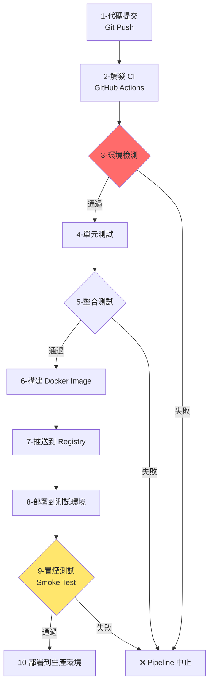

# 第 1.3 章:開發環境測試與驗證完全指南

本章旨在為您提供一份教科書級別的教學講義,深入探討 **NLP 開發環境測試與驗證** 的核心概念、方法論與最佳實踐。我們將從基礎理論出發,深入第一原理,最終將環境驗證置於 DevOps 工作流的宏觀知識體系中進行審視。

| 概念 | 中文譯名 | 典型用途 | 優點 | 侷限 |
| :--- | :--- | :--- | :--- | :--- |
| **Fundamentals** | 基礎理論 | 快速掌握套件版本檢查、GPU 環境測試、模型載入驗證的方法。 | 直觀易懂,能快速發現環境問題。 | 易忽略系統層級相依性 (CUDA/cuDNN) 與效能基準測試。 |
| **First Principles** | 第一原理 | 從依賴圖分析 (Dependency Graph)、GPU 驅動架構理解環境衝突根本原因。 | 深入本質,有助於解決複雜的相容性問題。 | 理論性強,需要理解作業系統與硬體架構。 |
| **Body of Knowledge** | 知識體系 | 將環境測試置於 CI/CD Pipeline、容器化部署的完整框架中。 | 結構完備,能建立自動化測試工作流。 | 內容龐雜,不適合快速入門。 |

---

## 1. Fundamentals (基礎理論)

在 NLP 專案開發中,**環境驗證 (Environment Validation)** 是最容易被忽略但最關鍵的環節,常見**三大問題**:
1. **版本不一致**: 開發環境能跑,生產環境崩潰 (「在我機器上可以跑」)。
2. **GPU 環境問題**: CUDA 版本不匹配,PyTorch/TensorFlow 無法使用 GPU。
3. **模型檔案缺失**: Transformers 模型未完整下載,執行時報錯。

**環境測試** 的核心思想是: **在寫第一行業務代碼前,先確保基礎設施穩定可靠**。

### 環境測試的層次架構

**1. 系統層測試 (System Level)**
* **核心思想**: 驗證作業系統、Python 版本、記憶體
* **檢查項目**: OS 版本、Python 版本、可用記憶體
* **工具**: `platform`、`sys`、`psutil`

**2. 套件層測試 (Package Level)**
* **核心思想**: 驗證所有依賴套件正確安裝
* **檢查項目**: 套件版本、依賴完整性
* **工具**: `importlib`、`pkg_resources`

**3. 硬體層測試 (Hardware Level)**
* **核心思想**: 驗證 GPU 可用性與驅動版本
* **檢查項目**: CUDA、cuDNN、GPU 記憶體
* **工具**: `torch.cuda`、`tensorflow.config`

**4. 功能層測試 (Functional Level)**
* **核心思想**: 驗證關鍵功能可正常執行
* **檢查項目**: 模型載入、推理測試
* **工具**: 自定義測試腳本

### 快速實作: 環境檢測腳本

**完整環境檢測腳本 (check_env.py)**

```python
#!/usr/bin/env python3
"""NLP 開發環境檢測腳本"""

import sys
import platform
import subprocess
from importlib.metadata import version, PackageNotFoundError

def print_section(title):
    """列印章節標題"""
    print(f"\n{'='*60}")
    print(f"  {title}")
    print(f"{'='*60}")

def check_system_info():
    """檢查系統資訊"""
    print_section("1. 系統資訊")
    print(f"作業系統: {platform.system()} {platform.release()}")
    print(f"CPU 架構: {platform.machine()}")
    print(f"Python 版本: {sys.version.split()[0]}")
    print(f"Python 路徑: {sys.executable}")

def check_package_version(package_name, min_version=None):
    """檢查套件版本"""
    try:
        installed_version = version(package_name)
        status = "✓"
        if min_version and installed_version < min_version:
            status = f"⚠ (需要 >= {min_version})"
        print(f"  {status} {package_name:20s} {installed_version}")
        return True
    except PackageNotFoundError:
        print(f"  ✗ {package_name:20s} 未安裝")
        return False

def check_core_packages():
    """檢查核心套件"""
    print_section("2. 核心套件版本")

    packages = {
        # 中文 NLP
        'jieba': None,
        # 英文 NLP
        'nltk': '3.8',
        'spacy': '3.0',
        # 深度學習 NLP
        'transformers': '4.30',
        'datasets': None,
        'tokenizers': None,
        # 深度學習框架
        'torch': '2.0',
        'tensorflow': '2.10',
        # 工具套件
        'numpy': '1.20',
        'pandas': '1.3',
        'scikit-learn': '1.0',
    }

    results = {}
    for package, min_ver in packages.items():
        results[package] = check_package_version(package, min_ver)

    return results

def check_gpu_availability():
    """檢查 GPU 可用性"""
    print_section("3. GPU 環境檢測")

    # 檢查 PyTorch
    try:
        import torch
        print(f"PyTorch 版本: {torch.__version__}")
        print(f"CUDA 可用: {torch.cuda.is_available()}")
        if torch.cuda.is_available():
            print(f"CUDA 版本: {torch.version.cuda}")
            print(f"GPU 數量: {torch.cuda.device_count()}")
            for i in range(torch.cuda.device_count()):
                print(f"  GPU {i}: {torch.cuda.get_device_name(i)}")
                print(f"    記憶體: {torch.cuda.get_device_properties(i).total_memory / 1e9:.2f} GB")
    except ImportError:
        print("PyTorch 未安裝,跳過 GPU 檢測")

    # 檢查 TensorFlow
    try:
        import tensorflow as tf
        print(f"\nTensorFlow 版本: {tf.__version__}")
        gpus = tf.config.list_physical_devices('GPU')
        print(f"GPU 數量: {len(gpus)}")
        for gpu in gpus:
            print(f"  {gpu}")
    except ImportError:
        print("\nTensorFlow 未安裝,跳過 GPU 檢測")

def check_nlp_models():
    """檢查 NLP 模型"""
    print_section("4. NLP 模型驗證")

    # 測試 jieba
    try:
        import jieba
        test_text = "我愛自然語言處理"
        result = list(jieba.cut(test_text))
        print(f"✓ jieba 分詞: {result}")
    except Exception as e:
        print(f"✗ jieba 測試失敗: {e}")

    # 測試 NLTK
    try:
        import nltk
        # 檢查 punkt 是否下載
        try:
            nltk.data.find('tokenizers/punkt')
            print("✓ NLTK punkt 資料已下載")
        except LookupError:
            print("⚠ NLTK punkt 資料未下載,執行: nltk.download('punkt')")
    except Exception as e:
        print(f"✗ NLTK 測試失敗: {e}")

    # 測試 spaCy
    try:
        import spacy
        # 檢查英文模型
        try:
            nlp = spacy.load('en_core_web_sm')
            print("✓ spaCy 英文模型 (en_core_web_sm) 已安裝")
        except OSError:
            print("⚠ spaCy 英文模型未安裝,執行: python -m spacy download en_core_web_sm")
    except Exception as e:
        print(f"✗ spaCy 測試失敗: {e}")

    # 測試 Transformers
    try:
        from transformers import AutoTokenizer
        print("✓ Transformers 套件可正常載入")
    except Exception as e:
        print(f"✗ Transformers 測試失敗: {e}")

def check_memory():
    """檢查記憶體資訊"""
    print_section("5. 記憶體資訊")
    try:
        import psutil
        memory = psutil.virtual_memory()
        print(f"總記憶體: {memory.total / 1e9:.2f} GB")
        print(f"可用記憶體: {memory.available / 1e9:.2f} GB")
        print(f"使用率: {memory.percent}%")
    except ImportError:
        print("psutil 未安裝,無法檢測記憶體")

def main():
    """主函數"""
    print("\n" + "="*60)
    print("  NLP 開發環境檢測報告")
    print("="*60)

    check_system_info()
    package_results = check_core_packages()
    check_gpu_availability()
    check_nlp_models()
    check_memory()

    # 總結
    print_section("總結")
    total = len(package_results)
    installed = sum(package_results.values())
    print(f"套件安裝狀態: {installed}/{total} 個核心套件已安裝")

    if installed == total:
        print("\n✓ 環境檢測通過,可以開始 NLP 開發!")
    else:
        print("\n⚠ 部分套件缺失,請根據上方提示安裝")

if __name__ == "__main__":
    main()
```

**執行方式**:

```bash
# 使用 Poetry
poetry run python check_env.py

# 或直接執行
python check_env.py
```

### GPU 環境測試 (CUDA/cuDNN)

**快速 GPU 測試腳本 (test_gpu.py)**

```python
"""GPU 環境測試腳本"""

def test_pytorch_gpu():
    """測試 PyTorch GPU"""
    print("\n" + "="*60)
    print("  PyTorch GPU 測試")
    print("="*60)

    try:
        import torch
        print(f"PyTorch 版本: {torch.__version__}")
        print(f"CUDA 編譯版本: {torch.version.cuda}")
        print(f"cuDNN 版本: {torch.backends.cudnn.version()}")
        print(f"CUDA 可用: {torch.cuda.is_available()}")

        if torch.cuda.is_available():
            # 測試 GPU 計算
            x = torch.rand(1000, 1000).cuda()
            y = torch.rand(1000, 1000).cuda()
            z = torch.matmul(x, y)
            print(f"✓ GPU 計算測試通過 (矩陣乘法結果形狀: {z.shape})")

            # 測試記憶體分配
            allocated = torch.cuda.memory_allocated() / 1e6
            cached = torch.cuda.memory_reserved() / 1e6
            print(f"GPU 記憶體使用: {allocated:.2f} MB (已分配) / {cached:.2f} MB (已快取)")
        else:
            print("⚠ CUDA 不可用,請檢查:")
            print("  1. NVIDIA 驅動是否安裝: nvidia-smi")
            print("  2. PyTorch 是否為 GPU 版本: pip install torch torchvision torchaudio --index-url https://download.pytorch.org/whl/cu118")
    except Exception as e:
        print(f"✗ PyTorch GPU 測試失敗: {e}")

def test_tensorflow_gpu():
    """測試 TensorFlow GPU"""
    print("\n" + "="*60)
    print("  TensorFlow GPU 測試")
    print("="*60)

    try:
        import tensorflow as tf
        print(f"TensorFlow 版本: {tf.__version__}")
        print(f"GPU 裝置列表:")
        gpus = tf.config.list_physical_devices('GPU')
        for gpu in gpus:
            print(f"  {gpu}")

        if len(gpus) > 0:
            # 測試 GPU 計算
            with tf.device('/GPU:0'):
                x = tf.random.normal([1000, 1000])
                y = tf.random.normal([1000, 1000])
                z = tf.matmul(x, y)
            print(f"✓ GPU 計算測試通過 (矩陣乘法結果形狀: {z.shape})")
        else:
            print("⚠ TensorFlow 偵測不到 GPU,請檢查:")
            print("  1. TensorFlow 版本是否支援 GPU: pip install tensorflow[and-cuda]")
            print("  2. CUDA/cuDNN 版本是否相容")
    except Exception as e:
        print(f"✗ TensorFlow GPU 測試失敗: {e}")

def check_nvidia_driver():
    """檢查 NVIDIA 驅動"""
    print("\n" + "="*60)
    print("  NVIDIA 驅動檢測")
    print("="*60)

    import subprocess
    try:
        result = subprocess.run(['nvidia-smi'], capture_output=True, text=True)
        if result.returncode == 0:
            print("✓ NVIDIA 驅動已安裝")
            print(result.stdout)
        else:
            print("✗ nvidia-smi 執行失敗")
    except FileNotFoundError:
        print("✗ nvidia-smi 未找到,請安裝 NVIDIA 驅動")

if __name__ == "__main__":
    check_nvidia_driver()
    test_pytorch_gpu()
    test_tensorflow_gpu()
```

---

## 2. First Principles (第一原理)

從第一原理出發,環境測試的有效性根植於對**依賴圖拓撲 (Dependency Graph Topology)** 與 **GPU 軟硬體堆疊 (GPU Stack)** 的深刻理解。

### 為什麼會出現「在我機器上可以跑」?

**問題: 依賴版本不一致的根本原因**

假設兩台機器:
```
機器 A (開發環境):
├─ numpy==1.24.0
├─ pandas==2.0.0 (依賴 numpy>=1.20, <1.25)
└─ scikit-learn==1.3.0 (依賴 numpy>=1.17, <1.25)

機器 B (生產環境):
├─ numpy==1.26.0  ← 版本更新!
├─ pandas==2.0.0 (依賴 numpy>=1.20, <1.25)  ✗ 衝突!
└─ scikit-learn==1.3.0
```

**根本原因**: pip 使用**貪婪演算法 (Greedy Algorithm)**,安裝順序影響結果。

**數學表示**:
```
依賴圖 G = (V, E)
- V: 套件集合 {numpy, pandas, scikit-learn, ...}
- E: 依賴邊集合 {(pandas, numpy), (scikit-learn, numpy), ...}

目標: 找到一組版本 V' = {v1, v2, ..., vn} 滿足所有約束

約束:
∀ (package_i, package_j) ∈ E:
  version(package_j) ∈ constraint(package_i → package_j)

問題: NP-Hard (需要回溯搜尋)
pip 的近似解: 貪婪 + 無回溯 → 不保證全局最優
Poetry/conda 的精確解: SAT Solver → 保證一致性
```

**實驗驗證: 重現依賴衝突**

```python
# 創建測試環境
import subprocess
import sys

def test_dependency_order():
    """測試依賴安裝順序影響"""

    # 測試 1: 先裝 pandas
    subprocess.run([sys.executable, '-m', 'pip', 'install', 'pandas==2.0.0'])
    subprocess.run([sys.executable, '-m', 'pip', 'install', 'numpy==1.26.0'])
    # 結果: pandas 可能報錯 (numpy 版本過高)

    # 清理
    subprocess.run([sys.executable, '-m', 'pip', 'uninstall', '-y', 'pandas', 'numpy'])

    # 測試 2: 先裝 numpy
    subprocess.run([sys.executable, '-m', 'pip', 'install', 'numpy==1.26.0'])
    subprocess.run([sys.executable, '-m', 'pip', 'install', 'pandas==2.0.0'])
    # 結果: pandas 可能強制降級 numpy
```

### GPU 軟硬體堆疊架構

**CUDA 軟體堆疊層次**

```
應用層
┌─────────────────────────┐
│ PyTorch / TensorFlow    │
└─────────────────────────┘
           ↓ (綁定)
┌─────────────────────────┐
│ cuDNN / cuBLAS          │  ← 深度學習加速函式庫
└─────────────────────────┘
           ↓
┌─────────────────────────┐
│ CUDA Toolkit            │  ← CUDA 編譯器與執行時
└─────────────────────────┘
           ↓
┌─────────────────────────┐
│ NVIDIA Driver           │  ← GPU 驅動程式
└─────────────────────────┘
           ↓
┌─────────────────────────┐
│ GPU Hardware (RTX 4090) │
└─────────────────────────┘
```

**版本相容性矩陵**

| PyTorch 版本 | CUDA 版本 | cuDNN 版本 | NVIDIA Driver |
|:---|:---|:---|:---|
| 2.1.0 | 11.8 / 12.1 | 8.9 | >= 450.80.02 |
| 2.0.0 | 11.7 / 11.8 | 8.5 | >= 450.80.02 |
| 1.13.0 | 11.6 / 11.7 | 8.3 | >= 450.80.02 |

**為什麼 CUDA 版本必須精確匹配?**

```
CUDA 使用 ABI (Application Binary Interface) 規範:

libcudart.so.11.8 → CUDA 11.8
libcudart.so.12.1 → CUDA 12.1

PyTorch 編譯時綁定特定 CUDA 版本:
torch-2.1.0+cu118 → 只能用 CUDA 11.8
torch-2.1.0+cu121 → 只能用 CUDA 12.1

如果系統安裝 CUDA 12.1,但 PyTorch 是 cu118:
→ 符號連結錯誤: undefined symbol: cudnnGetVersion_v8
```

**檢查 CUDA 版本一致性**

```python
import torch
import subprocess

def check_cuda_consistency():
    """檢查 CUDA 版本一致性"""

    # PyTorch 編譯時的 CUDA 版本
    pytorch_cuda = torch.version.cuda
    print(f"PyTorch 編譯 CUDA 版本: {pytorch_cuda}")

    # 系統安裝的 CUDA 版本
    try:
        result = subprocess.run(['nvcc', '--version'], capture_output=True, text=True)
        if result.returncode == 0:
            # 解析輸出: Cuda compilation tools, release 11.8, V11.8.89
            for line in result.stdout.split('\n'):
                if 'release' in line:
                    system_cuda = line.split('release ')[1].split(',')[0]
                    print(f"系統 CUDA 版本: {system_cuda}")

                    # 比對主版本號
                    pytorch_major = pytorch_cuda.split('.')[0]
                    system_major = system_cuda.split('.')[0]

                    if pytorch_major == system_major:
                        print("✓ CUDA 版本一致")
                    else:
                        print(f"⚠ CUDA 版本不一致 (PyTorch: {pytorch_cuda} vs 系統: {system_cuda})")
    except FileNotFoundError:
        print("⚠ nvcc 未找到,無法檢測系統 CUDA 版本")

check_cuda_consistency()
```

---

## 3. Body of Knowledge (知識體系)

在現代 DevOps 工作流中,環境測試是持續整合 (CI) 的第一道關卡,也是部署前的最後防線。

### 環境測試在 CI/CD 流程中的位置



### CI/CD 環境測試腳本 (GitHub Actions)

**.github/workflows/test-environment.yml**

```yaml
name: Environment Test

on:
  push:
    branches: [main, develop]
  pull_request:
    branches: [main]

jobs:
  test-environment:
    runs-on: ubuntu-latest
    strategy:
      matrix:
        python-version: ["3.10", "3.11", "3.12"]

    steps:
      - name: Checkout 代碼
        uses: actions/checkout@v4

      - name: 設定 Python
        uses: actions/setup-python@v4
        with:
          python-version: ${{ matrix.python-version }}

      - name: 安裝 Poetry
        run: pipx install poetry

      - name: 安裝依賴
        run: |
          poetry config virtualenvs.create true
          poetry install --no-interaction --no-ansi

      - name: 執行環境檢測
        run: poetry run python scripts/check_env.py

      - name: 測試套件導入
        run: |
          poetry run python -c "import jieba; print('jieba OK')"
          poetry run python -c "import nltk; print('NLTK OK')"
          poetry run python -c "import transformers; print('Transformers OK')"

      - name: 生成檢測報告
        if: always()
        run: |
          poetry run python scripts/check_env.py > env_report.txt
          cat env_report.txt

      - name: 上傳報告
        if: always()
        uses: actions/upload-artifact@v3
        with:
          name: environment-report-py${{ matrix.python-version }}
          path: env_report.txt

  test-gpu-environment:
    runs-on: ubuntu-latest
    container:
      image: nvidia/cuda:11.8.0-cudnn8-runtime-ubuntu22.04

    steps:
      - name: Checkout 代碼
        uses: actions/checkout@v4

      - name: 檢查 CUDA
        run: |
          nvcc --version
          nvidia-smi

      - name: 設定 Python
        run: |
          apt-get update
          apt-get install -y python3 python3-pip

      - name: 測試 PyTorch GPU
        run: |
          pip install torch torchvision --index-url https://download.pytorch.org/whl/cu118
          python3 -c "import torch; print('CUDA available:', torch.cuda.is_available())"
```

### Docker 環境測試 (容器化部署)

**Dockerfile.test**

```dockerfile
FROM nvidia/cuda:11.8.0-cudnn8-runtime-ubuntu22.04

# 設定環境變數
ENV DEBIAN_FRONTEND=noninteractive
ENV PYTHONUNBUFFERED=1

# 安裝 Python 與系統依賴
RUN apt-get update && apt-get install -y \
    python3.10 \
    python3-pip \
    git \
    && rm -rf /var/lib/apt/lists/*

# 安裝 Poetry
RUN pip install poetry

# 複製專案檔案
WORKDIR /app
COPY pyproject.toml poetry.lock ./
COPY scripts/ ./scripts/

# 安裝依賴
RUN poetry config virtualenvs.create false && \
    poetry install --no-interaction --no-ansi

# 執行環境檢測
RUN python3 scripts/check_env.py

# 健康檢查
HEALTHCHECK --interval=30s --timeout=3s \
  CMD python3 -c "import torch; assert torch.cuda.is_available()" || exit 1

CMD ["python3", "scripts/check_env.py"]
```

**構建與測試**

```bash
# 構建測試映像
docker build -f Dockerfile.test -t nlp-env-test:latest .

# 執行測試
docker run --gpus all nlp-env-test:latest

# 互動式除錯
docker run --gpus all -it nlp-env-test:latest /bin/bash
```

### 效能基準測試 (Benchmarking)

**benchmark.py**

```python
"""NLP 環境效能基準測試"""

import time
import torch
import numpy as np
from transformers import AutoTokenizer, AutoModel

def benchmark_cpu():
    """CPU 效能測試"""
    print("\n" + "="*60)
    print("  CPU 效能測試")
    print("="*60)

    # NumPy 矩陣乘法
    size = 5000
    start = time.time()
    a = np.random.rand(size, size)
    b = np.random.rand(size, size)
    c = np.dot(a, b)
    cpu_time = time.time() - start
    print(f"NumPy 矩陣乘法 ({size}x{size}): {cpu_time:.4f}s")

    return cpu_time

def benchmark_gpu():
    """GPU 效能測試"""
    print("\n" + "="*60)
    print("  GPU 效能測試")
    print("="*60)

    if not torch.cuda.is_available():
        print("CUDA 不可用,跳過 GPU 測試")
        return None

    # PyTorch GPU 矩陣乘法
    size = 5000
    device = torch.device('cuda')

    start = time.time()
    a = torch.rand(size, size, device=device)
    b = torch.rand(size, size, device=device)
    torch.cuda.synchronize()  # 等待 GPU 完成

    c = torch.matmul(a, b)
    torch.cuda.synchronize()
    gpu_time = time.time() - start

    print(f"PyTorch GPU 矩陣乘法 ({size}x{size}): {gpu_time:.4f}s")

    return gpu_time

def benchmark_transformer_inference():
    """Transformer 模型推理測試"""
    print("\n" + "="*60)
    print("  Transformer 推理測試")
    print("="*60)

    model_name = 'bert-base-chinese'
    tokenizer = AutoTokenizer.from_pretrained(model_name)
    model = AutoModel.from_pretrained(model_name)

    # CPU 推理
    text = "自然語言處理是人工智能的重要分支" * 10
    inputs = tokenizer(text, return_tensors='pt', max_length=512, truncation=True)

    start = time.time()
    with torch.no_grad():
        outputs = model(**inputs)
    cpu_inference_time = time.time() - start
    print(f"BERT CPU 推理: {cpu_inference_time:.4f}s")

    # GPU 推理 (如果可用)
    if torch.cuda.is_available():
        model = model.cuda()
        inputs = {k: v.cuda() for k, v in inputs.items()}

        start = time.time()
        with torch.no_grad():
            outputs = model(**inputs)
        torch.cuda.synchronize()
        gpu_inference_time = time.time() - start
        print(f"BERT GPU 推理: {gpu_inference_time:.4f}s")
        print(f"GPU 加速比: {cpu_inference_time / gpu_inference_time:.2f}x")

if __name__ == "__main__":
    cpu_time = benchmark_cpu()
    gpu_time = benchmark_gpu()

    if gpu_time:
        print(f"\nCPU vs GPU 加速比: {cpu_time / gpu_time:.2f}x")

    benchmark_transformer_inference()
```

### 自動化測試工作流

**完整測試腳本 (run_all_tests.sh)**

```bash
#!/bin/bash
set -e  # 遇到錯誤立即退出

echo "================================"
echo "  NLP 環境完整測試"
echo "================================"

# 1. 環境檢測
echo -e "\n[1/5] 執行環境檢測..."
python scripts/check_env.py

# 2. GPU 測試
echo -e "\n[2/5] 執行 GPU 測試..."
python scripts/test_gpu.py

# 3. 模型下載測試
echo -e "\n[3/5] 測試模型下載..."
python -c "
from transformers import AutoTokenizer, AutoModel
print('下載 BERT 模型...')
tokenizer = AutoTokenizer.from_pretrained('bert-base-chinese')
model = AutoModel.from_pretrained('bert-base-chinese')
print('✓ 模型下載成功')
"

# 4. 效能基準測試
echo -e "\n[4/5] 執行效能基準測試..."
python scripts/benchmark.py

# 5. 單元測試
echo -e "\n[5/5] 執行單元測試..."
pytest tests/ -v

echo -e "\n================================"
echo "  ✓ 所有測試通過!"
echo "================================"
```

**賦予執行權限並執行**

```bash
chmod +x run_all_tests.sh
./run_all_tests.sh
```

---

## 常見問題與疑難排解

### Q1: ModuleNotFoundError: No module named 'torch'

**原因**: 虛擬環境未啟動或套件未安裝在正確環境

**解決方案**:
```bash
# 方法 1: 啟動 Poetry 虛擬環境
poetry shell
poetry install

# 方法 2: 確認 Python 路徑
which python  # 應指向 .venv/bin/python

# 方法 3: 重建虛擬環境
poetry env remove python
poetry install
```

### Q2: CUDA out of memory

**原因**: GPU 記憶體不足

**解決方案**:
```python
import torch

# 方法 1: 減少 batch size
batch_size = 8  # 原本 32

# 方法 2: 使用梯度累積
accumulation_steps = 4
for i, batch in enumerate(dataloader):
    loss = model(batch)
    loss = loss / accumulation_steps
    loss.backward()

    if (i + 1) % accumulation_steps == 0:
        optimizer.step()
        optimizer.zero_grad()

# 方法 3: 使用混合精度訓練
from torch.cuda.amp import autocast, GradScaler
scaler = GradScaler()

with autocast():
    outputs = model(inputs)
    loss = criterion(outputs, labels)

scaler.scale(loss).backward()
scaler.step(optimizer)
scaler.update()

# 方法 4: 清理 GPU 快取
torch.cuda.empty_cache()
```

### Q3: ImportError: libcudnn.so.8: cannot open shared object file

**原因**: cuDNN 未安裝或版本不匹配

**解決方案**:
```bash
# 方法 1: 檢查 cuDNN 版本
ls /usr/local/cuda/lib64/libcudnn*

# 方法 2: 重新安裝 PyTorch (包含 cuDNN)
pip uninstall torch torchvision torchaudio
pip install torch torchvision torchaudio --index-url https://download.pytorch.org/whl/cu118

# 方法 3: 手動安裝 cuDNN
# 下載: https://developer.nvidia.com/cudnn
tar -xzvf cudnn-linux-x86_64-8.x.x.x_cudaX.Y-archive.tar.xz
sudo cp cudnn-*-archive/include/cudnn*.h /usr/local/cuda/include
sudo cp -P cudnn-*-archive/lib/libcudnn* /usr/local/cuda/lib64
```

---

## 結論與建議

1. **日常溝通與實作**: 優先掌握 **Fundamentals** 中的 **check_env.py 腳本**,每次開始新專案時先執行環境檢測。

2. **強調方法論與創新**: 從 **First Principles** 出發,理解依賴圖拓撲與 CUDA 軟體堆疊,有助於您快速定位環境問題的根本原因。

3. **構建宏觀視野**: 將環境測試放入 **Body of Knowledge** 的 CI/CD 框架中,建立自動化測試工作流,確保開發到部署的一致性。

**核心要點**: 環境測試不是一次性工作,而是貫穿專案生命週期的持續驗證過程。使用 **自動化腳本 + CI/CD + 容器化** 三管齊下,消除「在我機器上可以跑」的問題。

透過本章的學習,您應當已經掌握了環境檢測、GPU 測試、效能基準測試的完整方法,並能建立自動化驗證工作流。

---

## 延伸閱讀 (Further Reading)

### 官方文檔 (Official Documentation)
1. **PyTorch CUDA 文檔**: https://pytorch.org/get-started/locally/
2. **TensorFlow GPU 支援**: https://www.tensorflow.org/install/gpu
3. **NVIDIA CUDA 工具包**: https://developer.nvidia.com/cuda-toolkit

### 工具與資源 (Tools & Resources)
- **GitHub Actions 官方文檔**: https://docs.github.com/en/actions
- **Docker GPU 支援**: https://docs.docker.com/config/containers/resource_constraints/#gpu
- **Poetry CI/CD 範例**: https://python-poetry.org/docs/ci/

### 學習資源 (Learning Resources)
- **CUDA 編程指南**: https://docs.nvidia.com/cuda/cuda-c-programming-guide/
- **依賴解析演算法**: https://research.swtch.com/version-sat
- **效能基準測試**: https://pytorch.org/tutorials/recipes/recipes/benchmark.html

---

**上一章節**: [1.2 必要套件安裝與配置完全指南](./02_必要套件安裝與配置完全指南.md)
**下一章節**: [2.1 什麼是自然語言處理](../../02_自然語言處理入門/講義/01_什麼是自然語言處理.md)
