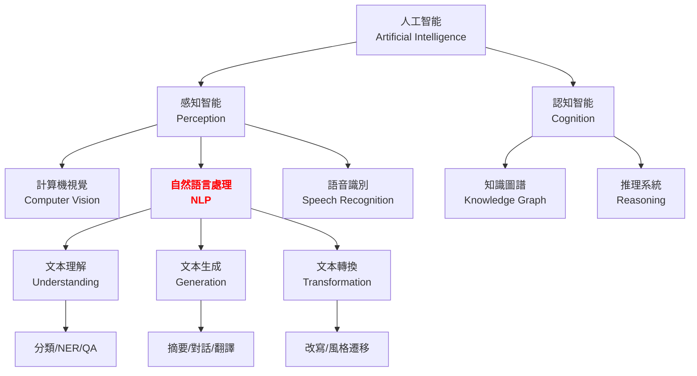
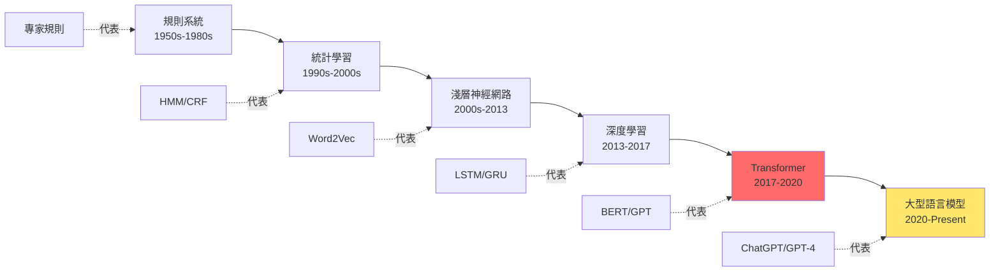

# 第 2.1 章:什麼是自然語言處理

本章旨在為您提供一份教科書級別的教學講義,深入探討 **自然語言處理 (Natural Language Processing, NLP)** 的定義、核心概念與應用場景。我們將從基礎理論出發,深入第一原理,最終將 NLP 置於人工智能的宏觀知識體系中進行審視。

| 概念 | 中文譯名 | 典型用途 | 優點 | 侷限 |
| :--- | :--- | :--- | :--- | :--- |
| **Fundamentals** | 基礎理論 | 快速掌握 NLP 定義、應用場景 (搜尋引擎、聊天機器人、翻譯) 與核心任務。 | 直觀易懂,能建立 NLP 的整體認知框架。 | 易忽略語言理解的本質挑戰與技術演進脈絡。 |
| **First Principles** | 第一原理 | 從語言的離散性 (Discreteness)、歧義性 (Ambiguity) 理解為何 NLP 困難。 | 深入本質,有助於理解為何需要深度學習。 | 理論性強,需要語言學與資訊理論基礎。 |
| **Body of Knowledge** | 知識體系 | 將 NLP 置於 AI 技術棧 (CV/NLP/Speech) 與產業應用的完整框架中。 | 結構完備,能理解 NLP 在 AI 領域的定位。 | 內容龐雜,不適合快速入門。 |

---

## 1. Fundamentals (基礎理論)

在人工智能的發展中,**自然語言處理 (Natural Language Processing, NLP)** 是讓機器理解與生成人類語言的核心技術,面臨**三大挑戰**:
1. **語言歧義**: 一句話可能有多種解讀 (例: 「我看到了一個人拿著望遠鏡」)。
2. **上下文依賴**: 詞彙意義隨語境變化 (例: 「蘋果」可能指水果或公司)。
3. **語言多樣性**: 全球 7000+ 種語言,每種語言有獨特文法與表達方式。

**NLP** 的核心思想是: **將人類語言轉換為機器可處理的數學表示,並從中提取語義資訊**。

### NLP 的定義與範疇

**定義**:
> 自然語言處理 (Natural Language Processing) 是人工智能與語言學的交叉領域,研究如何讓電腦理解、解釋與生成人類語言。

**核心目標**:
1. **理解 (Understanding)**: 從文本中提取語義 (分類、實體識別、情感分析)
2. **生成 (Generation)**: 創造符合語法與語義的文本 (翻譯、摘要、對話)
3. **轉換 (Transformation)**: 改變文本形式但保留語義 (翻譯、改寫)

### NLP 的應用場景

**1. 資訊檢索 (Information Retrieval)**
* **核心思想**: 從海量文本中快速找到相關資訊
* **代表應用**: Google 搜尋引擎、文獻查詢
* **關鍵技術**: TF-IDF、BM25、語義搜尋 (BERT)

**2. 機器翻譯 (Machine Translation)**
* **核心思想**: 將一種語言自動翻譯成另一種語言
* **代表應用**: Google Translate、DeepL
* **關鍵技術**: Seq2Seq、Transformer、多語言預訓練模型

**3. 對話系統 (Dialogue Systems)**
* **核心思想**: 與人類進行自然語言互動
* **代表應用**: Siri、Alexa、ChatGPT
* **關鍵技術**: 意圖識別、槽位填充、生成式對話 (GPT)

**4. 文本分類 (Text Classification)**
* **核心思想**: 將文本自動分配到預定義類別
* **代表應用**: 垃圾郵件過濾、情感分析、新聞分類
* **關鍵技術**: Naive Bayes、SVM、BERT 微調

**5. 資訊抽取 (Information Extraction)**
* **核心思想**: 從非結構化文本中提取結構化資訊
* **代表應用**: 命名實體識別 (NER)、關係抽取
* **關鍵技術**: CRF、BiLSTM-CRF、Transformer-based NER

**6. 文本生成 (Text Generation)**
* **核心思想**: 自動創造流暢且有意義的文本
* **代表應用**: 自動摘要、程式碼生成、詩詞創作
* **關鍵技術**: RNN、GPT、指令微調 (Instruction Tuning)

### 快速實作: NLP 應用展示

**範例 1: 中文分詞 (Word Segmentation)**

```python
import jieba

# 中文沒有空格分隔,需要分詞
text = "自然語言處理是人工智能的重要分支"
words = jieba.cut(text)
print("分詞結果:", " / ".join(words))
# 輸出: 自然語言 / 處理 / 是 / 人工智能 / 的 / 重要 / 分支
```

**範例 2: 情感分析 (Sentiment Analysis)**

```python
from transformers import pipeline

# 使用預訓練模型進行情感分析
classifier = pipeline('sentiment-analysis', model='uer/roberta-base-finetuned-chinanews-chinese')

text = "這部電影太精彩了,強烈推薦!"
result = classifier(text)
print(result)
# 輸出: [{'label': 'positive', 'score': 0.9987}]
```

**範例 3: 命名實體識別 (Named Entity Recognition)**

```python
import spacy

# 載入英文模型
nlp = spacy.load('en_core_web_sm')

text = "Apple Inc. was founded by Steve Jobs in Cupertino, California."
doc = nlp(text)

# 提取實體
for ent in doc.ents:
    print(f"{ent.text:20s} → {ent.label_}")
# 輸出:
# Apple Inc.           → ORG
# Steve Jobs           → PERSON
# Cupertino            → GPE
# California           → GPE
```

**範例 4: 機器翻譯 (Machine Translation)**

```python
from transformers import pipeline

# 使用 Helsinki-NLP 的翻譯模型
translator = pipeline('translation_zh_to_en', model='Helsinki-NLP/opus-mt-zh-en')

text = "自然語言處理是一門跨學科的技術"
result = translator(text)
print(result[0]['translation_text'])
# 輸出: Natural language processing is a cross-disciplinary technology
```

### NLP 與相關領域的關係

| 領域 | 關係 | 差異 |
|:---|:---|:---|
| **語言學 (Linguistics)** | NLP 的理論基礎 (語法、語義、語用學) | 語言學研究語言本質,NLP 專注於計算實現 |
| **計算語言學 (Computational Linguistics)** | NLP 的前身,更偏重理論 | 計算語言學偏學術,NLP 偏應用 |
| **資訊檢索 (Information Retrieval)** | NLP 的應用方向之一 | IR 專注於搜尋與排序,NLP 涵蓋更廣 |
| **機器學習 (Machine Learning)** | NLP 的核心技術 | ML 是通用方法,NLP 是特定領域 |
| **深度學習 (Deep Learning)** | 現代 NLP 的主流方法 | DL 是工具,NLP 是應用目標 |

---

## 2. First Principles (第一原理)

從第一原理出發,NLP 的困難性根植於**自然語言的本質特性** — 它是人類思維的符號化表示,充滿歧義、隱喻與上下文依賴。

### 為什麼自然語言處理如此困難?

**挑戰 1: 語言的歧義性 (Ambiguity)**

自然語言在多個層次上存在歧義:

**1. 詞彙歧義 (Lexical Ambiguity)**
```
範例: "bank" (銀行 vs 河岸)
句子 1: "I went to the bank to deposit money."  → 銀行
句子 2: "We sat on the river bank."           → 河岸

解決方法: 詞義消歧 (Word Sense Disambiguation, WSD)
使用上下文資訊 + 詞向量相似度
```

**2. 句法歧義 (Syntactic Ambiguity)**
```
範例: "I saw the man with the telescope."
解讀 1: 我用望遠鏡看到那個人 (with 修飾 saw)
解讀 2: 我看到拿著望遠鏡的那個人 (with 修飾 man)

解決方法: 句法分析 (Dependency Parsing)
構建語法樹,找出最可能的結構
```

**3. 語義歧義 (Semantic Ambiguity)**
```
範例: "The chicken is ready to eat."
解讀 1: 雞肉煮好可以吃了 (chicken 是食物)
解讀 2: 這隻雞準備要吃東西了 (chicken 是動物)

解決方法: 語義角色標註 (Semantic Role Labeling)
識別主語、賓語、施事者、受事者
```

**數學角度: 歧義的組合爆炸**

```
假設一個句子有 n 個詞,每個詞有 k 個可能的語義:
總可能解釋數 = k^n

例: 10 個詞,每個詞 3 種意思
總解釋數 = 3^10 = 59,049 種

隨著句子長度增加,搜尋空間呈指數級增長 (NP-Hard 問題)
```

### 挑戰 2: 語言的離散性 (Discreteness)

**問題: 詞彙是離散符號,如何計算語義相似度?**

傳統方法 (One-Hot Encoding) 的侷限:
```
詞彙表: {"dog", "cat", "apple", "orange"}

One-Hot 表示:
dog    = [1, 0, 0, 0]
cat    = [0, 1, 0, 0]
apple  = [0, 0, 1, 0]
orange = [0, 0, 0, 1]

問題:
1. 維度災難: 詞彙表 100,000 個詞 → 100,000 維向量
2. 無法表達相似度:
   dog · cat = 0 (餘弦相似度為 0)
   dog · apple = 0 (無法區分「狗和貓」比「狗和蘋果」更相似)
```

**解決方案: 詞向量 (Word Embeddings)**

```
核心思想: 將詞彙映射到連續向量空間

dog    = [0.2, 0.8, 0.1, ...]  (300 維)
cat    = [0.3, 0.7, 0.15, ...] (300 維)
apple  = [0.9, 0.1, 0.05, ...] (300 維)

現在可以計算相似度:
cosine(dog, cat)   = 0.92  (高度相似)
cosine(dog, apple) = 0.15  (低相似度)

數學原理: 分佈式假設 (Distributional Hypothesis)
"You shall know a word by the company it keeps." — J.R. Firth

相似上下文 → 相似語義
```

### 挑戰 3: 語言的上下文依賴 (Context Dependency)

**問題: 同一個詞在不同語境中意義不同**

```
範例: "bank"
句子 1: "The river bank was flooded."
句子 2: "I went to the bank for a loan."

靜態詞向量 (Word2Vec) 的侷限:
bank 只有一個固定向量,無法區分不同語義

動態詞向量 (BERT) 的解決方案:
bank_riverbank   = BERT("The river bank was flooded.")[2]
bank_financial   = BERT("I went to the bank for a loan.")[6]

bank_riverbank ≠ bank_financial (向量不同)
```

**數學表示: 上下文編碼函數**

```
傳統詞向量:
embed("bank") = v_bank  (固定向量)

上下文詞向量:
embed("bank", context) = f(context, "bank")

BERT 的實現:
h_i = Transformer([w_1, w_2, ..., w_n])[i]

其中:
- w_i: 第 i 個詞
- h_i: 考慮整個句子後,w_i 的上下文表示
```

---

## 3. Body of Knowledge (知識體系)

在人工智能的完整生態中,NLP 與計算機視覺 (CV)、語音識別 (Speech) 共同構成感知智能的三大支柱。

### NLP 在 AI 技術棧的位置



### NLP 的技術演進史



### NLP 核心任務分類

| 任務類別 | 任務名稱 | 輸入 | 輸出 | 代表模型 |
|:---|:---|:---|:---|:---|
| **序列標註** | 分詞 (Tokenization) | 連續文本 | 詞序列 | jieba, WordPiece |
| | 詞性標註 (POS Tagging) | 詞序列 | 詞性標籤 | BiLSTM-CRF |
| | 命名實體識別 (NER) | 文本 | 實體標籤 | BERT-NER |
| **文本分類** | 情感分析 | 評論文本 | 正面/負面 | BERT, RoBERTa |
| | 主題分類 | 新聞文本 | 主題類別 | TextCNN, BERT |
| **序列轉序列** | 機器翻譯 | 源語言 | 目標語言 | Transformer, mBART |
| | 文本摘要 | 長文本 | 摘要 | BART, T5 |
| **問答系統** | 閱讀理解 | 文章+問題 | 答案 | BERT-QA, RoBERTa |
| | 開放域問答 | 問題 | 答案 | DPR + GPT |
| **文本生成** | 對話生成 | 對話歷史 | 回覆 | GPT, ChatGPT |
| | 程式碼生成 | 自然語言描述 | 程式碼 | Codex, CodeLlama |

### NLP 與產業應用對應

**1. 金融科技 (FinTech)**
```
應用場景:
- 財報分析: 自動提取關鍵財務指標 (NER + 關係抽取)
- 輿情監控: 分析新聞/社群媒體對股價影響 (情感分析)
- 智能客服: 回答銀行業務問題 (對話系統)

技術棧:
BERT (理解) + GPT (生成) + 知識圖譜 (推理)
```

**2. 電子商務 (E-Commerce)**
```
應用場景:
- 商品推薦: 分析用戶評論找出偏好 (情感分析 + 分類)
- 智能搜尋: 理解用戶查詢意圖 (語義搜尋)
- 客服機器人: 處理售前售後諮詢 (對話系統)

技術棧:
BERT (語義匹配) + Sentence-BERT (相似度計算)
```

**3. 醫療健康 (Healthcare)**
```
應用場景:
- 病歷分析: 從病歷中提取症狀/疾病/藥物 (NER)
- 文獻探勘: 從醫學論文中發現新知識 (關係抽取)
- 診斷輔助: 根據症狀描述推薦可能疾病 (文本分類)

技術棧:
BioBERT (醫學領域預訓練) + CRF (序列標註)
```

**4. 法律科技 (LegalTech)**
```
應用場景:
- 合約審查: 自動標註關鍵條款 (NER + 分類)
- 判決預測: 根據案件描述預測判決結果 (文本分類)
- 法律問答: 回答法律諮詢 (問答系統)

技術棧:
LegalBERT (法律領域預訓練) + GPT (法條生成)
```

### 完整 NLP Pipeline 示例 (生產級)

```python
"""生產級 NLP Pipeline 範例"""

from transformers import pipeline, AutoTokenizer, AutoModelForSequenceClassification
import torch

class ProductionNLPPipeline:
    """生產級 NLP 處理流程"""

    def __init__(self):
        """初始化模型"""
        self.device = 0 if torch.cuda.is_available() else -1

        # 1. 情感分析模型
        self.sentiment_analyzer = pipeline(
            'sentiment-analysis',
            model='uer/roberta-base-finetuned-chinanews-chinese',
            device=self.device
        )

        # 2. 命名實體識別模型
        self.ner_model = pipeline(
            'ner',
            model='ckiplab/bert-base-chinese-ner',
            device=self.device,
            aggregation_strategy='simple'
        )

        # 3. 文本摘要模型
        self.summarizer = pipeline(
            'summarization',
            model='csebuetnlp/mT5_multilingual_XLSum',
            device=self.device
        )

    def analyze_sentiment(self, text):
        """情感分析"""
        result = self.sentiment_analyzer(text)[0]
        return {
            'sentiment': result['label'],
            'confidence': result['score']
        }

    def extract_entities(self, text):
        """實體識別"""
        entities = self.ner_model(text)
        return [
            {
                'text': ent['word'],
                'type': ent['entity_group'],
                'score': ent['score']
            }
            for ent in entities
        ]

    def generate_summary(self, text, max_length=100):
        """文本摘要"""
        summary = self.summarizer(
            text,
            max_length=max_length,
            min_length=30,
            do_sample=False
        )
        return summary[0]['summary_text']

    def process(self, text):
        """完整處理流程"""
        results = {
            'original_text': text,
            'sentiment': self.analyze_sentiment(text),
            'entities': self.extract_entities(text),
        }

        # 長文本才生成摘要
        if len(text) > 200:
            results['summary'] = self.generate_summary(text)

        return results

# 使用範例
if __name__ == "__main__":
    pipeline_obj = ProductionNLPPipeline()

    text = """
    蘋果公司今日宣布推出全新的 iPhone 15 系列,
    該產品採用最新的 A17 晶片,性能提升 30%,
    受到市場廣泛好評,股價上漲 5%。
    """

    result = pipeline_obj.process(text)
    print("分析結果:", result)
    # 輸出:
    # {
    #   'sentiment': {'sentiment': 'positive', 'confidence': 0.98},
    #   'entities': [
    #     {'text': '蘋果公司', 'type': 'ORG', 'score': 0.99},
    #     {'text': 'iPhone 15', 'type': 'PRODUCT', 'score': 0.95}
    #   ]
    # }
```

---

## 結論與建議

1. **日常溝通與實作**: 優先掌握 **Fundamentals** 中的 **NLP 核心應用** (分詞、情感分析、NER),它們是絕大多數 NLP 專案的基礎。

2. **強調方法論與創新**: 從 **First Principles** 出發,理解語言的歧義性、離散性與上下文依賴性,有助於您在面對新任務時,選擇更合適的模型架構。

3. **構建宏觀視野**: 將 NLP 放入 **Body of Knowledge** 的 AI 技術棧框架中,可以清晰地看到 NLP 在感知智能與產業應用中的戰略位置。

**核心要點**: NLP 的本質挑戰來自於自然語言的**歧義性、離散性與上下文依賴性**。現代 NLP 使用**詞向量 + Transformer + 預訓練**三大技術解決這些挑戰。

透過本章的學習,您應當已經掌握了 NLP 的定義、核心任務與應用場景,並能從第一原理理解 NLP 的困難性與解決方案。

---

## 延伸閱讀 (Further Reading)

### 關鍵論文 (Key Papers)
1. **Word2Vec**: Mikolov et al. (2013). *Efficient Estimation of Word Representations in Vector Space*. arXiv:1301.3781.
2. **Transformer**: Vaswani et al. (2017). *Attention is All You Need*. NeurIPS 2017.
3. **BERT**: Devlin et al. (2018). *BERT: Pre-training of Deep Bidirectional Transformers for Language Understanding*. arXiv:1810.04805.

### 經典教材 (Textbooks)
- **Speech and Language Processing**: Daniel Jurafsky & James H. Martin (第 3 版)
- **自然語言處理綜論**: 宗成慶 著 (清華大學出版社)
- **Deep Learning for NLP**: Yoav Goldberg (2017)

### 線上資源 (Online Resources)
- **Stanford CS224N (NLP with Deep Learning)**: http://web.stanford.edu/class/cs224n/
- **Hugging Face NLP Course**: https://huggingface.co/course/
- **NLP Progress**: http://nlpprogress.com/ (各任務 SOTA 模型追蹤)

---

**下一章節**: [2.2 NLP 演變歷程與技術典範](./02_NLP演變歷程與技術典範.md)
