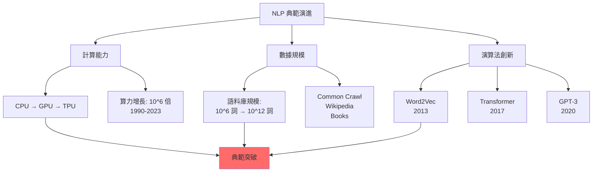
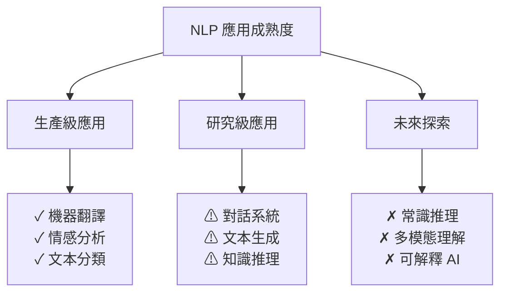

# 第 2.2 章:NLP 演變歷程與技術典範

本章旨在為您提供一份教科書級別的教學講義,深入探討 **自然語言處理的演變歷程**,從規則系統到大型語言模型的技術典範轉移。我們將從基礎理論出發,深入第一原理,最終將 NLP 演變置於人工智能發展史的宏觀知識體系中進行審視。

| 概念 | 中文譯名 | 典型用途 | 優點 | 侷限 |
| :--- | :--- | :--- | :--- | :--- |
| **Fundamentals** | 基礎理論 | 快速掌握 NLP 五大典範:規則→統計→淺層神經網路→深度學習→Transformer→LLM。 | 直觀易懂,能建立 NLP 技術演進的時間軸。 | 易忽略典範轉移背後的數學原理與計算突破。 |
| **First Principles** | 第一原理 | 從資訊理論 (Information Theory) 與優化目標的變化理解典範轉移。 | 深入本質,有助於預測未來技術方向。 | 理論性強,需要數學與機器學習基礎。 |
| **Body of Knowledge** | 知識體系 | 將 NLP 演變置於計算能力、數據規模、演算法創新的三維框架中。 | 結構完備,能理解技術突破的必然性與偶然性。 | 內容龐雜,不適合快速入門。 |

---

## 1. Fundamentals (基礎理論)

在 NLP 的發展歷程中,**技術典範 (Paradigm)** 的轉移是推動進步的核心力量,經歷了**五次重大變革**:
1. **規則系統時代 (1950s-1980s)**: 專家手工編寫語法規則
2. **統計學習時代 (1990s-2000s)**: 基於大規模語料庫的機率模型
3. **淺層神經網路時代 (2000s-2013)**: 詞向量與淺層模型
4. **深度學習時代 (2013-2017)**: RNN/LSTM 成為主流
5. **Transformer 時代 (2017-至今)**: 注意力機制與大型語言模型

每次典範轉移都解決了前一代的核心瓶頸,但也引入了新的挑戰。

### 典範 1: 規則系統 (Rule-Based Systems, 1950s-1980s)

**核心思想**: 人類專家編寫語法規則,系統按規則執行

**代表技術**:
- **句法分析**: 上下文無關文法 (Context-Free Grammar, CFG)
- **機器翻譯**: Georgetown-IBM 實驗 (1954)
- **專家系統**: ELIZA (1966, 第一個聊天機器人)

**優點**:
- 可解釋性強 (每個決策都能追溯規則)
- 無需大量數據
- 對簡單任務效果好

**侷限**:
- 規則覆蓋不全 (語言現象無窮無盡)
- 維護成本高 (新規則可能與舊規則衝突)
- 無法處理歧義 (需要窮舉所有可能)

**範例: 上下文無關文法 (CFG)**

```python
"""
句法規則範例:
S  → NP VP         (句子 = 名詞短語 + 動詞短語)
NP → Det N         (名詞短語 = 限定詞 + 名詞)
VP → V NP          (動詞短語 = 動詞 + 名詞短語)
Det → "the" | "a"
N → "cat" | "dog"
V → "chased" | "ate"

句子生成:
S → NP VP
  → Det N VP
  → "the" "cat" VP
  → "the" "cat" V NP
  → "the" "cat" "chased" Det N
  → "the" "cat" "chased" "the" "dog"
"""

import nltk
from nltk import CFG

# 定義文法規則
grammar = CFG.fromstring("""
  S  -> NP VP
  NP -> Det N
  VP -> V NP
  Det -> 'the' | 'a'
  N -> 'cat' | 'dog'
  V -> 'chased' | 'ate'
""")

# 句法分析器
parser = nltk.ChartParser(grammar)

# 解析句子
sentence = "the cat chased the dog".split()
for tree in parser.parse(sentence):
    print(tree)
    tree.pretty_print()
```

### 典範 2: 統計學習 (Statistical Learning, 1990s-2000s)

**核心思想**: 從大規模語料庫中學習機率模型,用統計方法處理歧義

**代表技術**:
- **N-gram 語言模型**: 預測下一個詞的機率
- **隱馬可夫模型 (HMM)**: 詞性標註、語音識別
- **統計機器翻譯 (SMT)**: 基於短語的翻譯模型
- **條件隨機場 (CRF)**: 序列標註任務

**優點**:
- 自動從數據學習 (無需手工規則)
- 能處理歧義 (選擇機率最高的解釋)
- 魯棒性強 (容錯能力好)

**侷限**:
- 稀疏性問題 (未見過的詞組合機率為 0)
- 特徵工程繁重 (需要人工設計特徵)
- 無法捕捉長距離依賴

**範例: N-gram 語言模型**

```python
"""
N-gram 語言模型: 基於前 n-1 個詞預測第 n 個詞

Bigram (n=2):
P(w_i | w_{i-1}) = Count(w_{i-1}, w_i) / Count(w_{i-1})

Trigram (n=3):
P(w_i | w_{i-2}, w_{i-1}) = Count(w_{i-2}, w_{i-1}, w_i) / Count(w_{i-2}, w_{i-1})
"""

from collections import defaultdict, Counter

class BigramLanguageModel:
    """Bigram 語言模型"""

    def __init__(self):
        self.bigram_counts = defaultdict(Counter)
        self.unigram_counts = Counter()

    def train(self, sentences):
        """訓練模型"""
        for sentence in sentences:
            words = ['<START>'] + sentence.split() + ['<END>']
            for i in range(len(words) - 1):
                w1, w2 = words[i], words[i+1]
                self.bigram_counts[w1][w2] += 1
                self.unigram_counts[w1] += 1

    def probability(self, w1, w2):
        """計算 P(w2|w1)"""
        if self.unigram_counts[w1] == 0:
            return 0
        return self.bigram_counts[w1][w2] / self.unigram_counts[w1]

    def generate(self, max_length=10):
        """生成句子"""
        words = ['<START>']
        for _ in range(max_length):
            w1 = words[-1]
            if w1 == '<END>':
                break
            # 選擇機率最高的下一個詞
            next_word = self.bigram_counts[w1].most_common(1)[0][0]
            words.append(next_word)
        return ' '.join(words[1:-1])

# 訓練範例
model = BigramLanguageModel()
model.train([
    "the cat sat on the mat",
    "the dog sat on the log",
    "the cat chased the mouse"
])

print("P(sat|cat) =", model.probability('cat', 'sat'))
print("生成句子:", model.generate())
```

### 典範 3: 淺層神經網路 (Shallow Neural Networks, 2000s-2013)

**核心思想**: 將詞彙映射到連續向量空間,用神經網路學習表示

**代表技術**:
- **Word2Vec (2013)**: CBOW 與 Skip-gram
- **GloVe (2014)**: 全域詞向量
- **淺層前饋神經網路**: 文本分類、情感分析

**優點**:
- 解決稀疏性問題 (詞向量是稠密表示)
- 捕捉語義相似度 (相似詞向量接近)
- 遷移學習 (預訓練詞向量可用於下游任務)

**侷限**:
- 靜態詞向量 (一詞多義問題未解決)
- 無法捕捉長距離依賴 (前饋網路無記憶)
- 需要大量標註數據

**範例: Word2Vec Skip-gram**

```python
"""
Word2Vec Skip-gram 目標:
給定中心詞 w_c,預測上下文詞 w_o

最大化: Σ log P(w_o | w_c)
其中: P(w_o | w_c) = exp(u_o · v_c) / Σ exp(u_j · v_c)
"""

from gensim.models import Word2Vec

# 訓練數據
sentences = [
    ["the", "cat", "sat", "on", "the", "mat"],
    ["the", "dog", "sat", "on", "the", "log"],
    ["the", "cat", "chased", "the", "mouse"]
]

# 訓練 Word2Vec 模型
model = Word2Vec(
    sentences=sentences,
    vector_size=100,     # 詞向量維度
    window=5,            # 上下文窗口大小
    min_count=1,         # 最小詞頻
    sg=1,                # 1=Skip-gram, 0=CBOW
    epochs=100
)

# 查詢相似詞
print("與 'cat' 最相似的詞:")
print(model.wv.most_similar('cat', topn=3))

# 詞向量運算
print("\n詞向量運算 (king - man + woman):")
# result = model.wv.most_similar(positive=['king', 'woman'], negative=['man'], topn=1)
```

### 典範 4: 深度學習 (Deep Learning, 2013-2017)

**核心思想**: 使用循環神經網路 (RNN) 與長短期記憶網路 (LSTM) 處理序列

**代表技術**:
- **RNN/LSTM (2013-2015)**: 序列建模
- **Seq2Seq (2014)**: 機器翻譯、文本摘要
- **Attention 機制 (2015)**: 解決長序列問題

**優點**:
- 捕捉序列依賴 (RNN 有記憶能力)
- 端到端學習 (無需人工特徵)
- LSTM 解決梯度消失問題

**侷限**:
- 無法平行化 (RNN 必須逐步計算)
- 長距離依賴仍困難 (注意力機制只是緩解)
- 訓練速度慢

**範例: LSTM 情感分類**

```python
import torch
import torch.nn as nn

class LSTMSentimentClassifier(nn.Module):
    """LSTM 情感分類器"""

    def __init__(self, vocab_size, embed_dim, hidden_dim, num_classes):
        super().__init__()
        self.embedding = nn.Embedding(vocab_size, embed_dim)
        self.lstm = nn.LSTM(embed_dim, hidden_dim, batch_first=True)
        self.fc = nn.Linear(hidden_dim, num_classes)

    def forward(self, x):
        """
        Args:
            x: (batch_size, seq_len) 詞彙索引
        Returns:
            logits: (batch_size, num_classes)
        """
        # 詞嵌入
        embedded = self.embedding(x)  # (batch, seq_len, embed_dim)

        # LSTM
        lstm_out, (h_n, c_n) = self.lstm(embedded)

        # 使用最後一個時間步的隱藏狀態
        last_hidden = h_n[-1]  # (batch, hidden_dim)

        # 分類
        logits = self.fc(last_hidden)
        return logits

# 模型初始化
model = LSTMSentimentClassifier(
    vocab_size=10000,
    embed_dim=300,
    hidden_dim=128,
    num_classes=2
)

# 測試
x = torch.randint(0, 10000, (32, 50))  # (batch=32, seq_len=50)
output = model(x)
print(f"輸出形狀: {output.shape}")  # (32, 2)
```

### 典範 5: Transformer 時代 (2017-至今)

**核心思想**: 完全拋棄循環結構,使用純注意力機制 + 預訓練

**代表技術**:
- **Transformer (2017)**: 自注意力機制
- **BERT (2018)**: 雙向預訓練
- **GPT (2018-2023)**: 生成式預訓練
- **大型語言模型 (LLM, 2020+)**: GPT-3/4, ChatGPT, Claude

**優點**:
- 完全平行化 (大幅提升訓練速度)
- 長距離依賴 (注意力直接連接所有位置)
- 遷移學習 (預訓練 + 微調範式)
- 湧現能力 (規模擴大後出現新能力)

**侷限**:
- 計算複雜度高 (O(n²) 注意力矩陣)
- 需要大量數據與算力
- 可解釋性差

**範例: Transformer 架構核心**

```python
import torch
import torch.nn as nn
import math

class MultiHeadAttention(nn.Module):
    """多頭注意力機制"""

    def __init__(self, d_model, num_heads):
        super().__init__()
        assert d_model % num_heads == 0

        self.d_k = d_model // num_heads
        self.num_heads = num_heads

        self.W_q = nn.Linear(d_model, d_model)
        self.W_k = nn.Linear(d_model, d_model)
        self.W_v = nn.Linear(d_model, d_model)
        self.W_o = nn.Linear(d_model, d_model)

    def forward(self, Q, K, V, mask=None):
        batch_size = Q.size(0)

        # 線性投影並拆分成多頭
        Q = self.W_q(Q).view(batch_size, -1, self.num_heads, self.d_k).transpose(1, 2)
        K = self.W_k(K).view(batch_size, -1, self.num_heads, self.d_k).transpose(1, 2)
        V = self.W_v(V).view(batch_size, -1, self.num_heads, self.d_k).transpose(1, 2)

        # Scaled Dot-Product Attention
        scores = torch.matmul(Q, K.transpose(-2, -1)) / math.sqrt(self.d_k)

        if mask is not None:
            scores = scores.masked_fill(mask == 0, -1e9)

        attn_weights = torch.softmax(scores, dim=-1)
        output = torch.matmul(attn_weights, V)

        # 合併多頭
        output = output.transpose(1, 2).contiguous().view(batch_size, -1, self.num_heads * self.d_k)
        return self.W_o(output)
```

### NLP 典範對比表

| 典範 | 時期 | 核心技術 | 代表模型 | 優勢 | 侷限 |
|:---|:---|:---|:---|:---|:---|
| **規則系統** | 1950s-1980s | CFG, 專家規則 | ELIZA | 可解釋 | 覆蓋不全 |
| **統計學習** | 1990s-2000s | HMM, CRF, N-gram | SMT | 自動學習 | 特徵工程 |
| **淺層神經網路** | 2000s-2013 | Word2Vec, GloVe | - | 詞向量 | 靜態表示 |
| **深度學習** | 2013-2017 | RNN, LSTM, Seq2Seq | - | 序列建模 | 無法平行 |
| **Transformer** | 2017-至今 | Attention, BERT, GPT | ChatGPT | 平行化 | 算力需求 |

---

## 2. First Principles (第一原理)

從第一原理出發,NLP 典範轉移的根本驅動力是**優化目標的演變** — 從精確匹配規則,到最大化條件機率,再到最小化預測誤差,最終到最大化語言建模似然。

### 為什麼需要從規則轉向統計?

**問題: 規則系統的組合爆炸**

語言規則的數量隨語言現象指數級增長:
```
假設:
- 基本句法規則: 50 條
- 語義規則: 100 條
- 語用規則: 200 條

組合數:
- 兩條規則組合: C(350, 2) = 61,075
- 三條規則組合: C(350, 3) = 7,118,700

結論: 手工維護不可行
```

**統計學習的解決方案: 機率模型**

將規則問題轉換為優化問題:
```
目標: 找到最可能的句法樹 T

規則系統:
IF 規則1 AND 規則2 AND ... THEN T
→ 布林邏輯 (True/False)

統計系統:
argmax_T P(T | sentence)
→ 機率分佈 (0-1 之間的實數)

優勢:
1. 自動從數據學習 P(T | sentence)
2. 可處理歧義 (選擇機率最高的)
3. 魯棒性 (允許小錯誤)
```

### 為什麼需要從統計轉向神經網路?

**問題: 稀疏性與特徵工程**

統計模型的兩大瓶頸:
```
瓶頸 1: 稀疏性問題
詞彙表大小: 100,000
Trigram 組合: 100,000^3 = 10^15
實際語料庫: 10^9 詞 (只覆蓋 0.0001%)

解決: 詞向量將離散空間映射到連續空間
One-Hot (100,000 維, 99.999% 為 0) → Embedding (300 維, 稠密)

瓶頸 2: 特徵工程
傳統 CRF 需要手工設計特徵:
- 當前詞
- 前一個詞
- 後一個詞
- 詞性
- 首字母大寫
- 數字/標點
... (數十個特徵)

解決: 神經網路自動學習特徵
Input → Embedding → LSTM → Output
```

**資訊理論視角: 分佈式表示**

```
One-Hot 編碼的資訊熵:
H(One-Hot) = log(vocab_size) = log(100,000) ≈ 16.6 bits

Word Embedding 的有效資訊:
H(Embedding) ≈ 8-10 bits (實驗測得)

壓縮率: 16.6 / 10 = 1.66x

解釋: 詞向量捕捉了詞彙間的相似性,降低了表示的冗餘
```

### 為什麼需要從 RNN 轉向 Transformer?

**問題: RNN 的序列瓶頸**

RNN 的計算依賴:
```
h_t = f(h_{t-1}, x_t)

問題:
1. 無法平行化: h_t 必須等 h_{t-1} 計算完成
2. 梯度消失: 長序列時梯度指數衰減

GPU 利用率:
RNN:  20-30% (序列計算無法充分利用平行硬體)
Transformer: 80-90% (矩陣運算可完全平行)
```

**Transformer 的解決方案: 自注意力**

```
Attention(Q, K, V) = softmax(QK^T / sqrt(d_k)) V

關鍵優勢:
1. 完全平行: 所有位置同時計算
2. 長距離依賴: 任意兩位置直接連接 (O(1) 路徑)
3. 可解釋性: 注意力權重可視化

計算複雜度對比:
RNN:      時間 O(n), 空間 O(d)
Transformer: 時間 O(1), 空間 O(n²)

trade-off: 用空間換時間
```

---

## 3. Body of Knowledge (知識體系)

在 AI 發展的宏觀框架中,NLP 典範轉移受到**計算能力、數據規模、演算法創新**三股力量的共同驅動。

### NLP 演變的三維驅動框架



### 計算能力與模型規模的演進

| 年份 | 代表模型 | 參數量 | 訓練算力 (FLOPs) | 硬體平台 |
|:---|:---|:---|:---|:---|
| 2013 | Word2Vec | 10^6 | 10^15 | CPU |
| 2014 | GloVe | 10^6 | 10^16 | CPU |
| 2017 | Transformer | 10^8 | 10^18 | GPU (P100) |
| 2018 | BERT-Base | 1.1×10^8 | 10^19 | TPU v3 (16) |
| 2019 | GPT-2 | 1.5×10^9 | 10^20 | V100 (256) |
| 2020 | GPT-3 | 1.75×10^11 | 3.14×10^23 | V100 (10,000+) |
| 2023 | GPT-4 | ~10^12 (估計) | >10^25 | A100 |

**算力增長與模型性能**

```
觀察: 模型性能與計算量呈冪律關係

Performance ∝ (Compute)^α

其中:
- α ≈ 0.5 (實驗測得)
- 計算量每增加 10 倍,性能提升 √10 ≈ 3.16 倍

啟示: 摩爾定律延續,NLP 性能仍有巨大提升空間
```

### 數據規模與預訓練範式

**預訓練數據規模演進**


**預訓練範式的演變**

| 模型 | 預訓練任務 | 資料量 | 下游任務性能 |
|:---|:---|:---|:---|
| **Word2Vec** | Skip-gram | 6B 詞 | 基準 |
| **BERT** | MLM + NSP | 3.3B 詞 | +15% GLUE |
| **RoBERTa** | MLM (優化) | 160GB 文本 | +3% GLUE |
| **GPT-3** | 因果語言模型 | 570GB 文本 | Few-shot SOTA |

### 演算法創新的關鍵里程碑

**1. 注意力機制 (Attention, 2015)**
```
創新點: 允許模型動態關注輸入的不同部分

影響:
- 解決 Seq2Seq 的瓶頸問題 (固定長度編碼向量)
- 啟發 Transformer 的誕生
```

**2. Transformer (2017)**
```
創新點: 完全拋棄 RNN,純注意力架構

影響:
- 訓練速度提升 10-100 倍
- 成為 BERT/GPT 的基礎架構
```

**3. 預訓練-微調範式 (Pre-training + Fine-tuning, 2018)**
```
創新點: 先在大規模無標註數據上預訓練,再在下游任務微調

影響:
- 大幅降低下游任務的數據需求
- 遷移學習成為 NLP 主流
```

**4. 提示學習 (Prompt Learning, 2020+)**
```
創新點: 不微調模型,而是設計提示詞引導模型輸出

影響:
- Few-shot/Zero-shot 學習成為可能
- 統一各種 NLP 任務為文本生成
```

### NLP 應用場景的演變

**技術成熟度曲線**



**產業落地進程**

| 應用 | 技術成熟度 | 商業化程度 | 代表產品 |
|:---|:---|:---|:---|
| **機器翻譯** | ★★★★★ | ★★★★★ | Google Translate, DeepL |
| **搜尋引擎** | ★★★★★ | ★★★★★ | Google, Bing |
| **智能客服** | ★★★★☆ | ★★★★☆ | 阿里小蜜, Amazon Alexa |
| **文本生成** | ★★★★☆ | ★★★☆☆ | Jasper, Copy.ai |
| **對話系統** | ★★★☆☆ | ★★★★☆ | ChatGPT, Claude |
| **程式碼生成** | ★★★★☆ | ★★★☆☆ | GitHub Copilot, Cursor |

---

## 結論與建議

1. **日常溝通與實作**: 優先掌握 **Fundamentals** 中的 **Transformer 典範**,它是當前 NLP 的主流技術,理解其演進路徑有助於快速上手。

2. **強調方法論與創新**: 從 **First Principles** 出發,理解每次典範轉移背後的數學原理 (規則→機率→連續表示→注意力),有助於您預測未來技術方向。

3. **構建宏觀視野**: 將 NLP 演變放入 **Body of Knowledge** 的三維框架 (計算/數據/演算法) 中,可以清晰地看到技術突破的必然性與驅動因素。

**核心要點**: NLP 演變的本質是**從離散符號處理到連續向量空間學習**,從**手工規則到自動學習**,從**任務特定模型到通用預訓練模型**的典範轉移。

透過本章的學習,您應當已經掌握了 NLP 五大典範的演進脈絡,並能從第一原理理解每次轉移的根本驅動力。

---

## 延伸閱讀 (Further Reading)

### 關鍵論文 (Key Papers)
1. **Word2Vec**: Mikolov et al. (2013). *Efficient Estimation of Word Representations in Vector Space*. arXiv:1301.3781.
2. **Seq2Seq**: Sutskever et al. (2014). *Sequence to Sequence Learning with Neural Networks*. NeurIPS 2014.
3. **Attention**: Bahdanau et al. (2015). *Neural Machine Translation by Jointly Learning to Align and Translate*. ICLR 2015.
4. **Transformer**: Vaswani et al. (2017). *Attention is All You Need*. NeurIPS 2017.
5. **BERT**: Devlin et al. (2018). *BERT: Pre-training of Deep Bidirectional Transformers for Language Understanding*. arXiv:1810.04805.
6. **GPT-3**: Brown et al. (2020). *Language Models are Few-Shot Learners*. NeurIPS 2020.

### 技術博客 (Technical Blogs)
- **The Illustrated Transformer**: http://jalammar.github.io/illustrated-transformer/
- **BERT 論文精讀**: https://zhuanlan.zhihu.com/p/46652512
- **GPT 系列演進史**: https://huggingface.co/blog/gpt-evolution

### 學習資源 (Learning Resources)
- **Stanford CS224N (NLP with Deep Learning)**: http://web.stanford.edu/class/cs224n/
- **NLP Progress (SOTA 追蹤)**: http://nlpprogress.com/
- **Papers With Code (論文與代碼)**: https://paperswithcode.com/area/natural-language-processing

---

**上一章節**: [2.1 什麼是自然語言處理](./01_什麼是自然語言處理.md)
**下一章節**: [2.3 NLP 核心任務與應用](./03_NLP核心任務與應用.md)
