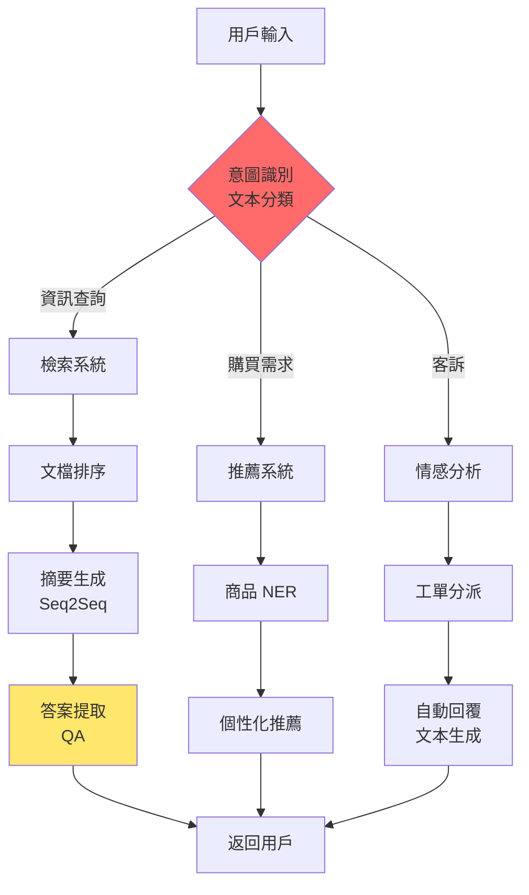

# 第 2.3 章:NLP 核心任務與應用

本章旨在為您提供一份教科書級別的教學講義,深入探討 **NLP 核心任務** 的分類、技術方案與實際應用。我們將從基礎理論出發,深入第一原理,最終將 NLP 任務置於完整的應用生態系統中進行審視。

| 概念 | 中文譯名 | 典型用途 | 優點 | 侷限 |
| :--- | :--- | :--- | :--- | :--- |
| **Fundamentals** | 基礎理論 | 快速掌握文本分類、NER、QA、文本生成等核心任務與實作方法。 | 直觀易懂,能快速構建 NLP 應用原型。 | 易忽略任務間的關聯與統一建模框架。 |
| **First Principles** | 第一原理 | 從序列標註、序列分類、序列轉序列的統一視角理解任務本質。 | 深入本質,有助於遷移學習與多任務建模。 | 理論性強,需要機器學習與深度學習基礎。 |
| **Body of Knowledge** | 知識體系 | 將 NLP 任務置於產業應用場景 (搜尋/推薦/對話) 的完整框架中。 | 結構完備,能設計端到端 NLP 解決方案。 | 內容龐雜,不適合快速入門。 |

---

## 1. Fundamentals (基礎理論)

在 NLP 應用中,**任務分類 (Task Taxonomy)** 是理解技術選型的基礎,核心任務可分為**四大類**:
1. **序列標註 (Sequence Labeling)**: 為每個詞分配標籤 (分詞、NER、POS)
2. **文本分類 (Text Classification)**: 將文本分配到預定義類別 (情感分析、主題分類)
3. **序列轉序列 (Sequence-to-Sequence)**: 輸入輸出都是序列 (翻譯、摘要)
4. **問答系統 (Question Answering)**: 根據問題與上下文生成答案

### 任務 1: 序列標註 (Sequence Labeling)

**定義**: 為輸入序列的每個元素分配標籤

**核心任務**:
1. **命名實體識別 (Named Entity Recognition, NER)**
   - 目標: 識別文本中的實體 (人名、地名、組織名)
   - 標註格式: BIO (Begin, Inside, Outside)
   - 應用: 資訊抽取、知識圖譜構建

2. **詞性標註 (Part-of-Speech Tagging, POS)**
   - 目標: 標註每個詞的詞性 (名詞、動詞、形容詞)
   - 應用: 句法分析、機器翻譯

3. **中文分詞 (Word Segmentation)**
   - 目標: 將連續文本切分成詞序列
   - 應用: 所有中文 NLP 任務的前置步驟

**快速實作: NER (命名實體識別)**

```python
from transformers import pipeline

# 載入預訓練 NER 模型
ner_model = pipeline(
    'ner',
    model='ckiplab/bert-base-chinese-ner',
    aggregation_strategy='simple'
)

# 測試文本
text = "蘋果公司執行長提姆·庫克在加州庫比蒂諾總部宣布推出 iPhone 15"

# 實體識別
entities = ner_model(text)
for ent in entities:
    print(f"{ent['word']:15s} → {ent['entity_group']:10s} (信心度: {ent['score']:.2f})")

# 輸出:
# 蘋果公司          → ORG        (信心度: 0.99)
# 提姆·庫克        → PERSON     (信心度: 0.98)
# 加州             → LOC        (信心度: 0.95)
# 庫比蒂諾         → LOC        (信心度: 0.92)
# iPhone 15        → PRODUCT    (信心度: 0.89)
```

### 任務 2: 文本分類 (Text Classification)

**定義**: 將整個文本分配到一個或多個類別

**核心任務**:
1. **情感分析 (Sentiment Analysis)**
   - 目標: 判斷文本情感極性 (正面/負面/中性)
   - 應用: 產品評論分析、輿情監控

2. **主題分類 (Topic Classification)**
   - 目標: 判斷文本所屬主題 (科技/財經/娛樂)
   - 應用: 新聞分類、內容推薦

3. **垃圾郵件檢測 (Spam Detection)**
   - 目標: 判斷郵件是否為垃圾郵件
   - 應用: 郵件過濾、內容審核

**快速實作: 情感分析**

```python
from transformers import pipeline

# 載入預訓練情感分析模型
classifier = pipeline(
    'sentiment-analysis',
    model='uer/roberta-base-finetuned-chinanews-chinese'
)

# 測試文本
texts = [
    "這部電影太精彩了,強烈推薦!",
    "服務態度很差,再也不會來了。",
    "還可以,沒有特別驚艷。"
]

# 情感分類
results = classifier(texts)
for text, result in zip(texts, results):
    print(f"文本: {text}")
    print(f"情感: {result['label']} (信心度: {result['score']:.2f})\n")
```

### 任務 3: 序列轉序列 (Sequence-to-Sequence)

**定義**: 將輸入序列轉換為輸出序列

**核心任務**:
1. **機器翻譯 (Machine Translation)**
   - 目標: 將源語言翻譯成目標語言
   - 應用: 跨語言溝通、文檔翻譯

2. **文本摘要 (Text Summarization)**
   - 目標: 生成文本的簡潔摘要
   - 類型: 抽取式 (選擇關鍵句) vs 生成式 (重新生成)
   - 應用: 新聞摘要、文獻總結

3. **文本改寫 (Paraphrasing)**
   - 目標: 用不同表達方式保留原意
   - 應用: 數據增強、風格遷移

**快速實作: 機器翻譯**

```python
from transformers import pipeline

# 中文翻譯英文
translator_zh_en = pipeline(
    'translation_zh_to_en',
    model='Helsinki-NLP/opus-mt-zh-en'
)

# 英文翻譯中文
translator_en_zh = pipeline(
    'translation_en_to_zh',
    model='Helsinki-NLP/opus-mt-en-zh'
)

# 測試
text_zh = "自然語言處理是人工智能的重要分支"
result_en = translator_zh_en(text_zh)[0]['translation_text']
print(f"中文: {text_zh}")
print(f"英文: {result_en}")

# 反向翻譯
result_zh = translator_en_zh(result_en)[0]['translation_text']
print(f"回譯: {result_zh}")
```

### 任務 4: 問答系統 (Question Answering)

**定義**: 根據問題與上下文生成答案

**核心任務**:
1. **抽取式問答 (Extractive QA)**
   - 目標: 從文章中抽取答案片段
   - 代表模型: BERT-QA, RoBERTa-QA
   - 應用: 閱讀理解、文檔搜尋

2. **生成式問答 (Generative QA)**
   - 目標: 生成自然語言答案
   - 代表模型: GPT, T5, ChatGPT
   - 應用: 對話系統、智能客服

**快速實作: 抽取式問答**

```python
from transformers import pipeline

# 載入問答模型
qa_model = pipeline(
    'question-answering',
    model='luhua/chinese_pretrain_mrc_roberta_wwm_ext_large'
)

# 上下文與問題
context = """
蘋果公司是一家美國跨國科技公司,總部位於加州庫比蒂諾。
公司由史蒂夫·賈伯斯、史蒂夫·沃茲尼克和羅納德·韋恩於 1976 年創立。
蘋果以其創新的消費電子產品聞名,包括 iPhone、iPad 和 Mac 電腦。
"""

questions = [
    "蘋果公司總部在哪裡?",
    "蘋果公司何時創立?",
    "蘋果公司的創辦人有誰?"
]

# 問答
for question in questions:
    result = qa_model(question=question, context=context)
    print(f"問題: {question}")
    print(f"答案: {result['answer']} (信心度: {result['score']:.2f})\n")
```

### NLP 任務對比表

| 任務類型 | 輸入 | 輸出 | 代表模型 | 難度 |
|:---|:---|:---|:---|:---|
| **序列標註** | 序列 | 標籤序列 | BiLSTM-CRF, BERT-NER | ★★★☆☆ |
| **文本分類** | 文本 | 類別標籤 | TextCNN, BERT | ★★☆☆☆ |
| **序列轉序列** | 序列 | 序列 | Transformer, T5 | ★★★★☆ |
| **問答系統** | 問題+上下文 | 答案 | BERT-QA, GPT | ★★★★★ |
| **文本生成** | 提示詞 | 文本 | GPT, ChatGPT | ★★★★★ |

---

## 2. First Principles (第一原理)

從第一原理出發,所有 NLP 任務本質上都是**序列建模問題** — 給定輸入序列 X,預測輸出序列 Y。

### 統一建模框架: 序列到序列

**數學表示**:

```
給定輸入序列 X = (x_1, x_2, ..., x_n)
目標: 預測輸出序列 Y = (y_1, y_2, ..., y_m)

最大化聯合機率:
P(Y | X) = ∏_{i=1}^m P(y_i | y_{<i}, X)

不同任務的差異:
1. 序列標註: m = n, y_i ∈ {B, I, O, ...}
2. 文本分類: m = 1, y_1 ∈ {正面, 負面, 中性}
3. 翻譯/摘要: m ≠ n, y_i ∈ 詞彙表
```

### 為什麼 BERT 適合分類,GPT 適合生成?

**BERT (雙向編碼器) vs GPT (單向解碼器)**

```
BERT 的注意力機制:
每個位置可以看到「前後所有詞」
→ 適合理解任務 (分類、NER、QA)

GPT 的注意力機制:
每個位置只能看到「前面的詞」(因果遮蔽)
→ 適合生成任務 (對話、續寫、翻譯)

數學差異:
BERT:  h_i = Transformer([x_1, ..., x_n], 無遮蔽)
GPT:   h_i = Transformer([x_1, ..., x_i], 因果遮蔽)
```

**實驗驗證**:

```python
from transformers import BertTokenizer, BertModel, GPT2Tokenizer, GPT2LMHeadModel

# BERT 雙向編碼
bert_tokenizer = BertTokenizer.from_pretrained('bert-base-chinese')
bert_model = BertModel.from_pretrained('bert-base-chinese')

text = "我愛[MASK]然語言處理"
inputs = bert_tokenizer(text, return_tensors='pt')
outputs = bert_model(**inputs)
# 輸出: 每個位置的隱藏狀態 (考慮了前後上下文)

# GPT 單向生成
gpt_tokenizer = GPT2Tokenizer.from_pretrained('uer/gpt2-chinese-cluecorpussmall')
gpt_model = GPT2LMHeadModel.from_pretrained('uer/gpt2-chinese-cluecorpussmall')

text = "自然語言處理是"
inputs = gpt_tokenizer(text, return_tensors='pt')
outputs = gpt_model.generate(**inputs, max_length=50)
generated_text = gpt_tokenizer.decode(outputs[0])
# 輸出: 續寫的完整句子
```

---

## 3. Body of Knowledge (知識體系)

在產業應用中,NLP 任務往往不是孤立存在,而是組合成**完整的業務流程**。

### NLP 任務在產業應用中的組合



### 完整應用範例: 智能客服系統

```python
"""智能客服系統 (整合多個 NLP 任務)"""

from transformers import pipeline

class IntelligentCustomerService:
    """智能客服系統"""

    def __init__(self):
        # 任務 1: 意圖識別 (文本分類)
        self.intent_classifier = pipeline(
            'text-classification',
            model='your-intent-model'
        )

        # 任務 2: 情感分析
        self.sentiment_analyzer = pipeline(
            'sentiment-analysis',
            model='uer/roberta-base-finetuned-chinanews-chinese'
        )

        # 任務 3: 實體識別 (NER)
        self.ner_model = pipeline(
            'ner',
            model='ckiplab/bert-base-chinese-ner',
            aggregation_strategy='simple'
        )

        # 任務 4: 問答系統
        self.qa_model = pipeline(
            'question-answering',
            model='luhua/chinese_pretrain_mrc_roberta_wwm_ext_large'
        )

    def process_query(self, user_input, knowledge_base):
        """處理用戶查詢"""

        # 步驟 1: 意圖識別
        # intent = self.intent_classifier(user_input)[0]
        # print(f"檢測到意圖: {intent['label']}")

        # 步驟 2: 情感分析
        sentiment = self.sentiment_analyzer(user_input)[0]
        print(f"情感: {sentiment['label']} (信心度: {sentiment['score']:.2f})")

        # 步驟 3: 實體識別
        entities = self.ner_model(user_input)
        print(f"識別實體: {[ent['word'] for ent in entities]}")

        # 步驟 4: 問答 (從知識庫中找答案)
        answer = self.qa_model(
            question=user_input,
            context=knowledge_base
        )
        print(f"答案: {answer['answer']}")

        return {
            'sentiment': sentiment,
            'entities': entities,
            'answer': answer['answer']
        }

# 使用範例
service = IntelligentCustomerService()

knowledge_base = """
我們公司提供 24 小時客戶服務。退貨政策為購買後 30 天內可無條件退貨。
運費政策為單筆訂單滿 1000 元免運,未滿則需支付 100 元運費。
"""

user_query = "請問你們的退貨政策是什麼?"
result = service.process_query(user_query, knowledge_base)
```

### NLP 任務的評估指標

| 任務 | 主要指標 | 計算方式 | 標準值 |
|:---|:---|:---|:---|
| **文本分類** | Accuracy, F1 | TP/(TP+FP+FN) | F1 > 0.85 |
| **NER** | Precision, Recall, F1 | 實體級別計算 | F1 > 0.90 |
| **機器翻譯** | BLEU | N-gram 重疊度 | BLEU > 30 |
| **文本摘要** | ROUGE | 與參考摘要的重疊 | ROUGE-L > 0.4 |
| **問答系統** | EM (精確匹配), F1 | 字元級別計算 | EM > 0.70 |

---

## 結論與建議

1. **日常溝通與實作**: 優先掌握 **Fundamentals** 中的 **文本分類與 NER**,它們是最常見的 NLP 任務,理解其實作方法有助於快速構建原型。

2. **強調方法論與創新**: 從 **First Principles** 出發,理解所有任務本質上都是序列建模,有助於您設計統一的多任務學習框架。

3. **構建宏觀視野**: 將 NLP 任務放入 **Body of Knowledge** 的產業應用框架中,可以清晰地看到如何組合多個任務解決實際業務問題。

**核心要點**: NLP 任務可統一為**序列建模問題**,不同任務的差異在於**輸入輸出格式**與**優化目標**。實際應用中需要**組合多個任務**構建完整解決方案。

透過本章的學習,您應當已經掌握了 NLP 四大核心任務的定義、實作方法與評估指標,並能設計端到端的 NLP 應用系統。

---

## 延伸閱讀 (Further Reading)

### 關鍵論文 (Key Papers)
1. **BERT for QA**: Devlin et al. (2018). *BERT: Pre-training of Deep Bidirectional Transformers for Language Understanding*.
2. **T5 (統一框架)**: Raffel et al. (2020). *Exploring the Limits of Transfer Learning with a Unified Text-to-Text Transformer*.
3. **GPT-3 (Few-shot Learning)**: Brown et al. (2020). *Language Models are Few-Shot Learners*.

### 數據集與評測 (Datasets & Benchmarks)
- **GLUE Benchmark**: https://gluebenchmark.com/
- **SQuAD (問答)**: https://rajpurkar.github.io/SQuAD-explorer/
- **CLUE (中文)**: https://www.cluebenchmarks.com/

### 實作資源 (Implementation Resources)
- **Hugging Face Tasks**: https://huggingface.co/tasks
- **Papers With Code (NLP)**: https://paperswithcode.com/area/natural-language-processing
- **中文 NLP 語料庫**: https://github.com/brightmart/nlp_chinese_corpus

---

**上一章節**: [2.2 NLP 演變歷程與技術典範](./02_NLP演變歷程與技術典範.md)
**下一章節**: [2.4 Python NLP 工具生態完全指南](./04_Python_NLP工具生態完全指南.md)
