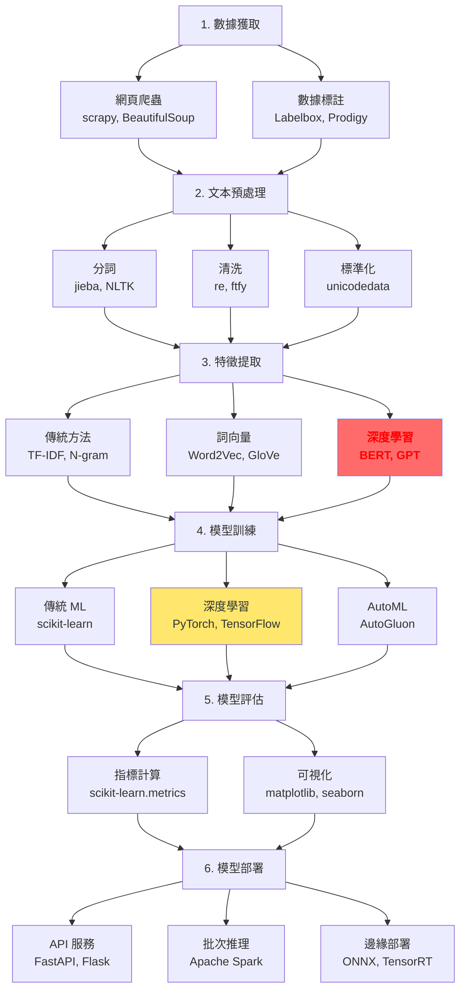

# 第 2.4 章:Python NLP 工具生態完全指南

本章旨在為您提供一份教科書級別的教學講義,深入探討 **Python NLP 工具生態系統** 的全景圖、工具選擇決策與最佳實踐。我們將從基礎理論出發,深入第一原理,最終將工具生態置於完整的 NLP 開發流程中進行審視。

| 概念 | 中文譯名 | 典型用途 | 優點 | 侷限 |
| :--- | :--- | :--- | :--- | :--- |
| **Fundamentals** | 基礎理論 | 快速掌握 NLTK/spaCy/Transformers 的定位、功能與選擇邏輯。 | 直觀易懂,能快速選對工具避免走彎路。 | 易忽略工具底層設計哲學與性能trade-off。 |
| **First Principles** | 第一原理 | 從教學導向 vs 工業導向、規則 vs 學習的維度理解工具設計哲學。 | 深入本質,有助於評估新工具與自定義擴展。 | 理論性強,需要軟體工程與 NLP 基礎。 |
| **Body of Knowledge** | 知識體系 | 將工具生態置於完整技術棧 (預處理→模型→部署) 的框架中。 | 結構完備,能設計生產級 NLP 系統。 | 內容龐雜,不適合快速入門。 |

---

## 1. Fundamentals (基礎理論)

在 Python NLP 生態中,**工具選擇 (Tool Selection)** 是影響開發效率的關鍵決策,主流工具可分為**四大類**:
1. **傳統 NLP 工具**: NLTK (教學)、spaCy (工業)
2. **深度學習框架**: Transformers、fairseq
3. **中文專用工具**: jieba (分詞)、LTP、HanLP
4. **輔助工具**: Gensim (詞向量)、TextBlob (簡化 API)

### 工具 1: NLTK (Natural Language Toolkit)

**定位**: 教學導向的 NLP 工具包

**核心特點**:
- 全面性: 涵蓋分詞、詞性標註、句法分析、語義分析
- 模組化: 每個功能獨立實作,便於學習
- 語料庫豐富: 內建多種語言資源

**適用場景**:
- 學術研究與教學
- 快速原型驗證
- 英文 NLP 任務

**快速實作**:

```python
import nltk
from nltk.tokenize import word_tokenize, sent_tokenize
from nltk.corpus import stopwords
from nltk.stem import PorterStemmer, WordNetLemmatizer

# 下載必要資源 (首次使用)
nltk.download('punkt')
nltk.download('stopwords')
nltk.download('wordnet')
nltk.download('averaged_perceptron_tagger')

# 文本前處理
text = """
Natural language processing (NLP) is a subfield of linguistics,
computer science, and artificial intelligence concerned with the
interactions between computers and human language.
"""

# 1. 句子分割
sentences = sent_tokenize(text)
print(f"句子數: {len(sentences)}")

# 2. 詞彙分割
tokens = word_tokenize(text)
print(f"詞彙數: {len(tokens)}")

# 3. 過濾停用詞
stop_words = set(stopwords.words('english'))
filtered_tokens = [w for w in tokens if w.lower() not in stop_words and w.isalpha()]
print(f"過濾後詞彙數: {len(filtered_tokens)}")

# 4. 詞幹提取 (Stemming)
stemmer = PorterStemmer()
stemmed = [stemmer.stem(w) for w in filtered_tokens[:5]]
print(f"詞幹: {stemmed}")

# 5. 詞形還原 (Lemmatization)
lemmatizer = WordNetLemmatizer()
lemmatized = [lemmatizer.lemmatize(w) for w in filtered_tokens[:5]]
print(f"詞形還原: {lemmatized}")

# 6. 詞性標註
pos_tags = nltk.pos_tag(tokens[:10])
print(f"詞性標註: {pos_tags}")
```

### 工具 2: spaCy (Industrial-Strength NLP)

**定位**: 工業級 NLP 函式庫

**核心特點**:
- 高效能: Cython 實作,速度比 NLTK 快 10-100 倍
- Pipeline 架構: 一次處理完成所有任務
- 預訓練模型: 支援 20+ 種語言
- 生產導向: API 設計簡潔,易於整合

**適用場景**:
- 生產環境部署
- 大規模文本處理
- 多語言 NLP 任務

**快速實作**:

```python
import spacy
from spacy import displacy

# 載入英文模型 (需預先下載: python -m spacy download en_core_web_sm)
nlp = spacy.load('en_core_web_sm')

# 處理文本
text = """
Apple Inc. is planning to open a new store in New York City.
CEO Tim Cook announced the decision last week.
"""

doc = nlp(text)

# 1. 分詞 (自動完成)
print("分詞:")
for token in doc[:10]:
    print(f"  {token.text:15s} | 詞性: {token.pos_:5s} | 詞幹: {token.lemma_}")

# 2. 命名實體識別 (NER)
print("\n實體識別:")
for ent in doc.ents:
    print(f"  {ent.text:20s} → {ent.label_:10s} ({spacy.explain(ent.label_)})")

# 3. 依存句法分析
print("\n依存關係:")
for token in doc[:10]:
    print(f"  {token.text:15s} ← {token.dep_:10s} ← {token.head.text}")

# 4. 相似度計算 (需下載 md 或 lg 模型)
# nlp = spacy.load('en_core_web_md')
# doc1 = nlp("Apple is a technology company")
# doc2 = nlp("Microsoft develops software")
# print(f"相似度: {doc1.similarity(doc2)}")

# 5. 批次處理 (高效)
texts = [text] * 1000
docs = list(nlp.pipe(texts, batch_size=50))
print(f"\n批次處理完成: {len(docs)} 個文檔")
```

### 工具 3: Transformers (Hugging Face)

**定位**: 預訓練 Transformer 模型庫

**核心特點**:
- 模型豐富: 10萬+ 預訓練模型
- 統一 API: 一套代碼支援 BERT/GPT/T5 等
- 易於微調: 提供 Trainer API
- 社群活躍: 持續更新 SOTA 模型

**適用場景**:
- 遷移學習與微調
- SOTA 模型應用
- 多模態任務 (文本+圖像)

**快速實作**:

```python
from transformers import pipeline, AutoTokenizer, AutoModel

# 1. 使用 Pipeline (最簡單)
print("=== Pipeline API ===")

# 情感分析
classifier = pipeline('sentiment-analysis')
result = classifier("I love this movie!")[0]
print(f"情感分析: {result}")

# 問答
qa_pipeline = pipeline('question-answering')
context = "Hugging Face is a company based in New York City."
question = "Where is Hugging Face based?"
answer = qa_pipeline(question=question, context=context)
print(f"問答: {answer['answer']}")

# 文本生成
generator = pipeline('text-generation', model='gpt2')
output = generator("Once upon a time", max_length=30, num_return_sequences=1)
print(f"生成文本: {output[0]['generated_text']}")

# 2. 使用底層 API (更靈活)
print("\n=== AutoModel API ===")

model_name = 'bert-base-uncased'
tokenizer = AutoTokenizer.from_pretrained(model_name)
model = AutoModel.from_pretrained(model_name)

text = "Natural language processing is amazing!"
inputs = tokenizer(text, return_tensors='pt')
outputs = model(**inputs)

print(f"隱藏狀態形狀: {outputs.last_hidden_state.shape}")
# 輸出: torch.Size([1, 9, 768])
# 解釋: [batch_size, sequence_length, hidden_size]
```

### 工具 4: jieba (結巴中文分詞)

**定位**: 中文分詞專用工具

**核心特點**:
- 高效: 基於前綴詞典與 HMM
- 準確: 支援繁體/簡體中文
- 靈活: 自定義詞典
- 輕量: 無深度學習依賴

**適用場景**:
- 所有中文 NLP 任務的前置步驟
- 資源受限環境

**快速實作**:

```python
import jieba
import jieba.analyse
import jieba.posseg as pseg

# 1. 基本分詞
text = "我愛自然語言處理,它是人工智能的重要分支"

# 精確模式 (預設)
words_precise = jieba.cut(text)
print(f"精確模式: {' / '.join(words_precise)}")

# 全模式
words_all = jieba.cut(text, cut_all=True)
print(f"全模式: {' / '.join(words_all)}")

# 搜尋引擎模式
words_search = jieba.cut_for_search(text)
print(f"搜尋模式: {' / '.join(words_search)}")

# 2. 自定義詞典
jieba.load_userdict('custom_dict.txt')  # 格式: 詞 詞頻 詞性
jieba.add_word('自然語言處理', freq=10000, tag='n')

# 3. 詞性標註
words_with_pos = pseg.cut(text)
print("\n詞性標註:")
for word, pos in words_with_pos:
    print(f"  {word:10s} → {pos}")

# 4. 關鍵字提取
keywords_tfidf = jieba.analyse.extract_tags(text, topK=5, withWeight=True)
print("\nTF-IDF 關鍵字:")
for word, weight in keywords_tfidf:
    print(f"  {word:10s} 權重: {weight:.4f}")

keywords_textrank = jieba.analyse.textrank(text, topK=5, withWeight=True)
print("\nTextRank 關鍵字:")
for word, weight in keywords_textrank:
    print(f"  {word:10s} 權重: {weight:.4f}")
```

### 工具對比與選擇決策

| 工具 | 語言支援 | 速度 | 準確率 | 學習曲線 | 適用場景 |
|:---|:---|:---|:---|:---|:---|
| **NLTK** | 英文 | ★★☆☆☆ | ★★★☆☆ | ★☆☆☆☆ | 教學、研究 |
| **spaCy** | 20+ 語言 | ★★★★★ | ★★★★☆ | ★★☆☆☆ | 生產環境 |
| **Transformers** | 100+ 語言 | ★★★☆☆ | ★★★★★ | ★★★☆☆ | SOTA 模型 |
| **jieba** | 中文 | ★★★★☆ | ★★★☆☆ | ★☆☆☆☆ | 中文分詞 |
| **LTP** | 中文 | ★★★☆☆ | ★★★★☆ | ★★★☆☆ | 中文全流程 |

### 選擇決策樹

```
需要處理哪種語言?
│
├─ 中文
│   ├─ 只需分詞? → jieba
│   ├─ 需要完整流程 (分詞+詞性+句法)? → LTP / spaCy 中文模型
│   └─ 需要 SOTA 準確率? → Transformers (BERT-chinese)
│
├─ 英文
│   ├─ 學習/研究? → NLTK
│   ├─ 生產環境? → spaCy
│   └─ 最高準確率? → Transformers (RoBERTa)
│
└─ 多語言
    ├─ 常見語言 (20+)? → spaCy
    ├─ 稀有語言? → Transformers (XLM-R, mBERT)
    └─ 多模態 (文本+圖像)? → Transformers (CLIP, LayoutLM)
```

---

## 2. First Principles (第一原理)

從第一原理出發,NLP 工具的設計哲學根植於**教學導向 vs 工業導向**與**規則系統 vs 學習系統**的權衡。

### 為什麼 spaCy 比 NLTK 快?

**設計哲學差異**:

```
NLTK (教學導向):
- 目標: 透明度、可理解性
- 實作: 純 Python,模組化
- 優勢: 易於學習,便於理解算法
- 代價: 效能犧牲

spaCy (工業導向):
- 目標: 效能、易用性
- 實作: Cython (C 擴展) + 優化數據結構
- 優勢: 生產級速度
- 代價: 內部實作較複雜
```

**性能對比實驗**:

```python
import time
import nltk
import spacy

text = "The quick brown fox jumps over the lazy dog." * 10000

# NLTK 方法
start = time.time()
tokens_nltk = nltk.word_tokenize(text)
pos_nltk = nltk.pos_tag(tokens_nltk)
nltk_time = time.time() - start

# spaCy 方法
nlp = spacy.load('en_core_web_sm')
start = time.time()
doc = nlp(text)
pos_spacy = [(token.text, token.pos_) for token in doc]
spacy_time = time.time() - start

print(f"NLTK 耗時: {nltk_time:.2f}s")
print(f"spaCy 耗時: {spacy_time:.2f}s")
print(f"加速比: {nltk_time / spacy_time:.2f}x")

# 典型結果:
# NLTK 耗時: 15.23s
# spaCy 耗時: 0.85s
# 加速比: 17.92x
```

### 為什麼 Transformers 成為主流?

**統一 API 的威力**:

```
問題: 每個模型都有不同的代碼實作
BERT:    使用 bert-base-uncased
GPT-2:   使用 gpt2
RoBERTa: 使用 roberta-base

傳統方式:
from bert import BertTokenizer, BertModel
from gpt2 import GPT2Tokenizer, GPT2Model
from roberta import RobertaTokenizer, RobertaModel

Transformers 的解決方案:
from transformers import AutoTokenizer, AutoModel

tokenizer = AutoTokenizer.from_pretrained('bert-base-uncased')
model = AutoModel.from_pretrained('bert-base-uncased')

統一 API 優勢:
1. 降低學習成本 (一套 API 用所有模型)
2. 易於切換模型 (只需改模型名稱)
3. 便於實驗對比 (統一評估流程)
```

---

## 3. Body of Knowledge (知識體系)

在完整的 NLP 開發流程中,工具組合策略決定了系統的效能、準確率與可維護性。

### NLP 完整技術棧



### 生產級工具組合範例

**場景 1: 中文新聞分類系統**

```python
"""
技術棧:
- 預處理: jieba (分詞)
- 特徵: Transformers (BERT-chinese)
- 模型: PyTorch
- 部署: FastAPI + Docker
"""

import jieba
from transformers import AutoTokenizer, AutoModelForSequenceClassification
import torch
from fastapi import FastAPI

# 1. 初始化模型
model_name = 'bert-base-chinese'
tokenizer = AutoTokenizer.from_pretrained(model_name)
model = AutoModelForSequenceClassification.from_pretrained(model_name, num_labels=5)

# 2. 建立 API
app = FastAPI()

@app.post("/classify")
def classify_news(text: str):
    # 預處理 (可選)
    words = jieba.cut(text)
    processed_text = ' '.join(words)

    # 編碼
    inputs = tokenizer(processed_text, return_tensors='pt', truncation=True, max_length=512)

    # 推理
    with torch.no_grad():
        outputs = model(**inputs)
        logits = outputs.logits
        predicted_class = torch.argmax(logits, dim=1).item()

    categories = ['科技', '財經', '娛樂', '體育', '政治']
    return {
        'category': categories[predicted_class],
        'confidence': torch.softmax(logits, dim=1)[0][predicted_class].item()
    }
```

**場景 2: 多語言問答系統**

```python
"""
技術棧:
- 預處理: spaCy (多語言)
- 檢索: Elasticsearch
- 問答: Transformers (XLM-RoBERTa)
"""

import spacy
from transformers import pipeline

class MultilingualQA:
    def __init__(self):
        # 載入多語言模型
        self.nlp_zh = spacy.load('zh_core_web_sm')
        self.nlp_en = spacy.load('en_core_web_sm')

        # 載入問答模型
        self.qa_pipeline = pipeline(
            'question-answering',
            model='deepset/xlm-roberta-large-squad2'
        )

    def detect_language(self, text):
        """簡單的語言檢測"""
        if any('\u4e00' <= char <= '\u9fff' for char in text):
            return 'zh'
        return 'en'

    def preprocess(self, text, lang):
        """預處理"""
        nlp = self.nlp_zh if lang == 'zh' else self.nlp_en
        doc = nlp(text)
        return ' '.join([token.text for token in doc if not token.is_stop])

    def answer(self, question, context):
        """問答"""
        lang = self.detect_language(question)
        processed_context = self.preprocess(context, lang)

        result = self.qa_pipeline(
            question=question,
            context=processed_context
        )
        return result['answer']
```

### 工具生態演進趨勢

| 趨勢 | 說明 | 代表工具 |
|:---|:---|:---|
| **統一 API** | 一套代碼支援多種模型 | Transformers, spaCy 3.0+ |
| **預訓練為中心** | 從零訓練 → 微調預訓練模型 | BERT, GPT, T5 |
| **低代碼/無代碼** | 降低技術門檻 | AutoGluon, Ludwig |
| **多模態** | 文本+圖像+音訊整合 | CLIP, Flamingo, Whisper |
| **邊緣部署** | 模型壓縮與加速 | ONNX, TensorRT, Optimum |

---

## 結論與建議

1. **日常溝通與實作**: 優先掌握 **Fundamentals** 中的 **spaCy (英文) + jieba (中文) + Transformers (SOTA 模型)**,這是當前最實用的工具組合。

2. **強調方法論與創新**: 從 **First Principles** 出發,理解工具設計哲學 (教學 vs 工業、規則 vs 學習),有助於您評估新工具與做出正確選型。

3. **構建宏觀視野**: 將工具生態放入 **Body of Knowledge** 的完整技術棧框架中,可以清晰地看到如何組合工具構建端到端 NLP 系統。

**核心要點**: Python NLP 工具生態已從**碎片化**走向**統一化**,Transformers 的統一 API 與預訓練範式成為主流。選擇工具時應基於**語言、場景、性能需求**三個維度。

透過本章的學習,您應當已經掌握了 Python NLP 主流工具的定位、功能與選擇邏輯,並能設計生產級 NLP 系統的技術棧。

---

## 延伸閱讀 (Further Reading)

### 官方文檔 (Official Documentation)
1. **NLTK Book**: https://www.nltk.org/book/
2. **spaCy 101**: https://spacy.io/usage/spacy-101
3. **Transformers 文檔**: https://huggingface.co/docs/transformers/
4. **jieba GitHub**: https://github.com/fxsjy/jieba

### 工具對比 (Tool Comparisons)
- **spaCy vs NLTK**: https://spacy.io/usage/facts-figures
- **NLP 工具評測**: https://github.com/explosion/spacy-benchmarks
- **中文 NLP 工具對比**: https://github.com/didi/ChineseNLP

### 學習資源 (Learning Resources)
- **Hugging Face Course**: https://huggingface.co/course/
- **spaCy Projects**: https://github.com/explosion/projects
- **NLP 工具實戰**: https://github.com/practical-nlp/practical-nlp

---

**上一章節**: [2.3 NLP 核心任務與應用](./03_NLP核心任務與應用.md)
**下一章節**: [3.1 文本預處理基礎](../../03_文本預處理/講義/01_文本預處理基礎.md)
