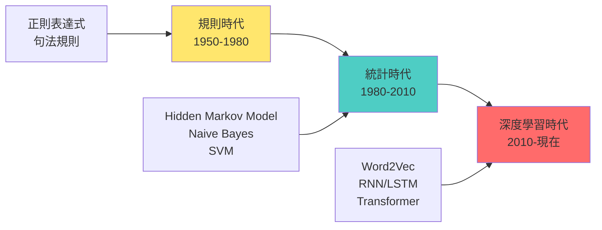
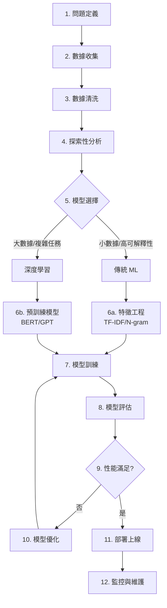

# 第 4.1 章: 機器學習基礎與 NLP 應用

本章旨在為您提供機器學習在自然語言處理領域應用的完整教學講義。我們將從傳統機器學習的基礎概念出發,深入探討如何將這些方法應用於文本數據,最終建立 NLP 領域的完整知識體系。

| 概念 | 中文譯名 | 典型用途 | 優點 | 侷限 |
| :--- | :--- | :--- | :--- | :--- |
| **Fundamentals** | 基礎理論 | 快速掌握機器學習的核心概念與文本特徵表示方法。 | 直觀易懂,能快速建立實作能力。 | 易忽略模型選擇的理論依據與適用場景。 |
| **First Principles** | 第一原理 | 從損失函數與優化本質,理解為何特定模型適合 NLP 任務。 | 深入本質,有助於模型選擇與調優。 | 理論性強,需要統計學與數學背景。 |
| **Body of Knowledge** | 知識體系 | 將機器學習置於 NLP 發展史與現代深度學習的完整框架中。 | 結構完備,能理解從傳統 ML 到深度學習的演進。 | 內容龐雜,不適合快速入門。 |

---

## 1. Fundamentals (基礎理論)

在深度學習興起之前,**傳統機器學習 (Classical Machine Learning)** 是 NLP 領域的主流方法。這些方法雖然相對簡單,但在許多實際應用中仍然表現優異,特別是在**小數據集**和**可解釋性要求高**的場景。

### 機器學習的核心概念

**定義**: 讓計算機從數據中自動學習模式,而不需要明確編程。

**三大要素**:
1. **數據 (Data)**: 訓練模型的原材料
2. **模型 (Model)**: 從數據中學習模式的數學函數
3. **目標 (Objective)**: 模型要優化的目標函數 (損失函數)

**學習類型**:

| 學習類型 | 定義 | NLP 應用範例 |
|:---|:---|:---|
| **監督學習** | 有標籤數據,學習輸入到輸出的映射 | 垃圾郵件分類,情感分析 |
| **非監督學習** | 無標籤數據,發現數據中的隱藏模式 | 主題建模,文本聚類 |
| **半監督學習** | 少量標籤 + 大量無標籤數據 | 利用未標註語料提升分類器 |
| **強化學習** | 通過獎勵信號學習最優策略 | 對話系統,文本生成優化 |

### 文本數據的特殊性

**挑戰**:
1. **非結構化**: 文本是序列數據,不像圖像有固定維度
2. **高維稀疏**: 詞彙表可能有幾萬個詞,但每個文檔只使用一小部分
3. **語義複雜**: 同義詞、多義詞、上下文依賴
4. **語言多樣性**: 不同語言、方言、俚語

**解決方案**: 文本特徵表示

### 文本特徵表示方法

#### 1. Bag of Words (詞袋模型)

**核心思想**: 將文本視為詞的集合,忽略順序和語法。

**數學表示**:
```
文檔 D = {w1, w2, ..., wn}
特徵向量 X = [count(w1), count(w2), ..., count(w|V|)]

其中:
- |V|: 詞彙表大小
- count(wi): 詞 wi 在文檔中的出現次數
```

**優點**:
- ✅ 簡單直觀,易於實作
- ✅ 計算效率高
- ✅ 對短文本效果好

**缺點**:
- ❌ 忽略詞序 (「我愛你」和「你愛我」相同)
- ❌ 稀疏性高 (大部分詞為 0)
- ❌ 無法捕捉語義 (「好」和「棒」被視為不同詞)

**Python 實作**:
```python
from sklearn.feature_extraction.text import CountVectorizer

# 文檔集合
documents = [
    "I love machine learning",
    "I love NLP",
    "Machine learning is awesome"
]

# 建立 Bag of Words 向量化器
vectorizer = CountVectorizer()
X = vectorizer.fit_transform(documents)

# 查看詞彙表
print("詞彙表:", vectorizer.get_feature_names_out())
# ['awesome', 'is', 'learning', 'love', 'machine', 'nlp']

# 查看特徵矩陣
print("特徵矩陣:\n", X.toarray())
# [[0 0 1 1 1 0]  # I love machine learning
#  [0 0 0 1 0 1]  # I love NLP
#  [1 1 1 0 1 0]] # Machine learning is awesome
```

#### 2. TF-IDF (詞頻-逆文檔頻率)

**核心思想**: 在 BoW 基礎上,降低常見詞 (如 "the", "is") 的權重,提高罕見但重要詞的權重。

**數學公式**:
```
TF-IDF(w, d) = TF(w, d) × IDF(w)

其中:
TF(w, d) = count(w, d) / |d|  (詞頻)
IDF(w) = log(N / df(w))        (逆文檔頻率)

- count(w, d): 詞 w 在文檔 d 中的出現次數
- |d|: 文檔 d 的總詞數
- N: 總文檔數
- df(w): 包含詞 w 的文檔數
```

**直觀理解**:
- **TF (詞頻)**: 詞在當前文檔中有多重要? (出現越多越重要)
- **IDF (逆文檔頻率)**: 詞在所有文檔中有多罕見? (越罕見越重要)

**範例**:
```
語料庫:
- 文檔 1: "machine learning is fun"
- 文檔 2: "deep learning is powerful"
- 文檔 3: "learning is important"

詞 "learning":
- TF(文檔1) = 1/4 = 0.25
- IDF = log(3/3) = 0  ← 出現在所有文檔,不重要!

詞 "machine":
- TF(文檔1) = 1/4 = 0.25
- IDF = log(3/1) = 1.09  ← 只出現在 1 個文檔,重要!

TF-IDF("machine", 文檔1) = 0.25 × 1.09 = 0.27
TF-IDF("learning", 文檔1) = 0.25 × 0 = 0
```

**Python 實作**:
```python
from sklearn.feature_extraction.text import TfidfVectorizer

documents = [
    "I love machine learning",
    "I love NLP",
    "Machine learning is awesome"
]

vectorizer = TfidfVectorizer()
X = vectorizer.fit_transform(documents)

print("TF-IDF 矩陣:\n", X.toarray().round(3))
# 每個詞的 TF-IDF 分數
```

#### 3. N-gram 特徵

**核心思想**: 捕捉連續 n 個詞的組合,保留部分詞序信息。

**定義**:
```
1-gram (unigram): 單個詞 ["I", "love", "NLP"]
2-gram (bigram):  連續兩詞 ["I love", "love NLP"]
3-gram (trigram): 連續三詞 ["I love NLP"]
```

**應用場景**:
- Bigram 捕捉短語 (如 "New York", "not good")
- Trigram 捕捉慣用語 (如 "as a matter of fact")

**Python 實作**:
```python
from sklearn.feature_extraction.text import CountVectorizer

# 使用 unigram + bigram
vectorizer = CountVectorizer(ngram_range=(1, 2))
X = vectorizer.fit_transform([
    "I love NLP",
    "NLP is awesome"
])

print("特徵:", vectorizer.get_feature_names_out())
# ['awesome', 'i', 'i love', 'is', 'is awesome', 'love',
#  'love nlp', 'nlp', 'nlp is']
```

### NLP 中的常見機器學習任務

| 任務 | 定義 | 輸入 | 輸出 | 典型模型 |
|:---|:---|:---|:---|:---|
| **文本分類** | 將文本分配到預定義類別 | 文檔 | 類別標籤 | Naive Bayes, SVM |
| **情感分析** | 判斷文本的情緒傾向 | 評論 | 正面/負面 | Logistic Regression |
| **命名實體識別** | 識別文本中的實體 (人名、地名) | 句子 | 實體標籤序列 | CRF, HMM |
| **主題建模** | 發現文檔集合的隱藏主題 | 文檔集 | 主題分佈 | LDA, NMF |
| **文本相似度** | 計算兩個文本的相似程度 | 兩個文檔 | 相似度分數 | Cosine Similarity |

### 快速實戰: 文本分類完整流程

```python
from sklearn.datasets import fetch_20newsgroups
from sklearn.feature_extraction.text import TfidfVectorizer
from sklearn.naive_bayes import MultinomialNB
from sklearn.metrics import accuracy_score, classification_report

# 1. 載入數據 (20 個新聞類別)
categories = ['alt.atheism', 'soc.religion.christian']
train_data = fetch_20newsgroups(subset='train', categories=categories)
test_data = fetch_20newsgroups(subset='test', categories=categories)

# 2. 特徵提取 (TF-IDF)
vectorizer = TfidfVectorizer(max_features=1000)
X_train = vectorizer.fit_transform(train_data.data)
X_test = vectorizer.transform(test_data.data)

# 3. 訓練模型 (Naive Bayes)
model = MultinomialNB()
model.fit(X_train, train_data.target)

# 4. 預測與評估
y_pred = model.predict(X_test)
accuracy = accuracy_score(test_data.target, y_pred)

print(f"準確率: {accuracy:.2%}")
print(classification_report(test_data.target, y_pred,
                          target_names=categories))
```

---

## 2. First Principles (第一原理)

從第一原理出發,機器學習的有效性根植於**統計學習理論**和**優化理論**。

### 機器學習的數學本質

**核心問題**: 給定數據 D = {(x1, y1), (x2, y2), ..., (xn, yn)},找到函數 f 使得預測 f(x) 最接近真實值 y。

**數學表示**:
```
目標: 最小化期望風險 (Expected Risk)
R(f) = E[(f(x) - y)²]

實際: 最小化經驗風險 (Empirical Risk)
R_emp(f) = (1/n) Σ L(f(xi), yi)

其中:
- L: 損失函數 (Loss Function)
- f: 從假設空間 H 中選擇的函數
```

### 常見損失函數

| 任務類型 | 損失函數 | 數學公式 | 說明 |
|:---|:---|:---|:---|
| **回歸** | Mean Squared Error | L = (1/n) Σ (yi - ŷi)² | 預測連續值 |
| **分類** | Cross-Entropy | L = -Σ yi log(ŷi) | 預測類別機率 |
| **分類** | Hinge Loss | L = max(0, 1 - yi·ŷi) | SVM 使用 |

### 偏差-方差權衡 (Bias-Variance Tradeoff)

**核心問題**: 為什麼模型在訓練集上表現好,但測試集上差?

**誤差分解**:
```
總誤差 = 偏差² + 方差 + 不可約誤差

- 偏差 (Bias): 模型的假設與真實函數的差距
  → 簡單模型 (如線性) 偏差高 (欠擬合)

- 方差 (Variance): 模型對訓練數據的敏感度
  → 複雜模型 (如深度神經網路) 方差高 (過擬合)

- 不可約誤差: 數據本身的噪音 (無法消除)
```

**視覺化**:
```
簡單模型 (高偏差):
  訓練誤差: 高
  測試誤差: 高
  → 欠擬合,無法學到模式

複雜模型 (高方差):
  訓練誤差: 低
  測試誤差: 高
  → 過擬合,記住了噪音

最優模型:
  訓練誤差: 中等
  測試誤差: 低
  → 泛化能力好
```

### 正則化 (Regularization)

**目的**: 防止過擬合,降低模型複雜度。

**數學表示**:
```
原目標: min L(f)
正則化: min L(f) + λ·R(f)

其中:
- L(f): 損失函數
- R(f): 正則化項 (懲罰複雜模型)
- λ: 正則化強度 (超參數)
```

**常見正則化方法**:

1. **L1 正則化 (Lasso)**:
```
R(w) = ||w||₁ = Σ |wi|

效果:
- 稀疏解 (許多 wi = 0)
- 特徵選擇
```

2. **L2 正則化 (Ridge)**:
```
R(w) = ||w||₂² = Σ wi²

效果:
- 權重縮小但不為 0
- 所有特徵都保留
```

**Python 實作**:
```python
from sklearn.linear_model import Ridge, Lasso

# L2 正則化 (Ridge)
ridge = Ridge(alpha=1.0)  # alpha = λ
ridge.fit(X_train, y_train)

# L1 正則化 (Lasso)
lasso = Lasso(alpha=1.0)
lasso.fit(X_train, y_train)

print("Ridge 係數:", ridge.coef_[:10])
print("Lasso 係數:", lasso.coef_[:10])  # 許多為 0
```

### 為什麼 Naive Bayes 適合 NLP?

**貝葉斯定理應用**:
```
P(類別|文檔) = P(文檔|類別) × P(類別) / P(文檔)

簡化 (因為 P(文檔) 對所有類別相同):
類別_預測 = argmax P(文檔|類別) × P(類別)

條件獨立假設 (Naive):
P(文檔|類別) = P(w1|類別) × P(w2|類別) × ... × P(wn|類別)
```

**為什麼 "Naive" 假設在 NLP 有效?**

1. **高維稀疏性**: 文本特徵空間巨大,大部分詞不共現
   → 條件獨立假設誤差小

2. **計算效率**: 避免估計 P(w1, w2, ..., wn | 類別) 需要的指數級參數
   → 只需估計 P(wi | 類別),參數量線性增長

3. **小數據友好**: 即使訓練數據少,也能估計可靠
   → 每個 P(wi | 類別) 只需少量樣本

4. **魯棒性**: 對噪音數據不敏感
   → 即使部分詞被錯誤標註,整體預測仍穩定

**實證驗證**:
```
研究表明,Naive Bayes 在以下 NLP 任務表現優異:
- 垃圾郵件分類: 準確率 95%+
- 情感分析: F1 分數 85%+
- 文檔分類: 與 SVM 相當

即使條件獨立假設明顯不成立,預測仍然準確!
```

### 特徵選擇的信息論解釋

**互信息 (Mutual Information)**:
```
MI(X, Y) = Σ P(x, y) log(P(x, y) / (P(x)P(y)))

解釋:
- 測量 X 和 Y 的相互依賴程度
- MI = 0: 完全獨立
- MI > 0: 有依賴關係

NLP 應用:
MI(詞, 類別) → 選擇與類別最相關的詞作為特徵
```

**卡方檢驗 (Chi-Square Test)**:
```
χ² = Σ (觀察頻率 - 期望頻率)² / 期望頻率

NLP 應用:
- 測試詞與類別的獨立性
- χ² 越大,詞對分類越重要
```

**Python 實作**:
```python
from sklearn.feature_selection import chi2, mutual_info_classif

# 計算特徵重要性
chi2_scores, _ = chi2(X_train, y_train)
mi_scores = mutual_info_classif(X_train, y_train)

# 選擇 top-k 特徵
from sklearn.feature_selection import SelectKBest

selector = SelectKBest(chi2, k=100)
X_train_selected = selector.fit_transform(X_train, y_train)
X_test_selected = selector.transform(X_test)
```

---

## 3. Body of Knowledge (知識體系)

將機器學習置於 NLP 發展史與現代深度學習的宏觀框架中,可以清晰地看到其演變與定位。

### NLP 發展的三個時代



### 傳統機器學習在 NLP 的黃金時代 (2000-2015)

**代表模型與應用**:

| 模型 | 原理 | NLP 應用 | 優勢 | 現狀 |
|:---|:---|:---|:---|:---|
| **Naive Bayes** | 貝葉斯定理 + 條件獨立 | 垃圾郵件分類 | 速度快,效果好 | 仍在使用 |
| **SVM** | 最大間隔分類器 | 文本分類, NER | 泛化能力強 | 被深度學習取代 |
| **CRF** | 序列標註 | 詞性標註, NER | 捕捉標籤依賴 | 部分被 LSTM-CRF 取代 |
| **LDA** | 主題建模 | 文檔聚類 | 可解釋性強 | 仍在使用 (探索性分析) |
| **TF-IDF** | 詞重要性 | 信息檢索 | 簡單有效 | 仍在使用 (基線方法) |

### 為什麼深度學習取代了傳統方法?

**傳統 ML 的局限**:

1. **特徵工程負擔重**:
   - 需要人工設計特徵 (TF-IDF, N-gram)
   - 難以捕捉複雜語義

2. **無法處理長距離依賴**:
   - Bag of Words 忽略詞序
   - N-gram 只能捕捉局部模式

3. **語義理解能力弱**:
   - 同義詞被視為不同特徵
   - 無法理解上下文

**深度學習的突破**:

1. **自動特徵學習**:
   - Word2Vec: 自動學習詞向量
   - BERT: 預訓練語言模型

2. **捕捉長距離依賴**:
   - LSTM: 記憶機制
   - Transformer: 注意力機制

3. **語義理解**:
   - 預訓練 + 微調範式
   - 遷移學習

### 傳統 ML 仍然有價值的場景

**何時使用傳統機器學習?**

✅ **推薦使用**:
1. **小數據集** (< 1000 樣本)
   - Naive Bayes, SVM 不易過擬合
   - 深度學習需要大量數據

2. **可解釋性要求高**
   - 可以查看特徵權重
   - 深度學習是黑盒模型

3. **計算資源有限**
   - 訓練和推理速度快
   - 深度學習需要 GPU

4. **實時應用**
   - 低延遲要求 (< 10ms)
   - 模型體積小

❌ **不推薦使用**:
1. **大數據集** (> 10萬樣本)
2. **複雜語義理解** (如問答、翻譯)
3. **多模態任務** (文本 + 圖像)

### 完整的 NLP 項目開發流程



### 模型選擇決策樹

```
數據量 < 1000?
├─ 是 → Naive Bayes / Logistic Regression
└─ 否 → 數據量 < 10萬?
    ├─ 是 → SVM / Random Forest
    └─ 否 → 需要複雜語義理解?
        ├─ 否 → TF-IDF + XGBoost
        └─ 是 → BERT / RoBERTa

計算資源有限?
├─ 是 → Naive Bayes / TF-IDF + Logistic Regression
└─ 否 → Transformer 模型

需要可解釋性?
├─ 是 → Naive Bayes / Logistic Regression / Decision Tree
└─ 否 → Deep Learning 模型
```

### 評估指標完整指南

**分類任務**:

| 指標 | 公式 | 適用場景 | 優點 | 缺點 |
|:---|:---|:---|:---|:---|
| **Accuracy** | (TP+TN)/(TP+TN+FP+FN) | 平衡數據集 | 直觀 | 不適合不平衡數據 |
| **Precision** | TP/(TP+FP) | 關注誤報 (如垃圾郵件) | 降低誤報 | 可能漏報 |
| **Recall** | TP/(TP+FN) | 關注漏報 (如疾病診斷) | 降低漏報 | 可能誤報 |
| **F1 Score** | 2·P·R/(P+R) | 不平衡數據 | 平衡 P/R | 需調整閾值 |

**混淆矩陣解讀**:
```
              預測 Negative  預測 Positive
實際 Negative      TN            FP (Type I Error)
實際 Positive      FN (Type II)   TP
                   (Error)

垃圾郵件範例:
- TP: 正確識別垃圾郵件
- TN: 正確識別正常郵件
- FP: 正常郵件被誤判為垃圾 (用戶不滿!)
- FN: 垃圾郵件漏判為正常 (用戶被騷擾!)

優化策略:
- 提高 Precision → 減少 FP (避免誤殺)
- 提高 Recall → 減少 FN (不漏網)
```

---

## 結論與建議

1. **日常溝通與實作**: 優先掌握 **Fundamentals** 中的 **TF-IDF** 和 **Naive Bayes**,它們是 NLP 實務的基石。

2. **強調方法論與創新**: 從 **First Principles** 出發,理解偏差-方差權衡和正則化原理,有助於您在面對新任務時,做出更明智的模型選擇。

3. **構建宏觀視野**: 將傳統機器學習放入 **Body of Knowledge** 的框架中,可以清晰地看到它在 NLP 演化史中的位置,以及何時應該使用傳統方法而非深度學習。

**核心要點**: 傳統機器學習雖然不如深度學習強大,但在小數據、高可解釋性、低計算資源的場景仍然是最佳選擇。

透過本章的學習,您應當已經掌握了機器學習在 NLP 中的應用基礎,並能從更宏觀的視角理解其在現代 AI 開發中的定位。

---

## 延伸閱讀 (Further Reading)

### 關鍵論文 (Key Papers)
1. **Naive Bayes 理論**: McCallum, A. & Nigam, K. (1998). *A Comparison of Event Models for Naive Bayes Text Classification*. AAAI Workshop.
2. **TF-IDF 原理**: Salton, G. & Buckley, C. (1988). *Term-weighting approaches in automatic text retrieval*. Information Processing & Management.
3. **文本分類綜述**: Sebastiani, F. (2002). *Machine learning in automated text categorization*. ACM Computing Surveys.

### 經典教材 (Textbooks)
- **Speech and Language Processing** by Jurafsky & Martin (第 4-6 章)
- **Introduction to Information Retrieval** by Manning et al. (第 13 章)
- **The Elements of Statistical Learning** by Hastie et al. (第 2-4 章)

### 實作資源 (Implementation Resources)
- **scikit-learn 官方教程**: https://scikit-learn.org/stable/tutorial/text_analytics/working_with_text_data.html
- **NLTK Book**: https://www.nltk.org/book/
- **Kaggle 實戰項目**: https://www.kaggle.com/c/nlp-getting-started

---

**下一章節**: [4.2 貝葉斯定理與樸素貝葉斯](./02_貝葉斯定理與樸素貝葉斯.md)
