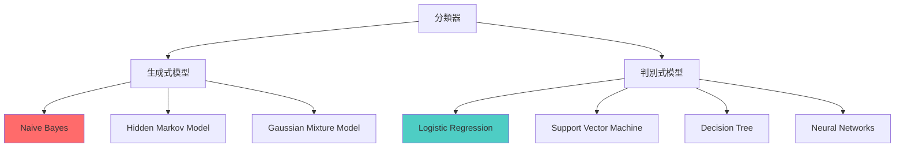

# 第 4.2 章: 貝葉斯定理與樸素貝葉斯分類器

本章將深入探討 **Naive Bayes (樸素貝葉斯)** 分類器的數學原理、實作細節與實務應用。從貝葉斯定理的基礎出發,理解為何這個看似"樸素"的假設能在 NLP 領域大放異彩。

| 概念 | 中文譯名 | 典型用途 | 優點 | 侷限 |
| :--- | :--- | :--- | :--- | :--- |
| **Fundamentals** | 基礎理論 | 快速掌握貝葉斯定理與條件機率,理解 Naive Bayes 的分類流程。 | 直觀易懂,適合快速實作垃圾郵件分類等任務。 | 易忽略條件獨立假設的適用性與限制。 |
| **First Principles** | 第一原理 | 從機率論基礎推導貝葉斯定理,理解 Laplace Smoothing 的必要性。 | 深入本質,有助於理解變體模型 (Multinomial vs Bernoulli)。 | 理論性強,需要機率論與統計學背景。 |
| **Body of Knowledge** | 知識體系 | 將 Naive Bayes 置於機率圖模型與生成式模型的完整框架中。 | 結構完備,能理解與其他分類器 (SVM, LR) 的差異。 | 內容龐雜,不適合快速入門。 |

---

## 1. Fundamentals (基礎理論)

**Naive Bayes** 是最簡單且最有效的文本分類算法之一,在垃圾郵件過濾、情感分析、文檔分類等任務中有廣泛應用。

### 貝葉斯定理 (Bayes' Theorem)

**核心公式**:
```
P(A|B) = P(B|A) · P(A) / P(B)

中文解釋:
P(A|B): 已知 B 發生,A 發生的機率 (後驗機率 Posterior)
P(B|A): 已知 A 發生,B 發生的機率 (似然 Likelihood)
P(A):   A 發生的機率 (先驗機率 Prior)
P(B):   B 發生的機率 (證據 Evidence)
```

**直觀理解**: 貝葉斯定理告訴我們如何根據新證據 (B) 更新我們對 A 的信念。

### 生活實例: 醫學診斷

```
問題: 某疾病的患病率為 1%,檢測準確率為 95%。
      若檢測呈陽性,實際患病的機率是多少?

直覺答案: 95% ?  (錯誤!)
正確答案: 約 16%

推導:
設 A = 患病, B = 檢測陽性

P(A|B) = P(B|A) · P(A) / P(B)

已知:
P(A) = 0.01      (先驗: 患病率 1%)
P(B|A) = 0.95    (似然: 患病者檢測陽性的機率)
P(B|not A) = 0.05 (假陽性率 5%)

計算 P(B):
P(B) = P(B|A)·P(A) + P(B|not A)·P(not A)
     = 0.95×0.01 + 0.05×0.99
     = 0.0095 + 0.0495
     = 0.059

最終:
P(A|B) = 0.95 × 0.01 / 0.059 ≈ 0.161 = 16.1%

結論: 儘管檢測陽性,實際患病機率只有 16%!
      因為疾病太罕見 (先驗機率低)。
```

### Naive Bayes 在文本分類的應用

**問題**: 給定文檔 D,預測類別 C。

**貝葉斯公式應用**:
```
P(C|D) = P(D|C) · P(C) / P(D)

目標: 找到使 P(C|D) 最大的類別 C

簡化 (P(D) 對所有類別相同):
C_pred = argmax P(D|C) · P(C)
          C

展開文檔 D = {w1, w2, ..., wn}:
P(D|C) = P(w1, w2, ..., wn | C)
```

### "Naive" 假設的本質

**條件獨立假設 (Naive Assumption)**:
```
P(w1, w2, ..., wn | C) = P(w1|C) × P(w2|C) × ... × P(wn|C)

簡寫:
P(D|C) = ∏ P(wi|C)  (i=1 to n)
```

**為什麼叫 "Naive" (樸素)?**

這個假設顯然不現實:
- 詞語之間有依賴關係
- 例如: 「New York」中,見到 "New" 後,出現 "York" 的機率很高
- 但 Naive Bayes 假設 P(New|C) 和 P(York|C) 互相獨立

**但為什麼仍然有效?**
- 研究表明,即使假設錯誤,預測仍然準確
- 原因: 我們只需要正確的相對排序,而非精確機率

### Naive Bayes 分類流程

**訓練階段**:
```python
1. 計算先驗機率 P(C):
   P(C) = (類別 C 的文檔數) / (總文檔數)

2. 計算條件機率 P(w|C):
   P(w|C) = (詞 w 在類別 C 中的出現次數) / (類別 C 的總詞數)

3. (可選) 應用 Laplace Smoothing 避免零機率:
   P(w|C) = (count(w, C) + α) / (count(C) + α·|V|)
   - α: smoothing 參數 (通常為 1)
   - |V|: 詞彙表大小
```

**預測階段**:
```python
對新文檔 D = {w1, w2, ..., wn}:

1. 計算每個類別的分數:
   Score(C) = log P(C) + Σ log P(wi|C)  # 取對數避免下溢

2. 選擇分數最高的類別:
   C_pred = argmax Score(C)
```

**為什麼使用對數?**
```
問題: P(w1|C) × P(w2|C) × ... × P(wn|C) 會變得極小
     (例如: 0.1^100 ≈ 10^-100,電腦無法表示)

解決: 取對數
log(a×b) = log(a) + log(b)

好處:
1. 防止數值下溢 (underflow)
2. 乘法變加法,計算更快
3. 單調性保持 (argmax 結果不變)
```

### 快速實作範例

```python
import numpy as np
from collections import defaultdict

class SimpleNaiveBayes:
    def __init__(self, alpha=1.0):
        self.alpha = alpha  # Laplace smoothing
        self.class_log_prior = {}
        self.word_log_prob = {}
        self.classes = None
        self.vocabulary = set()

    def fit(self, X, y):
        """
        訓練模型
        X: 文本列表 (list of str)
        y: 類別列表 (list of str)
        """
        n_samples = len(X)
        self.classes = np.unique(y)

        # 建立詞彙表
        for text in X:
            self.vocabulary.update(text.split())

        vocab_size = len(self.vocabulary)

        # 對每個類別計算統計量
        for c in self.classes:
            # 該類別的所有文本
            c_docs = [X[i] for i in range(n_samples) if y[i] == c]
            n_c = len(c_docs)

            # 先驗機率 P(C)
            self.class_log_prior[c] = np.log(n_c / n_samples)

            # 統計詞頻
            word_counts = defaultdict(int)
            total_words = 0

            for doc in c_docs:
                for word in doc.split():
                    word_counts[word] += 1
                    total_words += 1

            # 條件機率 P(w|C) with Laplace Smoothing
            self.word_log_prob[c] = {}
            for word in self.vocabulary:
                count = word_counts[word]
                prob = (count + self.alpha) / (total_words + self.alpha * vocab_size)
                self.word_log_prob[c][word] = np.log(prob)

    def predict(self, X):
        """預測類別"""
        predictions = []

        for text in X:
            words = text.split()
            class_scores = {}

            for c in self.classes:
                # log P(C)
                score = self.class_log_prior[c]

                # + Σ log P(wi|C)
                for word in words:
                    if word in self.vocabulary:
                        score += self.word_log_prob[c][word]

                class_scores[c] = score

            # argmax
            pred_class = max(class_scores, key=class_scores.get)
            predictions.append(pred_class)

        return predictions

# 測試
X_train = [
    "free money win prize",
    "hello friend how are you",
    "click here win cash",
    "meeting at noon tomorrow"
]
y_train = ['spam', 'ham', 'spam', 'ham']

nb = SimpleNaiveBayes()
nb.fit(X_train, y_train)

X_test = ["free cash prize", "hello how are"]
predictions = nb.predict(X_test)
print("預測:", predictions)  # ['spam', 'ham']
```

---

## 2. First Principles (第一原理)

從機率論基礎深入理解 Naive Bayes 的數學本質與設計原理。

### 貝葉斯定理的推導

**從條件機率定義出發**:
```
定義: P(A|B) = P(A∩B) / P(B)

對稱地: P(B|A) = P(A∩B) / P(A)

推導:
P(A∩B) = P(A|B) · P(B) = P(B|A) · P(A)

兩邊除以 P(B):
P(A|B) = P(B|A) · P(A) / P(B)

這就是貝葉斯定理!
```

### 全機率公式 (Law of Total Probability)

**問題**: 如何計算 P(D)?

**全機率公式**:
```
P(D) = Σ P(D|Ci) · P(Ci)  (對所有類別 Ci 求和)

範例:
P(D) = P(D|spam)·P(spam) + P(D|ham)·P(ham)
```

**應用到貝葉斯定理**:
```
P(spam|D) = P(D|spam) · P(spam) / P(D)
          = P(D|spam) · P(spam) / [P(D|spam)·P(spam) + P(D|ham)·P(ham)]
```

### 為什麼需要 Laplace Smoothing?

**零機率問題**:
```
訓練集:
Spam: "free money now"
Ham:  "hello friend"

測試: "free hello"

計算 P(spam|"free hello"):
P(spam) = 0.5
P("free"|spam) = 1/3
P("hello"|spam) = 0  ← 問題!

P(spam|"free hello") ∝ P(spam) × P("free"|spam) × P("hello"|spam)
                     = 0.5 × 1/3 × 0
                     = 0  ← 整個機率變 0!

結論: 因為訓練集中 spam 從未包含 "hello",
      導致任何包含 "hello" 的文檔都無法被分類為 spam。
```

**Laplace Smoothing (Add-α Smoothing)**:
```
原公式:
P(w|C) = count(w, C) / total_words(C)

Smoothing 後:
P(w|C) = (count(w, C) + α) / (total_words(C) + α·|V|)

其中:
- α: smoothing 參數 (通常 α=1,稱為 add-one smoothing)
- |V|: 詞彙表大小

效果:
- 所有詞都至少有 α 的計數 (避免零機率)
- 分母也相應調整,保持機率和為 1
```

**數學驗證 Smoothing 有效性**:
```
未見過的詞:
P(w|C) = (0 + 1) / (total + |V|)
       = 1 / (total + |V|)  ← 小但非零

高頻詞:
P(w|C) = (1000 + 1) / (total + |V|)
       ≈ 1000 / total  ← 幾乎不受影響

低頻詞:
P(w|C) = (1 + 1) / (total + |V|)  ← 被 smoothing 提升
```

### Multinomial vs Bernoulli Naive Bayes

**兩種變體的區別**:

| 特性 | Multinomial NB | Bernoulli NB |
|:---|:---|:---|
| **特徵表示** | 詞頻 (count) | 詞是否出現 (0/1) |
| **條件機率** | P(w\|C) 基於詞頻 | P(w\|C) 基於文檔比例 |
| **適用場景** | 長文本 | 短文本 |
| **優勢** | 利用詞頻信息 | 對罕見詞敏感 |

**Multinomial NB**:
```
P(w|C) = (count(w, C) + α) / (total_words(C) + α·|V|)

特點:
- 詞出現多次,機率更高
- 適合長文檔 (如新聞、文章)
```

**Bernoulli NB**:
```
P(w|C) = (包含詞 w 的文檔數 + α) / (類別 C 的文檔數 + 2α)

特點:
- 只關心詞是否出現
- 對沒出現的詞也建模: P(not w|C) = 1 - P(w|C)
- 適合短文本 (如推文、標題)
```

**實作對比**:
```python
from sklearn.naive_bayes import MultinomialNB, BernoulliNB

# Multinomial (使用詞頻)
mnb = MultinomialNB()
mnb.fit(X_train_counts, y_train)

# Bernoulli (使用 0/1)
bnb = BernoulliNB()
X_train_binary = (X_train_counts > 0).astype(int)  # 轉為 0/1
bnb.fit(X_train_binary, y_train)
```

### 生成式 vs 判別式模型

**Naive Bayes 是生成式模型 (Generative Model)**:
```
學習: P(X|Y) 和 P(Y)
預測: P(Y|X) = P(X|Y)·P(Y) / P(X)  (貝葉斯定理)

優點:
- 可以生成樣本 (從 P(X|Y) 採樣)
- 需要較少訓練數據
- 可以處理缺失值

缺點:
- 需要假設數據分佈 (條件獨立)
- 假設錯誤影響性能
```

**判別式模型 (如 Logistic Regression)**:
```
學習: 直接學習 P(Y|X)
預測: 直接輸出 P(Y|X)

優點:
- 不需要假設數據分佈
- 通常性能更好

缺點:
- 需要更多訓練數據
- 無法生成樣本
```

### 為什麼 Naive Bayes 在 NLP 有效?

**理論解釋**:

1. **決策邊界只需粗略正確**:
   - Naive Bayes 學習的是判別邊界
   - 即使機率估計不準確,只要排序正確即可

2. **高維稀疏特徵空間**:
   - 文本特徵維度高 (幾萬詞)
   - 大部分詞不共現 → 條件獨立假設誤差小

3. **大數定律效應**:
   - 雖然個別詞的機率估計有誤
   - 但累積大量詞後,誤差相互抵消

**實證研究** (Rennie et al. 2003):
```
即使條件獨立假設明顯錯誤,Naive Bayes 仍能:
- 垃圾郵件分類: 準確率 95%+
- 情感分析: F1 分數 85%+
- 新聞分類: 與 SVM 性能接近

原因: 不需要準確的機率,只需正確的排序!
```

---

## 3. Body of Knowledge (知識體系)

將 Naive Bayes 置於機率圖模型與分類器家族的宏觀框架中。

### 機率圖模型視角

**Naive Bayes 的圖模型表示**:
```
有向圖 (Bayesian Network):

        C (類別)
      ↙ ↓ ↓ ↓ ↘
    w1 w2 w3 ... wn (詞)

條件獨立性:
- 給定 C,所有詞 wi 互相獨立
- wi ⊥ wj | C  (wi 與 wj 在給定 C 下獨立)
```

**與其他模型的關係**:

| 模型 | 假設 | 圖結構 | 優勢 |
|:---|:---|:---|:---|
| **Naive Bayes** | 詞獨立 | 星形 | 簡單高效 |
| **Hidden Markov Model** | 詞序列依賴 | 鏈式 | 捕捉順序 |
| **Conditional Random Field** | 標籤序列依賴 | 無向圖 | 全局優化 |

### 分類器譜系



### Naive Bayes vs Logistic Regression

**驚人發現**: Naive Bayes 和 Logistic Regression 有深刻聯繫!

**數學證明**:
```
Naive Bayes 的預測:
P(C=1|x) = sigmoid(w·x + b)

其中:
w = log[P(xi|C=1) / P(xi|C=0)]
b = log[P(C=1) / P(C=0)]

這與 Logistic Regression 的形式完全相同!
```

**區別**:
```
Naive Bayes:
- 生成式: 學習 P(X|Y), P(Y)
- 假設條件獨立
- 參數估計: 簡單計數

Logistic Regression:
- 判別式: 直接學習 P(Y|X)
- 不假設條件獨立
- 參數估計: 最大似然/梯度下降
```

**性能對比 (Ng & Jordan, 2001)**:
```
小數據集 (< 1000 樣本):
→ Naive Bayes 更好 (需要更少數據)

大數據集 (> 10000 樣本):
→ Logistic Regression 更好 (假設更寬鬆)

漸近行為:
→ LR 收斂到最優,NB 收斂到次優 (因為假設錯誤)
```

### 實務應用場景

**推薦使用 Naive Bayes**:

1. **垃圾郵件分類** ⭐⭐⭐⭐⭐
   - 小數據集友好
   - 實時性要求高
   - 可解釋性強

2. **情感分析 (初步分析)** ⭐⭐⭐⭐
   - 快速建立基線
   - 特徵工程簡單

3. **文檔分類** ⭐⭐⭐⭐
   - 多分類任務
   - 增量學習需求

4. **特徵選擇** ⭐⭐⭐
   - 計算特徵重要性
   - log P(w|C_pos) / P(w|C_neg)

**不推薦使用**:

1. **複雜語義理解** ❌
   - 無法捕捉詞序
   - 忽略上下文

2. **長距離依賴** ❌
   - 條件獨立假設過強

3. **小類別樣本極少** ❌
   - 機率估計不穩定

### 優化技巧與變體

**1. 特徵選擇**:
```python
from sklearn.feature_selection import chi2, SelectKBest

# 選擇最相關的 1000 個特徵
selector = SelectKBest(chi2, k=1000)
X_train_selected = selector.fit_transform(X_train, y_train)
```

**2. TF-IDF 權重**:
```python
# 使用 TF-IDF 而非原始計數
from sklearn.feature_extraction.text import TfidfTransformer

tfidf = TfidfTransformer()
X_train_tfidf = tfidf.fit_transform(X_train_counts)
```

**3. 調整 Smoothing 參數**:
```python
# Grid Search 找最佳 alpha
from sklearn.model_selection import GridSearchCV

param_grid = {'alpha': [0.1, 0.5, 1.0, 2.0, 5.0]}
grid = GridSearchCV(MultinomialNB(), param_grid, cv=5)
grid.fit(X_train, y_train)
print("最佳 alpha:", grid.best_params_)
```

**4. 處理類別不平衡**:
```python
# 調整先驗機率
from sklearn.naive_bayes import MultinomialNB

# 手動設定先驗
mnb = MultinomialNB(class_prior=[0.3, 0.7])  # [spam, ham]
```

### 完整實戰流程

```python
from sklearn.datasets import fetch_20newsgroups
from sklearn.feature_extraction.text import TfidfVectorizer
from sklearn.naive_bayes import MultinomialNB
from sklearn.pipeline import Pipeline
from sklearn.model_selection import cross_val_score
from sklearn.metrics import classification_report

# 1. 載入數據
categories = ['alt.atheism', 'talk.religion.misc',
              'comp.graphics', 'sci.space']
train_data = fetch_20newsgroups(subset='train', categories=categories)
test_data = fetch_20newsgroups(subset='test', categories=categories)

# 2. 建立 Pipeline
pipeline = Pipeline([
    ('tfidf', TfidfVectorizer(max_features=3000, ngram_range=(1, 2))),
    ('clf', MultinomialNB(alpha=0.1))
])

# 3. 交叉驗證
cv_scores = cross_val_score(pipeline, train_data.data, train_data.target,
                            cv=5, scoring='f1_macro')
print(f"CV F1 Score: {cv_scores.mean():.3f} ± {cv_scores.std():.3f}")

# 4. 訓練與評估
pipeline.fit(train_data.data, train_data.target)
y_pred = pipeline.predict(test_data.data)

print(classification_report(test_data.target, y_pred,
                          target_names=categories))

# 5. 特徵重要性分析
feature_names = pipeline.named_steps['tfidf'].get_feature_names_out()
clf = pipeline.named_steps['clf']

for i, category in enumerate(categories):
    # 獲取該類別的 log probability
    log_prob = clf.feature_log_prob_[i]
    # 找出最重要的 10 個詞
    top_indices = log_prob.argsort()[-10:][::-1]
    top_features = [feature_names[j] for j in top_indices]
    print(f"\n{category} 的關鍵詞: {', '.join(top_features)}")
```

---

## 結論與建議

1. **日常溝通與實作**: 優先掌握 **Fundamentals** 中的 **Laplace Smoothing** 和 **對數技巧**,這是實作 Naive Bayes 的關鍵。

2. **強調方法論與創新**: 從 **First Principles** 出發,理解生成式模型的本質,有助於您在面對新問題時,選擇合適的模型類型。

3. **構建宏觀視野**: 將 Naive Bayes 放入 **Body of Knowledge** 的框架中,可以清晰地看到它與 Logistic Regression、SVM 的關係,以及適用場景的差異。

**核心要點**: Naive Bayes 雖然基於"樸素"的條件獨立假設,但在 NLP 領域仍然是最有效的基線方法之一,特別是在小數據集和實時應用場景。

透過本章的學習,您應當已經掌握了 Naive Bayes 的數學原理與實作技巧,並能從機率論和統計學的角度深入理解其有效性。

---

## 延伸閱讀 (Further Reading)

### 關鍵論文 (Key Papers)
1. **Naive Bayes 理論**: Domingos, P. & Pazzani, M. (1997). *On the Optimality of the Simple Bayesian Classifier*. Machine Learning.
2. **NB vs LR 對比**: Ng, A. & Jordan, M. (2001). *On Discriminative vs. Generative Classifiers*. NeurIPS.
3. **Smoothing 技術**: Chen, S. & Goodman, J. (1999). *An Empirical Study of Smoothing Techniques for Language Modeling*. Computer Speech & Language.

### 實作資源 (Implementation Resources)
- **scikit-learn Naive Bayes**: https://scikit-learn.org/stable/modules/naive_bayes.html
- **Stanford NLP Tutorial**: https://web.stanford.edu/~jurafsky/slp3/4.pdf
- **Kaggle SMS Spam Dataset**: https://www.kaggle.com/uciml/sms-spam-collection-dataset

---

**下一章節**: [4.3 主題建模技術 - NMF 與 LDA](./03_主題建模技術_NMF與LDA.md)
