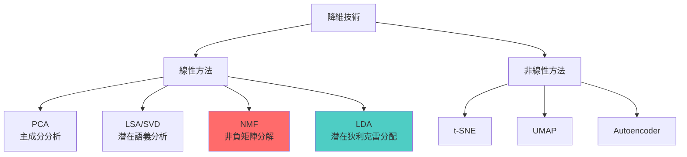

# 第 4.3 章: 主題建模技術 - NMF 與 LDA

本章將深入探討**主題建模 (Topic Modeling)** 這一重要的非監督學習技術。從矩陣分解的角度出發,理解如何從文檔集合中自動發現隱藏的主題結構,並比較 NMF 和 LDA 兩種主流方法。

| 概念 | 中文譯名 | 典型用途 | 優點 | 侷限 |
| :--- | :--- | :--- | :--- | :--- |
| **Fundamentals** | 基礎理論 | 快速掌握主題建模的核心概念,理解 NMF 與 LDA 的基本流程。 | 直觀易懂,適合快速實作文檔聚類與探索性分析。 | 易忽略主題數量選擇與模型評估的細節。 |
| **First Principles** | 第一原理 | 從矩陣分解與機率生成模型的本質,理解 NMF/LDA 的數學原理。 | 深入本質,有助於理解參數調優與模型選擇。 | 理論性強,需要線性代數與機率論背景。 |
| **Body of Knowledge** | 知識體系 | 將主題建模置於降維技術與無監督學習的完整框架中。 | 結構完備,能理解與 LSA、word2vec 的關係。 | 內容龐雜,不適合快速入門。 |

---

## 1. Fundamentals (基礎理論)

**主題建模 (Topic Modeling)** 是一種非監督學習技術,用於從大量文檔中自動發現隱藏的主題結構。

### 什麼是主題?

**直觀理解**: 主題是一組語義相關的詞彙集合。

**範例**:
```
主題 1 (體育):
- basketball, player, game, team, score, win
- 機率分佈: basketball(0.15), player(0.12), game(0.10), ...

主題 2 (政治):
- government, president, election, vote, policy, law
- 機率分佈: government(0.14), president(0.11), election(0.09), ...

主題 3 (科技):
- computer, software, internet, technology, digital
- 機率分佈: computer(0.13), software(0.10), internet(0.09), ...
```

### 主題建模的核心假設

**文檔-主題-詞 的生成模型**:
```
1. 每個文檔由多個主題組成
   - 例如: 某新聞 = 70%政治 + 20%經濟 + 10%社會

2. 每個主題是詞的機率分佈
   - 例如: 政治主題 = {government: 0.15, president: 0.12, ...}

3. 文檔中的每個詞都從某個主題採樣而來
```

**視覺化**:
```
文檔集合
    ↓ (主題建模)
主題分佈矩陣 (文檔-主題)  ×  主題詞分佈矩陣 (主題-詞)
[D × K]                      [K × V]

其中:
- D: 文檔數
- K: 主題數 (超參數)
- V: 詞彙表大小
```

### NMF (Non-negative Matrix Factorization)

**核心思想**: 將文檔-詞矩陣分解為兩個非負矩陣的乘積。

**數學表示**:
```
X ≈ W × H

其中:
X: 文檔-詞矩陣 (D × V),每個元素 X[d,w] 是詞 w 在文檔 d 中的頻率
W: 文檔-主題矩陣 (D × K),每個元素 W[d,k] 是文檔 d 屬於主題 k 的程度
H: 主題-詞矩陣 (K × V),每個元素 H[k,w] 是詞 w 在主題 k 中的權重

約束:
- W ≥ 0, H ≥ 0 (所有元素非負)
- 最小化重構誤差: ||X - WH||²
```

**直觀解釋**:
```
原矩陣 X:
        word1  word2  word3  ... (V 個詞)
doc1     5      3      0
doc2     2      0      8
doc3     0      7      1
...
(D 個文檔)

分解為:
W (文檔-主題):
        topic1  topic2  topic3  ... (K 個主題)
doc1     0.8     0.1     0.1
doc2     0.2     0.1     0.7
...

H (主題-詞):
         word1   word2   word3   ...
topic1    0.9     0.8     0.0
topic2    0.0     0.7     0.2
topic3    0.1     0.0     0.9
...
```

**Python 快速實作**:
```python
from sklearn.decomposition import NMF
from sklearn.feature_extraction.text import TfidfVectorizer

# 文檔集合
documents = [
    "basketball player scores game",
    "president election government policy",
    "computer software technology internet",
    "team wins championship season",
    "vote congress senate legislation",
]

# 1. 建立 TF-IDF 矩陣
vectorizer = TfidfVectorizer(max_features=100)
X = vectorizer.fit_transform(documents)

# 2. NMF 分解 (K=3 個主題)
nmf_model = NMF(n_components=3, random_state=42)
W = nmf_model.fit_transform(X)  # 文檔-主題
H = nmf_model.components_       # 主題-詞

# 3. 查看主題
feature_names = vectorizer.get_feature_names_out()

for topic_idx, topic in enumerate(H):
    print(f"主題 {topic_idx + 1}:")
    top_words_idx = topic.argsort()[-5:][::-1]
    top_words = [feature_names[i] for i in top_words_idx]
    print(f"  關鍵詞: {', '.join(top_words)}\n")

# 4. 查看文檔的主題分佈
print("文檔的主題分佈:")
for doc_idx, topic_dist in enumerate(W):
    print(f"文檔 {doc_idx + 1}: {topic_dist}")
```

### LDA (Latent Dirichlet Allocation)

**核心思想**: 基於機率生成模型,假設文檔和主題都服從 Dirichlet 分佈。

**生成過程** (plate notation):
```
對每個文檔 d:
  1. 從 Dirichlet(α) 採樣主題分佈 θd
     → θd = [P(topic1|d), P(topic2|d), ..., P(topicK|d)]

  2. 對文檔中的每個位置 n:
     a. 從 θd 採樣主題 zd,n
        → zd,n ~ Multinomial(θd)

     b. 從該主題的詞分佈 φz 採樣詞 wd,n
        → wd,n ~ Multinomial(φzd,n)

主題-詞分佈:
  對每個主題 k:
    從 Dirichlet(β) 採樣詞分佈 φk
    → φk = [P(word1|k), P(word2|k), ..., P(wordV|k)]
```

**超參數**:
```
α (alpha): 控制文檔-主題分佈的稀疏性
- α 小 → 文檔傾向於專注少數主題
- α 大 → 文檔主題分佈均勻

β (beta): 控制主題-詞分佈的稀疏性
- β 小 → 主題由少數核心詞定義
- β 大 → 主題詞分佈均勻
```

**Python 實作**:
```python
from sklearn.decomposition import LatentDirichletAllocation
from sklearn.feature_extraction.text import CountVectorizer

# 1. 建立詞頻矩陣 (LDA 使用 count,不是 TF-IDF)
vectorizer = CountVectorizer(max_features=100)
X = vectorizer.fit_transform(documents)

# 2. LDA 訓練
lda_model = LatentDirichletAllocation(
    n_components=3,      # K 個主題
    random_state=42,
    max_iter=10,
    learning_method='batch'
)
W_lda = lda_model.fit_transform(X)  # 文檔-主題
H_lda = lda_model.components_       # 主題-詞

# 3. 查看主題
feature_names = vectorizer.get_feature_names_out()

for topic_idx, topic in enumerate(H_lda):
    print(f"主題 {topic_idx + 1}:")
    top_words_idx = topic.argsort()[-5:][::-1]
    top_words = [feature_names[i] for i in top_words_idx]
    print(f"  關鍵詞: {', '.join(top_words)}\n")
```

### NMF vs LDA 對比

| 特性 | NMF | LDA |
|:---|:---|:---|
| **模型類型** | 矩陣分解 | 機率生成模型 |
| **輸入** | TF-IDF | 詞頻 (count) |
| **輸出** | 非負實數 | 機率分佈 (和為 1) |
| **可解釋性** | 詞權重 | 機率 |
| **訓練速度** | 快 | 慢 (需要迭代採樣) |
| **適用場景** | 探索性分析 | 生成式任務 |

---

## 2. First Principles (第一原理)

從線性代數和機率論的基礎深入理解 NMF 和 LDA 的數學本質。

### NMF 的數學推導

**優化目標**:
```
min ||X - WH||²_F
W,H

約束: W ≥ 0, H ≥ 0

其中:
||·||_F: Frobenius 範數 (矩陣所有元素平方和的平方根)
```

**為什麼要求非負?**

1. **可解釋性**: 負權重難以解釋 (如何理解"負的詞"?)
2. **稀疏性**: 非負約束自然產生稀疏解 (許多元素為 0)
3. **部分加性**: 主題可以相加 (如 0.7·sport + 0.3·politics)

**優化算法 (Multiplicative Update)**:
```
Lee & Seung (1999) 提出的迭代更新規則:

W ← W ⊙ (XH^T) / (WHH^T)
H ← H ⊙ (W^TX) / (W^TWH)

其中:
⊙: 逐元素乘法 (Hadamard product)
/: 逐元素除法

保證:
1. 非負性: W, H 始終 ≥ 0
2. 收斂性: 目標函數單調遞減
```

**替代目標函數**:
```
除了平方誤差,還可以使用:

1. KL 散度 (Kullback-Leibler Divergence):
   D_KL(X || WH) = Σ [X log(X/WH) - X + WH]

2. Itakura-Saito 散度:
   D_IS(X || WH) = Σ [X/(WH) - log(X/WH) - 1]

不同散度適用不同數據類型。
```

### LDA 的貝葉斯推斷

**完整的機率模型**:
```
聯合機率:
P(w, z, θ, φ | α, β) = P(φ | β) · P(θ | α) · P(z | θ) · P(w | z, φ)

其中:
- φ ~ Dirichlet(β): 主題-詞分佈 (K 個)
- θ ~ Dirichlet(α): 文檔-主題分佈 (D 個)
- z ~ Multinomial(θ): 詞的主題分配
- w ~ Multinomial(φz): 觀測到的詞
```

**推斷問題**:
```
給定觀測詞 w,推斷隱變量:
P(z, θ, φ | w, α, β) = P(w, z, θ, φ | α, β) / P(w | α, β)

問題: P(w | α, β) 難以計算 (需要對所有可能的 z, θ, φ 積分)

解決方案:
1. Gibbs Sampling (馬可夫鏈蒙特卡洛)
2. Variational Inference (變分推斷)
3. Expectation-Maximization (EM 算法)
```

**Gibbs Sampling 直觀解釋**:
```
迭代過程:
1. 隨機初始化每個詞的主題分配 z

2. 對每個詞 w_d,n:
   - 移除當前主題分配
   - 根據條件機率重新採樣主題:

   P(z_d,n = k | z_-d,n, w, α, β) ∝
       (count_{-d,n}(k, w) + β) / (count_{-d,n}(k, ·) + Vβ)
       × (count_{-d,n}(d, k) + α)

   其中:
   - count_{-d,n}(k, w): 除了當前詞,主題 k 中詞 w 的出現次數
   - count_{-d,n}(d, k): 除了當前詞,文檔 d 中主題 k 的詞數

3. 重複步驟 2 直到收斂

收斂後,統計計數即可估計 θ 和 φ。
```

### Dirichlet 分佈的直觀理解

**Dirichlet 分佈**: 機率分佈的分佈 (distribution over distributions)。

**一維範例 (Beta 分佈 = 2D Dirichlet)**:
```
Beta(α, β) 控制二項分佈的先驗:

α=1, β=1 → 均勻分佈 (無先驗知識)
α=10, β=2 → 偏向較高機率
α=0.5, β=0.5 → 極端分佈 (接近 0 或 1)
```

**在 LDA 中的作用**:
```
α 控制文檔-主題分佈的稀疏性:
- α < 1: 稀疏 (文檔專注少數主題)
- α = 1: 中性
- α > 1: 平滑 (文檔包含多個主題)

實際選擇:
- 新聞文章: α ≈ 0.1 (每篇文章通常只有 1-2 個主題)
- 學術論文: α ≈ 0.5 (可能跨多個領域)
```

### 為什麼 LDA 有效?

**貝葉斯框架的優勢**:

1. **自然的不確定性建模**:
   - 不僅輸出點估計,還能量化不確定性
   - 例如: 某文檔 60% 體育 ± 15%

2. **先驗知識整合**:
   - α, β 可以編碼領域知識
   - 例如: 某些詞不太可能出現在某些主題

3. **自動正則化**:
   - Dirichlet 先驗防止過擬合
   - 即使訓練數據少,仍能學到合理的主題

**實證研究** (Blei et al. 2003):
```
在大規模文檔集合 (如 Wikipedia) 上:
- LDA 能發現語義連貫的主題
- 主題可用於文檔分類,效果接近監督學習
- 適合探索性數據分析 (EDA)
```

---

## 3. Body of Knowledge (知識體系)

將主題建模置於降維技術與無監督學習的宏觀框架中。

### 降維技術譜系



### LSA vs NMF vs LDA 對比

| 方法 | 數學基礎 | 約束 | 輸出 | 優勢 | 劣勢 |
|:---|:---|:---|:---|:---|:---|
| **LSA (SVD)** | 奇異值分解 | 無 | 實數 (可為負) | 理論優美,全局最優 | 可解釋性差 |
| **NMF** | 矩陣分解 | 非負 | 非負實數 | 可解釋性強 | 局部最優 |
| **LDA** | 機率生成模型 | 機率和為 1 | 機率分佈 | 貝葉斯框架 | 計算慢 |

**實作對比**:
```python
from sklearn.decomposition import TruncatedSVD, NMF, LatentDirichletAllocation

# LSA (SVD)
lsa = TruncatedSVD(n_components=10)
lsa_topics = lsa.fit_transform(tfidf_matrix)

# NMF
nmf = NMF(n_components=10)
nmf_topics = nmf.fit_transform(tfidf_matrix)

# LDA
lda = LatentDirichletAllocation(n_components=10)
lda_topics = lda.fit_transform(count_matrix)  # 注意: LDA 使用 count

# 對比結果
print("LSA 主題分佈 (可為負):\n", lsa_topics[0])
print("NMF 主題分佈 (非負):\n", nmf_topics[0])
print("LDA 主題分佈 (機率):\n", lda_topics[0])
```

### 主題建模的應用場景

**1. 探索性數據分析**:
```python
# 快速了解大型文檔集合的內容結構
lda = LatentDirichletAllocation(n_components=20)
topics = lda.fit_transform(documents)

# 視覺化主題分佈
import pyLDAvis.sklearn
vis = pyLDAvis.sklearn.prepare(lda, count_matrix, vectorizer)
pyLDAvis.display(vis)
```

**2. 文檔聚類**:
```python
from sklearn.cluster import KMeans

# 使用主題分佈作為特徵進行聚類
kmeans = KMeans(n_clusters=5)
clusters = kmeans.fit_predict(lda_topics)
```

**3. 信息檢索增強**:
```python
# 計算查詢與文檔的主題相似度
query_topic = lda.transform(vectorizer.transform([query]))
doc_topics = lda.transform(documents)

from sklearn.metrics.pairwise import cosine_similarity
similarities = cosine_similarity(query_topic, doc_topics)
```

**4. 推薦系統**:
```python
# 基於主題的文檔推薦
def recommend_similar_docs(doc_id, top_n=5):
    doc_topic = lda_topics[doc_id]
    similarities = cosine_similarity([doc_topic], lda_topics)[0]
    similar_indices = similarities.argsort()[-top_n-1:-1][::-1]
    return similar_indices
```

### 主題數量選擇

**問題**: 如何選擇最佳主題數 K?

**方法 1: Perplexity (困惑度)**:
```python
perplexities = []
K_range = range(5, 50, 5)

for K in K_range:
    lda = LatentDirichletAllocation(n_components=K)
    lda.fit(count_matrix)
    perplexity = lda.perplexity(count_matrix)
    perplexities.append(perplexity)

# 繪圖選擇 elbow point
plt.plot(K_range, perplexities)
plt.xlabel('Number of Topics')
plt.ylabel('Perplexity')
plt.title('Perplexity vs Number of Topics')
```

**方法 2: Coherence Score (連貫性分數)**:
```python
from gensim.models import CoherenceModel

coherence_scores = []
for K in K_range:
    # ... 訓練 LDA
    coherence = CoherenceModel(
        model=lda_model,
        texts=tokenized_docs,
        coherence='c_v'
    ).get_coherence()
    coherence_scores.append(coherence)

# 選擇 coherence 最高的 K
```

**方法 3: 人工評估**:
```
1. 訓練多個不同 K 的模型
2. 查看每個主題的 top-10 詞
3. 評估主題的語義連貫性與多樣性
4. 選擇最合理的 K
```

### 優化技巧

**1. 文本預處理**:
```python
import nltk
from nltk.corpus import stopwords
from nltk.stem import WordNetLemmatizer

def preprocess(text):
    # 小寫
    text = text.lower()
    # 分詞
    tokens = nltk.word_tokenize(text)
    # 移除停用詞
    stop_words = set(stopwords.words('english'))
    tokens = [t for t in tokens if t not in stop_words]
    # 詞形還原
    lemmatizer = WordNetLemmatizer()
    tokens = [lemmatizer.lemmatize(t) for t in tokens]
    return ' '.join(tokens)
```

**2. 超參數調優**:
```python
from sklearn.model_selection import GridSearchCV

# LDA 超參數網格搜索
param_grid = {
    'n_components': [10, 20, 30],
    'learning_decay': [0.5, 0.7, 0.9],
    'max_iter': [10, 20, 30]
}

grid_search = GridSearchCV(
    LatentDirichletAllocation(),
    param_grid,
    cv=3,
    n_jobs=-1
)
grid_search.fit(count_matrix)
best_lda = grid_search.best_estimator_
```

**3. 增量學習 (Online LDA)**:
```python
# 處理大規模數據流
lda_online = LatentDirichletAllocation(
    n_components=20,
    learning_method='online',  # 在線學習
    batch_size=128,
    n_jobs=-1
)

# 批次更新
for batch in document_batches:
    lda_online.partial_fit(batch)
```

### 實務完整流程

```python
from sklearn.datasets import fetch_20newsgroups
from sklearn.feature_extraction.text import CountVectorizer
from sklearn.decomposition import LatentDirichletAllocation
import matplotlib.pyplot as plt

# 1. 載入數據
newsgroups = fetch_20newsgroups(subset='all', remove=('headers', 'footers', 'quotes'))

# 2. 文本預處理 + 向量化
vectorizer = CountVectorizer(
    max_df=0.95,        # 忽略出現在 >95% 文檔的詞 (太常見)
    min_df=2,           # 忽略出現在 <2 個文檔的詞 (太罕見)
    max_features=1000,  # 最多 1000 個特徵
    stop_words='english'
)
count_matrix = vectorizer.fit_transform(newsgroups.data)

# 3. 訓練 LDA
n_topics = 20
lda = LatentDirichletAllocation(
    n_components=n_topics,
    max_iter=10,
    learning_method='online',
    random_state=42,
    n_jobs=-1
)
doc_topics = lda.fit_transform(count_matrix)

# 4. 查看主題
def display_topics(model, feature_names, n_top_words=10):
    for topic_idx, topic in enumerate(model.components_):
        print(f"\n主題 {topic_idx + 1}:")
        top_words_idx = topic.argsort()[-n_top_words:][::-1]
        top_words = [feature_names[i] for i in top_words_idx]
        print(f"  {', '.join(top_words)}")

feature_names = vectorizer.get_feature_names_out()
display_topics(lda, feature_names)

# 5. 視覺化文檔-主題分佈
import numpy as np

# 選擇前 10 個文檔
sample_docs = doc_topics[:10]

fig, ax = plt.subplots(figsize=(12, 6))
im = ax.imshow(sample_docs, cmap='YlOrRd', aspect='auto')
ax.set_xlabel('Topic')
ax.set_ylabel('Document')
ax.set_title('Document-Topic Distribution')
plt.colorbar(im)
plt.show()

# 6. 評估模型
perplexity = lda.perplexity(count_matrix)
log_likelihood = lda.score(count_matrix)
print(f"\nPerplexity: {perplexity:.2f}")
print(f"Log Likelihood: {log_likelihood:.2f}")
```

---

## 結論與建議

1. **日常溝通與實作**: 優先掌握 **Fundamentals** 中的 **NMF**,它簡單高效,適合快速探索數據。

2. **強調方法論與創新**: 從 **First Principles** 出發,理解 LDA 的貝葉斯框架,有助於您在面對新問題時,選擇合適的機率模型。

3. **構建宏觀視野**: 將主題建模放入 **Body of Knowledge** 的框架中,可以清晰地看到它與降維技術、詞嵌入的關係,以及在 NLP 管道中的位置。

**核心要點**: 主題建模是探索大型文檔集合的強大工具,NMF 適合快速分析,LDA 適合需要機率解釋的場景。

透過本章的學習,您應當已經掌握了主題建模的數學原理與實作技巧,並能從降維與無監督學習的角度深入理解其應用價值。

---

## 延伸閱讀 (Further Reading)

### 關鍵論文 (Key Papers)
1. **NMF 原理**: Lee, D. & Seung, H. (1999). *Learning the parts of objects by non-negative matrix factorization*. Nature.
2. **LDA 原始論文**: Blei, D. et al. (2003). *Latent Dirichlet Allocation*. Journal of Machine Learning Research.
3. **LDA 變體**: Hoffman, M. et al. (2010). *Online Learning for Latent Dirichlet Allocation*. NIPS.

### 工具與資源 (Tools & Resources)
- **Gensim (推薦)**: https://radimrehurek.com/gensim/
- **scikit-learn LDA**: https://scikit-learn.org/stable/modules/decomposition.html#latentdirichletallocation
- **pyLDAvis (視覺化)**: https://github.com/bmabey/pyLDAvis

### 進階主題 (Advanced Topics)
- **Dynamic Topic Models**: 時間序列主題建模
- **Hierarchical LDA**: 階層式主題結構
- **Correlated Topic Models**: 主題間相關性建模

---

**下一章節**: [CH05 神經網路與深度學習入門](../../05_神經網路與深度學習入門/講義/01_神經網路基礎原理.md)
