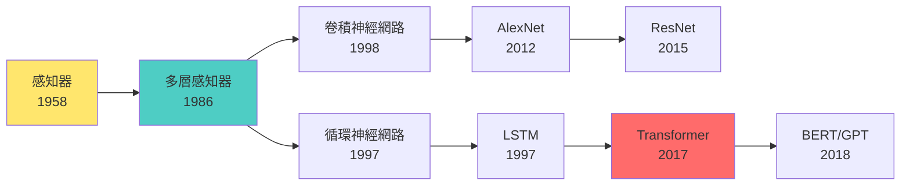

# 第 5.1 章: 神經網路基礎原理

本章將深入探討**神經網路 (Neural Networks)** 的基礎原理,從生物神經元的啟發出發,理解人工神經網路的數學本質,並掌握前向傳播與反向傳播的完整流程。

| 概念 | 中文譯名 | 典型用途 | 優點 | 侷限 |
| :--- | :--- | :--- | :--- | :--- |
| **Fundamentals** | 基礎理論 | 快速掌握神經元、激活函數、前向傳播的核心概念。 | 直觀易懂,能快速建立實作能力。 | 易忽略梯度計算與優化細節。 |
| **First Principles** | 第一原理 | 從微積分與線性代數推導反向傳播算法,理解梯度下降本質。 | 深入本質,有助於調試與優化模型。 | 理論性強,需要數學背景。 |
| **Body of Knowledge** | 知識體系 | 將神經網路置於機器學習與深度學習的完整框架中。 | 結構完備,能理解從感知器到深度學習的演進。 | 內容龐雜,不適合快速入門。 |

---

## 1. Fundamentals (基礎理論)

**神經網路 (Neural Networks)** 是受生物神經系統啟發的計算模型,通過多層非線性變換學習數據中的複雜模式。

### 從生物神經元到人工神經元

**生物神經元的工作原理**:
```
樹突 (Dendrites) → 接收輸入信號
    ↓
細胞體 (Cell Body) → 整合信號
    ↓
軸突 (Axon) → 如果信號強度超過閾值,發送電脈衝
    ↓
突觸 (Synapse) → 傳遞信號給下一個神經元
```

**人工神經元 (Perceptron)**:
```
輸入: x1, x2, ..., xn
     ↓
加權求和: z = w1·x1 + w2·x2 + ... + wn·xn + b
     ↓
激活函數: a = f(z)
     ↓
輸出: a
```

**數學表示**:
```
z = w^T x + b  (線性組合)
a = f(z)       (非線性激活)

其中:
- x: 輸入向量 [x1, x2, ..., xn]
- w: 權重向量 [w1, w2, ..., wn]
- b: 偏置 (bias)
- f: 激活函數
- a: 輸出 (activation)
```

**直觀理解**:
- **權重 w**: 連接強度 (類比突觸強度)
- **偏置 b**: 激活閾值
- **激活函數 f**: 決定是否"發火"

### 激活函數 (Activation Functions)

**為什麼需要激活函數?**

如果沒有激活函數:
```
層1: h1 = W1·x + b1
層2: h2 = W2·h1 + b2 = W2·(W1·x + b1) + b2
         = (W2·W1)·x + (W2·b1 + b2)
         = W'·x + b'

結論: 多層線性變換 = 單層線性變換 (沒有學到複雜模式!)
```

引入激活函數後:
```
h1 = f(W1·x + b1)
h2 = f(W2·h1 + b2)

現在 h2 是 x 的非線性函數,能學習複雜模式!
```

**常見激活函數**:

| 激活函數 | 公式 | 值域 | 優點 | 缺點 | 適用場景 |
|:---|:---|:---|:---|:---|:---|
| **Sigmoid** | σ(z) = 1/(1+e^(-z)) | (0, 1) | 輸出可解釋為機率 | 梯度消失 | 二元分類輸出層 |
| **Tanh** | tanh(z) = (e^z - e^(-z))/(e^z + e^(-z)) | (-1, 1) | 零中心化 | 梯度消失 | 隱藏層 (RNN) |
| **ReLU** | max(0, z) | [0, ∞) | 計算快,緩解梯度消失 | 神經元死亡 | 隱藏層 (CNN/MLP) |
| **Leaky ReLU** | max(0.01z, z) | (-∞, ∞) | 避免神經元死亡 | 超參數調整 | 深度網路 |
| **Softmax** | exp(zi)/Σexp(zj) | (0, 1), Σ=1 | 多類別機率 | - | 多分類輸出層 |

**視覺化激活函數**:
```python
import numpy as np
import matplotlib.pyplot as plt

z = np.linspace(-5, 5, 100)

# Sigmoid
sigmoid = 1 / (1 + np.exp(-z))

# Tanh
tanh = np.tanh(z)

# ReLU
relu = np.maximum(0, z)

# Leaky ReLU
leaky_relu = np.where(z > 0, z, 0.01 * z)

# 繪圖
fig, axes = plt.subplots(2, 2, figsize=(12, 10))

axes[0, 0].plot(z, sigmoid, 'b-', linewidth=2)
axes[0, 0].set_title('Sigmoid', fontsize=14, fontweight='bold')
axes[0, 0].grid(True, alpha=0.3)
axes[0, 0].axhline(y=0, color='k', linewidth=0.5)
axes[0, 0].axvline(x=0, color='k', linewidth=0.5)

axes[0, 1].plot(z, tanh, 'g-', linewidth=2)
axes[0, 1].set_title('Tanh', fontsize=14, fontweight='bold')
axes[0, 1].grid(True, alpha=0.3)
axes[0, 1].axhline(y=0, color='k', linewidth=0.5)
axes[0, 1].axvline(x=0, color='k', linewidth=0.5)

axes[1, 0].plot(z, relu, 'r-', linewidth=2)
axes[1, 0].set_title('ReLU', fontsize=14, fontweight='bold')
axes[1, 0].grid(True, alpha=0.3)
axes[1, 0].axhline(y=0, color='k', linewidth=0.5)
axes[1, 0].axvline(x=0, color='k', linewidth=0.5)

axes[1, 1].plot(z, leaky_relu, 'm-', linewidth=2)
axes[1, 1].set_title('Leaky ReLU', fontsize=14, fontweight='bold')
axes[1, 1].grid(True, alpha=0.3)
axes[1, 1].axhline(y=0, color='k', linewidth=0.5)
axes[1, 1].axvline(x=0, color='k', linewidth=0.5)

plt.tight_layout()
plt.show()
```

### 多層感知器 (Multi-Layer Perceptron, MLP)

**架構**:
```
輸入層 → 隱藏層1 → 隱藏層2 → ... → 輸出層

範例 (3 層網路):
輸入層:  x1, x2, x3 (3 個神經元)
    ↓
隱藏層:  h1, h2, h3, h4 (4 個神經元)
    ↓
輸出層:  y (1 個神經元,二元分類)
```

**前向傳播 (Forward Propagation)**:
```
層 1 (輸入層 → 隱藏層):
z^[1] = W^[1] · x + b^[1]
a^[1] = f(z^[1])

層 2 (隱藏層 → 輸出層):
z^[2] = W^[2] · a^[1] + b^[2]
a^[2] = f(z^[2])

最終輸出: ŷ = a^[2]
```

**Python 實作 (從零開始)**:
```python
import numpy as np

class SimpleMLP:
    def __init__(self, input_size, hidden_size, output_size):
        # 初始化權重 (小隨機數)
        self.W1 = np.random.randn(hidden_size, input_size) * 0.01
        self.b1 = np.zeros((hidden_size, 1))
        self.W2 = np.random.randn(output_size, hidden_size) * 0.01
        self.b2 = np.zeros((output_size, 1))

    def sigmoid(self, z):
        return 1 / (1 + np.exp(-z))

    def forward(self, X):
        """
        前向傳播
        X: 輸入 (input_size, m) - m 個樣本
        """
        # 層 1
        self.Z1 = np.dot(self.W1, X) + self.b1
        self.A1 = self.sigmoid(self.Z1)

        # 層 2
        self.Z2 = np.dot(self.W2, self.A1) + self.b2
        self.A2 = self.sigmoid(self.Z2)

        return self.A2

    def predict(self, X):
        """預測"""
        output = self.forward(X)
        return (output > 0.5).astype(int)

# 測試
np.random.seed(42)
mlp = SimpleMLP(input_size=3, hidden_size=4, output_size=1)

# 假設輸入
X_test = np.array([[1, 0, 1]]).T  # (3, 1)
output = mlp.forward(X_test)
print(f"輸出機率: {output[0, 0]:.4f}")
print(f"預測類別: {mlp.predict(X_test)[0, 0]}")
```

### 損失函數 (Loss Functions)

**目的**: 衡量模型預測與真實值的差距。

**常見損失函數**:

| 任務 | 損失函數 | 公式 | 說明 |
|:---|:---|:---|:---|
| **二元分類** | Binary Cross-Entropy | L = -[y·log(ŷ) + (1-y)·log(1-ŷ)] | y ∈ {0,1} |
| **多分類** | Categorical Cross-Entropy | L = -Σ yi·log(ŷi) | Softmax 輸出 |
| **回歸** | Mean Squared Error | L = (1/n)Σ(yi - ŷi)² | 連續值預測 |
| **回歸** | Mean Absolute Error | L = (1/n)Σ\|yi - ŷi\| | 對離群值魯棒 |

**為什麼用 Cross-Entropy 而非 MSE 於分類?**

```
問題: MSE 在分類任務中梯度消失

假設:
真實值 y = 1
預測值 ŷ = 0.1 (很差!)

MSE:
L = (y - ŷ)² = (1 - 0.1)² = 0.81
dL/dŷ = -2(y - ŷ) = -1.8

Cross-Entropy:
L = -log(ŷ) = -log(0.1) = 2.3
dL/dŷ = -1/ŷ = -10  ← 梯度更大!

結論: Cross-Entropy 在預測錯誤時梯度更大,訓練更快。
```

### 訓練流程 (整體流程)

```
1. 初始化權重 (小隨機數)

2. 重複以下步驟 (epochs):

   a. 前向傳播 (Forward Propagation):
      - 計算每層的輸出
      - 得到最終預測 ŷ

   b. 計算損失 (Loss):
      - L = loss_function(y, ŷ)

   c. 反向傳播 (Backpropagation):
      - 計算損失對權重的梯度 dL/dW

   d. 更新權重 (Gradient Descent):
      - W := W - α · dL/dW
      - b := b - α · dL/db

3. 直到損失收斂或達到最大 epochs
```

**簡化圖示**:
```
輸入 X
  ↓ (前向傳播)
預測 ŷ
  ↓ (計算損失)
損失 L
  ↓ (反向傳播)
梯度 dL/dW, dL/db
  ↓ (梯度下降)
更新權重 W, b
  ↓ (重複)
...
```

---

## 2. First Principles (第一原理)

從微積分和線性代數的基礎深入理解反向傳播算法的數學本質。

### 計算圖 (Computational Graph)

**範例**: 計算 f(x, y, z) = (x + y) · z

**計算圖**:
```
x = -2, y = 5, z = -4

a = x + y = 3
    ↓
f = a · z = -12
```

**前向傳播** (計算函數值):
```
a = x + y = -2 + 5 = 3
f = a · z = 3 · (-4) = -12
```

**反向傳播** (計算梯度):
```
目標: 計算 df/dx, df/dy, df/dz

鏈式法則 (Chain Rule):
df/dx = (df/da) · (da/dx)
df/dy = (df/da) · (da/dy)
df/dz = (df/dz)

計算:
df/da = z = -4
da/dx = 1
da/dy = 1
df/dz = a = 3

最終:
df/dx = -4 · 1 = -4
df/dy = -4 · 1 = -4
df/dz = 3
```

### 反向傳播推導 (2 層網路)

**網路架構**:
```
輸入: x
層1: z1 = W1·x + b1, a1 = σ(z1)
層2: z2 = W2·a1 + b2, a2 = σ(z2)
輸出: ŷ = a2
損失: L = -(y·log(ŷ) + (1-y)·log(1-ŷ))  (Binary Cross-Entropy)
```

**前向傳播**:
```
z1 = W1·x + b1
a1 = σ(z1)
z2 = W2·a1 + b2
a2 = σ(z2)
ŷ = a2
L = -(y·log(ŷ) + (1-y)·log(1-ŷ))
```

**反向傳播** (從輸出層往回):
```
步驟 1: 計算 dL/da2
dL/da2 = -(y/a2 - (1-y)/(1-a2))
       = (a2 - y) / (a2·(1-a2))

步驟 2: 計算 dL/dz2
dL/dz2 = (dL/da2) · (da2/dz2)
       = (dL/da2) · σ'(z2)
       = (dL/da2) · a2·(1-a2)
       = a2 - y  ← 簡化!

步驟 3: 計算 dL/dW2, dL/db2
dL/dW2 = dL/dz2 · a1^T  (外積)
dL/db2 = dL/dz2

步驟 4: 計算 dL/da1
dL/da1 = W2^T · dL/dz2  (反向傳遞)

步驟 5: 計算 dL/dz1
dL/dz1 = (dL/da1) ⊙ σ'(z1)
       = (dL/da1) ⊙ a1⊙(1-a1)

步驟 6: 計算 dL/dW1, dL/db1
dL/dW1 = dL/dz1 · x^T
dL/db1 = dL/dz1
```

**Python 實作 (完整版)**:
```python
class MLP:
    def __init__(self, input_size, hidden_size, output_size, learning_rate=0.01):
        # 初始化
        self.W1 = np.random.randn(hidden_size, input_size) * 0.01
        self.b1 = np.zeros((hidden_size, 1))
        self.W2 = np.random.randn(output_size, hidden_size) * 0.01
        self.b2 = np.zeros((output_size, 1))
        self.lr = learning_rate

    def sigmoid(self, z):
        return 1 / (1 + np.exp(-np.clip(z, -500, 500)))  # 防止溢出

    def forward(self, X):
        """前向傳播"""
        self.Z1 = np.dot(self.W1, X) + self.b1
        self.A1 = self.sigmoid(self.Z1)
        self.Z2 = np.dot(self.W2, self.A1) + self.b2
        self.A2 = self.sigmoid(self.Z2)
        return self.A2

    def compute_loss(self, Y, Y_pred):
        """計算 Binary Cross-Entropy 損失"""
        m = Y.shape[1]
        loss = -np.mean(Y * np.log(Y_pred + 1e-8) + (1 - Y) * np.log(1 - Y_pred + 1e-8))
        return loss

    def backward(self, X, Y):
        """反向傳播"""
        m = X.shape[1]

        # 層 2 梯度
        dZ2 = self.A2 - Y  # dL/dz2
        dW2 = (1/m) * np.dot(dZ2, self.A1.T)
        db2 = (1/m) * np.sum(dZ2, axis=1, keepdims=True)

        # 層 1 梯度
        dA1 = np.dot(self.W2.T, dZ2)
        dZ1 = dA1 * self.A1 * (1 - self.A1)  # dL/da1 * σ'(z1)
        dW1 = (1/m) * np.dot(dZ1, X.T)
        db1 = (1/m) * np.sum(dZ1, axis=1, keepdims=True)

        # 儲存梯度
        self.dW1, self.db1 = dW1, db1
        self.dW2, self.db2 = dW2, db2

    def update_parameters(self):
        """梯度下降更新權重"""
        self.W1 -= self.lr * self.dW1
        self.b1 -= self.lr * self.db1
        self.W2 -= self.lr * self.dW2
        self.b2 -= self.lr * self.db2

    def train(self, X, Y, epochs=1000, print_every=100):
        """訓練"""
        losses = []

        for epoch in range(epochs):
            # 前向傳播
            Y_pred = self.forward(X)

            # 計算損失
            loss = self.compute_loss(Y, Y_pred)
            losses.append(loss)

            # 反向傳播
            self.backward(X, Y)

            # 更新權重
            self.update_parameters()

            if (epoch + 1) % print_every == 0:
                accuracy = np.mean((Y_pred > 0.5) == Y)
                print(f"Epoch {epoch+1}/{epochs} - Loss: {loss:.4f}, Accuracy: {accuracy:.4f}")

        return losses

# 測試
np.random.seed(42)

# 生成 XOR 數據 (非線性可分)
X = np.array([[0, 0, 1, 1],
              [0, 1, 0, 1]])
Y = np.array([[0, 1, 1, 0]])  # XOR

# 訓練
mlp = MLP(input_size=2, hidden_size=4, output_size=1, learning_rate=1.0)
losses = mlp.train(X, Y, epochs=5000, print_every=1000)

# 預測
Y_pred = mlp.forward(X)
print("\n預測結果:")
print("輸入:", X.T)
print("真實:", Y.T)
print("預測:", (Y_pred > 0.5).astype(int).T)
```

### 梯度下降的變體

**1. Batch Gradient Descent (批次梯度下降)**:
```
使用所有訓練數據計算梯度
W := W - α · (1/m) Σ dL/dW

優點: 梯度準確,穩定收斂
缺點: 大數據集慢,記憶體需求大
```

**2. Stochastic Gradient Descent (隨機梯度下降)**:
```
每次使用 1 個樣本計算梯度
W := W - α · dL/dW (單個樣本)

優點: 更新快,可在線學習
缺點: 梯度波動大,不穩定
```

**3. Mini-batch Gradient Descent (小批次梯度下降)**:
```
每次使用 batch_size 個樣本計算梯度
W := W - α · (1/batch_size) Σ dL/dW

優點: 平衡速度與穩定性 (最常用)
缺點: 需要調整 batch_size
```

**視覺化收斂過程**:
```
Batch GD:      平滑,直線型收斂
SGD:           鋸齒狀,波動大
Mini-batch GD: 輕微波動,快速收斂 ✅
```

### 權重初始化策略

**問題**: 初始化不當導致訓練失敗。

**錯誤初始化 1: 全零**:
```
W = 0, b = 0

結果: 所有神經元輸出相同 → 對稱性問題 → 無法學習
```

**錯誤初始化 2: 過大隨機數**:
```
W = np.random.randn(n, m) * 10

結果:
- z = W·x 過大 → σ(z) 飽和 → 梯度消失
- 訓練無法進行
```

**正確初始化策略**:

| 方法 | 公式 | 適用場景 |
|:---|:---|:---|
| **Xavier** | W ~ N(0, 1/n_in) | Sigmoid/Tanh |
| **He** | W ~ N(0, 2/n_in) | ReLU |
| **LeCun** | W ~ N(0, 1/n_in) | SELU |

**Python 實作**:
```python
# Xavier 初始化
W = np.random.randn(n_out, n_in) * np.sqrt(1 / n_in)

# He 初始化 (推薦用於 ReLU)
W = np.random.randn(n_out, n_in) * np.sqrt(2 / n_in)
```

---

## 3. Body of Knowledge (知識體系)

將神經網路置於機器學習與深度學習的宏觀框架中。

### 神經網路的演化史



### 神經網路 vs 傳統機器學習

| 特性 | 傳統 ML | 神經網路 |
|:---|:---|:---|
| **特徵工程** | 手工設計 | 自動學習 |
| **模型複雜度** | 低-中 | 中-極高 |
| **數據需求** | 小-中 (10³-10⁵) | 大-極大 (10⁵-10⁹) |
| **訓練時間** | 快 (分鐘-小時) | 慢 (小時-天) |
| **可解釋性** | 高 | 低 (黑盒) |
| **泛化能力** | 中 | 高 (在大數據下) |
| **適用任務** | 結構化數據 | 圖像、文本、語音 |

### 通用逼近定理 (Universal Approximation Theorem)

**定理**: 具有至少一個隱藏層的神經網路,在適當的激活函數下,可以逼近任何連續函數。

**數學表示**:
```
對任意連續函數 f: ℝⁿ → ℝᵐ,
存在神經網路 N(x; W, b),使得:

||f(x) - N(x; W, b)|| < ε  (對所有 x)

其中 ε 是任意小的正數。
```

**直觀理解**:
```
1 個隱藏層 + 足夠多神經元 = 可以擬合任何函數!

但實務上:
- "足夠多" 可能需要指數級神經元
- 深度網路 (多層少神經元) 通常更有效
```

**為什麼深度網路更好?**

```
淺層網路 (1 隱藏層):
- 需要大量神經元
- 參數量: O(2^d),d 是輸入維度

深度網路 (L 層):
- 每層少量神經元
- 參數量: O(L·d)

範例:
擬合 x₁ XOR x₂ XOR ... XOR x₁₀:
- 淺層: 需要 2¹⁰ = 1024 個神經元
- 深層 (10 層): 每層 2 個神經元,共 20 個

深度 = 效率!
```

### 過擬合與正則化

**問題**: 模型在訓練集表現好,測試集差 (泛化能力弱)。

**正則化技術**:

**1. L1/L2 正則化**:
```
原損失: L(W)
加正則: L(W) + λ·R(W)

L1: R(W) = Σ|wi|  → 稀疏權重
L2: R(W) = Σwi²   → 權重衰減 (Weight Decay)
```

**2. Dropout**:
```
訓練時: 隨機丟棄 p% 的神經元
測試時: 使用所有神經元,輸出 × (1-p)

效果: 類似訓練多個子網路的集成
```

**3. Early Stopping**:
```
監控驗證集損失:
- 如果連續 n 個 epoch 不下降
- 停止訓練,使用最佳權重
```

**4. Data Augmentation**:
```
增加訓練數據多樣性:
- 圖像: 旋轉、翻轉、裁剪
- 文本: 同義詞替換、回譯
```

**5. Batch Normalization**:
```
標準化每層輸入:
x_norm = (x - μ) / σ

效果:
- 加速訓練
- 允許更大學習率
- 減輕過擬合
```

### 梯度消失與梯度爆炸

**梯度消失 (Vanishing Gradient)**:
```
問題: 深層網路中,梯度在反向傳播時越來越小

原因 (Sigmoid):
σ'(z) = σ(z)·(1-σ(z)) ∈ [0, 0.25]

10 層網路:
梯度 ~ (0.25)¹⁰ = 9.5 × 10⁻⁷  ← 幾乎為 0!

結果: 前層幾乎不更新,無法訓練
```

**解決方案**:
```
1. 使用 ReLU 激活函數:
   ReLU'(z) = 1 (當 z > 0)

2. Residual Connections (ResNet):
   h(x) = F(x) + x  → 梯度直通

3. LSTM/GRU (RNN 專用):
   門控機制保持梯度流動

4. Batch Normalization:
   標準化激活值,穩定梯度
```

**梯度爆炸 (Exploding Gradient)**:
```
問題: 梯度過大,權重更新劇烈震盪

解決:
1. Gradient Clipping:
   if ||grad|| > threshold:
       grad = grad * threshold / ||grad||

2. 權重初始化 (He/Xavier)

3. 降低學習率
```

### 神經網路的應用場景

| 領域 | 任務 | 典型架構 | 代表模型 |
|:---|:---|:---|:---|
| **計算機視覺** | 圖像分類 | CNN | ResNet, EfficientNet |
| **計算機視覺** | 目標檢測 | CNN | YOLO, Faster R-CNN |
| **自然語言處理** | 文本分類 | MLP/RNN | BERT, RoBERTa |
| **自然語言處理** | 機器翻譯 | Seq2Seq/Transformer | GPT, T5 |
| **語音處理** | 語音識別 | RNN/CNN | DeepSpeech, Wav2Vec |
| **推薦系統** | 協同過濾 | MLP/Embedding | DeepFM, Wide&Deep |
| **強化學習** | 遊戲AI | DQN | AlphaGo, OpenAI Five |

---

## 結論與建議

1. **日常溝通與實作**: 優先掌握 **Fundamentals** 中的 **激活函數**、**前向傳播** 與 **損失函數**,這是實作神經網路的基礎。

2. **強調方法論與創新**: 從 **First Principles** 出發,深入理解 **反向傳播** 的數學推導,有助於您在調試模型時快速定位問題。

3. **構建宏觀視野**: 將神經網路放入 **Body of Knowledge** 的框架中,可以清晰地看到從感知器到深度學習的演進,以及不同架構的適用場景。

**核心要點**: 神經網路通過多層非線性變換自動學習特徵表示,是現代深度學習的基石。理解前向傳播與反向傳播是掌握深度學習的關鍵。

透過本章的學習,您應當已經掌握了神經網路的核心原理,並能從數學角度深入理解其訓練過程。

---

## 延伸閱讀 (Further Reading)

### 關鍵論文 (Key Papers)
1. **反向傳播**: Rumelhart et al. (1986). *Learning representations by back-propagating errors*. Nature.
2. **通用逼近定理**: Hornik et al. (1989). *Multilayer feedforward networks are universal approximators*. Neural Networks.
3. **Dropout**: Srivastava et al. (2014). *Dropout: A Simple Way to Prevent Neural Networks from Overfitting*. JMLR.

### 經典教材 (Textbooks)
- **Deep Learning** by Goodfellow, Bengio, Courville (第 6 章)
- **Neural Networks and Deep Learning** by Michael Nielsen (線上免費)
- **Hands-On Machine Learning with Scikit-Learn, Keras, and TensorFlow** by Aurélien Géron

### 實作資源 (Implementation Resources)
- **TensorFlow Playground**: https://playground.tensorflow.org/ (視覺化神經網路)
- **3Blue1Brown Neural Networks**: https://www.youtube.com/playlist?list=PLZHQObOWTQDNU6R1_67000Dx_ZCJB-3pi
- **CS231n Stanford**: http://cs231n.stanford.edu/

---

**下一章節**: [5.2 深度學習框架 - Keras 入門](./02_深度學習框架_Keras入門.md)
