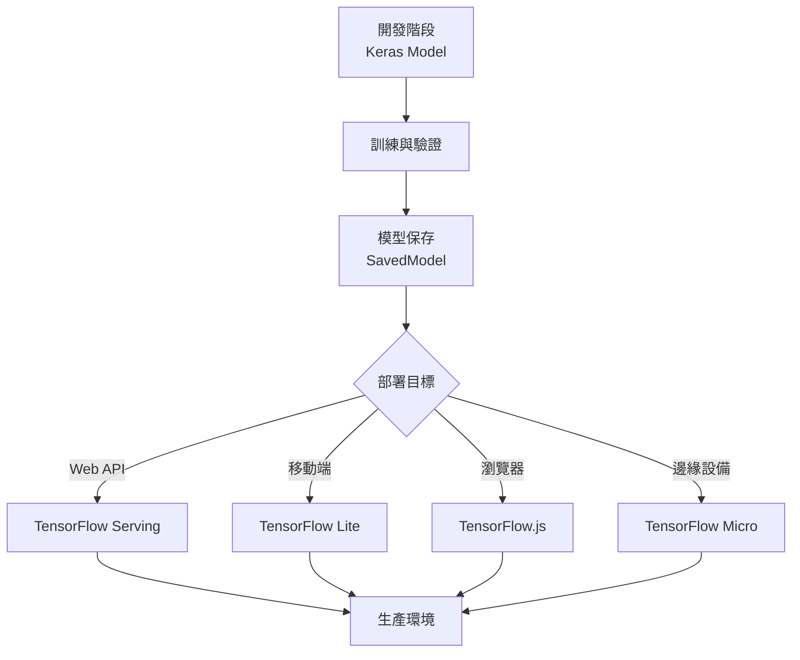

# 第 5.2 章: 深度學習框架 - Keras 入門

本章將深入探討 **Keras** 深度學習框架的使用,從 API 設計哲學到實戰應用,幫助您快速上手現代深度學習開發。Keras 以其簡潔優雅的 API 設計成為最受歡迎的深度學習框架之一。

| 概念 | 中文譯名 | 典型用途 | 優點 | 侷限 |
| :--- | :--- | :--- | :--- | :--- |
| **Fundamentals** | 基礎理論 | 快速掌握 Sequential 與 Functional API,建立第一個深度學習模型。 | 直觀易懂,適合快速原型開發。 | 易忽略底層計算圖與性能優化。 |
| **First Principles** | 第一原理 | 從張量運算與自動微分的本質,理解 Keras 的設計哲學。 | 深入本質,有助於自定義層與模型。 | 理論性強,需要了解 TensorFlow 底層。 |
| **Body of Knowledge** | 知識體系 | 將 Keras 置於深度學習框架生態的完整框架中。 | 結構完備,能理解與 PyTorch/JAX 的差異。 | 內容龐雜,不適合快速入門。 |

---

## 1. Fundamentals (基礎理論)

**Keras** 是一個高級神經網路 API,最初作為獨立框架,現已整合進 TensorFlow 2.x 成為官方推薦接口。

### Keras 的設計哲學

**核心原則**:
1. **用戶友好**: 簡潔一致的 API,降低學習門檻
2. **模組化**: 神經網路是可配置的模組序列
3. **易擴展**: 輕鬆自定義層、損失函數、指標
4. **Python 原生**: 充分利用 Python 語法特性

**Keras vs 其他框架**:
```
TensorFlow 1.x: 靜態計算圖,冗長 API
PyTorch: 動態計算圖,靈活但需更多代碼
Keras (TF 2.x): 靜態 + Eager,簡潔 API ✅
```

### 安裝與環境設定

**安裝**:
```bash
# 安裝 TensorFlow (包含 Keras)
pip install tensorflow

# 驗證安裝
python -c "import tensorflow as tf; print(tf.__version__)"
python -c "import tensorflow.keras as keras; print(keras.__version__)"
```

**基本導入**:
```python
import numpy as np
import matplotlib.pyplot as plt

# TensorFlow 與 Keras
import tensorflow as tf
from tensorflow import keras
from tensorflow.keras import layers, models

print(f"TensorFlow 版本: {tf.__version__}")
print(f"Keras 版本: {keras.__version__}")

# 檢查 GPU
print(f"GPU 可用: {tf.config.list_physical_devices('GPU')}")
```

### Sequential API (序列式模型)

**最簡單的 API**: 適合線性堆疊的網路層。

**基本語法**:
```python
model = keras.Sequential([
    layers.Dense(64, activation='relu', input_shape=(784,)),
    layers.Dense(32, activation='relu'),
    layers.Dense(10, activation='softmax')
])
```

**完整範例: MNIST 手寫數字分類**:
```python
from tensorflow import keras
from tensorflow.keras import layers
from tensorflow.keras.datasets import mnist

# 1. 載入數據
(X_train, y_train), (X_test, y_test) = mnist.load_data()

# 2. 預處理
X_train = X_train.reshape(-1, 784) / 255.0  # 展平 + 標準化
X_test = X_test.reshape(-1, 784) / 255.0

# 3. 建立模型 (Sequential API)
model = keras.Sequential([
    layers.Dense(128, activation='relu', input_shape=(784,)),
    layers.Dropout(0.2),  # 正則化
    layers.Dense(64, activation='relu'),
    layers.Dropout(0.2),
    layers.Dense(10, activation='softmax')  # 10 個類別
])

# 4. 編譯模型
model.compile(
    optimizer='adam',
    loss='sparse_categorical_crossentropy',  # 整數標籤
    metrics=['accuracy']
)

# 5. 訓練
history = model.fit(
    X_train, y_train,
    batch_size=128,
    epochs=10,
    validation_split=0.2,  # 20% 驗證集
    verbose=1
)

# 6. 評估
test_loss, test_acc = model.evaluate(X_test, y_test, verbose=0)
print(f"\n測試準確率: {test_acc:.4f}")

# 7. 視覺化訓練過程
import matplotlib.pyplot as plt

plt.figure(figsize=(12, 4))

# 損失曲線
plt.subplot(1, 2, 1)
plt.plot(history.history['loss'], label='Train Loss')
plt.plot(history.history['val_loss'], label='Val Loss')
plt.xlabel('Epoch')
plt.ylabel('Loss')
plt.legend()
plt.title('Training & Validation Loss')

# 準確率曲線
plt.subplot(1, 2, 2)
plt.plot(history.history['accuracy'], label='Train Acc')
plt.plot(history.history['val_accuracy'], label='Val Acc')
plt.xlabel('Epoch')
plt.ylabel('Accuracy')
plt.legend()
plt.title('Training & Validation Accuracy')

plt.tight_layout()
plt.show()
```

### Functional API (函數式模型)

**更靈活的 API**: 適合複雜網路 (多輸入、多輸出、殘差連接)。

**基本語法**:
```python
inputs = layers.Input(shape=(784,))
x = layers.Dense(128, activation='relu')(inputs)
x = layers.Dropout(0.2)(x)
x = layers.Dense(64, activation='relu')(x)
outputs = layers.Dense(10, activation='softmax')(x)

model = keras.Model(inputs=inputs, outputs=outputs)
```

**進階範例: 多輸入模型**:
```python
# 情境: 結合文本特徵和數值特徵進行分類

# 輸入 1: 文本特徵 (經過 TF-IDF)
text_input = layers.Input(shape=(1000,), name='text_input')
text_features = layers.Dense(64, activation='relu')(text_input)

# 輸入 2: 數值特徵
numeric_input = layers.Input(shape=(10,), name='numeric_input')
numeric_features = layers.Dense(32, activation='relu')(numeric_input)

# 合併兩個輸入
combined = layers.concatenate([text_features, numeric_features])

# 共享層
x = layers.Dense(64, activation='relu')(combined)
x = layers.Dropout(0.3)(x)

# 輸出
outputs = layers.Dense(3, activation='softmax', name='category')(x)

# 建立模型
model = keras.Model(
    inputs=[text_input, numeric_input],
    outputs=outputs,
    name='multi_input_model'
)

# 編譯
model.compile(
    optimizer='adam',
    loss='sparse_categorical_crossentropy',
    metrics=['accuracy']
)

# 查看架構
model.summary()
```

**範例: 殘差連接 (Residual Connection)**:
```python
inputs = layers.Input(shape=(64,))

# 主路徑
x = layers.Dense(64, activation='relu')(inputs)
x = layers.Dense(64, activation='relu')(x)

# 殘差連接
outputs = layers.Add()([x, inputs])  # x + inputs

model = keras.Model(inputs, outputs)
```

### 常用層 (Layers)

| 層類型 | 用途 | 關鍵參數 | 範例 |
|:---|:---|:---|:---|
| **Dense** | 全連接層 | units, activation | `layers.Dense(64, activation='relu')` |
| **Dropout** | 正則化 | rate (丟棄比例) | `layers.Dropout(0.5)` |
| **BatchNormalization** | 批次標準化 | - | `layers.BatchNormalization()` |
| **Embedding** | 詞嵌入 | input_dim, output_dim | `layers.Embedding(10000, 128)` |
| **LSTM** | 長短期記憶 | units, return_sequences | `layers.LSTM(64)` |
| **Conv1D** | 1D 卷積 | filters, kernel_size | `layers.Conv1D(32, 3)` |
| **GlobalMaxPooling1D** | 全局池化 | - | `layers.GlobalMaxPooling1D()` |

### 編譯模型 (Compile)

**三大要素**:
1. **優化器 (Optimizer)**: 如何更新權重
2. **損失函數 (Loss)**: 如何衡量誤差
3. **評估指標 (Metrics)**: 如何評估性能

**常用優化器**:
```python
# Adam (最常用,自適應學習率)
model.compile(optimizer='adam', ...)

# 自定義學習率
model.compile(optimizer=keras.optimizers.Adam(learning_rate=0.001), ...)

# SGD with Momentum
model.compile(optimizer=keras.optimizers.SGD(learning_rate=0.01, momentum=0.9), ...)

# RMSprop
model.compile(optimizer='rmsprop', ...)
```

**常用損失函數**:
```python
# 二元分類
loss='binary_crossentropy'

# 多分類 (整數標籤)
loss='sparse_categorical_crossentropy'

# 多分類 (one-hot 標籤)
loss='categorical_crossentropy'

# 回歸
loss='mean_squared_error'
loss='mean_absolute_error'
```

**常用評估指標**:
```python
# 分類
metrics=['accuracy']
metrics=['precision', 'recall']
metrics=[keras.metrics.F1Score()]

# 回歸
metrics=['mae', 'mse']
```

### 訓練模型 (Fit)

**基本用法**:
```python
history = model.fit(
    X_train, y_train,
    batch_size=32,          # 批次大小
    epochs=50,              # 訓練輪數
    validation_split=0.2,   # 驗證集比例
    verbose=1               # 顯示進度
)
```

**使用驗證數據**:
```python
history = model.fit(
    X_train, y_train,
    batch_size=32,
    epochs=50,
    validation_data=(X_val, y_val),  # 明確指定驗證集
    verbose=1
)
```

**Callbacks (回調函數)**:
```python
from tensorflow.keras.callbacks import EarlyStopping, ModelCheckpoint, ReduceLROnPlateau

callbacks = [
    # Early Stopping: 驗證損失不下降就停止
    EarlyStopping(
        monitor='val_loss',
        patience=5,
        restore_best_weights=True
    ),

    # Model Checkpoint: 保存最佳模型
    ModelCheckpoint(
        filepath='best_model.h5',
        monitor='val_accuracy',
        save_best_only=True
    ),

    # Reduce LR: 驗證損失不下降就降低學習率
    ReduceLROnPlateau(
        monitor='val_loss',
        factor=0.5,
        patience=3,
        min_lr=1e-7
    )
]

history = model.fit(
    X_train, y_train,
    batch_size=32,
    epochs=100,
    validation_data=(X_val, y_val),
    callbacks=callbacks
)
```

### 預測與評估

**預測**:
```python
# 預測機率
y_pred_proba = model.predict(X_test)  # shape: (n_samples, n_classes)

# 預測類別
y_pred = np.argmax(y_pred_proba, axis=1)

# 單個樣本預測
single_pred = model.predict(X_test[0:1])  # 必須是 2D
```

**評估**:
```python
# 計算損失和指標
loss, accuracy = model.evaluate(X_test, y_test, verbose=0)
print(f"測試損失: {loss:.4f}")
print(f"測試準確率: {accuracy:.4f}")
```

**詳細評估**:
```python
from sklearn.metrics import classification_report, confusion_matrix
import seaborn as sns

# 預測
y_pred = np.argmax(model.predict(X_test), axis=1)

# 混淆矩陣
cm = confusion_matrix(y_test, y_pred)

plt.figure(figsize=(10, 8))
sns.heatmap(cm, annot=True, fmt='d', cmap='Blues')
plt.xlabel('Predicted')
plt.ylabel('True')
plt.title('Confusion Matrix')
plt.show()

# 分類報告
print(classification_report(y_test, y_pred))
```

### 模型保存與載入

**保存整個模型**:
```python
# 保存 (HDF5 格式)
model.save('my_model.h5')

# 保存 (SavedModel 格式,推薦)
model.save('my_model')

# 載入
loaded_model = keras.models.load_model('my_model.h5')
```

**只保存權重**:
```python
# 保存權重
model.save_weights('weights.h5')

# 載入權重 (需先建立相同架構的模型)
model.load_weights('weights.h5')
```

**保存架構**:
```python
# 保存架構 (JSON)
json_config = model.to_json()
with open('model_architecture.json', 'w') as f:
    f.write(json_config)

# 載入架構
from tensorflow.keras.models import model_from_json
with open('model_architecture.json', 'r') as f:
    json_config = f.read()
new_model = model_from_json(json_config)
```

---

## 2. First Principles (第一原理)

從張量運算與自動微分的本質深入理解 Keras 的設計哲學。

### 張量 (Tensors) 的本質

**定義**: 張量是多維數組的推廣。

**維度對應**:
```
0D 張量 (標量): 42
1D 張量 (向量): [1, 2, 3]
2D 張量 (矩陣): [[1, 2], [3, 4]]
3D 張量: [[[1, 2], [3, 4]], [[5, 6], [7, 8]]]
4D 張量: (batch_size, height, width, channels)  # 圖像批次
```

**Keras 中的張量操作**:
```python
import tensorflow as tf

# 創建張量
x = tf.constant([[1.0, 2.0], [3.0, 4.0]])
print(f"張量形狀: {x.shape}")  # (2, 2)
print(f"張量維度: {len(x.shape)}")  # 2
print(f"數據類型: {x.dtype}")  # float32

# 張量運算
y = x + 10  # 廣播
z = tf.matmul(x, x)  # 矩陣乘法
print(z)
```

### 自動微分 (Automatic Differentiation)

**核心**: Keras 使用 TensorFlow 的 GradientTape 自動計算梯度。

**手動計算梯度**:
```python
# 定義函數 f(x) = x^2
x = tf.Variable(3.0)

with tf.GradientTape() as tape:
    y = x ** 2

# 計算 dy/dx
dy_dx = tape.gradient(y, x)
print(f"f(x) = x^2 在 x=3 的梯度: {dy_dx.numpy()}")  # 6.0
```

**神經網路的自動微分**:
```python
# 自定義訓練循環
model = keras.Sequential([
    layers.Dense(64, activation='relu', input_shape=(10,)),
    layers.Dense(1)
])

optimizer = keras.optimizers.SGD(learning_rate=0.01)
loss_fn = keras.losses.MeanSquaredError()

# 訓練一個batch
X_batch = tf.random.normal((32, 10))
y_batch = tf.random.normal((32, 1))

with tf.GradientTape() as tape:
    # 前向傳播
    y_pred = model(X_batch, training=True)
    # 計算損失
    loss = loss_fn(y_batch, y_pred)

# 反向傳播: 計算梯度
gradients = tape.gradient(loss, model.trainable_variables)

# 更新權重
optimizer.apply_gradients(zip(gradients, model.trainable_variables))

print(f"損失: {loss.numpy():.4f}")
```

### 自定義層 (Custom Layers)

**基礎範例**: 自定義全連接層。

```python
class CustomDense(layers.Layer):
    def __init__(self, units, activation=None):
        super(CustomDense, self).__init__()
        self.units = units
        self.activation = keras.activations.get(activation)

    def build(self, input_shape):
        # 初始化權重 (只在首次調用時執行)
        self.w = self.add_weight(
            shape=(input_shape[-1], self.units),
            initializer='random_normal',
            trainable=True,
            name='kernel'
        )
        self.b = self.add_weight(
            shape=(self.units,),
            initializer='zeros',
            trainable=True,
            name='bias'
        )

    def call(self, inputs):
        # 前向傳播
        z = tf.matmul(inputs, self.w) + self.b
        return self.activation(z) if self.activation else z

# 使用自定義層
model = keras.Sequential([
    CustomDense(64, activation='relu'),
    CustomDense(10, activation='softmax')
])
```

**進階範例**: 帶狀態的層 (Layer with State)。

```python
class ComputeSum(layers.Layer):
    def __init__(self):
        super(ComputeSum, self).__init__()

    def build(self, input_shape):
        # 創建不可訓練的狀態變量
        self.total = self.add_weight(
            shape=(),
            initializer='zeros',
            trainable=False,
            name='total'
        )

    def call(self, inputs):
        # 累積輸入總和
        self.total.assign_add(tf.reduce_sum(inputs))
        return inputs

# 測試
layer = ComputeSum()
x = tf.constant([1.0, 2.0, 3.0])
y = layer(x)
print(f"累積總和: {layer.total.numpy()}")  # 6.0
```

### 自定義模型 (Custom Models)

**子類化 Model**:
```python
class ResidualBlock(keras.Model):
    def __init__(self, units):
        super(ResidualBlock, self).__init__()
        self.dense1 = layers.Dense(units, activation='relu')
        self.dense2 = layers.Dense(units, activation='relu')

    def call(self, inputs):
        x = self.dense1(inputs)
        x = self.dense2(x)
        # 殘差連接
        return x + inputs  # 假設輸入與輸出維度相同

# 使用
inputs = layers.Input(shape=(64,))
x = ResidualBlock(64)(inputs)
x = layers.Dense(10, activation='softmax')(x)
model = keras.Model(inputs, x)
```

### 自定義訓練循環

**完全控制訓練過程**:
```python
# 準備數據
(X_train, y_train), (X_test, y_test) = keras.datasets.mnist.load_data()
X_train = X_train.reshape(-1, 784).astype('float32') / 255
X_test = X_test.reshape(-1, 784).astype('float32') / 255

# 創建 Dataset
train_dataset = tf.data.Dataset.from_tensor_slices((X_train, y_train))
train_dataset = train_dataset.shuffle(10000).batch(128)

# 建立模型
model = keras.Sequential([
    layers.Dense(128, activation='relu'),
    layers.Dense(10)
])

# 優化器與損失
optimizer = keras.optimizers.Adam()
loss_fn = keras.losses.SparseCategoricalCrossentropy(from_logits=True)

# 評估指標
train_acc_metric = keras.metrics.SparseCategoricalAccuracy()

# 訓練循環
epochs = 5
for epoch in range(epochs):
    print(f"\nEpoch {epoch + 1}/{epochs}")

    # 遍歷批次
    for step, (x_batch, y_batch) in enumerate(train_dataset):
        with tf.GradientTape() as tape:
            # 前向傳播
            logits = model(x_batch, training=True)
            # 計算損失
            loss = loss_fn(y_batch, logits)

        # 反向傳播
        gradients = tape.gradient(loss, model.trainable_variables)
        optimizer.apply_gradients(zip(gradients, model.trainable_variables))

        # 更新指標
        train_acc_metric.update_state(y_batch, logits)

        # 每 100 步打印一次
        if step % 100 == 0:
            print(f"Step {step}: Loss = {loss.numpy():.4f}")

    # 顯示每個 epoch 的準確率
    train_acc = train_acc_metric.result().numpy()
    print(f"Training accuracy: {train_acc:.4f}")

    # 重置指標
    train_acc_metric.reset_states()
```

---

## 3. Body of Knowledge (知識體系)

將 Keras 置於深度學習框架生態與現代 AI 開發流程的完整框架中。

### 深度學習框架對比

| 框架 | 設計哲學 | 易用性 | 靈活性 | 生態系統 | 適用場景 |
|:---|:---|:---|:---|:---|:---|
| **Keras** | 高級 API | ⭐⭐⭐⭐⭐ | ⭐⭐⭐ | TensorFlow | 快速原型、生產部署 |
| **PyTorch** | 動態圖,研究導向 | ⭐⭐⭐⭐ | ⭐⭐⭐⭐⭐ | 豐富 | 研究、靈活架構 |
| **JAX** | 函數式,自動微分 | ⭐⭐ | ⭐⭐⭐⭐⭐ | 成長中 | 高性能計算、研究 |
| **MXNet** | 分布式訓練 | ⭐⭐⭐ | ⭐⭐⭐⭐ | AWS | 大規模分布式 |

### Keras 在 NLP 的應用範式

**文本分類完整流程**:
```python
from tensorflow import keras
from tensorflow.keras import layers
from sklearn.model_selection import train_test_split

# 1. 數據準備
texts = ["I love this movie", "This is terrible", ...]
labels = [1, 0, ...]

# 2. 文本向量化
vectorizer = layers.TextVectorization(max_tokens=10000, output_sequence_length=100)
vectorizer.adapt(texts)  # 學習詞彙表

# 3. 建立模型
model = keras.Sequential([
    vectorizer,  # 向量化層
    layers.Embedding(input_dim=10000, output_dim=128),
    layers.GlobalAveragePooling1D(),
    layers.Dense(64, activation='relu'),
    layers.Dropout(0.5),
    layers.Dense(1, activation='sigmoid')
])

# 4. 編譯與訓練
model.compile(optimizer='adam',
              loss='binary_crossentropy',
              metrics=['accuracy'])

history = model.fit(texts, labels, epochs=10, validation_split=0.2)
```

### 遷移學習 (Transfer Learning)

**使用預訓練模型**:
```python
# 載入預訓練的 BERT (需安裝 transformers)
from transformers import TFBertModel

# 凍結 BERT 權重
bert_model = TFBertModel.from_pretrained('bert-base-uncased')
bert_model.trainable = False

# 添加分類頭
inputs = layers.Input(shape=(128,), dtype=tf.int32)
bert_outputs = bert_model(inputs)[0]  # 獲取序列輸出
pooled = layers.GlobalAveragePooling1D()(bert_outputs)
outputs = layers.Dense(3, activation='softmax')(pooled)

model = keras.Model(inputs, outputs)
```

### 模型部署流程



**TensorFlow Serving 部署**:
```bash
# 保存模型
model.save('saved_model/my_model')

# 啟動 TensorFlow Serving (Docker)
docker run -p 8501:8501 \
  --mount type=bind,source=/path/to/saved_model,target=/models/my_model \
  -e MODEL_NAME=my_model \
  -t tensorflow/serving
```

### 最佳實踐

**1. 數據管道優化**:
```python
# 使用 tf.data API
dataset = tf.data.Dataset.from_tensor_slices((X, y))
dataset = (dataset
    .shuffle(10000)
    .batch(32)
    .prefetch(tf.data.AUTOTUNE)  # 自動調優
)

model.fit(dataset, epochs=10)
```

**2. Mixed Precision 訓練**:
```python
# 啟用混合精度 (GPU 加速)
from tensorflow.keras import mixed_precision

policy = mixed_precision.Policy('mixed_float16')
mixed_precision.set_global_policy(policy)

# 輸出層保持 float32
outputs = layers.Dense(10, activation='softmax', dtype='float32')(x)
```

**3. 分布式訓練**:
```python
# 多 GPU 訓練
strategy = tf.distribute.MirroredStrategy()

with strategy.scope():
    model = keras.Sequential([...])
    model.compile(...)

model.fit(X, y, epochs=10)
```

**4. 模型可視化**:
```python
# 繪製模型架構
keras.utils.plot_model(model, to_file='model.png',
                       show_shapes=True,
                       show_layer_names=True)

# TensorBoard 監控
tensorboard_callback = keras.callbacks.TensorBoard(log_dir='./logs')
model.fit(X, y, callbacks=[tensorboard_callback])
```

---

## 結論與建議

1. **日常溝通與實作**: 優先掌握 **Fundamentals** 中的 **Sequential API** 和 **Functional API**,90% 的模型可用這兩種 API 實現。

2. **強調方法論與創新**: 從 **First Principles** 出發,理解 **自動微分** 與 **自定義層**,有助於您實現複雜架構。

3. **構建宏觀視野**: 將 Keras 放入 **Body of Knowledge** 的框架中,可以清晰地看到其在深度學習生態中的定位,以及與其他框架的權衡。

**核心要點**: Keras 以簡潔優雅的 API 設計成為深度學習入門與快速原型開發的首選,同時通過 TensorFlow 後端提供生產級性能。

透過本章的學習,您應當已經掌握了 Keras 的核心 API 與最佳實踐,並能快速開發深度學習模型。

---

## 延伸閱讀 (Further Reading)

### 官方資源 (Official Resources)
- **Keras 官方文檔**: https://keras.io/
- **TensorFlow 教程**: https://www.tensorflow.org/tutorials
- **Keras Code Examples**: https://keras.io/examples/

### 進階主題 (Advanced Topics)
- **自定義訓練循環**: https://www.tensorflow.org/guide/keras/writing_a_training_loop_from_scratch
- **混合精度訓練**: https://www.tensorflow.org/guide/mixed_precision
- **分布式訓練**: https://www.tensorflow.org/guide/distributed_training

### 實戰資源 (Practical Resources)
- **Kaggle Keras Kernels**: https://www.kaggle.com/code
- **TensorFlow Hub**: https://tfhub.dev/ (預訓練模型)

---

**下一章節**: [5.3 詞嵌入技術 - Embedding 層](./03_詞嵌入技術_Embedding層.md)
