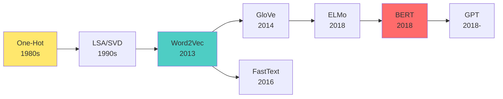

# 第 5.3 章: 詞嵌入技術 - Embedding 層

本章將深入探討**詞嵌入 (Word Embeddings)** 這一革命性技術,從稀疏的 one-hot 編碼到密集的詞向量,理解如何讓神經網路"理解"詞的語義。詞嵌入是現代 NLP 的基石,是從傳統方法到深度學習的關鍵橋樑。

| 概念 | 中文譯名 | 典型用途 | 優點 | 侷限 |
| :--- | :--- | :--- | :--- | :--- |
| **Fundamentals** | 基礎理論 | 快速掌握 Embedding 層的使用,理解詞向量的基本概念。 | 直觀易懂,適合快速整合進 NLP 模型。 | 易忽略訓練詞向量的數學原理。 |
| **First Principles** | 第一原理 | 從分佈式假設與矩陣分解,理解 Word2Vec/GloVe 的數學本質。 | 深入本質,有助於選擇與調優詞向量。 | 理論性強,需要線性代數與統計學背景。 |
| **Body of Knowledge** | 知識體系 | 將詞嵌入置於表示學習與預訓練模型的完整框架中。 | 結構完備,能理解從 Word2Vec 到 BERT 的演進。 | 內容龐雜,不適合快速入門。 |

---

## 1. Fundamentals (基礎理論)

**詞嵌入 (Word Embeddings)** 是將詞彙映射到連續向量空間的技術,使得語義相近的詞在向量空間中距離也接近。

### 為什麼需要詞嵌入?

**傳統方法的問題: One-Hot Encoding**

```
詞彙表: ["cat", "dog", "apple", "banana"]

One-Hot 編碼:
cat    = [1, 0, 0, 0]
dog    = [0, 1, 0, 0]
apple  = [0, 0, 1, 0]
banana = [0, 0, 0, 1]

問題:
1. 維度災難: 詞彙表 10萬詞 → 10萬維向量!
2. 稀疏性: 99.99% 的元素是 0
3. 無語義: cat 與 dog 的距離 = cat 與 apple 的距離 (都是 √2)
```

**詞嵌入的優勢**

```
詞向量 (假設 3 維):
cat    = [0.2, 0.8, 0.1]
dog    = [0.3, 0.7, 0.2]
apple  = [0.9, 0.1, 0.8]
banana = [0.8, 0.2, 0.7]

優點:
1. 低維: 通常 50-300 維即可
2. 密集: 所有元素都有意義
3. 語義: 相似詞距離近
   - distance(cat, dog) = 0.17  ← 近!
   - distance(cat, apple) = 1.02 ← 遠!
```

**視覺化詞向量**:
```
在 2D 平面上 (降維後):

      ┌─────────────────┐
      │     animals     │
      │   cat   dog     │
      │     •    •      │
      │                 │
      │     fruits      │
      │  apple  banana  │
      │    •      •     │
      └─────────────────┘

相似詞聚集在一起!
```

### Keras Embedding 層

**基本用法**:
```python
from tensorflow.keras import layers

# Embedding 層
embedding_layer = layers.Embedding(
    input_dim=10000,    # 詞彙表大小
    output_dim=128,     # 詞向量維度
    input_length=100    # 輸入序列長度 (可選)
)

# 輸入: 整數序列 (batch_size, sequence_length)
# 輸出: 詞向量序列 (batch_size, sequence_length, embedding_dim)
```

**完整範例: 情感分析**:
```python
import numpy as np
from tensorflow import keras
from tensorflow.keras import layers

# 1. 準備數據 (簡化範例)
texts = [
    "I love this movie",
    "This film is terrible",
    "Great acting and story",
    "Waste of time"
]
labels = [1, 0, 1, 0]  # 1=正面, 0=負面

# 2. 文本向量化
vectorizer = layers.TextVectorization(
    max_tokens=1000,
    output_sequence_length=10
)
vectorizer.adapt(texts)

# 轉換為整數序列
X = vectorizer(texts)
y = np.array(labels)

print("整數序列:")
print(X.numpy())
# [[  2   3   4   5   0   0   0   0   0   0]
#  [  4   6   7   8   0   0   0   0   0   0]
#  [  9  10  11  12   0   0   0   0   0   0]
#  [ 13  14  15   0   0   0   0   0   0   0]]

# 3. 建立模型
model = keras.Sequential([
    layers.Embedding(input_dim=1000, output_dim=16, input_length=10),
    # 此時: (batch_size, 10, 16)

    layers.GlobalAveragePooling1D(),
    # 平均池化: (batch_size, 16)

    layers.Dense(16, activation='relu'),
    layers.Dense(1, activation='sigmoid')
])

# 4. 編譯與訓練
model.compile(
    optimizer='adam',
    loss='binary_crossentropy',
    metrics=['accuracy']
)

model.summary()

history = model.fit(X, y, epochs=50, verbose=0)

# 5. 查看學到的詞向量
embedding_weights = model.layers[0].get_weights()[0]
print(f"\nEmbedding 權重形狀: {embedding_weights.shape}")  # (1000, 16)

# 獲取特定詞的向量
vocab = vectorizer.get_vocabulary()
word = "love"
if word in vocab:
    word_index = vocab.index(word)
    word_vector = embedding_weights[word_index]
    print(f"\n'{word}' 的詞向量 (前 5 維): {word_vector[:5]}")
```

### 詞嵌入的屬性

**1. 語義相似性**:
```python
from scipy.spatial.distance import cosine

# 計算兩個詞的相似度
def word_similarity(word1, word2, vocab, embeddings):
    idx1 = vocab.index(word1)
    idx2 = vocab.index(word2)
    vec1 = embeddings[idx1]
    vec2 = embeddings[idx2]
    similarity = 1 - cosine(vec1, vec2)
    return similarity

# 範例
similarity = word_similarity("cat", "dog", vocab, embedding_weights)
print(f"cat 與 dog 的相似度: {similarity:.4f}")
```

**2. 詞類比 (Word Analogy)**:
```
著名的 Word2Vec 例子:
king - man + woman ≈ queen

向量運算:
vec(king) - vec(man) + vec(woman) ≈ vec(queen)

解釋:
"king" 去掉 "男性" 概念,加上 "女性" 概念 → "queen"
```

**3. 降維可視化**:
```python
from sklearn.manifold import TSNE
import matplotlib.pyplot as plt

# 選擇要可視化的詞
words_to_plot = ["love", "hate", "good", "bad", "movie", "film"]
indices = [vocab.index(w) for w in words_to_plot if w in vocab]

# 獲取這些詞的向量
vectors = embedding_weights[indices]

# t-SNE 降維到 2D
tsne = TSNE(n_components=2, random_state=42)
vectors_2d = tsne.fit_transform(vectors)

# 繪圖
plt.figure(figsize=(10, 8))
for i, word in enumerate([vocab[idx] for idx in indices]):
    x, y = vectors_2d[i]
    plt.scatter(x, y)
    plt.annotate(word, (x, y), fontsize=12)
plt.title('Word Embeddings Visualization (t-SNE)')
plt.show()
```

### 使用預訓練詞向量

**為什麼使用預訓練?**
- 在大規模語料 (如 Wikipedia) 上訓練
- 捕捉更豐富的語義信息
- 對小數據集特別有幫助

**常見預訓練詞向量**:
| 模型 | 訓練語料 | 向量維度 | 詞彙量 | 特色 |
|:---|:---|:---|:---|:---|
| **Word2Vec** | Google News | 300 | 300萬 | 最經典 |
| **GloVe** | Common Crawl/Wiki | 50-300 | 40萬-220萬 | 統計共現 |
| **FastText** | Wiki | 300 | 200萬 | 子詞信息 |

**載入 GloVe 詞向量**:
```python
import numpy as np

def load_glove_embeddings(glove_file, vocab, embedding_dim):
    """
    載入 GloVe 詞向量

    Args:
        glove_file: GloVe 檔案路徑 (如 glove.6B.100d.txt)
        vocab: 詞彙表 (list)
        embedding_dim: 向量維度

    Returns:
        embedding_matrix: (vocab_size, embedding_dim)
    """
    # 讀取 GloVe
    embeddings_index = {}
    with open(glove_file, encoding='utf-8') as f:
        for line in f:
            values = line.split()
            word = values[0]
            coefs = np.asarray(values[1:], dtype='float32')
            embeddings_index[word] = coefs

    print(f"載入 {len(embeddings_index)} 個詞向量")

    # 建立 embedding matrix
    vocab_size = len(vocab)
    embedding_matrix = np.zeros((vocab_size, embedding_dim))

    for i, word in enumerate(vocab):
        embedding_vector = embeddings_index.get(word)
        if embedding_vector is not None:
            embedding_matrix[i] = embedding_vector
        # 否則保持為 0 (未知詞)

    return embedding_matrix

# 使用範例
vocab = vectorizer.get_vocabulary()
embedding_matrix = load_glove_embeddings(
    'glove.6B.100d.txt',
    vocab,
    embedding_dim=100
)

# 在 Keras 中使用
model = keras.Sequential([
    layers.Embedding(
        input_dim=len(vocab),
        output_dim=100,
        weights=[embedding_matrix],  # 載入預訓練權重
        trainable=False              # 凍結權重 (不訓練)
    ),
    layers.GlobalAveragePooling1D(),
    layers.Dense(1, activation='sigmoid')
])
```

---

## 2. First Principles (第一原理)

從分佈式假設與矩陣分解深入理解詞嵌入的數學本質。

### 分佈式假設 (Distributional Hypothesis)

**核心思想**: "一個詞的意義由其上下文決定"

```
語言學家 Firth (1957):
"You shall know a word by the company it keeps."

範例:
"The cat sat on the mat"
"The dog sat on the mat"

觀察:
- "cat" 和 "dog" 出現在相似的上下文
- 因此它們語義相近 (都是動物)
```

**數學表示**:
```
詞 w 的意義 = 其上下文詞的分佈 P(context|w)

相似詞有相似的上下文分佈:
w1 ≈ w2  ⟺  P(context|w1) ≈ P(context|w2)
```

### Word2Vec 的數學原理

**兩種架構**:
1. **CBOW (Continuous Bag of Words)**: 用上下文預測中心詞
2. **Skip-gram**: 用中心詞預測上下文

**Skip-gram 目標函數**:
```
給定中心詞 wt,最大化其上下文詞的機率:

max  (1/T) Σ Σ log P(wt+j | wt)
     t=1   -c≤j≤c, j≠0

其中:
- T: 語料總詞數
- c: 上下文窗口大小
- P(wt+j | wt): 給定中心詞,上下文詞的條件機率
```

**Softmax 機率**:
```
P(wo | wc) = exp(vo^T · vc) / Σ exp(vi^T · vc)
                               i=1..V

其中:
- vo: 輸出詞 (上下文詞) 的向量
- vc: 中心詞的向量
- V: 詞彙表大小

問題: 分母需要遍歷所有詞 → 計算量 O(V),V 可能有幾百萬!
```

**負採樣 (Negative Sampling) 優化**:
```
不計算完整 Softmax,改為二元分類:

log σ(vo^T · vc) + Σ E[log σ(-vi^T · vc)]
                   i~P(w)

其中:
- σ: sigmoid 函數
- 第一項: 正樣本 (真實上下文詞)
- 第二項: K 個負樣本 (隨機採樣的非上下文詞)

計算量: O(K),通常 K=5-20
```

**Python 簡化實作 (概念)**:
```python
import numpy as np

def sigmoid(x):
    return 1 / (1 + np.exp(-x))

class Word2VecSkipGram:
    def __init__(self, vocab_size, embedding_dim):
        # 中心詞向量
        self.W_center = np.random.randn(vocab_size, embedding_dim) * 0.01
        # 上下文詞向量
        self.W_context = np.random.randn(vocab_size, embedding_dim) * 0.01

    def train_step(self, center_idx, context_idx, negative_indices, lr=0.01):
        """
        一個訓練步驟

        Args:
            center_idx: 中心詞索引
            context_idx: 上下文詞索引
            negative_indices: 負樣本索引 (list)
            lr: 學習率
        """
        # 獲取向量
        vc = self.W_center[center_idx]  # (embedding_dim,)
        vo = self.W_context[context_idx]

        # 正樣本損失
        score = np.dot(vo, vc)
        pos_loss = -np.log(sigmoid(score))

        # 正樣本梯度
        grad_vc = -(1 - sigmoid(score)) * vo
        grad_vo = -(1 - sigmoid(score)) * vc

        # 負樣本
        neg_loss = 0
        for neg_idx in negative_indices:
            vn = self.W_context[neg_idx]
            score_neg = np.dot(vn, vc)
            neg_loss += -np.log(sigmoid(-score_neg))

            # 負樣本梯度
            grad_vc += (1 - sigmoid(-score_neg)) * vn
            self.W_context[neg_idx] -= lr * (1 - sigmoid(-score_neg)) * vc

        # 更新權重
        self.W_center[center_idx] -= lr * grad_vc
        self.W_context[context_idx] -= lr * grad_vo

        return pos_loss + neg_loss

# 使用 (簡化)
model = Word2VecSkipGram(vocab_size=1000, embedding_dim=50)
loss = model.train_step(
    center_idx=42,
    context_idx=17,
    negative_indices=[100, 200, 300, 400, 500]
)
```

### GloVe 的數學原理

**核心思想**: 詞向量應該編碼詞共現統計信息。

**共現矩陣 (Co-occurrence Matrix)**:
```
統計詞對在窗口內共現的次數:
X_ij = 詞 i 和詞 j 共現的次數

範例 (窗口=1):
"I love NLP. I love AI."

    I   love  NLP  AI
I   0   2     0    0
love 2   0     1    1
NLP  0   1     0    0
AI   0   1     0    0
```

**GloVe 目標函數**:
```
min Σ f(Xij) (vi^T · vj + bi + bj - log Xij)²
    i,j

其中:
- vi, vj: 詞向量
- bi, bj: 偏置項
- f(Xij): 權重函數 (降低高頻詞對的影響)

權重函數:
f(x) = (x/x_max)^α  if x < x_max
     = 1            otherwise

通常 x_max=100, α=0.75
```

**直觀解釋**:
```
目標: vi^T · vj ≈ log P(j|i) = log(Xij / Xi)

相似詞有相似的共現模式 → 向量接近

優勢:
- 利用全局統計信息 (vs Word2Vec 的局部窗口)
- 訓練快 (矩陣分解 vs 神經網路)
```

### FastText: 子詞信息

**問題**: Word2Vec/GloVe 無法處理 OOV (未見過的詞)。

**FastText 解決方案**: 使用字符級 n-gram。

```
詞: "where"

子詞 (n=3-6):
3-gram: <wh, whe, her, ere, re>
4-gram: <whe, wher, here, ere>
5-gram: <wher, where, here>
6-gram: <where, where>

詞向量 = Σ 子詞向量

優勢:
1. OOV 詞可以通過子詞組合得到向量
2. 捕捉形態學信息 (如 teach, teacher, teaching 共享 "teach")
```

**Python 實作 (概念)**:
```python
def get_ngrams(word, n_min=3, n_max=6):
    """提取子詞"""
    word = f"<{word}>"  # 添加邊界標記
    ngrams = []
    for n in range(n_min, n_max + 1):
        for i in range(len(word) - n + 1):
            ngrams.append(word[i:i+n])
    return ngrams

# 範例
print(get_ngrams("where"))
# ['<wh', 'whe', 'her', 'ere', 're>', '<whe', 'wher', 'here', 'ere>', ...]

# 詞向量 = Σ 子詞向量
def get_word_vector(word, subword_embeddings):
    ngrams = get_ngrams(word)
    vectors = [subword_embeddings.get(ng, np.zeros(dim)) for ng in ngrams]
    return np.mean(vectors, axis=0)
```

---

## 3. Body of Knowledge (知識體系)

將詞嵌入置於表示學習與預訓練模型的宏觀框架中。

### 詞嵌入的演化史



### 靜態 vs 上下文化詞嵌入

| 特性 | 靜態詞嵌入 | 上下文化詞嵌入 |
|:---|:---|:---|
| **代表** | Word2Vec, GloVe | ELMo, BERT |
| **詞向量** | 每個詞唯一向量 | 根據上下文動態變化 |
| **多義詞** | 無法區分 | 可以區分 |
| **範例** | "bank" 永遠相同 | "river bank" vs "money bank" 不同 |

**多義詞問題**:
```
Word2Vec 中 "bank" 的向量:
bank = [0.2, 0.5, 0.1, ...]  (固定)

無法區分:
"I went to the bank" (銀行)
"I sat on the bank" (河岸)

BERT 中:
"I went to the bank" → bank_vector_1 = [0.8, 0.1, 0.3, ...]
"I sat on the bank"  → bank_vector_2 = [0.1, 0.7, 0.2, ...]

根據上下文動態調整!
```

### 詞嵌入在 NLP 任務中的應用

**文本分類**:
```python
# 使用預訓練詞向量
inputs = layers.Input(shape=(100,))  # 序列長度
x = layers.Embedding(10000, 300, weights=[glove_matrix])(inputs)
x = layers.GlobalAveragePooling1D()(x)  # 平均所有詞向量
x = layers.Dense(64, activation='relu')(x)
outputs = layers.Dense(3, activation='softmax')(x)
```

**序列標註 (NER)**:
```python
# 保留序列結構
inputs = layers.Input(shape=(100,))
x = layers.Embedding(10000, 128)(inputs)
x = layers.Bidirectional(layers.LSTM(64))(x)
outputs = layers.Dense(num_tags, activation='softmax')(x)
```

**文本相似度**:
```python
# Siamese Network
input1 = layers.Input(shape=(100,))
input2 = layers.Input(shape=(100,))

# 共享 Embedding 層
embedding = layers.Embedding(10000, 128)

x1 = embedding(input1)
x2 = embedding(input2)

x1 = layers.GlobalAveragePooling1D()(x1)
x2 = layers.GlobalAveragePooling1D()(x2)

# 計算相似度
similarity = layers.Dot(axes=1, normalize=True)([x1, x2])
```

### 詞嵌入的評估方法

**1. 內在評估 (Intrinsic Evaluation)**:
```
任務: 詞類比 (Word Analogy)
範例: king - man + woman = ?
正確答案: queen

評估: 準確率 = 正確預測數 / 總問題數

標準數據集:
- Google Analogy Dataset
- WordSim-353
- SimLex-999
```

**2. 外在評估 (Extrinsic Evaluation)**:
```
任務: 在下游 NLP 任務中的性能
範例:
- 情感分析準確率
- 命名實體識別 F1 分數
- 機器翻譯 BLEU 分數

最終標準: 對實際應用的幫助!
```

### 選擇詞嵌入的決策樹

```
數據量 < 10萬?
├─ 是 → 使用預訓練詞向量 (GloVe/FastText)
│         凍結或微調?
│         ├─ 數據 < 1萬 → 凍結 (trainable=False)
│         └─ 數據 > 1萬 → 微調 (trainable=True, small lr)
└─ 否 → 訓練專屬詞向量
          ├─ 有 OOV 問題? → FastText (子詞)
          ├─ 多義詞重要? → 上下文化嵌入 (BERT)
          └─ 其他 → Word2Vec/GloVe

任務特性:
├─ 需要理解上下文? → BERT/ELMo
├─ 計算資源有限? → 靜態嵌入 (Word2Vec)
└─ 多語言? → 多語言 BERT (mBERT)
```

### 詞嵌入的限制與未來

**當前限制**:
1. **靜態性**: Word2Vec/GloVe 無法處理一詞多義
2. **詞彙外 (OOV)**: 未見過的詞無法處理 (FastText 部分緩解)
3. **語言偏見**: 繼承訓練語料中的社會偏見
4. **缺乏可解釋性**: 向量維度難以理解

**未來趨勢**:
1. **上下文化**: ELMo, BERT, GPT 已成為主流
2. **多語言**: mBERT, XLM-R 支持 100+ 語言
3. **高效訓練**: ALBERT, DistilBERT 壓縮模型
4. **多模態**: CLIP, DALL-E 結合文本與圖像

---

## 結論與建議

1. **日常溝通與實作**: 優先掌握 **Fundamentals** 中的 **Keras Embedding 層** 與 **預訓練詞向量載入**,這是 NLP 模型的標準組件。

2. **強調方法論與創新**: 從 **First Principles** 出發,理解 **分佈式假設** 與 **Word2Vec 數學原理**,有助於您在選擇詞嵌入方法時做出明智決策。

3. **構建宏觀視野**: 將詞嵌入放入 **Body of Knowledge** 的框架中,可以清晰地看到從靜態嵌入到上下文化嵌入的演進,以及在現代 NLP 中的定位。

**核心要點**: 詞嵌入是 NLP 深度學習的基石,通過將詞映射到連續向量空間,使得神經網路能夠理解詞的語義。從 Word2Vec 到 BERT,詞嵌入技術不斷演進,但核心思想—分佈式假設—始終不變。

透過本章的學習,您應當已經掌握了詞嵌入的核心概念與實作技巧,並能從數學角度深入理解其訓練原理。

---

## 延伸閱讀 (Further Reading)

### 關鍵論文 (Key Papers)
1. **Word2Vec**: Mikolov et al. (2013). *Efficient Estimation of Word Representations in Vector Space*. arXiv:1301.3781.
2. **GloVe**: Pennington et al. (2014). *GloVe: Global Vectors for Word Representation*. EMNLP 2014.
3. **FastText**: Bojanowski et al. (2017). *Enriching Word Vectors with Subword Information*. TACL 2017.

### 預訓練詞向量下載 (Pretrained Embeddings)
- **GloVe**: https://nlp.stanford.edu/projects/glove/
- **FastText**: https://fasttext.cc/docs/en/english-vectors.html
- **Word2Vec**: https://code.google.com/archive/p/word2vec/

### 實作資源 (Implementation Resources)
- **Gensim Word2Vec**: https://radimrehurek.com/gensim/models/word2vec.html
- **TensorFlow Embedding Projector**: https://projector.tensorflow.org/
- **Keras Text Preprocessing**: https://keras.io/api/layers/preprocessing_layers/text/

---

**下一章節**: [CH06 經典序列模型 - RNN/LSTM](../../06_經典序列模型_RNN_LSTM/講義/01_序列模型概論_RNN原理.md)
