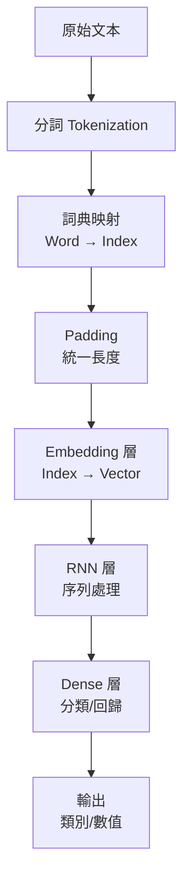

# 第 6.1 章: 序列模型概論 - RNN 原理

本章將深入探討**循環神經網路 (Recurrent Neural Networks, RNN)** 的基礎原理,從序列建模的動機出發,理解 RNN 如何處理時間序列數據,以及其面臨的挑戰。

| 概念 | 中文譯名 | 典型用途 | 優點 | 侷限 |
| :--- | :--- | :--- | :--- | :--- |
| **Fundamentals** | 基礎理論 | 快速掌握 RNN 的核心思想、前向傳播與 Keras 實作。 | 直觀易懂,適合快速建立序列模型。 | 易忽略梯度消失問題與長距離依賴。 |
| **First Principles** | 第一原理 | 從時間反向傳播 (BPTT) 推導,理解梯度消失的數學本質。 | 深入本質,有助於理解 LSTM 的設計動機。 | 理論性強,需要微積分與動態系統背景。 |
| **Body of Knowledge** | 知識體系 | 將 RNN 置於序列建模與深度學習的完整框架中。 | 結構完備,能理解從 HMM 到 Transformer 的演進。 | 內容龐雜,不適合快速入門。 |

---

## 1. Fundamentals (基礎理論)

**循環神經網路 (RNN)** 是專門設計來處理**序列數據**的神經網路,通過內部狀態 (記憶) 捕捉序列中的時間依賴關係。

### 為什麼需要 RNN?

**傳統前饋網路的局限**:
```
多層感知器 (MLP):
輸入 x → 隱藏層 h → 輸出 y

問題:
1. 固定輸入維度: 無法處理變長序列
2. 位置無關: 無法區分 "I love you" 和 "you love I"
3. 無記憶: 無法利用歷史信息
```

**序列數據的特性**:
```
時間序列: 股價、溫度、心跳
文本序列: 句子、段落、文章
語音序列: 音頻波形
視頻序列: 影像幀

共同點:
- 可變長度
- 時間順序重要
- 前後有依賴關係
```

### RNN 的核心思想

**循環 (Recurrence)**: 神經網路在每個時間步重複使用相同的權重。

**數學表示**:
```
在時間步 t:
ht = f(Wh · ht-1 + Wx · xt + b)

其中:
- xt: 當前輸入
- ht-1: 前一時間步的隱藏狀態 (記憶)
- ht: 當前隱藏狀態
- Wh: 狀態轉移權重矩陣
- Wx: 輸入權重矩陣
- b: 偏置
- f: 激活函數 (通常是 tanh)

輸出:
yt = Why · ht + by
```

**展開的時間視圖**:
```
t=0     t=1     t=2     t=3
x0      x1      x2      x3     (輸入序列)
 ↓      ↓       ↓       ↓
h0 →   h1 →    h2 →    h3     (隱藏狀態)
 ↓      ↓       ↓       ↓
y0      y1      y2      y3     (輸出序列)

關鍵: h1 依賴 h0 → h2 依賴 h1 → ... (記憶傳遞)
```

**直觀理解**:
```
RNN 就像一個有記憶的函數:
- 看到 "The cat"  → 記住 "有動物"
- 看到 "sat"     → 結合記憶預測動作
- 看到 "on the" → 等待下一個詞
- 看到 "mat"    → 完整理解句子
```

### 從零實作 RNN (NumPy)

**基礎 RNN Cell**:
```python
import numpy as np

class SimpleRNNCell:
    def __init__(self, input_size, hidden_size):
        # 初始化權重
        self.Wx = np.random.randn(hidden_size, input_size) * 0.01
        self.Wh = np.random.randn(hidden_size, hidden_size) * 0.01
        self.b = np.zeros((hidden_size, 1))

    def forward(self, x, h_prev):
        """
        單個時間步的前向傳播

        Args:
            x: 當前輸入 (input_size, 1)
            h_prev: 前一狀態 (hidden_size, 1)

        Returns:
            h_next: 當前狀態 (hidden_size, 1)
        """
        # h_t = tanh(Wh·h_{t-1} + Wx·x_t + b)
        h_next = np.tanh(np.dot(self.Wh, h_prev) + np.dot(self.Wx, x) + self.b)
        return h_next

# 完整序列處理
def rnn_forward(X, rnn_cell, h0=None):
    """
    處理整個序列

    Args:
        X: 輸入序列 (timesteps, input_size)
        rnn_cell: RNN Cell
        h0: 初始狀態

    Returns:
        hidden_states: 所有隱藏狀態 (timesteps, hidden_size)
    """
    timesteps, input_size = X.shape
    hidden_size = rnn_cell.Wh.shape[0]

    # 初始化狀態
    if h0 is None:
        h = np.zeros((hidden_size, 1))
    else:
        h = h0

    hidden_states = []

    # 逐步處理序列
    for t in range(timesteps):
        x_t = X[t].reshape(-1, 1)  # (input_size, 1)
        h = rnn_cell.forward(x_t, h)
        hidden_states.append(h.flatten())

    return np.array(hidden_states)

# 測試
rnn = SimpleRNNCell(input_size=10, hidden_size=20)
X = np.random.randn(5, 10)  # 5 個時間步,每步 10 維輸入
hidden_states = rnn_forward(X, rnn)
print(f"隱藏狀態序列形狀: {hidden_states.shape}")  # (5, 20)
```

### Keras RNN 實作

**基本用法**:
```python
from tensorflow.keras import layers

# 簡單 RNN 層
rnn_layer = layers.SimpleRNN(
    units=32,                # 隱藏狀態維度
    activation='tanh',       # 激活函數
    return_sequences=False,  # 只返回最後一個狀態
    return_state=False       # 不返回隱藏狀態
)
```

**三種輸出模式**:

**1. Many-to-One (序列到單值)**:
```python
# 應用: 情感分析、文本分類
model = keras.Sequential([
    layers.Embedding(10000, 128, input_length=100),
    layers.SimpleRNN(64),  # return_sequences=False (默認)
    layers.Dense(1, activation='sigmoid')
])

# 輸入: (batch, 100)
# 經過 Embedding: (batch, 100, 128)
# 經過 RNN: (batch, 64)  ← 只有最後一個時間步
# 輸出: (batch, 1)
```

**2. Many-to-Many (序列到序列,同長)**:
```python
# 應用: 詞性標註、命名實體識別
model = keras.Sequential([
    layers.Embedding(10000, 128, input_length=100),
    layers.SimpleRNN(64, return_sequences=True),  # 返回所有時間步
    layers.Dense(num_tags, activation='softmax')
])

# 輸入: (batch, 100)
# 經過 Embedding: (batch, 100, 128)
# 經過 RNN: (batch, 100, 64)  ← 所有時間步
# 輸出: (batch, 100, num_tags)
```

**3. Many-to-Many (序列到序列,異長)**:
```python
# 應用: 機器翻譯、文本摘要
# 使用 Encoder-Decoder 架構 (下一章詳述)
```

**堆疊 RNN**:
```python
# 增加模型容量
model = keras.Sequential([
    layers.Embedding(10000, 128),
    layers.SimpleRNN(64, return_sequences=True),  # 第1層必須返回序列
    layers.SimpleRNN(64, return_sequences=True),  # 第2層
    layers.SimpleRNN(32),                         # 最後一層
    layers.Dense(1, activation='sigmoid')
])
```

### RNN 的應用場景

| 任務 | 輸入 | 輸出 | 架構 | 範例 |
|:---|:---|:---|:---|:---|
| **情感分析** | 評論文本 | 正面/負面 | Many-to-One | IMDB 電影評論 |
| **詞性標註** | 句子 | 詞性序列 | Many-to-Many | Penn Treebank |
| **機器翻譯** | 英文句子 | 中文句子 | Seq2Seq | WMT 數據集 |
| **文本生成** | 種子文本 | 生成文本 | Many-to-Many | 詩歌生成 |
| **語音識別** | 音頻波形 | 文字 | Many-to-Many | LibriSpeech |

---

## 2. First Principles (第一原理)

從動態系統與時間反向傳播的本質深入理解 RNN 的數學原理與挑戰。

### 時間反向傳播 (BPTT)

**問題**: 如何訓練 RNN?

**答案**: Backpropagation Through Time (BPTT) - 將 RNN 展開成前饋網路,然後應用標準反向傳播。

**展開的計算圖**:
```
時間步:   t=0    t=1    t=2
         ↓      ↓      ↓
輸入:    x0     x1     x2
         ↓      ↓      ↓
狀態:    h0  →  h1  →  h2
         ↓      ↓      ↓
輸出:    y0     y1     y2
         ↓      ↓      ↓
損失:    L0     L1     L2

總損失: L = L0 + L1 + L2
```

**BPTT 推導 (簡化版)**:
```
前向傳播:
h0 = 0
h1 = tanh(Wh·h0 + Wx·x1 + b)
h2 = tanh(Wh·h1 + Wx·x2 + b)
y2 = Why·h2 + by
L = loss(y2, target)

反向傳播 (從 t=2 往回):
dL/dh2 = Why^T · dL/dy2

dL/dh1 = (dL/dh2) · (dh2/dh1)
       = (dL/dh2) · Wh^T · (1 - h2²)  ← tanh 導數

dL/dh0 = (dL/dh1) · Wh^T · (1 - h1²)

參數梯度:
dL/dWh = Σ (dL/dht) · ht-1^T
dL/dWx = Σ (dL/dht) · xt^T
```

### 梯度消失問題 (Vanishing Gradient)

**核心問題**: 長序列中,早期時間步的梯度會指數級衰減。

**數學分析**:
```
梯度回傳:
dL/dh0 = (dL/dh2) · (dh2/dh1) · (dh1/dh0)
       = (dL/dh2) · Wh^T·f'(z2) · Wh^T·f'(z1)
       = (dL/dh2) · (Wh^T)² · f'(z2)·f'(z1)

對於 T 個時間步:
dL/dh0 ∝ (Wh^T)^T · ∏ f'(zt)
                     t=1..T

問題:
1. tanh 導數: f'(z) ∈ [0, 1]
   → 連乘 T 次: (0.25)^100 ≈ 6×10^-61 ← 幾乎為 0!

2. 如果 Wh 的最大特徵值 < 1:
   → (Wh^T)^T → 0  (指數衰減)

結果: 早期時間步的梯度消失,無法學習長距離依賴!
```

**視覺化梯度流**:
```
t=100   t=50    t=10    t=0
  ↓      ↓       ↓       ↓
grad  grad    grad    grad
1.0   0.5     0.1     10^-20  ← 幾乎消失

結論: 只能記住最近 10-20 個時間步的信息
```

**梯度爆炸 (Exploding Gradient)**:
```
相反的,如果 Wh 的最大特徵值 > 1:
→ (Wh^T)^T → ∞  (指數增長)

結果: 梯度爆炸,權重更新失控

解決: Gradient Clipping
if ||grad|| > threshold:
    grad = grad * threshold / ||grad||
```

### RNN 的變體

**1. 雙向 RNN (Bidirectional RNN)**:
```
問題: 標準 RNN 只能看到過去,無法看到未來

解決: 同時使用前向和後向 RNN

前向: h→t = f(h→t-1, xt)
後向: h←t = f(h←t+1, xt)
合併: ht = [h→t; h←t]  (拼接)

應用:
- 命名實體識別: "Paris" 是人名還是地名?
  → "I met Paris" vs "I visited Paris"
  → 需要看後文才能確定!
```

**Keras 實作**:
```python
from tensorflow.keras import layers

model = keras.Sequential([
    layers.Embedding(10000, 128, input_length=100),
    layers.Bidirectional(layers.SimpleRNN(64, return_sequences=True)),
    layers.Bidirectional(layers.SimpleRNN(32)),
    layers.Dense(num_classes, activation='softmax')
])

# Bidirectional 將前向和後向的輸出拼接
# 輸出維度 = 2 × units (64 → 128)
```

**2. 深層 RNN (Deep RNN)**:
```python
# 堆疊多層 RNN
model = keras.Sequential([
    layers.Embedding(10000, 128),
    layers.SimpleRNN(128, return_sequences=True),  # 第1層
    layers.Dropout(0.3),
    layers.SimpleRNN(64, return_sequences=True),   # 第2層
    layers.Dropout(0.3),
    layers.SimpleRNN(32),                          # 第3層
    layers.Dense(1, activation='sigmoid')
])

# 注意: 除了最後一層,前面的層都要 return_sequences=True
```

### 完整實戰: IMDB 情感分析

```python
from tensorflow import keras
from tensorflow.keras import layers
from tensorflow.keras.datasets import imdb

# 1. 載入數據
max_features = 10000
maxlen = 500

(X_train, y_train), (X_test, y_test) = imdb.load_data(num_words=max_features)

# 2. Padding (統一序列長度)
from tensorflow.keras.preprocessing import sequence
X_train = sequence.pad_sequences(X_train, maxlen=maxlen)
X_test = sequence.pad_sequences(X_test, maxlen=maxlen)

print(f"訓練集: {X_train.shape}")  # (25000, 500)
print(f"測試集: {X_test.shape}")   # (25000, 500)

# 3. 建立模型
model = keras.Sequential([
    layers.Embedding(max_features, 32),
    layers.SimpleRNN(32),
    layers.Dense(1, activation='sigmoid')
])

model.compile(
    optimizer='rmsprop',
    loss='binary_crossentropy',
    metrics=['accuracy']
)

model.summary()

# 4. 訓練
history = model.fit(
    X_train, y_train,
    epochs=10,
    batch_size=128,
    validation_split=0.2
)

# 5. 評估
test_loss, test_acc = model.evaluate(X_test, y_test)
print(f"\n測試準確率: {test_acc:.4f}")

# 6. 視覺化
import matplotlib.pyplot as plt

plt.figure(figsize=(12, 4))

plt.subplot(1, 2, 1)
plt.plot(history.history['loss'], label='Train Loss')
plt.plot(history.history['val_loss'], label='Val Loss')
plt.xlabel('Epoch')
plt.ylabel('Loss')
plt.legend()
plt.title('Training & Validation Loss')

plt.subplot(1, 2, 2)
plt.plot(history.history['accuracy'], label='Train Acc')
plt.plot(history.history['val_accuracy'], label='Val Acc')
plt.xlabel('Epoch')
plt.ylabel('Accuracy')
plt.legend()
plt.title('Training & Validation Accuracy')

plt.tight_layout()
plt.show()
```

**預期結果**:
```
SimpleRNN 在 IMDB 上:
- 訓練準確率: ~85%
- 測試準確率: ~80%
- 問題: 過擬合 + 梯度消失
- 改進: 使用 LSTM/GRU
```

---

## 3. Body of Knowledge (知識體系)

將 RNN 置於序列建模與深度學習的宏觀框架中。

### 序列建模的演化史


### RNN vs HMM (Hidden Markov Model)

| 特性 | HMM | RNN |
|:---|:---|:---|
| **狀態** | 離散 (有限個) | 連續 (向量) |
| **假設** | 馬可夫性 (只依賴前一狀態) | 可依賴所有歷史 |
| **學習** | EM 算法 | 梯度下降 |
| **表達能力** | 有限 | 強大 |
| **適用場景** | 詞性標註 (傳統) | 文本生成、翻譯 |

### RNN vs Transformer

**為什麼 Transformer 取代了 RNN?**

| 特性 | RNN | Transformer |
|:---|:---|:---|
| **計算** | 序列 (無法平行) | 平行 (高效) |
| **長距離依賴** | 梯度消失,效果差 | 直接連接,效果好 |
| **訓練速度** | 慢 | 快 (10-100x) |
| **記憶體** | O(T) | O(T²) 注意力矩陣 |

**RNN 仍有價值的場景**:
1. **實時處理**: 逐步處理流數據
2. **低資源設備**: 參數量小
3. **短序列任務**: T < 100 時效果相當

### 完整的 NLP 管道 (RNN 時代)



**完整代碼範例**:
```python
import numpy as np
from tensorflow import keras
from tensorflow.keras import layers
from tensorflow.keras.preprocessing.text import Tokenizer
from tensorflow.keras.preprocessing.sequence import pad_sequences

# 1. 原始數據
texts = [
    "I love this movie, it's amazing!",
    "This film is terrible and boring.",
    "Great acting and wonderful story.",
    "Waste of time, don't watch it."
]
labels = [1, 0, 1, 0]  # 1=正面, 0=負面

# 2. 分詞與映射
tokenizer = Tokenizer(num_words=1000)
tokenizer.fit_on_texts(texts)
sequences = tokenizer.texts_to_sequences(texts)

print("原始文本:", texts[0])
print("整數序列:", sequences[0])

# 3. Padding
X = pad_sequences(sequences, maxlen=20, padding='post')
y = np.array(labels)

print(f"Padding 後: {X[0]}")

# 4. 建立完整模型
model = keras.Sequential([
    layers.Embedding(input_dim=1000, output_dim=64, input_length=20),
    layers.SimpleRNN(32),
    layers.Dense(1, activation='sigmoid')
])

# 5. 訓練
model.compile(optimizer='adam', loss='binary_crossentropy', metrics=['accuracy'])
model.fit(X, y, epochs=50, verbose=0)

# 6. 預測新文本
new_texts = ["This is the best movie ever!"]
new_seq = tokenizer.texts_to_sequences(new_texts)
new_X = pad_sequences(new_seq, maxlen=20, padding='post')

prediction = model.predict(new_X)[0, 0]
print(f"\n預測: {prediction:.4f} ({'正面' if prediction > 0.5 else '負面'})")
```

### RNN 的數學性質

**1. 通用逼近性 (Universal Approximation)**:
```
定理: RNN 可以逼近任何可測序列函數

但實務上:
- 梯度消失限制了長距離依賴
- 需要 LSTM/GRU 緩解
```

**2. 圖靈完備性 (Turing Completeness)**:
```
理論: RNN 可以模擬任何圖靈機 (通用計算機)

證明: Siegelmann & Sontag (1995)

意義: RNN 理論上可以執行任何計算!
```

**3. 動態系統視角**:
```
RNN 是離散時間動態系統:
ht = f(ht-1, xt; θ)

性質:
- 狀態轉移: ht-1 → ht
- 輸入驅動: xt 影響轉移
- 參數共享: 所有時間步使用相同 θ

穩定性:
- 如果系統不穩定 → 梯度爆炸
- 如果過於穩定 → 梯度消失
```

---

## 結論與建議

1. **日常溝通與實作**: 優先掌握 **Fundamentals** 中的 **RNN 前向傳播** 與 **Keras SimpleRNN**,理解序列處理的基本概念。

2. **強調方法論與創新**: 從 **First Principles** 出發,深入理解 **BPTT** 與 **梯度消失問題**,這是理解 LSTM 設計動機的關鍵。

3. **構建宏觀視野**: 將 RNN 放入 **Body of Knowledge** 的框架中,可以清晰地看到其在序列建模史中的位置,以及為何被 Transformer 取代。

**核心要點**: RNN 通過循環連接引入記憶機制,能處理序列數據,但受限於梯度消失問題,實務上主要使用 LSTM/GRU 變體。

透過本章的學習,您應當已經掌握了 RNN 的核心原理,並理解其局限性,為下一章 LSTM 的學習打下基礎。

---

## 延伸閱讀 (Further Reading)

### 關鍵論文 (Key Papers)
1. **RNN 基礎**: Rumelhart et al. (1986). *Learning Internal Representations by Error Propagation*. PDP.
2. **BPTT**: Werbos, P. (1990). *Backpropagation Through Time: What It Does and How to Do It*. IEEE.
3. **梯度消失**: Bengio et al. (1994). *Learning Long-Term Dependencies with Gradient Descent is Difficult*. IEEE Transactions.

### 視覺化資源 (Visualization)
- **Understanding LSTM Networks**: http://colah.github.io/posts/2015-08-Understanding-LSTMs/
- **The Unreasonable Effectiveness of RNN**: http://karpathy.github.io/2015/05/21/rnn-effectiveness/

### 實作資源 (Implementation)
- **Keras RNN Tutorial**: https://keras.io/api/layers/recurrent_layers/
- **TensorFlow RNN Guide**: https://www.tensorflow.org/guide/keras/rnn

---

**下一章節**: [6.2 LSTM 與門控機制](./02_LSTM與門控機制.md)
