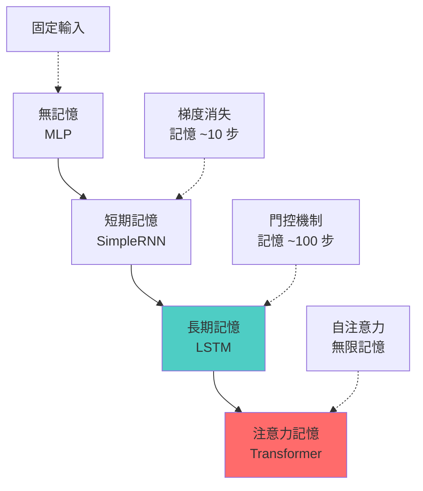

# 第 6.2 章: LSTM 與門控機制

本章將深入探討 **LSTM (Long Short-Term Memory)** 的設計原理,從梯度消失問題的解決方案出發,理解門控機制 (Gate Mechanism) 如何讓神經網路學會"記憶"和"遺忘"。

| 概念 | 中文譯名 | 典型用途 | 優點 | 侷限 |
| :--- | :--- | :--- | :--- | :--- |
| **Fundamentals** | 基礎理論 | 快速掌握 LSTM 的三個門與記憶單元,理解 Keras LSTM 層的使用。 | 直觀易懂,適合快速應用於長序列任務。 | 易忽略門控機制的數學細節。 |
| **First Principles** | 第一原理 | 從梯度流動與記憶單元更新推導,理解 LSTM 如何緩解梯度消失。 | 深入本質,有助於理解變體 (GRU, Peephole) 設計。 | 理論性強,需要微積分與線性代數背景。 |
| **Body of Knowledge** | 知識體系 | 將 LSTM 置於序列模型演化與注意力機制的完整框架中。 | 結構完備,能理解從 LSTM 到 Transformer 的演進。 | 內容龐雜,不適合快速入門。 |

---

## 1. Fundamentals (基礎理論)

**LSTM (Long Short-Term Memory)** 是 1997 年由 Hochreiter 和 Schmidhuber 提出的 RNN 變體,通過引入**門控機制**和**記憶單元**,有效解決了梯度消失問題。

### LSTM 的核心動機

**RNN 的問題回顧**:
```
標準 RNN:
ht = tanh(Wh·ht-1 + Wx·xt + b)

問題:
1. 梯度消失: tanh 導數 ∈ [0,1] → 連乘變小
2. 無選擇性: 所有信息都經過 tanh,無法選擇性記憶
3. 狀態覆蓋: ht 完全覆蓋 ht-1,無法長期保存信息
```

**LSTM 的解決方案**:
```
1. 記憶單元 (Cell State) Ct: 長期記憶,梯度直通
2. 遺忘門 (Forget Gate) ft: 決定丟棄哪些舊記憶
3. 輸入門 (Input Gate) it: 決定添加哪些新信息
4. 輸出門 (Output Gate) ot: 決定輸出哪些信息
```

### LSTM 的四大組件

**架構圖**:
```
        ┌─────────────────────────────┐
        │      Cell State (Ct)        │  ← 長期記憶
        └─────────────────────────────┘
            ↑           ↑          ↑
            │           │          │
       遺忘門 ft    輸入門 it   輸出門 ot
            ↑           ↑          ↑
         ┌──┴───────────┴──────────┴──┐
         │   xt (輸入) + ht-1 (狀態)  │
         └─────────────────────────────┘
```

**數學公式 (完整)**:
```
輸入: xt (當前輸入), ht-1 (前一隱藏狀態), Ct-1 (前一記憶單元)

1. 遺忘門 (Forget Gate):
   ft = σ(Wf·[ht-1, xt] + bf)
   → 輸出 ∈ (0, 1),決定保留多少 Ct-1

2. 輸入門 (Input Gate):
   it = σ(Wi·[ht-1, xt] + bi)
   → 輸出 ∈ (0, 1),決定添加多少新信息

3. 候選記憶 (Candidate Memory):
   C̃t = tanh(Wc·[ht-1, xt] + bc)
   → 新的候選記憶內容

4. 更新記憶單元 (Cell State Update):
   Ct = ft ⊙ Ct-1 + it ⊙ C̃t
   → ⊙ 是逐元素乘法

5. 輸出門 (Output Gate):
   ot = σ(Wo·[ht-1, xt] + bo)
   → 決定輸出多少記憶

6. 隱藏狀態 (Hidden State):
   ht = ot ⊙ tanh(Ct)

其中:
- σ: sigmoid 函數
- ⊙: Hadamard 乘積 (逐元素)
- [ht-1, xt]: 拼接向量
```

**直觀理解 (以閱讀文章為例)**:

```
句子: "The cat, which had been sleeping on the mat, suddenly jumped."

t=1: "The cat"
  - 記住 "有一隻貓"
  - Ct: [cat: 0.9, ...]

t=2-6: "which had been sleeping on the mat"
  - 遺忘門 ft: 保留 "貓" 的記憶 (重要!)
  - 輸入門 it: 添加 "正在睡覺" 的信息
  - Ct: [cat: 0.9, sleeping: 0.7, ...]

t=7: "suddenly jumped"
  - 輸出門 ot: 結合長期記憶 (貓) 和當前輸入 (跳)
  - 輸出: "貓突然跳起來"

關鍵: 即使中間有長串子句,LSTM 仍能記住主語 "cat"!
```

### 門控的作用機制

**遺忘門 (Forget Gate)**:
```
ft = σ(Wf·[ht-1, xt] + bf) ∈ (0, 1)

ft ≈ 1: 完全保留舊記憶
ft ≈ 0: 完全遺忘舊記憶
ft ≈ 0.5: 部分遺忘

範例:
句子: "Alice is a teacher. She lives in Paris."
      ↑                    ↑
  記住 "Alice"          "She" 指的是 Alice

遺忘門: 在看到 "She" 時,保持 "Alice" 的記憶 (ft ≈ 1)
```

**輸入門 (Input Gate)**:
```
it = σ(Wi·[ht-1, xt] + bi) ∈ (0, 1)
C̃t = tanh(Wc·[ht-1, xt] + bc) ∈ (-1, 1)

更新: Ct = ft⊙Ct-1 + it⊙C̃t

it ≈ 1: 大量添加新信息
it ≈ 0: 忽略新信息

協同工作:
- ft=0, it=1: 清空舊記憶,寫入新記憶
- ft=1, it=0: 保持舊記憶,不添加新信息
- ft=1, it=1: 合併新舊記憶
- ft=0, it=0: 清空記憶 (罕見)
```

**輸出門 (Output Gate)**:
```
ot = σ(Wo·[ht-1, xt] + bo) ∈ (0, 1)
ht = ot ⊙ tanh(Ct)

ot 控制當前記憶有多少需要暴露給下一層或輸出

範例:
問題: "Who is the president?"
記憶 Ct: [president: Biden, year: 2024, country: USA, ...]

輸出門: 只輸出 "president: Biden",過濾其他信息
```

### Keras LSTM 實作

**基本用法**:
```python
from tensorflow.keras import layers

# LSTM 層
lstm_layer = layers.LSTM(
    units=128,                # 隱藏狀態/記憶單元維度
    activation='tanh',        # 候選記憶的激活函數
    recurrent_activation='sigmoid',  # 門的激活函數
    return_sequences=False,   # 是否返回所有時間步
    return_state=False,       # 是否返回最終狀態
    dropout=0.0,              # 輸入 dropout
    recurrent_dropout=0.0     # 循環 dropout
)
```

**完整範例: IMDB 情感分析**:
```python
from tensorflow import keras
from tensorflow.keras import layers
from tensorflow.keras.datasets import imdb
from tensorflow.keras.preprocessing import sequence

# 1. 載入數據
max_features = 10000
maxlen = 500

(X_train, y_train), (X_test, y_test) = imdb.load_data(num_words=max_features)
X_train = sequence.pad_sequences(X_train, maxlen=maxlen)
X_test = sequence.pad_sequences(X_test, maxlen=maxlen)

# 2. 建立 LSTM 模型
model = keras.Sequential([
    layers.Embedding(max_features, 128),
    layers.LSTM(64, dropout=0.2, recurrent_dropout=0.2),
    layers.Dense(1, activation='sigmoid')
])

model.compile(
    optimizer='adam',
    loss='binary_crossentropy',
    metrics=['accuracy']
)

model.summary()

# 3. 訓練
history = model.fit(
    X_train, y_train,
    batch_size=128,
    epochs=10,
    validation_split=0.2
)

# 4. 評估
test_loss, test_acc = model.evaluate(X_test, y_test, verbose=0)
print(f"\nLSTM 測試準確率: {test_acc:.4f}")

# 預期: ~88% (比 SimpleRNN 的 ~80% 好很多!)
```

**堆疊 LSTM**:
```python
model = keras.Sequential([
    layers.Embedding(10000, 128),
    layers.LSTM(128, return_sequences=True, dropout=0.2),  # 第1層
    layers.LSTM(64, return_sequences=True, dropout=0.2),   # 第2層
    layers.LSTM(32, dropout=0.2),                          # 第3層
    layers.Dense(1, activation='sigmoid')
])

# 注意: 前面的 LSTM 層必須 return_sequences=True
```

**雙向 LSTM**:
```python
model = keras.Sequential([
    layers.Embedding(10000, 128),
    layers.Bidirectional(layers.LSTM(64)),  # 前向 + 後向
    layers.Dense(1, activation='sigmoid')
])

# 輸出維度 = 2 × 64 = 128 (前向 64 + 後向 64)
```

---

## 2. First Principles (第一原理)

從梯度流動與記憶單元的本質深入理解 LSTM 的數學設計。

### 為什麼 LSTM 能緩解梯度消失?

**關鍵: Cell State 的加法更新**

標準 RNN:
```
ht = tanh(Wh·ht-1 + Wx·xt + b)
→ 每步都經過非線性變換 tanh
→ 梯度: dht/dht-1 = Wh^T · (1-ht²)
→ 連乘 T 次 → 指數衰減
```

LSTM:
```
Ct = ft ⊙ Ct-1 + it ⊙ C̃t
→ 加法操作! (不是乘法)
→ 梯度: dCt/dCt-1 = ft
→ 如果 ft ≈ 1,梯度可以無損傳播!

dC3/dC0 = f3 · f2 · f1
        ≈ 1 · 1 · 1 = 1  ← 梯度不消失!

關鍵洞察:
加法 (Ct = Ct-1 + ...) 允許梯度直通 (類似 ResNet 的 skip connection)
```

**完整梯度推導**:
```
損失 L 對 Ct 的梯度:

dL/dCt = dL/dht · dht/dCt + dL/dCt+1 · dCt+1/dCt
       = dL/dht · ot⊙(1-tanh²(Ct)) + dL/dCt+1 · ft+1

遞推:
dL/dCt = (向下游的梯度) + (從未來的梯度) · ft+1

關鍵: ft+1 ≈ 1 時,梯度從未來幾乎無損傳回!
```

### 門的學習機制

**門是如何學會何時開關的?**

**1. 遺忘門學習範例**:
```
訓練數據:
"John is a doctor. He likes tennis. Mary is a lawyer. She enjoys reading."

任務: 預測 "She" 指代誰?

LSTM 學習到:
- 看到 "Mary" → 記住 (Ct 更新)
- 看到 "She" → 檢索記憶,預測 "She" = "Mary"
- 看到句號 "." → 遺忘門 ft ≈ 0,清空主語記憶

梯度反饋:
- 如果預測對: 強化這個遺忘/記憶模式
- 如果預測錯: 調整門的權重 Wf
```

**2. 輸入門學習範例**:
```
句子: "The movie was not good"

標準 RNN 可能:
- 看到 "good" → 預測正面情感 ✗

LSTM 學習到:
- 看到 "not" → 輸入門 it ≈ 0 (不要被 "good" 誤導)
- 或者記住 "not" 的否定信息
- 最終: 預測負面情感 ✓
```

**3. 輸出門學習範例**:
```
任務: 詞性標註

句子: "bank" (銀行/河岸?)

LSTM:
- 記憶 Ct: 包含前文所有信息
- 輸出門 ot: 選擇性輸出相關信息
  - 如果前文是 "money" → 輸出 "金融" 相關信息
  - 如果前文是 "river" → 輸出 "地理" 相關信息
```

### LSTM Cell 的完整計算流程

**逐步計算** (假設 dim=3):
```python
import numpy as np

def sigmoid(x):
    return 1 / (1 + np.exp(-x))

def lstm_cell_forward(xt, ht_prev, Ct_prev, parameters):
    """
    LSTM Cell 前向傳播

    Args:
        xt: 當前輸入 (n_x, 1)
        ht_prev: 前一隱藏狀態 (n_h, 1)
        Ct_prev: 前一記憶單元 (n_h, 1)
        parameters: 權重字典

    Returns:
        ht: 當前隱藏狀態
        Ct: 當前記憶單元
    """
    # 提取參數
    Wf, Wi, Wc, Wo = parameters['Wf'], parameters['Wi'], parameters['Wc'], parameters['Wo']
    bf, bi, bc, bo = parameters['bf'], parameters['bi'], parameters['bc'], parameters['bo']

    # 拼接 [ht-1, xt]
    concat = np.vstack([ht_prev, xt])

    # 1. 遺忘門
    ft = sigmoid(np.dot(Wf, concat) + bf)

    # 2. 輸入門
    it = sigmoid(np.dot(Wi, concat) + bi)

    # 3. 候選記憶
    Ct_tilde = np.tanh(np.dot(Wc, concat) + bc)

    # 4. 更新記憶單元
    Ct = ft * Ct_prev + it * Ct_tilde

    # 5. 輸出門
    ot = sigmoid(np.dot(Wo, concat) + bo)

    # 6. 隱藏狀態
    ht = ot * np.tanh(Ct)

    # 緩存用於反向傳播
    cache = (xt, ht_prev, Ct_prev, ft, it, Ct_tilde, ot, Ct, concat)

    return ht, Ct, cache

# 測試
n_x, n_h = 10, 20  # 輸入維度 10,隱藏維度 20

# 初始化參數
parameters = {
    'Wf': np.random.randn(n_h, n_h + n_x) * 0.01,
    'Wi': np.random.randn(n_h, n_h + n_x) * 0.01,
    'Wc': np.random.randn(n_h, n_h + n_x) * 0.01,
    'Wo': np.random.randn(n_h, n_h + n_x) * 0.01,
    'bf': np.zeros((n_h, 1)),
    'bi': np.zeros((n_h, 1)),
    'bc': np.zeros((n_h, 1)),
    'bo': np.zeros((n_h, 1))
}

# 前向傳播
xt = np.random.randn(n_x, 1)
ht_prev = np.random.randn(n_h, 1)
Ct_prev = np.random.randn(n_h, 1)

ht, Ct, cache = lstm_cell_forward(xt, ht_prev, Ct_prev, parameters)

print(f"隱藏狀態 ht: {ht.shape}")  # (20, 1)
print(f"記憶單元 Ct: {Ct.shape}")  # (20, 1)
print(f"遺忘門均值: {cache[3].mean():.4f}")
print(f"輸入門均值: {cache[4].mean():.4f}")
```

### GRU (Gated Recurrent Unit)

**動機**: LSTM 有 3 個門,參數多,訓練慢。能否簡化?

**GRU 設計** (Cho et al. 2014):
```
只用 2 個門:
1. 重置門 (Reset Gate) rt: 決定忽略多少過去信息
2. 更新門 (Update Gate) zt: 決定保留多少舊狀態

公式:
rt = σ(Wr·[ht-1, xt] + br)
zt = σ(Wz·[ht-1, xt] + bz)
h̃t = tanh(Wh·[rt⊙ht-1, xt] + bh)
ht = (1-zt)⊙ht-1 + zt⊙h̃t

簡化:
- 沒有單獨的記憶單元 Ct (合併到 ht)
- 遺忘門和輸入門合併為更新門 (1-zt 和 zt)
```

**LSTM vs GRU**:
| 特性 | LSTM | GRU |
|:---|:---|:---|
| **門數量** | 3 個 | 2 個 |
| **參數量** | 多 (~4x) | 少 (~3x) |
| **訓練速度** | 慢 | 快 |
| **性能** | 略好 (大數據) | 略差但接近 |
| **適用場景** | 長序列 | 中短序列 |

**Keras GRU 實作**:
```python
model = keras.Sequential([
    layers.Embedding(10000, 128),
    layers.GRU(64, dropout=0.2),  # 使用 GRU 替代 LSTM
    layers.Dense(1, activation='sigmoid')
])

# 參數量比 LSTM 少 ~25%,訓練快 ~20%
```

---

## 3. Body of Knowledge (知識體系)

將 LSTM 置於序列建模演化與記憶機制的宏觀框架中。

### 記憶機制的演化



### LSTM 的里程碑應用

**1. 機器翻譯 (2014)**:
```
Google Neural Machine Translation (GNMT)
- 8 層堆疊 LSTM
- Encoder-Decoder 架構
- BLEU 分數超越傳統統計方法

架構:
英文句子 → Encoder LSTM → 語義向量 → Decoder LSTM → 中文句子
```

**2. 語音識別 (2015)**:
```
DeepSpeech, Listen-Attend-Spell
- 雙向 LSTM + CTC Loss
- 詞錯誤率 (WER) 大幅降低

優勢: 捕捉語音的時序依賴
```

**3. 圖像標註 (2015)**:
```
Show and Tell (Google)
- CNN 提取圖像特徵
- LSTM 生成描述文本

範例:
圖像 (貓坐在墊子上) → LSTM → "A cat sitting on a mat"
```

**4. 文本生成 (2015)**:
```
Char-RNN (Karpathy)
- 字符級 LSTM
- 生成莎士比亞風格文本、程式碼

應用: 詩歌生成、代碼自動補全
```

### LSTM 變體

**1. Peephole LSTM**:
```
改進: 門可以"偷看" Cell State

ft = σ(Wf·[Ct-1, ht-1, xt] + bf)  ← 加入 Ct-1
it = σ(Wi·[Ct-1, ht-1, xt] + bi)
ot = σ(Wo·[Ct, ht-1, xt] + bo)    ← 使用當前 Ct

優勢: 門的決策基於更多信息
劣勢: 參數更多
```

**2. Coupled LSTM**:
```
改進: 遺忘門和輸入門耦合

ft = σ(Wf·[ht-1, xt] + bf)
it = 1 - ft  ← 直接耦合!

Ct = ft⊙Ct-1 + (1-ft)⊙C̃t

優勢: 參數少,防止記憶丟失
```

**3. Depth Gated RNN**:
```
改進: 加入深度門 (控制垂直信息流)

適用: 極深的堆疊 RNN (>10 層)
```

### 實務優化技巧

**1. 序列長度處理**:
```python
# 問題: 不同長度的序列如何批次處理?

# 解決 1: Padding (常用)
from tensorflow.keras.preprocessing.sequence import pad_sequences

sequences = [[1, 2], [3, 4, 5, 6], [7]]
padded = pad_sequences(sequences, maxlen=5, padding='post', value=0)
# [[1, 2, 0, 0, 0],
#  [3, 4, 5, 6, 0],
#  [7, 0, 0, 0, 0]]

# 解決 2: Masking (忽略 padding 位置)
model = keras.Sequential([
    layers.Embedding(10000, 128, mask_zero=True),  # 0 會被遮蔽
    layers.LSTM(64),
    layers.Dense(1, activation='sigmoid')
])
```

**2. 梯度裁剪**:
```python
# 防止梯度爆炸
optimizer = keras.optimizers.Adam(clipnorm=1.0)  # 梯度範數裁剪

# 或
optimizer = keras.optimizers.Adam(clipvalue=0.5)  # 梯度值裁剪
```

**3. 學習率調度**:
```python
from tensorflow.keras.callbacks import ReduceLROnPlateau

# 驗證損失不下降時降低學習率
reduce_lr = ReduceLROnPlateau(
    monitor='val_loss',
    factor=0.5,
    patience=5,
    min_lr=1e-7
)

model.fit(X_train, y_train, callbacks=[reduce_lr])
```

**4. 正則化**:
```python
# Dropout
model.add(layers.LSTM(64, dropout=0.2, recurrent_dropout=0.2))

# L2 正則化
from tensorflow.keras import regularizers
model.add(layers.LSTM(64, kernel_regularizer=regularizers.l2(0.01)))

# Batch Normalization (注意: RNN 中較少用)
model.add(layers.BatchNormalization())
```

### 完整專案: 文本生成

```python
import numpy as np
from tensorflow import keras
from tensorflow.keras import layers

# 1. 準備數據
text = """
To be, or not to be, that is the question:
Whether 'tis nobler in the mind to suffer
The slings and arrows of outrageous fortune,
Or to take arms against a sea of troubles...
"""

# 字符集
chars = sorted(set(text))
char_to_idx = {c: i for i, c in enumerate(chars)}
idx_to_char = {i: c for i, c in enumerate(chars)}

vocab_size = len(chars)
print(f"詞彙量: {vocab_size}")

# 2. 創建訓練數據
seq_length = 40
sequences = []
next_chars = []

for i in range(len(text) - seq_length):
    sequences.append(text[i:i+seq_length])
    next_chars.append(text[i+seq_length])

# 向量化
X = np.zeros((len(sequences), seq_length, vocab_size), dtype=np.bool_)
y = np.zeros((len(sequences), vocab_size), dtype=np.bool_)

for i, seq in enumerate(sequences):
    for t, char in enumerate(seq):
        X[i, t, char_to_idx[char]] = 1
    y[i, char_to_idx[next_chars[i]]] = 1

print(f"訓練數據: {X.shape}")  # (n_sequences, 40, vocab_size)

# 3. 建立模型
model = keras.Sequential([
    layers.LSTM(128, input_shape=(seq_length, vocab_size)),
    layers.Dense(vocab_size, activation='softmax')
])

model.compile(optimizer='adam', loss='categorical_crossentropy')

# 4. 訓練
model.fit(X, y, batch_size=128, epochs=20)

# 5. 文本生成
def generate_text(model, seed_text, length=100, temperature=1.0):
    """
    生成文本

    Args:
        model: 訓練好的 LSTM 模型
        seed_text: 種子文本
        length: 生成長度
        temperature: 溫度參數 (控制隨機性)
    """
    generated = seed_text

    for _ in range(length):
        # 準備輸入
        x = np.zeros((1, seq_length, vocab_size))
        for t, char in enumerate(seed_text[-seq_length:]):
            x[0, t, char_to_idx[char]] = 1

        # 預測下一個字符
        preds = model.predict(x, verbose=0)[0]

        # 溫度採樣
        preds = np.log(preds + 1e-8) / temperature
        preds = np.exp(preds) / np.sum(np.exp(preds))

        next_idx = np.random.choice(len(preds), p=preds)
        next_char = idx_to_char[next_idx]

        # 添加到生成文本
        generated += next_char
        seed_text += next_char

    return generated

# 生成文本
seed = "To be, or not to be"
generated = generate_text(model, seed, length=200, temperature=0.5)
print(generated)
```

---

## 結論與建議

1. **日常溝通與實作**: 優先掌握 **Fundamentals** 中的 **LSTM 三個門** 與 **Keras LSTM 層**,這是處理序列數據的標準工具。

2. **強調方法論與創新**: 從 **First Principles** 出發,深入理解 **Cell State 的加法更新** 如何緩解梯度消失,有助於您設計新的門控機制。

3. **構建宏觀視野**: 將 LSTM 放入 **Body of Knowledge** 的框架中,可以清晰地看到其在序列建模史中的關鍵地位,以及為何在某些場景仍優於 Transformer。

**核心要點**: LSTM 通過門控機制實現選擇性記憶與遺忘,有效緩解梯度消失問題,成為 2010-2018 年間 NLP 的主流模型。

透過本章的學習,您應當已經掌握了 LSTM 的設計原理與實作技巧,並能從數學角度深入理解其優勢與局限。

---

## 延伸閱讀 (Further Reading)

### 關鍵論文 (Key Papers)
1. **LSTM 原始論文**: Hochreiter, S. & Schmidhuber, J. (1997). *Long Short-Term Memory*. Neural Computation.
2. **GRU**: Cho et al. (2014). *Learning Phrase Representations using RNN Encoder-Decoder*. EMNLP 2014.
3. **LSTM 應用**: Sutskever et al. (2014). *Sequence to Sequence Learning with Neural Networks*. NIPS.

### 視覺化資源 (Visualization)
- **Understanding LSTM Networks**: http://colah.github.io/posts/2015-08-Understanding-LSTMs/
- **LSTM Diagrams**: https://github.com/llSourcell/LSTM_Networks

### 實作資源 (Implementation)
- **Keras LSTM Guide**: https://keras.io/api/layers/recurrent_layers/lstm/
- **Char-RNN**: https://github.com/karpathy/char-rnn
- **Text Generation Tutorial**: https://www.tensorflow.org/text/tutorials/text_generation

---

**下一章節**: [6.3 Seq2Seq 架構與應用](./03_Seq2Seq架構與應用.md)
