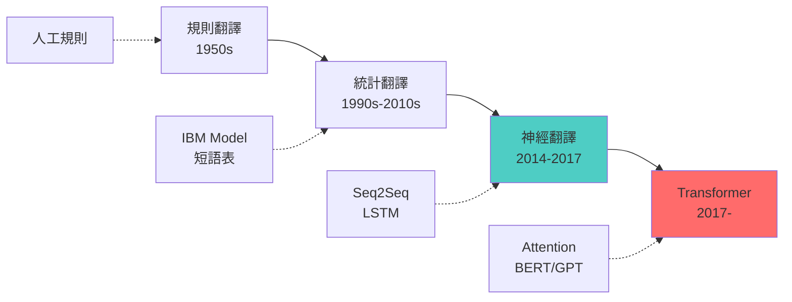

# 第 6.3 章: Seq2Seq 架構與應用

本章將深入探討 **Sequence-to-Sequence (Seq2Seq)** 架構,這一革命性的框架為機器翻譯、文本摘要等任務帶來了突破。從 Encoder-Decoder 的核心思想出發,理解如何將可變長度的輸入序列映射到可變長度的輸出序列。

| 概念 | 中文譯名 | 典型用途 | 優點 | 侷限 |
| :--- | :--- | :--- | :--- | :--- |
| **Fundamentals** | 基礎理論 | 快速掌握 Encoder-Decoder 架構,理解機器翻譯的基本流程。 | 直觀易懂,適合快速建立翻譯或摘要模型。 | 易忽略 Attention 機制的重要性。 |
| **First Principles** | 第一原理 | 從信息瓶頸與注意力機制推導,理解 Seq2Seq 的數學本質。 | 深入本質,有助於理解 Transformer 的設計動機。 | 理論性強,需要信息論背景。 |
| **Body of Knowledge** | 知識體系 | 將 Seq2Seq 置於序列轉換任務的完整框架中。 | 結構完備,能理解從統計翻譯到神經翻譯的演進。 | 內容龐雜,不適合快速入門。 |

---

## 1. Fundamentals (基礎理論)

**Sequence-to-Sequence (Seq2Seq)** 模型是用於將一個序列轉換為另一個序列的神經網路架構,由 Google 於 2014 年提出。

### Seq2Seq 的核心架構

**Encoder-Decoder 框架**:
```
輸入序列 → [Encoder] → 上下文向量 → [Decoder] → 輸出序列

範例 (英中翻譯):
"How are you" → [Encoder LSTM] → c (固定長度向量)
                                  ↓
                           [Decoder LSTM] → "你好嗎"
```

**兩大組件**:

**1. Encoder (編碼器)**:
```
任務: 將可變長度輸入序列編碼為固定長度的上下文向量

x1, x2, ..., xT (輸入序列)
    ↓
LSTM Encoder
    ↓
hT (最後一個隱藏狀態) = 上下文向量 c

c 包含了整個輸入序列的語義信息
```

**2. Decoder (解碼器)**:
```
任務: 從上下文向量生成輸出序列

初始化: h0 = c (用 Encoder 的最終狀態初始化)

自回歸生成:
y1 = f(h0, <START>)
y2 = f(h1, y1)
y3 = f(h2, y2)
...
直到生成 <END> token

關鍵: 每步的輸入是前一步的輸出 (自回歸)
```

**數學表示**:
```
Encoder:
ht^enc = LSTM_enc(xt, ht-1^enc)
c = hT^enc  (上下文向量)

Decoder:
h0^dec = c
ht^dec = LSTM_dec(yt-1, ht-1^dec)
yt = softmax(Wy · ht^dec + by)
```

### Keras 基礎實作

**簡化版 Seq2Seq**:
```python
from tensorflow import keras
from tensorflow.keras import layers

# 假設參數
vocab_size = 10000
embedding_dim = 256
lstm_units = 512
max_encoder_length = 50
max_decoder_length = 50

# Encoder
encoder_inputs = layers.Input(shape=(max_encoder_length,))
encoder_embedding = layers.Embedding(vocab_size, embedding_dim)(encoder_inputs)
encoder_lstm = layers.LSTM(lstm_units, return_state=True)
encoder_outputs, state_h, state_c = encoder_lstm(encoder_embedding)
encoder_states = [state_h, state_c]  # 保存最終狀態

# Decoder
decoder_inputs = layers.Input(shape=(max_decoder_length,))
decoder_embedding = layers.Embedding(vocab_size, embedding_dim)(decoder_inputs)
decoder_lstm = layers.LSTM(lstm_units, return_sequences=True, return_state=True)
decoder_outputs, _, _ = decoder_lstm(
    decoder_embedding,
    initial_state=encoder_states  # 使用 Encoder 的最終狀態初始化
)
decoder_dense = layers.Dense(vocab_size, activation='softmax')
decoder_outputs = decoder_dense(decoder_outputs)

# 完整模型
model = keras.Model([encoder_inputs, decoder_inputs], decoder_outputs)

model.compile(optimizer='adam', loss='sparse_categorical_crossentropy', metrics=['accuracy'])
```

**訓練數據格式**:
```
輸入句子: "How are you"
目標句子: "你好嗎"

Encoder 輸入: [How, are, you]          → 整數序列
Decoder 輸入: [<START>, 你, 好, 嗎]    → 整數序列 (shifted)
Decoder 目標: [你, 好, 嗎, <END>]      → 整數序列

Teacher Forcing:
- 訓練時 Decoder 使用真實目標作為輸入 (而非自己的預測)
- 加速訓練,穩定收斂
```

### Seq2Seq 的應用場景

| 任務 | 輸入 | 輸出 | 難度 | 範例數據集 |
|:---|:---|:---|:---|:---|
| **機器翻譯** | 源語言句子 | 目標語言句子 | ⭐⭐⭐⭐ | WMT, OPUS |
| **文本摘要** | 長文章 | 摘要 | ⭐⭐⭐⭐⭐ | CNN/DailyMail |
| **對話系統** | 用戶輸入 | 系統回覆 | ⭐⭐⭐⭐⭐ | Cornell Movie |
| **代碼生成** | 自然語言描述 | 程式碼 | ⭐⭐⭐⭐⭐ | CodeSearchNet |
| **語法糾錯** | 錯誤句子 | 正確句子 | ⭐⭐⭐ | Lang-8 |

---

## 2. First Principles (第一原理)

從信息論與注意力機制的本質深入理解 Seq2Seq 的設計與改進。

### 信息瓶頸問題 (Information Bottleneck)

**核心問題**: 固定長度的上下文向量 c 是瓶頸。

**數學分析**:
```
Encoder 將 T 個詞的信息壓縮到 c (維度 d):
I(x1, x2, ..., xT) → c ∈ ℝ^d

信息損失:
- 長句子 (T=100) 的信息量 > 短句子 (T=10)
- 但都壓縮到相同維度 d 的向量
- 必然有信息丟失!

實證觀察 (Sutskever et al. 2014):
- 短句 (< 20 詞): BLEU 35+
- 長句 (> 50 詞): BLEU 10-  ← 急劇下降!
```

**視覺化瓶頸**:
```
輸入長度 vs BLEU 分數:

BLEU
 40│
   │  •
 30│    •
   │      •
 20│         •
   │           •
 10│              •••
  0└──────────────────
    10  20  30  40  50  60  (句子長度)

結論: 標準 Seq2Seq 無法處理長句!
```

### Attention 機制的引入

**動機**: 不要只用最後一個狀態,而是讓 Decoder 看到所有 Encoder 狀態。

**Attention 公式**:
```
在 Decoder 的每個時間步 t:

1. 計算注意力分數:
   eti = score(ht^dec, hi^enc)  (i = 1..T)

   常見 score 函數:
   - 點積: ht^dec · hi^enc
   - 加法: v^T · tanh(Wa·ht^dec + Ua·hi^enc)
   - 縮放點積: (ht^dec · hi^enc) / sqrt(d)

2. 計算注意力權重 (softmax 歸一化):
   αti = exp(eti) / Σ exp(etj)
                    j=1..T

3. 計算上下文向量 (加權和):
   ct = Σ αti · hi^enc
       i=1..T

4. 結合上下文生成輸出:
   ht^dec = LSTM(yt-1, ht-1^dec)
   output = f([ht^dec; ct])  # 拼接
```

**直觀理解 (翻譯範例)**:
```
英文: "The cat sat on the mat"
中文: "貓 坐在 墊子 上"

翻譯 "貓" 時:
- Attention 權重: α = [0.1, 0.8, 0.05, 0.02, 0.02, 0.01]
                      ↑   ↑
                    The  cat  ← 主要關注 "cat"!

翻譯 "坐在" 時:
- Attention 權重: α = [0.05, 0.1, 0.7, 0.1, 0.03, 0.02]
                              ↑   ↑
                            sat  on  ← 主要關注 "sat" 和 "on"!

關鍵: Decoder 可以動態選擇關注 Encoder 的哪些部分!
```

**Attention 的優勢**:
```
1. 緩解信息瓶頸: 可訪問所有 Encoder 狀態
2. 長句子性能提升: BLEU 分數提高 5-10 分
3. 可解釋性: 可視化注意力權重,理解對齊關係
4. 梯度流動: 梯度可直接從 Decoder 傳回任意 Encoder 位置
```

### Beam Search 解碼

**問題**: Greedy Decoding (貪心解碼) 不是最優。

**Greedy Decoding**:
```
每步選擇機率最高的詞:
t=1: argmax P(y1 | x) = "The"
t=2: argmax P(y2 | y1, x) = "cat"
t=3: argmax P(y3 | y1, y2, x) = "sat"

問題: 局部最優 ≠ 全局最優

反例:
P("The cat sat") = 0.3
P("A cat sat") = 0.5  ← 全局更好

但 Greedy 選了 "The" (P=0.6) > "A" (P=0.4)
→ 錯過了更好的整體解!
```

**Beam Search**:
```
保留 top-K 個候選序列 (K = beam width)

t=1: 保留 K=3 個最可能的首詞
  候選: ["The", "A", "This"]

t=2: 對每個候選擴展,保留總分最高的 K=3 個
  "The cat"  (log P = -0.5)
  "The dog"  (log P = -0.7)
  "A cat"    (log P = -0.4)  ← 最好!

t=3: 繼續擴展...

最終: 選擇總分最高的序列
```

**Python 實作 (概念)**:
```python
def beam_search_decoder(model, input_seq, beam_width=3, max_length=50):
    """
    Beam Search 解碼

    Args:
        model: Seq2Seq 模型
        input_seq: 輸入序列
        beam_width: Beam 寬度
        max_length: 最大生成長度

    Returns:
        best_sequence: 最佳輸出序列
    """
    # 初始化 beam
    sequences = [[[], 0.0]]  # [序列, 累積分數]

    for _ in range(max_length):
        all_candidates = []

        # 對每個候選序列擴展
        for seq, score in sequences:
            # 預測下一個詞的機率
            preds = model.predict_next(input_seq, seq)

            # 保留 top-K
            top_k_indices = np.argsort(preds)[-beam_width:]

            for idx in top_k_indices:
                candidate = [seq + [idx], score + np.log(preds[idx])]
                all_candidates.append(candidate)

        # 排序並保留 top-K
        ordered = sorted(all_candidates, key=lambda x: x[1], reverse=True)
        sequences = ordered[:beam_width]

        # 檢查是否所有序列都結束
        if all(seq[-1] == END_TOKEN for seq, _ in sequences):
            break

    # 返回分數最高的序列
    best_sequence = sequences[0][0]
    return best_sequence
```

**Beam Width 的影響**:
```
K=1: Greedy Search (最快,質量最差)
K=5: 平衡 (常用)
K=10: 質量提升有限,速度慢 2x
K=50: 過度搜索,可能產生通用但無聊的句子

實務建議: K=3-10
```

### Seq2Seq 的訓練技巧

**1. Teacher Forcing**:
```
訓練時: 使用真實目標作為 Decoder 輸入
測試時: 使用 Decoder 自己的預測

訓練 (Teacher Forcing):
Target: "你 好 嗎"
Decoder 輸入: [<START>, 你, 好, 嗎]  ← 真實目標
Decoder 輸出: [你, 好, 嗎, <END>]

優點: 訓練快速穩定
缺點: 訓練與測試不一致 (Exposure Bias)

改進: Scheduled Sampling
- 開始訓練: 100% Teacher Forcing
- 逐漸減少: 80% → 60% → 40%
- 後期訓練: 讓模型更多地使用自己的預測
```

**2. 反向輸入序列**:
```
發現 (Sutskever et al. 2014): 反向輸入提升性能!

標準:
輸入: "I love you" → Encoder
輸出: "我 愛 你"

反向:
輸入: "you love I" → Encoder  ← 反向!
輸出: "我 愛 你"

原因:
- 減少源端和目標端的"距離"
- "I" 離 "我" 更近,更容易學習對齊

實務: BLEU +1-2 分
```

**3. 雙向 Encoder**:
```python
# 使用雙向 LSTM 作為 Encoder
encoder_lstm = layers.Bidirectional(
    layers.LSTM(lstm_units, return_state=True)
)

# 注意: 雙向 LSTM 返回 [前向 h, 前向 c, 後向 h, 後向 c]
outputs, fh, fc, bh, bc = encoder_lstm(encoder_embedding)

# 合併前向和後向狀態
state_h = layers.Concatenate()([fh, bh])
state_c = layers.Concatenate()([fc, bc])
encoder_states = [state_h, state_c]
```

### 完整實作: 英中翻譯

```python
import numpy as np
from tensorflow import keras
from tensorflow.keras import layers

# ========== 數據準備 ==========
# 假設數據格式
input_texts = ["How are you", "I love you", "Good morning"]
target_texts = ["你好嗎", "我愛你", "早安"]

# 特殊 token
START_TOKEN = "<START>"
END_TOKEN = "<END>"

# 添加特殊 token 到目標
target_texts_with_tokens = [f"{START_TOKEN} {text} {END_TOKEN}" for text in target_texts]

# ========== 向量化 ==========
from tensorflow.keras.preprocessing.text import Tokenizer
from tensorflow.keras.preprocessing.sequence import pad_sequences

# 源語言 tokenizer
src_tokenizer = Tokenizer()
src_tokenizer.fit_on_texts(input_texts)
src_vocab_size = len(src_tokenizer.word_index) + 1

# 目標語言 tokenizer
tgt_tokenizer = Tokenizer(filters='')  # 不過濾特殊字符
tgt_tokenizer.fit_on_texts(target_texts_with_tokens)
tgt_vocab_size = len(tgt_tokenizer.word_index) + 1

# 轉換為序列
encoder_input_data = pad_sequences(
    src_tokenizer.texts_to_sequences(input_texts),
    maxlen=10, padding='post'
)

decoder_input_data = pad_sequences(
    tgt_tokenizer.texts_to_sequences(
        [f"{START_TOKEN} {text}" for text in target_texts]
    ),
    maxlen=10, padding='post'
)

decoder_target_data = pad_sequences(
    tgt_tokenizer.texts_to_sequences(
        [f"{text} {END_TOKEN}" for text in target_texts]
    ),
    maxlen=10, padding='post'
)

print(f"源詞彙量: {src_vocab_size}")
print(f"目標詞彙量: {tgt_vocab_size}")

# ========== 建立模型 ==========
latent_dim = 256

# Encoder
encoder_inputs = layers.Input(shape=(None,))
encoder_embedding = layers.Embedding(src_vocab_size, latent_dim)(encoder_inputs)
encoder_lstm = layers.LSTM(latent_dim, return_state=True)
encoder_outputs, state_h, state_c = encoder_lstm(encoder_embedding)
encoder_states = [state_h, state_c]

# Decoder
decoder_inputs = layers.Input(shape=(None,))
decoder_embedding = layers.Embedding(tgt_vocab_size, latent_dim)(decoder_inputs)
decoder_lstm = layers.LSTM(latent_dim, return_sequences=True, return_state=True)
decoder_outputs, _, _ = decoder_lstm(decoder_embedding, initial_state=encoder_states)
decoder_dense = layers.Dense(tgt_vocab_size, activation='softmax')
decoder_outputs = decoder_dense(decoder_outputs)

# 訓練模型
model = keras.Model([encoder_inputs, decoder_inputs], decoder_outputs)
model.compile(optimizer='adam', loss='sparse_categorical_crossentropy', metrics=['accuracy'])

print("\n模型架構:")
model.summary()

# ========== 訓練 ==========
history = model.fit(
    [encoder_input_data, decoder_input_data],
    np.expand_dims(decoder_target_data, -1),  # (batch, seq, 1)
    batch_size=64,
    epochs=100,
    validation_split=0.2,
    verbose=0
)

print(f"\n訓練完成! 最終損失: {history.history['loss'][-1]:.4f}")
```

### 推理模型 (Inference)

**問題**: 訓練模型不能直接用於推理。

**原因**: 訓練時 Decoder 輸入是完整目標序列,但推理時我們沒有目標,需要逐步生成。

**解決**: 建立獨立的 Encoder 和 Decoder 推理模型。

```python
# ========== 推理模型 ==========

# Encoder 模型 (編碼輸入序列)
encoder_model = keras.Model(encoder_inputs, encoder_states)

# Decoder 模型 (逐步生成)
decoder_state_input_h = layers.Input(shape=(latent_dim,))
decoder_state_input_c = layers.Input(shape=(latent_dim,))
decoder_states_inputs = [decoder_state_input_h, decoder_state_input_c]

decoder_embedding_inf = layers.Embedding(tgt_vocab_size, latent_dim)
decoder_inputs_single = layers.Input(shape=(1,))
decoder_embedding_output = decoder_embedding_inf(decoder_inputs_single)

decoder_lstm_inf = layers.LSTM(latent_dim, return_sequences=True, return_state=True)
decoder_outputs_inf, state_h_inf, state_c_inf = decoder_lstm_inf(
    decoder_embedding_output,
    initial_state=decoder_states_inputs
)
decoder_states_inf = [state_h_inf, state_c_inf]

decoder_dense_inf = layers.Dense(tgt_vocab_size, activation='softmax')
decoder_outputs_inf = decoder_dense_inf(decoder_outputs_inf)

decoder_model = keras.Model(
    [decoder_inputs_single] + decoder_states_inputs,
    [decoder_outputs_inf] + decoder_states_inf
)

# ========== 翻譯函數 ==========
def translate_sequence(input_seq):
    """
    翻譯單個序列

    Args:
        input_seq: 源語言整數序列 (1, max_len)

    Returns:
        decoded_sentence: 翻譯結果
    """
    # 1. Encoder: 編碼輸入
    states_value = encoder_model.predict(input_seq, verbose=0)

    # 2. Decoder: 生成目標序列
    target_seq = np.zeros((1, 1))
    target_seq[0, 0] = tgt_tokenizer.word_index[START_TOKEN]

    stop_condition = False
    decoded_sentence = []

    while not stop_condition:
        # 預測下一個詞
        output_tokens, h, c = decoder_model.predict(
            [target_seq] + states_value, verbose=0
        )

        # 選擇機率最高的詞
        sampled_token_index = np.argmax(output_tokens[0, -1, :])
        sampled_word = tgt_tokenizer.index_word.get(sampled_token_index, '')

        # 檢查結束條件
        if sampled_word == END_TOKEN or len(decoded_sentence) > 50:
            stop_condition = True
        else:
            decoded_sentence.append(sampled_word)

        # 更新 Decoder 輸入和狀態
        target_seq = np.zeros((1, 1))
        target_seq[0, 0] = sampled_token_index
        states_value = [h, c]

    return ' '.join(decoded_sentence)

# ========== 測試翻譯 ==========
test_input = "How are you"
test_seq = pad_sequences(
    src_tokenizer.texts_to_sequences([test_input]),
    maxlen=10, padding='post'
)

translation = translate_sequence(test_seq)
print(f"\n輸入: {test_input}")
print(f"翻譯: {translation}")
```

---

## 3. Body of Knowledge (知識體系)

將 Seq2Seq 置於神經機器翻譯與序列轉換任務的完整框架中。

### 機器翻譯的演化史



### Seq2Seq 的重要里程碑

**2014**: Sutskever et al. (Google)
```
- 首次提出 Seq2Seq 架構
- LSTM Encoder-Decoder
- WMT 英法翻譯: BLEU 34.8 (接近人類水平)
- 證明神經網路可以端到端學習翻譯
```

**2015**: Bahdanau et al.
```
- 引入 Attention 機制
- BLEU 提升 5-10 分
- 可視化對齊關係
- 成為後續標準
```

**2016**: Google Neural Machine Translation
```
- 8 層堆疊 LSTM
- Attention + Residual Connection
- 生產級系統 (Google 翻譯)
- 翻譯錯誤率降低 60%
```

**2017**: Transformer
```
- 完全基於 Attention (無 RNN)
- 訓練速度快 10x
- BLEU 分數超越 LSTM Seq2Seq
- 成為新標準 (BERT, GPT)
```

### Seq2Seq 的應用範式

**1. 機器翻譯**:
```python
# 標準 Seq2Seq + Attention
from tensorflow_addons.seq2seq import AttentionWrapper

model = Seq2SeqModel(
    src_vocab_size=50000,
    tgt_vocab_size=50000,
    embedding_dim=512,
    units=1024,
    attention_type='luong'  # Luong Attention
)
```

**2. 文本摘要**:
```python
# Encoder: 編碼長文章
# Decoder: 生成摘要

# 特殊考量:
# - Copy Mechanism: 允許複製原文中的詞
# - Coverage Mechanism: 避免重複生成
```

**3. 對話系統**:
```python
# Encoder: 編碼用戶輸入
# Decoder: 生成系統回覆

# 挑戰:
# - 通用回覆問題 ("I don't know")
# - 缺乏一致性 (前後矛盾)
# - 需要強化學習或 GAN 改進
```

**4. 代碼生成**:
```python
# Encoder: 編碼自然語言描述
# Decoder: 生成程式碼

# 範例:
Input:  "Sort a list of numbers in ascending order"
Output: "sorted_list = sorted(numbers)"
```

### Seq2Seq vs Transformer

**為什麼 Transformer 取代了 Seq2Seq?**

| 特性 | LSTM Seq2Seq | Transformer |
|:---|:---|:---|
| **計算** | 序列 (慢) | 平行 (快 10x) |
| **長序列** | 梯度問題 | 直接連接 |
| **訓練時間** | 天-周 | 小時-天 |
| **BLEU** | 35-40 | 40-45+ |
| **部署** | 推理慢 | 可優化 |

**Seq2Seq 仍有價值的場景**:
1. **小數據集**: Transformer 需要大量數據
2. **實時應用**: 逐步生成,延遲低
3. **資源受限**: 參數量較小

### 評估指標

**BLEU (Bilingual Evaluation Understudy)**:
```
測量機器翻譯與參考翻譯的 n-gram 重疊度

BLEU = BP × exp(Σ wn · log pn)
              n=1..4

其中:
- pn: n-gram 精確度
- wn: 權重 (通常均勻 1/4)
- BP: 簡短懲罰 (Brevity Penalty)

分數範圍: 0-100
- < 10: 幾乎無用
- 10-20: 勉強可讀
- 20-30: 可以理解
- 30-40: 高質量
- > 40: 接近人類水平
```

**其他指標**:
```
ROUGE: 文本摘要 (召回率導向)
METEOR: 考慮同義詞與詞幹
CIDEr: 圖像標註
Human Evaluation: 人工評分 (最終標準)
```

---

## 結論與建議

1. **日常溝通與實作**: 優先掌握 **Fundamentals** 中的 **Encoder-Decoder 架構** 與 **Attention 機制**,這是 Seq2Seq 的核心。

2. **強調方法論與創新**: 從 **First Principles** 出發,理解 **信息瓶頸問題** 與 **Attention 的數學原理**,有助於您理解 Transformer 的設計動機。

3. **構建宏觀視野**: 將 Seq2Seq 放入 **Body of Knowledge** 的框架中,可以清晰地看到其在機器翻譯史中的關鍵地位,以及為何被 Transformer 取代。

**核心要點**: Seq2Seq 通過 Encoder-Decoder 架構實現序列到序列的映射,Attention 機制的引入是關鍵改進。雖然已被 Transformer 取代,但其設計思想影響深遠。

透過本章的學習,您應當已經掌握了 Seq2Seq 的完整流程,並理解從 LSTM 到 Transformer 的演進邏輯。

---

## 延伸閱讀 (Further Reading)

### 關鍵論文 (Key Papers)
1. **Seq2Seq 原始論文**: Sutskever et al. (2014). *Sequence to Sequence Learning with Neural Networks*. NIPS.
2. **Attention 機制**: Bahdanau et al. (2015). *Neural Machine Translation by Jointly Learning to Align and Translate*. ICLR.
3. **GNMT**: Wu et al. (2016). *Google's Neural Machine Translation System*. arXiv:1609.08144.

### 實作資源 (Implementation)
- **Keras Seq2Seq Tutorial**: https://keras.io/examples/nlp/lstm_seq2seq/
- **TensorFlow NMT**: https://www.tensorflow.org/tutorials/text/nmt_with_attention
- **OpenNMT**: https://opennmt.net/ (生產級工具)

### 進階主題 (Advanced Topics)
- **Copy Mechanism**: 允許從輸入複製詞彙
- **Coverage Mechanism**: 避免重複翻譯
- **Pointer Networks**: 輸出是輸入的指針
- **Transformer**: 完全基於 Attention 的架構

---

**下一章節**: [CH07 Transformer 與大型語言模型](../../07_Transformer與大型語言模型/講義/01_Transformer架構完全解析.md)

---

## 附錄: Attention 可視化

**可視化注意力權重**: 理解模型的對齊關係。

```python
import matplotlib.pyplot as plt
import seaborn as sns

def plot_attention(attention_weights, source_words, target_words):
    """
    繪製注意力熱圖

    Args:
        attention_weights: (target_len, source_len)
        source_words: 源語言詞列表
        target_words: 目標語言詞列表
    """
    fig, ax = plt.subplots(figsize=(10, 8))

    # 熱圖
    sns.heatmap(
        attention_weights,
        xticklabels=source_words,
        yticklabels=target_words,
        cmap='YlOrRd',
        ax=ax,
        cbar_kws={'label': 'Attention Weight'}
    )

    ax.set_xlabel('Source Sequence', fontsize=12)
    ax.set_ylabel('Target Sequence', fontsize=12)
    ax.set_title('Attention Alignment', fontsize=14, fontweight='bold')

    plt.tight_layout()
    plt.show()

# 範例 (模擬數據)
attention = np.array([
    [0.8, 0.1, 0.05, 0.05],  # "你" 主要對齊 "you"
    [0.1, 0.7, 0.1, 0.1],    # "好" 主要對齊 "are"
    [0.05, 0.1, 0.7, 0.15],  # "嗎" 主要對齊 "How"
])

plot_attention(
    attention,
    source_words=["How", "are", "you", "<END>"],
    target_words=["你", "好", "嗎"]
)
```

**觀察**:
- 對角線較亮: 單調對齊 (順序翻譯)
- 非對角線: 詞序調整 (如英中語序不同)
- 一對多: 一個源詞對應多個目標詞 (如成語)

---

**課程**: iSpan Python NLP Cookbooks v2
**章節**: CH06 經典序列模型
**最後更新**: 2025-10-17
