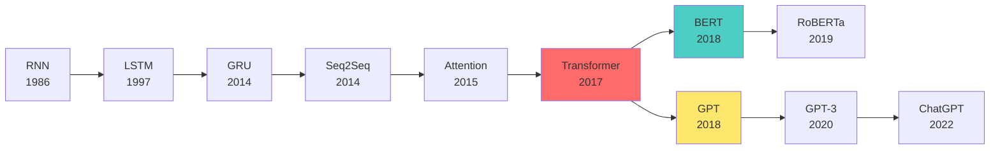
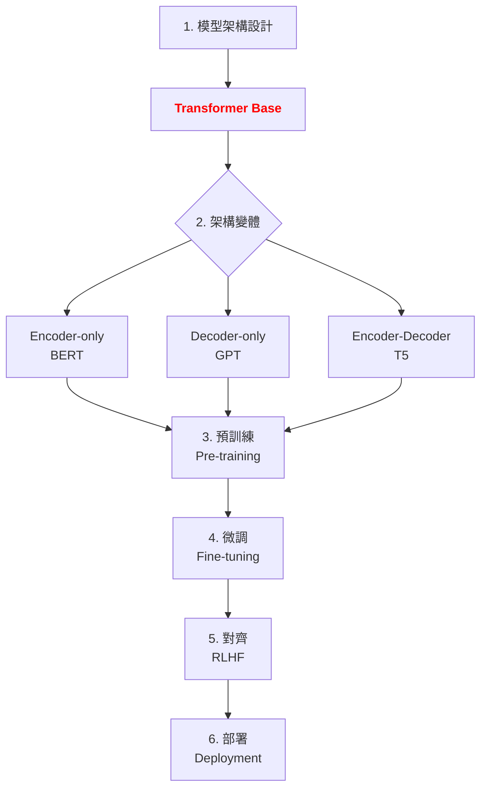

# 第 7.1 章:Transformer 架構完全解析

本章旨在為您提供一份教科書級別的教學講義,深入探討 Transformer 架構的核心概念、基本原理與實務應用。我們將從基礎理論出發,深入第一原理,最終將 Transformer 置於現代深度學習的宏觀知識體系中進行審視。

| 概念 | 中文譯名 | 典型用途 | 優點 | 侷限 |
| :--- | :--- | :--- | :--- | :--- |
| **Fundamentals** | 基礎理論 | 快速掌握 Transformer 的核心組件與自注意力機制 (Self-Attention)。 | 直觀易懂,能快速建立實作能力。 | 易忽略注意力機制的數學本質與計算複雜度。 |
| **First Principles** | 第一原理 | 從點積注意力 (Dot-Product Attention) 與位置編碼的本質,理解為何 Transformer 能取代 RNN。 | 深入本質,有助於創新與變體設計。 | 理論性強,需要較強的數學背景。 |
| **Body of Knowledge** | 知識體系 | 將 Transformer 置於 NLP 模型演化史與 LLM 預訓練的完整框架中。 | 結構完備,能理解 BERT/GPT/T5 的架構差異。 | 內容龐雜,不適合快速入門。 |

---

## 1. Fundamentals (基礎理論)

在深度學習的歷史中,**序列建模 (Sequence Modeling)** 長期由 RNN 與 LSTM 主導,但它們面臨**三大挑戰**:
1. **無法平行化**: 必須逐步處理序列,GPU 利用率低。
2. **長距離依賴**: 梯度消失問題,難以捕捉長文本中的關聯。
3. **訓練時間**: 長序列訓練速度極慢。

**Transformer** (2017 年 Google 提出) 徹底拋棄了循環結構,改用 **純注意力機制 (Pure Attention)**,實現了真正的平行化運算。

### Transformer 的核心思想

**核心公式**: Scaled Dot-Product Attention
```
Attention(Q, K, V) = softmax(QK^T / sqrt(d_k)) V

其中:
- Q (Query): 查詢向量,代表「我想找什麼」
- K (Key): 鍵向量,代表「記憶庫的索引」
- V (Value): 值向量,代表「記憶庫的內容」
- d_k: Key 的維度,用於縮放防止梯度消失
```

**直觀理解**:
假設你在圖書館找書:
- **Query**: 你的問題「關於機器學習的書」
- **Key**: 每本書的標籤「機器學習」「深度學習」「演算法」
- **Value**: 每本書的實際內容
- **Attention**: 根據標籤與問題的相似度,決定要讀哪些書

### Transformer 的架構組成

Transformer 由 **Encoder** 和 **Decoder** 兩部分組成:

**1. Encoder (編碼器)**
- 用途: 理解輸入序列的語義
- 應用: BERT, 文本分類, 命名實體識別
- 結構:
  - Multi-Head Self-Attention (多頭自注意力)
  - Feed-Forward Network (前饋網路)
  - Residual Connection + Layer Normalization (殘差連接 + 層歸一化)

**2. Decoder (解碼器)**
- 用途: 生成輸出序列
- 應用: GPT, 文本生成, 機器翻譯
- 結構:
  - Masked Multi-Head Self-Attention (遮蔽的多頭自注意力)
  - Cross-Attention (交叉注意力,連接 Encoder)
  - Feed-Forward Network
  - Residual Connection + Layer Normalization

### 快速實作: 簡化版 Self-Attention

```python
import numpy as np

def simple_self_attention(X, d_k):
    """
    簡化版自注意力機制

    Args:
        X: 輸入序列 (seq_len, d_model)
        d_k: Key 的維度

    Returns:
        output: 注意力輸出 (seq_len, d_model)
        attention_weights: 注意力權重 (seq_len, seq_len)
    """
    # 簡化: Q = K = V = X
    Q = K = V = X

    # 計算注意力分數 (相似度)
    scores = np.dot(Q, K.T) / np.sqrt(d_k)

    # Softmax 歸一化
    attention_weights = np.exp(scores) / np.sum(np.exp(scores), axis=-1, keepdims=True)

    # 加權求和
    output = np.dot(attention_weights, V)

    return output, attention_weights

# 測試: 句子「The cat sat」
# 假設每個詞用 3 維向量表示
X = np.array([
    [1, 0, 0],  # The
    [0, 1, 0],  # cat
    [0, 0, 1],  # sat
])

output, attn = simple_self_attention(X, d_k=3)

print("注意力權重:\n", attn)
# 輸出: 每個詞對其他詞的關注程度
# 例如: attn[1] 表示「cat」對「The, cat, sat」的注意力分佈
```

### Transformer vs RNN 對比

| 特性 | RNN/LSTM | Transformer |
|:---|:---|:---|
| **計算方式** | 序列處理 (無法平行) | 全部平行處理 |
| **長距離依賴** | 梯度消失,效果差 | 直接連接,效果好 |
| **訓練速度** | 慢 (序列長度 n 步) | 快 (1 步完成) |
| **GPU 利用率** | 低 (~20%) | 高 (~80%) |
| **記憶體消耗** | O(n) | O(n^2) (注意力矩陣) |
| **適用場景** | 短序列 | 長序列 (配合優化技術) |

---

## 2. First Principles (第一原理)

從第一原理出發,Transformer 的有效性根植於對**注意力機制數學本質**的深刻理解。

### 為什麼需要 Scaled Dot-Product Attention?

**問題: 為什麼要除以 sqrt(d_k)?**

當 Key 的維度 d_k 很大時,點積 Q·K 的方差會爆炸:

```
假設 Q 和 K 的元素是獨立同分佈的隨機變量,均值為 0,方差為 1:

Var(Q·K) = Var(q_1*k_1 + q_2*k_2 + ... + q_{d_k}*k_{d_k})
         = d_k * Var(q_i) * Var(k_i)
         = d_k

當 d_k = 512 時,方差 = 512,點積結果會非常大!
```

**後果**:
- 點積進入 softmax 的飽和區 (極大或極小值)
- 梯度趨近於零 → 無法訓練

**解決方案**:
```
除以 sqrt(d_k) 後:
Var(Q·K / sqrt(d_k)) = d_k / d_k = 1

方差穩定,梯度正常傳播。
```

### Multi-Head Attention 的本質

**為什麼需要多頭 (Multi-Head)?**

單頭注意力只能學習一種模式,例如:
- 句子「The cat sat on the mat」
- 單頭可能只學到: cat → sat (主謂關係)

但實際上我們需要同時捕捉:
- **語法關係**: cat → sat (主語-動詞)
- **語義關係**: cat → mat (都是名詞)
- **位置關係**: the → cat (相鄰詞)

**多頭注意力的優勢**:
```
8 個注意力頭 = 8 種不同的關注模式

Head 1: 學習語法依存
Head 2: 學習語義相似
Head 3: 學習位置相鄰
Head 4: 學習長距離依賴
...
```

**數學表示**:
```
MultiHead(Q, K, V) = Concat(head_1, ..., head_h) W^O

其中:
head_i = Attention(Q W^Q_i, K W^K_i, V W^V_i)

每個頭有獨立的權重矩陣 W^Q_i, W^K_i, W^V_i
```

### Positional Encoding 的數學原理

**問題**: 注意力機制沒有順序概念,「I love you」和「you love I」會得到相同結果!

**解決**: 注入位置編碼 (Positional Encoding)

```
公式:
PE(pos, 2i)   = sin(pos / 10000^(2i/d_model))
PE(pos, 2i+1) = cos(pos / 10000^(2i/d_model))

其中:
- pos: 位置 (0, 1, 2, ...)
- i: 維度索引 (0, 1, 2, ..., d_model/2)
- d_model: 模型維度 (如 512)
```

**為什麼選擇三角函數?**

1. **週期性**: 不同維度有不同頻率,能捕捉多尺度位置信息
2. **相對位置**: sin(α+β) = sin(α)cos(β) + cos(α)sin(β),位置差可以用線性組合表示
3. **外推性**: 即使遇到訓練時沒見過的長度,也能計算位置編碼

**實作範例**:
```python
import numpy as np
import matplotlib.pyplot as plt

def get_positional_encoding(max_len, d_model):
    """生成位置編碼"""
    pe = np.zeros((max_len, d_model))
    position = np.arange(0, max_len).reshape(-1, 1)
    div_term = np.exp(np.arange(0, d_model, 2) * -(np.log(10000.0) / d_model))

    pe[:, 0::2] = np.sin(position * div_term)
    pe[:, 1::2] = np.cos(position * div_term)
    return pe

# 視覺化
pe = get_positional_encoding(100, 128)
plt.figure(figsize=(12, 6))
plt.imshow(pe, cmap='RdBu', aspect='auto')
plt.colorbar()
plt.xlabel('Embedding Dimension')
plt.ylabel('Position')
plt.title('Positional Encoding Visualization')
plt.show()
```

### Layer Normalization vs Batch Normalization

Transformer 使用 **Layer Normalization** 而非 Batch Normalization,原因如下:

| 特性 | Batch Normalization | Layer Normalization |
|:---|:---|:---|
| **歸一化維度** | 在 batch 維度計算均值/方差 | 在 feature 維度計算均值/方差 |
| **依賴性** | 依賴 batch size | 不依賴 batch size |
| **適用場景** | CNN (圖像) | RNN/Transformer (序列) |
| **序列問題** | 不同位置的統計特性不同 | 能處理變長序列 |

**公式**:
```
LayerNorm(x) = gamma * (x - mean) / sqrt(var + epsilon) + beta

其中:
- mean, var: 在最後一個維度 (d_model) 計算
- gamma, beta: 可學習的縮放和偏移參數
```

---

## 3. Body of Knowledge (知識體系)

在深度學習的演化史中,Transformer 標誌著序列建模的典範轉移。它不僅是一項獨立技術,更是現代 NLP 與 LLM 的基石。

### 序列模型的演化史



### Transformer 在 LLM 生命週期的位置



### 三大 Transformer 架構變體

| 架構 | 代表模型 | 核心組件 | 適用任務 | 優缺點 |
|:---|:---|:---|:---|:---|
| **Encoder-only** | BERT, RoBERTa | 雙向 Self-Attention | 文本分類, NER, 問答 | 理解能力強,無法生成 |
| **Decoder-only** | GPT, LLaMA | 單向 Masked Attention | 文本生成, 對話 | 生成能力強,理解能力較弱 |
| **Encoder-Decoder** | T5, BART | Encoder + Cross-Attention + Decoder | 翻譯, 摘要 | 功能全面,計算開銷大 |

### 完整 Transformer 實作 (PyTorch)

```python
import torch
import torch.nn as nn
import math

class MultiHeadAttention(nn.Module):
    def __init__(self, d_model, num_heads):
        super().__init__()
        assert d_model % num_heads == 0

        self.d_k = d_model // num_heads
        self.num_heads = num_heads

        self.W_q = nn.Linear(d_model, d_model)
        self.W_k = nn.Linear(d_model, d_model)
        self.W_v = nn.Linear(d_model, d_model)
        self.W_o = nn.Linear(d_model, d_model)

    def forward(self, Q, K, V, mask=None):
        batch_size = Q.size(0)

        # 線性投影並拆分成多頭
        Q = self.W_q(Q).view(batch_size, -1, self.num_heads, self.d_k).transpose(1, 2)
        K = self.W_k(K).view(batch_size, -1, self.num_heads, self.d_k).transpose(1, 2)
        V = self.W_v(V).view(batch_size, -1, self.num_heads, self.d_k).transpose(1, 2)

        # Scaled Dot-Product Attention
        scores = torch.matmul(Q, K.transpose(-2, -1)) / math.sqrt(self.d_k)
        if mask is not None:
            scores = scores.masked_fill(mask == 0, -1e9)

        attn_weights = torch.softmax(scores, dim=-1)
        output = torch.matmul(attn_weights, V)

        # 合併多頭
        output = output.transpose(1, 2).contiguous().view(batch_size, -1, self.num_heads * self.d_k)
        return self.W_o(output)

class FeedForward(nn.Module):
    def __init__(self, d_model, d_ff, dropout=0.1):
        super().__init__()
        self.linear1 = nn.Linear(d_model, d_ff)
        self.linear2 = nn.Linear(d_ff, d_model)
        self.dropout = nn.Dropout(dropout)

    def forward(self, x):
        return self.linear2(self.dropout(torch.relu(self.linear1(x))))

class TransformerEncoderLayer(nn.Module):
    def __init__(self, d_model, num_heads, d_ff, dropout=0.1):
        super().__init__()
        self.self_attn = MultiHeadAttention(d_model, num_heads)
        self.ffn = FeedForward(d_model, d_ff, dropout)
        self.norm1 = nn.LayerNorm(d_model)
        self.norm2 = nn.LayerNorm(d_model)
        self.dropout = nn.Dropout(dropout)

    def forward(self, x, mask=None):
        # Multi-Head Attention + Residual + Norm
        attn_output = self.self_attn(x, x, x, mask)
        x = self.norm1(x + self.dropout(attn_output))

        # Feed Forward + Residual + Norm
        ffn_output = self.ffn(x)
        x = self.norm2(x + self.dropout(ffn_output))
        return x

# 使用範例
d_model, num_heads, d_ff = 512, 8, 2048
encoder_layer = TransformerEncoderLayer(d_model, num_heads, d_ff)

# 輸入: (batch_size, seq_len, d_model)
x = torch.randn(32, 100, 512)
output = encoder_layer(x)
print(f"輸出形狀: {output.shape}")  # (32, 100, 512)
```

### 性能分析與優化策略

#### 計算複雜度對比

| 層類型 | 時間複雜度 | 空間複雜度 | 最長路徑 |
|:---|:---|:---|:---|
| Self-Attention | O(n^2 · d) | O(n^2) | O(1) |
| RNN | O(n · d^2) | O(d) | O(n) |
| CNN | O(k · n · d^2) | O(k · d) | O(log_k(n)) |

**解讀**:
- Transformer 空間複雜度高 (注意力矩陣 n×n),但最長路徑為 O(1) (任意兩 token 直接連接)
- RNN 空間複雜度低,但最長路徑為 O(n) (梯度需經過 n 步)

#### 優化技術

**1. Sparse Attention (稀疏注意力)**
- 問題: 完整注意力矩陣 O(n^2) 無法處理長文本
- 解決: 只計算部分位置的注意力 (如局部窗口、跨步採樣)
- 代表: Longformer, BigBird

**2. Linear Attention (線性注意力)**
- 問題: Softmax 無法線性化
- 解決: 用核函數近似 softmax
- 代表: Linformer, Performer
- 複雜度: O(n · d^2)

**3. Flash Attention (快速注意力)**
- 問題: GPU 記憶體頻寬瓶頸
- 解決: 分塊計算,減少 HBM 訪問
- 加速: 2-4x

### 方法選擇指引

| 場景 | 推薦架構 | 原因 |
| :--- | :--- | :--- |
| **文本分類** | Encoder-only (BERT) | 需要雙向理解,無需生成 |
| **文本生成** | Decoder-only (GPT) | 自回歸生成,單向注意力 |
| **機器翻譯** | Encoder-Decoder (T5) | 需要編碼輸入 + 解碼輸出 |
| **長文本處理** | Sparse Attention | 降低計算複雜度 |
| **邊緣設備部署** | 蒸餾 + 量化 | 減少模型大小 |

---

## 結論與建議

1. **日常溝通與實作**: 優先掌握 **Fundamentals** 中的 **Self-Attention 機制**,它是所有 Transformer 變體的基礎。

2. **強調方法論與創新**: 從 **First Principles** 出發,理解為什麼需要 Scaled Dot-Product 和 Multi-Head,有助於您在面對新任務時,設計或選擇更合適的架構。

3. **構建宏觀視野**: 將 Transformer 放入 **Body of Knowledge** 的框架中,可以清晰地看到它在 LLM 演化史中的戰略位置,以及如何與預訓練、微調、對齊等環節協同工作。

**核心要點**: Transformer 通過純注意力機制取代循環結構,實現平行化運算,是現代 LLM (BERT, GPT, T5) 的共同基石。

透過本章的學習,您應當已經掌握了 Transformer 的核心思想與實作技巧,並能從更宏觀的視角理解其在現代 AI 開發中的關鍵作用。

---

## 延伸閱讀 (Further Reading)

### 關鍵論文 (Key Papers)
1. **Transformer 原始論文**: Vaswani et al. (2017). *Attention is All You Need*. NeurIPS 2017.
2. **BERT**: Devlin et al. (2018). *BERT: Pre-training of Deep Bidirectional Transformers for Language Understanding*. arXiv:1810.04805.
3. **GPT**: Radford et al. (2018). *Improving Language Understanding by Generative Pre-Training*.
4. **T5**: Raffel et al. (2020). *Exploring the Limits of Transfer Learning with a Unified Text-to-Text Transformer*. JMLR 2020.

### 視覺化工具 (Visualization Tools)
- **The Illustrated Transformer**: http://jalammar.github.io/illustrated-transformer/
- **Transformer Explainer**: https://poloclub.github.io/transformer-explainer/
- **3D Attention Visualization**: https://github.com/jessevig/bertviz

### 實作資源 (Implementation Resources)
- **PyTorch Official Tutorial**: https://pytorch.org/tutorials/beginner/transformer_tutorial.html
- **Hugging Face Transformers**: https://huggingface.co/docs/transformers/
- **Annotated Transformer**: http://nlp.seas.harvard.edu/annotated-transformer/

---

**下一章節**: [7.2 注意力機制深度剖析](./02_注意力機制深度剖析.md)
