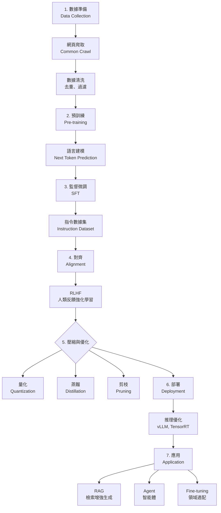

# 第 7.2 章:大型語言模型 (LLM) 原理與應用

本章旨在為您提供一份教科書級別的教學講義,深入探討大型語言模型 (Large Language Models, LLMs) 的核心概念、基本原理與實務應用。我們將從基礎理論出發,深入第一原理,最終將 LLMs 置於 AI 發展的宏觀知識體系中進行審視。

| 概念 | 中文譯名 | 典型用途 | 優點 | 侷限 |
| :--- | :--- | :--- | :--- | :--- |
| **Fundamentals** | 基礎理論 | 快速掌握 LLM 的核心技術與提示工程 (Prompt Engineering)。 | 直觀易懂,能快速建立應用能力。 | 易忽略湧現能力的本質與訓練原理。 |
| **First Principles** | 第一原理 | 從縮放定律 (Scaling Laws) 與湧現能力的本質,理解為何規模帶來質變。 | 深入本質,有助於理解 LLM 的能力邊界。 | 理論性強,需要較強的數學與機器學習背景。 |
| **Body of Knowledge** | 知識體系 | 將 LLM 置於預訓練、對齊、部署的完整生命週期中。 | 結構完備,能與 RLHF、RAG 等技術整合。 | 內容龐雜,不適合快速入門。 |

---

## 1. Fundamentals (基礎理論)

在 AI 的歷史中,**語言模型 (Language Models)** 經歷了從統計模型 (N-gram) 到神經網路 (RNN) 再到 Transformer 的演化。**大型語言模型 (LLMs)** 的出現,標誌著 AI 從「專用工具」向「通用智能」的典範轉移。

### 什麼是大型語言模型?

**定義**: LLM 是基於 Transformer 架構,在海量文本數據 (數百億到數兆 tokens) 上預訓練的超大規模神經網路 (數十億到數千億參數)。

**核心特性**:
1. **規模化 (Scale)**: 參數量從 GPT-2 的 1.5B 到 GPT-4 的估計 1.8T
2. **預訓練 (Pre-training)**: 在無標註文本上學習語言的統計規律
3. **湧現能力 (Emergent Abilities)**: 達到一定規模後,模型自動獲得推理、翻譯、編程等能力
4. **零樣本 / 少樣本學習 (Zero/Few-shot Learning)**: 無需微調即可完成新任務

### LLM 的發展時間線

| 年份 | 模型 | 參數量 | 關鍵創新 | 代表能力 |
|:---|:---|:---|:---|:---|
| **2018** | GPT-1 | 117M | Transformer Decoder | 文本生成 |
| **2019** | GPT-2 | 1.5B | 擴大規模 + 零樣本學習 | 故事創作 |
| **2020** | GPT-3 | 175B | 少樣本學習 (In-Context Learning) | 代碼生成、推理 |
| **2022** | ChatGPT | ~175B | RLHF 對齊 | 對話、指令遵循 |
| **2023** | GPT-4 | ~1.8T (估計) | 多模態 + 更強推理 | 複雜推理、圖像理解 |
| **2023** | LLaMA-2 | 7B-70B | 開源 + 商用友好 | 社群應用 |

### LLM 的訓練流程

LLM 的訓練通常分為 **三個階段**:

**階段 1: 預訓練 (Pre-training)**
- 目標: 學習語言的統計規律
- 數據: 海量無標註文本 (維基百科、網頁、書籍、代碼)
- 任務: 下一個 token 預測 (Next Token Prediction)
- 損失函數:
  ```
  L = -Σ log P(token_i | token_1, ..., token_{i-1})
  ```
- 成本: GPT-3 訓練成本約 $4.6M (2020)

**階段 2: 監督微調 (Supervised Fine-Tuning, SFT)**
- 目標: 教會模型遵循指令
- 數據: 人工標註的高質量對話 (如「請寫一首詩」→「春眠不覺曉...」)
- 任務: 根據提示生成回應
- 數據量: 通常數千到數萬條 (遠少於預訓練)

**階段 3: 人類反饋強化學習 (RLHF)**
- 目標: 對齊人類價值觀 (有用、無害、誠實)
- 流程:
  1. 訓練獎勵模型 (Reward Model): 人類標註回應的好壞
  2. 用 PPO 算法優化: 最大化獎勵模型的分數
- 效果: ChatGPT 的「人性化」主要來自這一步

### 提示工程 (Prompt Engineering)

**定義**: 設計輸入提示 (Prompt) 來引導 LLM 完成任務的技術。

**核心方法**:

**1. Zero-Shot Prompting (零樣本)**
```
提示: 將以下句子翻譯成英文:「我愛自然語言處理」
輸出: "I love natural language processing"
```

**2. Few-Shot Prompting (少樣本)**
```
提示:
問題: 2+3=?  答案: 5
問題: 7-4=?  答案: 3
問題: 9+6=?  答案:

輸出: 15
```

**3. Chain-of-Thought (思維鏈, CoT)**
```
提示:
問題: 一家咖啡店早上賣出 23 杯咖啡,下午賣出 37 杯,每杯 50 元,總收入多少?
讓我們一步步思考:

輸出:
1. 總共賣出: 23 + 37 = 60 杯
2. 總收入: 60 × 50 = 3000 元
答案: 3000 元
```

**4. Self-Consistency (自洽性)**
- 生成多個思維鏈,選擇最常見的答案
- 例如: 生成 5 次,3 次得到「3000 元」,2 次得到「3500 元」→ 選擇「3000 元」

---

## 2. First Principles (第一原理)

從第一原理出發,LLM 的驚人能力根植於對**縮放定律 (Scaling Laws)** 和**湧現能力 (Emergent Abilities)** 的深刻理解。

### 縮放定律 (Scaling Laws)

**OpenAI 的發現 (2020)**:
模型性能與三個因素呈現冪律關係 (Power Law):
```
L(N, D, C) ∝ N^(-α) · D^(-β) · C^(-γ)

其中:
- L: 損失函數 (Loss)
- N: 模型參數量 (Parameters)
- D: 數據集大小 (Dataset Size)
- C: 計算量 (Compute)
- α, β, γ: 冪律指數 (實驗測得: α≈0.076, β≈0.095, γ≈0.050)
```

**核心洞察**:
1. **參數量最重要**: α > β > γ,增加參數量比增加數據更有效
2. **可預測性**: 給定資源,可以預測模型性能
3. **沒有飽和**: 目前沒有看到性能上限

**實驗數據**:
| 模型 | 參數量 | 訓練 Tokens | 損失 (Loss) |
|:---|:---|:---|:---|
| GPT-2 Small | 117M | 40B | 3.31 |
| GPT-2 Medium | 345M | 40B | 2.93 |
| GPT-2 Large | 762M | 40B | 2.74 |
| GPT-2 XL | 1.5B | 40B | 2.62 |
| GPT-3 | 175B | 300B | ~2.2 |

### 湧現能力 (Emergent Abilities)

**定義**: 當模型規模達到某個臨界點後,突然出現的能力 (在小模型中完全沒有)。

**典型湧現能力**:

| 能力 | 臨界規模 | 描述 |
|:---|:---|:---|
| **算術推理** | ~10B | 能正確計算多位數加減乘除 |
| **多步推理** | ~60B | 能進行邏輯推理、因果推斷 |
| **代碼生成** | ~100B | 能根據描述生成正確的代碼 |
| **多語言理解** | ~10B | 能處理未在訓練數據中充分出現的語言 |
| **上下文學習** | ~1B | 能從提示中的示例學習新任務 |

**視覺化**:
```
性能

  │                 ╱─────────
  │              ╱
  │           ╱  ← 湧現點 (突然提升)
  │        ╱
  │     ╱
  │  ╱
  │╱─────────────────────────→ 參數量
 1B  10B  100B  1T
```

### In-Context Learning 的本質

**問題**: 為什麼 LLM 能從提示中的幾個例子學習新任務,而不需要更新參數?

**假設 1: 隱式微調**
- LLM 在預訓練時見過大量「任務描述 + 示例」的模式
- 推理時,模型識別出這種模式,調用對應的「子程序」

**假設 2: 元學習 (Meta-Learning)**
- LLM 學會了「如何學習」的能力
- 類似於人類看到幾個例子就能推斷規則

**數學直覺**:
```
P(答案 | 問題, 示例1, 示例2, ..., 示例k)
= P(答案 | 問題, 學習到的規則)

其中「學習到的規則」是從示例中推斷出來的。
```

### RLHF 的數學原理

**目標**: 最大化人類偏好,而非單純的預訓練損失。

**步驟 1: 訓練獎勵模型**
```
收集數據: 對於同一個提示,生成多個回應,人類標註排序
例如:
提示: 「什麼是愛?」
回應A: 「愛是一種情感...」 (人類評分: 8/10)
回應B: 「愛是 love...」    (人類評分: 3/10)

訓練目標: 最大化 log(sigmoid(r(x, A) - r(x, B)))
其中 r(x, y) 是獎勵模型給提示 x 和回應 y 的分數。
```

**步驟 2: PPO 優化**
```
目標函數:
J(θ) = E[r(x, y)] - β·KL(π_θ || π_ref)

其中:
- r(x, y): 獎勵模型的分數
- β: KL 散度權重 (防止偏離太遠)
- π_θ: 當前策略 (模型)
- π_ref: 參考策略 (SFT 模型)
```

**核心洞察**:
- 不直接優化人類標註,而是先學習獎勵函數
- KL 散度項防止模型「過度優化」獎勵模型,丟失原有能力

---

## 3. Body of Knowledge (知識體系)

在 AI 的完整生命週期中,LLM 不僅是一項技術,更是串連研發、部署、應用的核心樞紐。

### LLM 完整生命週期



### LLM 的核心技術棧

**1. 預訓練技術**

| 技術 | 描述 | 代表模型 |
|:---|:---|:---|
| **Causal LM** | 從左到右預測下一個 token | GPT 系列 |
| **Masked LM** | 隨機遮蔽部分 tokens,預測它們 | BERT, RoBERTa |
| **Prefix LM** | 前半部分雙向,後半部分單向 | GLM, UniLM |
| **Mixture of Denoisers** | 多種預訓練任務混合 | T5, UL2 |

**2. 對齊技術**

| 技術 | 描述 | 優缺點 |
|:---|:---|:---|
| **SFT** | 監督微調,人工標註數據 | 簡單有效,但成本高 |
| **RLHF** | 強化學習 + 人類反饋 | 效果最好,但訓練複雜 |
| **RLAIF** | 強化學習 + AI 反饋 | 成本低,但效果稍差 |
| **DPO** | 直接偏好優化,無需獎勵模型 | 訓練簡單,效果接近 RLHF |

**3. 應用技術**

**RAG (Retrieval-Augmented Generation)**
```
流程:
1. 用戶提問: "台灣最高的山是哪座?"
2. 檢索系統: 從知識庫找到相關文檔
   → 「玉山海拔 3952 公尺,是台灣第一高峰」
3. LLM 生成: 結合檢索結果回答
   → 「台灣最高的山是玉山,海拔 3952 公尺」
```

**優勢**:
- 知識可更新 (不需重新訓練模型)
- 減少幻覺 (Hallucination)
- 可追溯來源

**Agent (智能體)**
```
Agent = LLM + 工具 + 記憶 + 規劃

例子: 旅遊規劃 Agent
1. LLM 思考: 需要查詢天氣和航班
2. 調用工具: weather_api("Tokyo"), flight_api("TPE-NRT")
3. 記憶: 保存查詢結果
4. 規劃: 生成行程表
```

### LLM 性能對比

**開源 vs 閉源模型 (2024 年)**

| 模型 | 參數量 | MMLU | HumanEval | GSM8K | 開源 | 成本 |
|:---|:---|:---|:---|:---|:---|:---|
| **GPT-4** | ~1.8T | 86.4 | 67.0 | 92.0 | ❌ | $$$$ |
| **Claude 3 Opus** | ? | 86.8 | 84.9 | 95.0 | ❌ | $$$$ |
| **GPT-3.5 Turbo** | ~175B | 70.0 | 48.1 | 57.1 | ❌ | $$ |
| **LLaMA-2-70B** | 70B | 68.9 | 29.9 | 56.8 | ✅ | $ |
| **LLaMA-2-13B** | 13B | 54.8 | 18.3 | 28.7 | ✅ | $ |
| **LLaMA-2-7B** | 7B | 45.3 | 12.8 | 14.6 | ✅ | $ |

**基準測試說明**:
- **MMLU**: 多任務語言理解 (57 個學科,涵蓋數學、歷史、法律等)
- **HumanEval**: 代碼生成能力 (164 個編程問題)
- **GSM8K**: 小學數學推理 (8.5K 個數學應用題)

### 實戰應用模式

**模式 1: 零樣本分類**
```python
from transformers import pipeline

classifier = pipeline("zero-shot-classification", model="facebook/bart-large-mnli")

text = "這部電影真的太感人了,我哭了好幾次"
labels = ["正面評價", "負面評價", "中性評價"]

result = classifier(text, labels)
print(result)
# {'labels': ['正面評價', '中性評價', '負面評價'],
#  'scores': [0.89, 0.08, 0.03]}
```

**模式 2: RAG 應用**
```python
from langchain.chains import RetrievalQA
from langchain.llms import OpenAI
from langchain.vectorstores import FAISS
from langchain.embeddings import OpenAIEmbeddings

# 1. 建立向量數據庫
documents = ["文檔1內容...", "文檔2內容...", ...]
embeddings = OpenAIEmbeddings()
vectorstore = FAISS.from_texts(documents, embeddings)

# 2. 創建 RAG 鏈
qa_chain = RetrievalQA.from_chain_type(
    llm=OpenAI(temperature=0),
    retriever=vectorstore.as_retriever()
)

# 3. 提問
answer = qa_chain.run("台灣最高的山是哪座?")
print(answer)  # "台灣最高的山是玉山..."
```

**模式 3: Agent 應用**
```python
from langchain.agents import initialize_agent, Tool
from langchain.llms import OpenAI

# 定義工具
tools = [
    Tool(
        name="計算器",
        func=lambda x: eval(x),
        description="用於數學計算"
    ),
    Tool(
        name="天氣查詢",
        func=weather_api,
        description="查詢指定城市的天氣"
    )
]

# 初始化 Agent
agent = initialize_agent(tools, OpenAI(temperature=0), agent="zero-shot-react-description")

# 執行任務
result = agent.run("如果東京明天是晴天,計算 3952 除以 7 是多少")
# Agent 會自動:
# 1. 調用天氣查詢工具
# 2. 調用計算器工具
# 3. 整合結果回答
```

---

## 4. 方法選擇指引與未來趨勢

### 實踐選擇建議

| 場景 | 推薦方案 | 原因 |
| :--- | :--- | :--- |
| **快速原型開發** | **GPT-4 API** | 效果最好,開發速度快 |
| **成本敏感** | **LLaMA-2-7B + Fine-tuning** | 開源免費,可本地部署 |
| **需要隱私保護** | **自部署開源模型** | 數據不離開本地 |
| **需要最新信息** | **RAG + LLM** | 知識可更新,減少幻覺 |
| **複雜任務** | **Agent (ReAct)** | 能調用工具,分步推理 |
| **領域特化** | **SFT + LoRA** | 參數高效,性能好 |

### LLM 應用決策樹

```
是否需要使用 LLM?
│
├─ 任務需要語言理解或生成
│   ├─ 預算充足 → GPT-4 / Claude
│   ├─ 需要隱私 → 自部署 LLaMA-2
│   └─ 成本敏感 → GPT-3.5 / LLaMA-2-7B
│
├─ 需要最新信息
│   └─ RAG (檢索增強生成)
│
├─ 需要調用外部工具
│   └─ Agent (LangChain / AutoGPT)
│
└─ 領域特定任務
    └─ Fine-tuning (SFT + LoRA)
```

### 未來趨勢

**1. 多模態 LLM**
- GPT-4V: 圖像 + 文本理解
- Gemini: 圖像 + 音頻 + 視頻 + 文本

**2. 更長的上下文窗口**
- GPT-4 Turbo: 128K tokens (~300 頁)
- Claude 2.1: 200K tokens (~500 頁)

**3. 更高效的推理**
- Speculative Decoding: 加速 2-3x
- Mixture of Experts (MoE): 降低推理成本

**4. 開源生態蓬勃發展**
- LLaMA-3, Mistral, Qwen
- 社群微調模型 (Alpaca, Vicuna, WizardLM)

---

## 結論與建議

1. **日常溝通與實作**: 優先掌握 **Fundamentals** 中的 **Prompt Engineering**,它是使用 LLM 的核心技能。

2. **強調方法論與創新**: 從 **First Principles** 出發,理解縮放定律和湧現能力,有助於您預測 LLM 的能力邊界,並設計更有效的應用方案。

3. **構建宏觀視野**: 將 LLM 放入 **Body of Knowledge** 的框架中,可以清晰地看到它在 AI 產品開發中的戰略位置,以及如何與 RAG、Agent、Fine-tuning 等技術協同工作,實現業務目標。

**核心要點**: LLM 的能力來自規模 (縮放定律) 和對齊 (RLHF),應用時需結合 RAG、Agent 等技術克服幻覺和知識時效性問題。

透過本章的學習,您應當已經掌握了 LLM 的核心原理與應用技巧,並能從更宏觀的視角理解其在現代 AI 開發中的關鍵作用。

---

## 延伸閱讀 (Further Reading)

### 關鍵論文 (Key Papers)
1. **Scaling Laws**: Kaplan et al. (2020). *Scaling Laws for Neural Language Models*. arXiv:2001.08361.
2. **GPT-3**: Brown et al. (2020). *Language Models are Few-Shot Learners*. NeurIPS 2020.
3. **InstructGPT / ChatGPT**: Ouyang et al. (2022). *Training language models to follow instructions with human feedback*. arXiv:2203.02155.
4. **LLaMA**: Touvron et al. (2023). *LLaMA: Open and Efficient Foundation Language Models*. arXiv:2302.13971.
5. **Emergent Abilities**: Wei et al. (2022). *Emergent Abilities of Large Language Models*. TMLR 2022.

### 工具與框架 (Tools & Frameworks)
- **Hugging Face Transformers**: https://huggingface.co/docs/transformers/
- **LangChain**: https://python.langchain.com/ (LLM 應用框架)
- **vLLM**: https://github.com/vllm-project/vllm (高效推理引擎)
- **Ollama**: https://ollama.ai/ (本地部署工具)

### 學習資源 (Learning Resources)
- **OpenAI Cookbook**: https://github.com/openai/openai-cookbook
- **Prompt Engineering Guide**: https://www.promptingguide.ai/
- **LLM Course (Hugging Face)**: https://huggingface.co/learn/nlp-course/

---

**上一章節**: [7.1 Transformer 架構完全解析](./01_Transformer架構完全解析.md)
