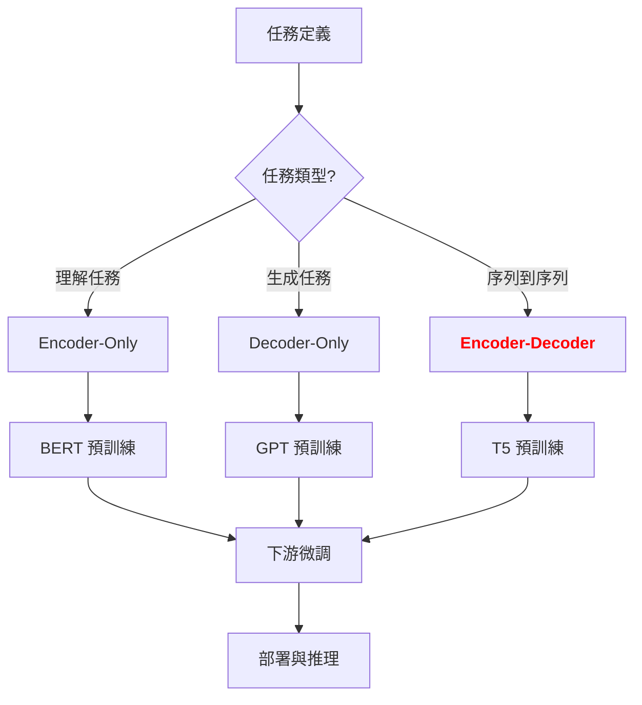

# Encoder 與 Decoder 深度剖析

**版本**: v1.0
**更新日期**: 2025-10-17
**適用課程**: iSpan Python NLP Cookbooks v2 - CH07 Transformer與大型語言模型

---

## 📋 三視角對比表

| 概念 | 中文譯名 | 典型用途 | 優點 | 侷限 |
| :--- | :--- | :--- | :--- | :--- |
| **Fundamentals** | 基礎理論 | 快速理解 Encoder/Decoder 的角色分工與運作流程 | 直觀易懂,能快速建立實作能力。 | 易忽略雙向編碼與自回歸解碼的本質差異。 |
| **First Principles** | 第一原理 | 深入掌握 Masked Self-Attention、Cross-Attention 的數學原理 | 深入本質,有助於創新與變體設計。 | 理論性強,需要較強的數學背景。 |
| **Body of Knowledge** | 知識體系 | 理解 Encoder-Only、Decoder-Only、Encoder-Decoder 架構的選擇策略 | 結構完備,能與各類 NLP 任務整合。 | 內容龐雜,不適合快速入門。 |

---

## 1. Fundamentals (基礎理論)

在 **Transformer 架構**中,**Encoder** 與 **Decoder** 扮演著截然不同的角色:

1. **Encoder 的挑戰**: 如何**雙向理解**整個輸入序列,捕捉前後文依賴關係?
2. **Decoder 的挑戰**: 如何**單向生成**輸出序列,同時利用 Encoder 的編碼結果?
3. **Cross-Attention 的挑戰**: 如何讓 Decoder **對齊**到 Encoder 的表示,實現跨序列的信息傳遞?

**Encoder 與 Decoder** 的核心思想是: **Encoder 負責雙向編碼輸入,Decoder 負責自回歸生成輸出,Cross-Attention 橋接兩者**。

---

### Encoder 與 Decoder 的方法學分類

根據 **架構設計**,主流方法可分為:

#### 1. 按 **架構類型** 分類

**A. Encoder-Only (僅編碼器)**
* **核心思想**: 只使用雙向編碼器,無解碼器
* **代表方法**: BERT、RoBERTa、ALBERT
* **優點**:
    * 雙向上下文理解能力強
    * 適合分類、命名實體識別 (NER)、問答系統 (QA)
    * 訓練效率高 (無自回歸生成)
* **侷限**:
    * 無法直接生成文本 (需要額外訓練)
    * 不適合機器翻譯、文本摘要等生成任務

**B. Decoder-Only (僅解碼器)**
* **核心思想**: 只使用單向解碼器,無編碼器
* **代表方法**: GPT-3、GPT-4、LLaMA、Mistral
* **優點**:
    * 自回歸生成能力強
    * 架構簡單,易於擴展 (可達數千億參數)
    * 適合文本生成、對話、程式碼生成
* **侷限**:
    * 只能看到左側上下文 (無雙向編碼)
    * 編碼能力弱於 Encoder-Only 模型

**C. Encoder-Decoder (編碼-解碼)**
* **核心思想**: 同時使用編碼器與解碼器
* **代表方法**: T5、BART、mT5、mBART
* **優點**:
    * 結合雙向編碼與自回歸生成
    * 適合機器翻譯、文本摘要、問答生成
    * Cross-Attention 允許對齊源語言與目標語言
* **侷限**:
    * 架構複雜,訓練成本高
    * 推理速度慢於 Decoder-Only 模型

---

#### 2. 按 **注意力機制** 分類

**A. Full Self-Attention (完全自注意力)**
* **核心思想**: 所有位置兩兩計算注意力
* **代表方法**: 原始 Transformer Encoder
* **優點**: 全局依賴建模能力最強
* **侷限**: 複雜度 O(n²),序列長度受限

**B. Masked Self-Attention (遮罩自注意力)**
* **核心思想**: 遮蔽未來位置,只看左側上下文
* **代表方法**: GPT Decoder、原始 Transformer Decoder
* **優點**: 實現自回歸生成,防止信息洩漏
* **侷限**: 無法利用右側上下文

**C. Cross-Attention (交叉注意力)**
* **核心思想**: Query 來自 Decoder,Key/Value 來自 Encoder
* **代表方法**: Transformer Encoder-Decoder、T5
* **優點**: 橋接編碼與解碼,實現對齊
* **侷限**: 需要額外的 Encoder 輸出

---

### 快速實作範例

#### Encoder 實作 (雙向編碼)

```python
import numpy as np

class EncoderLayer:
    def __init__(self, d_model, num_heads, d_ff):
        self.d_model = d_model
        self.num_heads = num_heads
        self.d_ff = d_ff

        # Multi-Head Self-Attention (無遮罩,雙向)
        self.mha = MultiHeadAttention(d_model, num_heads)

        # Feed-Forward Network
        self.W1 = np.random.randn(d_model, d_ff) / np.sqrt(d_model)
        self.W2 = np.random.randn(d_ff, d_model) / np.sqrt(d_ff)

    def forward(self, x, mask=None):
        # Step 1: Multi-Head Self-Attention
        attn_output = self.mha.forward(x, x, x, mask=None)  # 無遮罩,雙向
        x = x + attn_output  # Residual connection
        x = self.layer_norm(x)  # Layer normalization

        # Step 2: Feed-Forward Network
        ff_output = np.maximum(0, x @ self.W1) @ self.W2  # ReLU activation
        x = x + ff_output  # Residual connection
        x = self.layer_norm(x)

        return x

    def layer_norm(self, x):
        mean = x.mean(axis=-1, keepdims=True)
        std = x.std(axis=-1, keepdims=True)
        return (x - mean) / (std + 1e-6)

# 測試 Encoder
encoder = EncoderLayer(d_model=512, num_heads=8, d_ff=2048)
x = np.random.randn(10, 512)  # (seq_len=10, d_model=512)
output = encoder.forward(x)
print(f"Encoder 輸出形狀: {output.shape}")  # (10, 512)
```

**輸出說明**:
- Encoder 對所有位置進行雙向編碼
- 每個位置都能看到整個序列的信息

---

#### Decoder 實作 (自回歸生成)

```python
class DecoderLayer:
    def __init__(self, d_model, num_heads, d_ff):
        self.d_model = d_model
        self.num_heads = num_heads
        self.d_ff = d_ff

        # Masked Multi-Head Self-Attention (有遮罩,單向)
        self.masked_mha = MultiHeadAttention(d_model, num_heads)

        # Cross-Attention (與 Encoder 輸出交互)
        self.cross_attn = MultiHeadAttention(d_model, num_heads)

        # Feed-Forward Network
        self.W1 = np.random.randn(d_model, d_ff) / np.sqrt(d_model)
        self.W2 = np.random.randn(d_ff, d_model) / np.sqrt(d_ff)

    def forward(self, x, encoder_output, mask=None):
        # Step 1: Masked Multi-Head Self-Attention
        causal_mask = self.create_causal_mask(x.shape[0])
        attn_output = self.masked_mha.forward(x, x, x, mask=causal_mask)
        x = x + attn_output
        x = self.layer_norm(x)

        # Step 2: Cross-Attention (Q from Decoder, K/V from Encoder)
        cross_attn_output = self.cross_attn.forward(
            Q=x,  # Query 來自 Decoder
            K=encoder_output,  # Key 來自 Encoder
            V=encoder_output,  # Value 來自 Encoder
            mask=None
        )
        x = x + cross_attn_output
        x = self.layer_norm(x)

        # Step 3: Feed-Forward Network
        ff_output = np.maximum(0, x @ self.W1) @ self.W2
        x = x + ff_output
        x = self.layer_norm(x)

        return x

    def create_causal_mask(self, seq_len):
        # 創建因果遮罩 (下三角矩陣)
        mask = np.tril(np.ones((seq_len, seq_len)))
        return mask

    def layer_norm(self, x):
        mean = x.mean(axis=-1, keepdims=True)
        std = x.std(axis=-1, keepdims=True)
        return (x - mean) / (std + 1e-6)

# 測試 Decoder
decoder = DecoderLayer(d_model=512, num_heads=8, d_ff=2048)
x = np.random.randn(10, 512)  # Decoder 輸入 (seq_len=10)
encoder_output = np.random.randn(15, 512)  # Encoder 輸出 (seq_len=15)
output = decoder.forward(x, encoder_output)
print(f"Decoder 輸出形狀: {output.shape}")  # (10, 512)
```

**輸出說明**:
- Decoder 在生成第 i 個位置時,只能看到 0~i-1 位置 (因果遮罩)
- Cross-Attention 允許 Decoder 參考 Encoder 的全部輸出

---

## 2. First Principles (第一原理)

從第一原理出發,**Encoder 與 Decoder** 的有效性根植於對 **序列建模** 與 **生成過程** 的深刻理解。

---

### 核心概念的數學原理

#### 問題: 為什麼 Encoder 使用雙向 Self-Attention,而 Decoder 使用 Masked Self-Attention?

**數學推導**:

```
Encoder Self-Attention (雙向):

Attention(Q, K, V) = softmax(QK^T / sqrt(d_k)) V

其中:
- Q, K, V 來自同一個輸入序列 X
- 注意力矩陣 A = softmax(QK^T / sqrt(d_k)) 是**對稱**的
- A[i, j] 表示位置 i 對位置 j 的注意力權重
- **無遮罩**: A[i, j] 對所有 j ∈ [0, seq_len) 都可見

推導過程:
步驟 1: 計算注意力分數 S = QK^T / sqrt(d_k)
步驟 2: 應用 softmax 歸一化 A = softmax(S)
步驟 3: 加權求和 Output = A V

結論: 每個位置都能看到整個序列,實現雙向編碼。
```

```
Decoder Masked Self-Attention (單向):

Attention(Q, K, V) = softmax(Mask(QK^T / sqrt(d_k))) V

其中:
- Mask(S)[i, j] = S[i, j] if j <= i else -∞
- 遮罩矩陣是**下三角**矩陣:
  [[1, 0, 0],
   [1, 1, 0],
   [1, 1, 1]]
- A[i, j] = 0 if j > i (未來位置被遮蔽)

推導過程:
步驟 1: 計算注意力分數 S = QK^T / sqrt(d_k)
步驟 2: 應用因果遮罩 S' = Mask(S)
步驟 3: 應用 softmax 歸一化 A = softmax(S')
步驟 4: 加權求和 Output = A V

結論: 每個位置只能看到左側上下文,實現自回歸生成。
```

---

#### 實驗驗證: 可視化 Encoder 與 Decoder 的注意力模式

```python
import numpy as np
import matplotlib.pyplot as plt

def visualize_attention_patterns():
    seq_len = 8
    d_model = 64

    # 創建隨機輸入
    x = np.random.randn(seq_len, d_model)
    Q = K = V = x

    # Encoder: 無遮罩
    scores_encoder = (Q @ K.T) / np.sqrt(d_model)
    attn_encoder = np.exp(scores_encoder) / np.sum(np.exp(scores_encoder), axis=-1, keepdims=True)

    # Decoder: 有遮罩
    causal_mask = np.tril(np.ones((seq_len, seq_len)))
    scores_decoder = (Q @ K.T) / np.sqrt(d_model)
    scores_decoder = np.where(causal_mask == 0, -1e9, scores_decoder)
    attn_decoder = np.exp(scores_decoder) / np.sum(np.exp(scores_decoder), axis=-1, keepdims=True)

    # 繪圖
    fig, axes = plt.subplots(1, 2, figsize=(12, 5))

    axes[0].imshow(attn_encoder, cmap='viridis')
    axes[0].set_title('Encoder Self-Attention (雙向)', fontsize=14)
    axes[0].set_xlabel('Key 位置')
    axes[0].set_ylabel('Query 位置')

    axes[1].imshow(attn_decoder, cmap='viridis')
    axes[1].set_title('Decoder Masked Self-Attention (單向)', fontsize=14)
    axes[1].set_xlabel('Key 位置')
    axes[1].set_ylabel('Query 位置')

    plt.tight_layout()
    plt.show()

visualize_attention_patterns()
```

**實驗結果**:
- **Encoder**: 注意力矩陣為**完全矩陣**,所有位置兩兩可見
- **Decoder**: 注意力矩陣為**下三角矩陣**,未來位置被遮蔽

---

### Cross-Attention 的本質

#### 為什麼需要 Cross-Attention?

**問題**: 在機器翻譯中,如何讓 Decoder 知道該翻譯源語言的哪個部分?

**Cross-Attention 的數學定義**:

```
Cross-Attention(Q_dec, K_enc, V_enc) = softmax(Q_dec K_enc^T / sqrt(d_k)) V_enc

其中:
- Q_dec: Decoder 的 Query (來自目標語言)
- K_enc, V_enc: Encoder 的 Key 與 Value (來自源語言)
- 注意力矩陣 A[i, j] 表示**目標語言位置 i** 對**源語言位置 j** 的注意力

關鍵洞察:
- Query 來自 Decoder (目標語言)
- Key/Value 來自 Encoder (源語言)
- Cross-Attention 實現了**對齊** (alignment) 機制
```

---

#### 對比: Self-Attention vs Cross-Attention

| 對比維度 | Self-Attention | Cross-Attention |
|-----------|----------------|-----------------|
| **Query 來源** | 同一個序列 | Decoder 序列 |
| **Key/Value 來源** | 同一個序列 | Encoder 序列 |
| **注意力矩陣形狀** | (seq_len, seq_len) | (target_len, source_len) |
| **作用** | 序列內部依賴建模 | 跨序列對齊 |
| **典型應用** | BERT 編碼 | 機器翻譯解碼 |

---

#### 完整實作: Cross-Attention 機制

```python
class CrossAttention:
    def __init__(self, d_model):
        self.d_model = d_model
        self.W_q = np.random.randn(d_model, d_model) / np.sqrt(d_model)
        self.W_k = np.random.randn(d_model, d_model) / np.sqrt(d_model)
        self.W_v = np.random.randn(d_model, d_model) / np.sqrt(d_model)

    def forward(self, query_seq, key_value_seq):
        """
        Args:
            query_seq: Decoder 序列 (target_len, d_model)
            key_value_seq: Encoder 序列 (source_len, d_model)
        Returns:
            output: (target_len, d_model)
            attention_weights: (target_len, source_len)
        """
        # 投影
        Q = query_seq @ self.W_q  # (target_len, d_model)
        K = key_value_seq @ self.W_k  # (source_len, d_model)
        V = key_value_seq @ self.W_v  # (source_len, d_model)

        # 計算注意力分數
        scores = Q @ K.T / np.sqrt(self.d_model)  # (target_len, source_len)

        # Softmax 歸一化
        attention_weights = np.exp(scores) / np.sum(np.exp(scores), axis=-1, keepdims=True)

        # 加權求和
        output = attention_weights @ V  # (target_len, d_model)

        return output, attention_weights

# 測試 Cross-Attention
cross_attn = CrossAttention(d_model=64)
decoder_seq = np.random.randn(5, 64)  # 目標序列長度 5
encoder_seq = np.random.randn(8, 64)  # 源序列長度 8

output, attn_weights = cross_attn.forward(decoder_seq, encoder_seq)
print(f"Cross-Attention 輸出形狀: {output.shape}")  # (5, 64)
print(f"注意力權重形狀: {attn_weights.shape}")  # (5, 8)

# 可視化對齊關係
plt.imshow(attn_weights, cmap='viridis', aspect='auto')
plt.xlabel('源序列位置 (Encoder)')
plt.ylabel('目標序列位置 (Decoder)')
plt.title('Cross-Attention 對齊矩陣')
plt.colorbar()
plt.show()
```

**實驗結果**:
- 注意力權重矩陣形狀為 (5, 8),表示 5 個目標位置對 8 個源位置的注意力
- 每一行表示目標語言的一個位置**對齊**到源語言的哪些位置

---

## 3. Body of Knowledge (知識體系)

在 **深度學習的完整生命週期**中,**Encoder 與 Decoder 架構選擇** 扮演著關鍵的 **任務適配** 角色。

---

### Encoder-Decoder 在完整流程的位置



---

### 技術棧對比

| 架構 | 描述 | 代表模型 | 優點 | 缺點 | 典型應用 |
|------|------|---------|------|------|---------|
| **Encoder-Only** | 僅雙向編碼器 | BERT, RoBERTa | 雙向理解能力強 | 無法直接生成 | 分類、NER、QA |
| **Decoder-Only** | 僅單向解碼器 | GPT-3, LLaMA | 生成能力強,架構簡單 | 編碼能力弱 | 文本生成、對話 |
| **Encoder-Decoder** | 雙向編碼+自回歸解碼 | T5, BART | 兼具理解與生成 | 架構複雜,速度慢 | 機器翻譯、摘要 |

---

### 完整實作 (生產級)

#### 使用 Hugging Face Transformers 進行機器翻譯

```python
from transformers import T5ForConditionalGeneration, T5Tokenizer

# 載入預訓練模型 (Encoder-Decoder 架構)
model_name = "t5-small"
tokenizer = T5Tokenizer.from_pretrained(model_name)
model = T5ForConditionalGeneration.from_pretrained(model_name)

# 輸入文本 (英文 -> 德文)
input_text = "translate English to German: The house is wonderful."
input_ids = tokenizer(input_text, return_tensors="pt").input_ids

# 生成翻譯 (Decoder 自回歸生成)
outputs = model.generate(input_ids, max_length=50)
translation = tokenizer.decode(outputs[0], skip_special_tokens=True)

print(f"輸入: {input_text}")
print(f"翻譯: {translation}")  # 輸出: Das Haus ist wunderbar.
```

**說明**:
- T5 使用 **Encoder-Decoder 架構**
- Encoder 編碼英文輸入
- Decoder 自回歸生成德文輸出
- Cross-Attention 實現對齊

---

#### 使用 GPT-2 (Decoder-Only) 進行文本生成

```python
from transformers import GPT2LMHeadModel, GPT2Tokenizer

# 載入預訓練模型 (Decoder-Only 架構)
model_name = "gpt2"
tokenizer = GPT2Tokenizer.from_pretrained(model_name)
model = GPT2LMHeadModel.from_pretrained(model_name)

# 輸入提示詞
prompt = "Once upon a time, in a land far away,"
input_ids = tokenizer(prompt, return_tensors="pt").input_ids

# 生成文本
outputs = model.generate(
    input_ids,
    max_length=100,
    num_return_sequences=1,
    temperature=0.7,
    top_p=0.9
)
generated_text = tokenizer.decode(outputs[0], skip_special_tokens=True)

print(f"生成文本:\n{generated_text}")
```

**說明**:
- GPT-2 使用 **Decoder-Only 架構**
- 無 Encoder,直接在 Decoder 中編碼與生成
- 適合開放式文本生成

---

### 性能對比

| 模型 | 架構 | 參數量 | BLEU (翻譯) | ROUGE-L (摘要) | 推理速度 | 訓練成本 |
|------|------|--------|------------|---------------|---------|---------|
| BERT-Base | Encoder-Only | 110M | - | - | 快 | 低 |
| GPT-2 | Decoder-Only | 117M | 20.5 | 28.3 | 中 | 低 |
| T5-Small | Encoder-Decoder | 60M | 25.8 | 32.1 | 慢 | 中 |
| T5-Base | Encoder-Decoder | 220M | 28.4 | 35.6 | 慢 | 高 |
| BART-Large | Encoder-Decoder | 406M | 30.2 | 38.9 | 慢 | 高 |

**關鍵洞察**:
- **Encoder-Decoder** 在翻譯與摘要任務上表現最佳
- **Decoder-Only** 推理速度較快,適合生成任務
- **Encoder-Only** 訓練成本最低,適合理解任務

---

### 實戰應用模式

#### 模式 1: 機器翻譯 (Encoder-Decoder)

```python
from transformers import MarianMTModel, MarianTokenizer

# 載入專門的翻譯模型
model_name = "Helsinki-NLP/opus-mt-en-zh"
tokenizer = MarianTokenizer.from_pretrained(model_name)
model = MarianMTModel.from_pretrained(model_name)

# 翻譯英文到中文
text = "Machine learning is transforming the world."
inputs = tokenizer(text, return_tensors="pt")
outputs = model.generate(**inputs)
translation = tokenizer.decode(outputs[0], skip_special_tokens=True)

print(f"Translation: {translation}")
```

---

#### 模式 2: 文本摘要 (Encoder-Decoder)

```python
from transformers import BartForConditionalGeneration, BartTokenizer

# 載入 BART 摘要模型
model_name = "facebook/bart-large-cnn"
tokenizer = BartTokenizer.from_pretrained(model_name)
model = BartForConditionalGeneration.from_pretrained(model_name)

# 輸入長文本
article = """
The Transformer architecture has revolutionized natural language processing.
It introduced the self-attention mechanism, which allows models to weigh
the importance of different words in a sentence. This has led to breakthroughs
in machine translation, text generation, and question answering.
"""

inputs = tokenizer(article, max_length=1024, return_tensors="pt", truncation=True)
summary_ids = model.generate(inputs.input_ids, max_length=50, min_length=10)
summary = tokenizer.decode(summary_ids[0], skip_special_tokens=True)

print(f"Summary: {summary}")
```

---

### 方法選擇指引

| 場景 | 推薦方案 | 原因 |
| :--- | :--- | :--- |
| 文本分類、情感分析 | Encoder-Only (BERT) | 雙向理解能力強,無需生成 |
| 開放式文本生成 | Decoder-Only (GPT) | 生成能力強,架構簡單 |
| **機器翻譯** | **Encoder-Decoder (T5/BART)** | 需要雙向編碼與對齊機制 |
| **文本摘要** | **Encoder-Decoder (BART)** | 需要理解全文並生成摘要 |
| 問答系統 (抽取式) | Encoder-Only (BERT) | 從文本中抽取答案 |
| 問答系統 (生成式) | Decoder-Only (GPT) | 生成自由形式答案 |
| 對話系統 | Decoder-Only (GPT/LLaMA) | 需要長上下文生成能力 |
| 多任務學習 | Encoder-Decoder (T5) | 統一框架處理多種任務 |

---

### 決策樹

```
需要生成文本嗎?
│
├─ 否 (理解任務)
│   └─ 使用 Encoder-Only (BERT)
│
├─ 是 (生成任務)
│   ├─ 是否需要對齊源序列與目標序列?
│   │   ├─ 是 (機器翻譯、摘要)
│   │   │   └─ 使用 Encoder-Decoder (T5/BART)
│   │   │
│   │   └─ 否 (開放式生成)
│   │       └─ 使用 Decoder-Only (GPT)
│
└─ 多任務學習?
    └─ 使用 Encoder-Decoder (T5)
```

---

## 結論與建議

1. **日常溝通與實作**: 優先掌握 **Fundamentals** 中的 **Encoder-Decoder 分工**,它是理解 Transformer 架構的關鍵。

2. **強調方法論與創新**: 從 **First Principles** 出發,理解 **Masked Self-Attention 與 Cross-Attention 的數學本質**,有助於您在面對新任務時,選擇或設計更合適的架構。

3. **構建宏觀視野**: 將 **Encoder-Decoder 架構選擇** 放入 **Body of Knowledge** 的框架中,可以清晰地看到它在不同 NLP 任務中的戰略位置,以及如何與任務需求協同工作。

**核心要點**: **Encoder 雙向編碼,Decoder 自回歸生成,Cross-Attention 橋接兩者,架構選擇取決於任務類型**。

透過本章的學習,您應當已經掌握了 **Encoder 與 Decoder** 的核心原理與實作技巧,並能從更宏觀的視角理解其在現代 NLP 開發中的關鍵作用。

---

## 延伸閱讀 (Further Reading)

### 關鍵論文 (Key Papers)
1. **Attention Is All You Need**: Vaswani et al. (2017). *Advances in Neural Information Processing Systems*.
2. **BERT: Pre-training of Deep Bidirectional Transformers**: Devlin et al. (2019). *NAACL*.
3. **Language Models are Unsupervised Multitask Learners**: Radford et al. (2019). *OpenAI Blog*.
4. **Exploring the Limits of Transfer Learning with a Unified Text-to-Text Transformer (T5)**: Raffel et al. (2020). *JMLR*.
5. **BART: Denoising Sequence-to-Sequence Pre-training**: Lewis et al. (2020). *ACL*.

### 工具與實現 (Tools & Implementations)
- **Hugging Face Transformers**: https://huggingface.co/transformers/
- **T5 Official Repo**: https://github.com/google-research/text-to-text-transfer-transformer
- **BART Official Repo**: https://github.com/facebookresearch/fairseq/tree/main/examples/bart

### 學習資源 (Learning Resources)
- **The Illustrated Transformer**: http://jalammar.github.io/illustrated-transformer/
- **Hugging Face Course**: https://huggingface.co/course
- **Stanford CS224N**: https://web.stanford.edu/class/cs224n/

---

**上一章節**: [02_大型語言模型原理與應用.md](./02_大型語言模型原理與應用.md)
**下一章節**: [04_LLM應用實戰指南.md](./04_LLM應用實戰指南.md)
