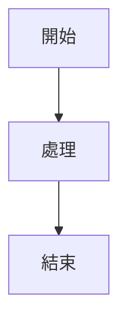

# 講義撰寫範本與風格指南

**版本**: v1.1
**更新日期**: 2025-10-17
**適用範圍**: iSpan Python NLP Cookbooks v2 所有講義文件

---

## 📋 講義撰寫準則

### 核心原則

本講義範本遵循**三段式教學法** (Fundamentals → First Principles → Body of Knowledge),確保學生能從不同層次理解技術:

1. **Fundamentals (基礎理論)**: 快速掌握,建立實作能力
2. **First Principles (第一原理)**: 深入本質,理解數學原理
3. **Body of Knowledge (知識體系)**: 宏觀視野,技術整合與應用

### 風格特色

| 特色 | 說明 | 範例 |
|------|------|------|
| **教科書級別** | 嚴謹但可讀 | 使用定義、定理、證明的結構 |
| **中英對照** | 關鍵術語標註英文 | 知識蒸餾 (Knowledge Distillation) |
| **公式格式** | 代碼塊包裹,非 LaTeX | 使用 ``` 包裹公式,避免複雜 LaTeX |
| **強調粗體** | 關鍵概念用粗體 | **核心思想**、**暗知識** |
| **數字化指標** | 具體數值說明 | "參數量為教師模型的 10-50%" |
| **漸進式深入** | 從應用到原理 | 先實例,再數學,後框架 |
| **性能表格** | 對比不同方法 | 模型大小/準確率/速度對比 |
| **決策樹** | 幫助選擇方法 | 何時使用哪種技術的流程圖 |

---

## 📝 講義結構模板

### 開篇對比表格

每個講義必須以**三視角對比表**開始,說明學習路徑:

```markdown
| 概念 | 中文譯名 | 典型用途 | 優點 | 侷限 |
| :--- | :--- | :--- | :--- | :--- |
| **Fundamentals** | 基礎理論 | [快速掌握的內容] | 直觀易懂,能快速建立實作能力。 | 易忽略 [核心本質]。 |
| **First Principles** | 第一原理 | [深入本質的內容] | 深入本質,有助於創新與變體設計。 | 理論性強,需要較強的數學背景。 |
| **Body of Knowledge** | 知識體系 | [宏觀框架的內容] | 結構完備,能與 [相關技術] 整合。 | 內容龐雜,不適合快速入門。 |
```

### 1. Fundamentals (基礎理論)

**目標**: 讓學生在最短時間內理解核心概念並能動手實作

**結構**:
```markdown
### 1. Fundamentals (基礎理論)

在 [領域] 的時代,**面臨的挑戰**:
1. **挑戰 1**: 描述
2. **挑戰 2**: 描述
3. **挑戰 3**: 描述

**[技術名稱]** 的核心思想是: [一句話總結]

#### [技術] 的方法學分類

根據 [分類依據],主流方法可分為:

**1. 按 [維度1] 分類**
* **方法A**:
    * **核心思想**: 簡潔描述
    * **代表方法**: 具體技術名稱
    * **優點**: 列出優勢

**2. 按 [維度2] 分類**
* [同上格式]

#### 快速實作範例

\```python
# 簡單但完整的代碼範例
# 包含註解說明每一步
\```
```

**撰寫要點**:
- 先列出痛點/挑戰,引發共鳴
- 用類比解釋複雜概念 (如:圖書館找書 = Attention)
- 代碼必須可執行,有輸出說明
- 避免數學公式,用直觀描述

---

### 2. First Principles (第一原理)

**目標**: 從數學與原理層面深入理解技術本質

**結構**:
```markdown
### 2. First Principles (第一原理)

從第一原理出發,[技術] 的有效性根植於對 **[核心概念]** 的深刻理解。

#### 核心概念的數學原理

**問題: 為什麼 [技術細節] ?**

[數學推導]:
\```
公式:
f(x) = ...

其中:
- 參數1: 說明
- 參數2: 說明

推導過程:
步驟 1: ...
步驟 2: ...
結論: ...
\```

**實驗驗證**:
\```python
# 用代碼驗證數學原理
# 繪製圖表展示效果
\```

#### [子概念] 的本質

**為什麼需要 [子概念]?**

| [對比維度] | 方法A | 方法B |
|-----------|------|------|
| 特性1 | 描述 | 描述 |
| 特性2 | 描述 | 描述 |

**完整實作**:
\```python
# 從零實作該概念
# 包含完整的 class 定義
\```
```

**撰寫要點**:
- **公式用代碼塊**,不用 LaTeX (除非非常簡單)
- 每個公式後必須有**為什麼**的解釋
- 用實驗/代碼驗證數學結論
- 對比表格突出差異

**公式格式規範**:
```markdown
正確 ✅:
\```
Attention(Q, K, V) = softmax(QK^T / sqrt(d_k)) V

其中:
- Q: Query 向量
- K: Key 向量
- V: Value 向量
\```

錯誤 ❌:
$$\text{Attention}(Q, K, V) = \text{softmax}\left(\frac{QK^T}{\sqrt{d_k}}\right)V$$
(避免使用複雜 LaTeX,改用簡潔文字表示)
```

---

### 3. Body of Knowledge (知識體系)

**目標**: 將技術置於完整生命週期,理解與其他技術的關係

**結構**:
```markdown
### 3. Body of Knowledge (知識體系)

在 [領域] 的完整生命週期中,[技術] 扮演著關鍵的 **[角色]** 角色。

#### [技術] 在完整流程的位置

\```mermaid
graph TD
    A[階段1] --> B[階段2];
    B --> C{決策點};
    C --> D[路徑A];
    C --> E[<b style='color:red'>[核心技術]</b>];
    E --> F[階段N];
\```

#### 技術棧對比

| 技術 | 描述 | 代表模型 | 優缺點 |
|------|------|---------|--------|
| 技術A | ... | Model A | ... |
| **[核心技術]** | ... | Model B | ... |

#### 完整實作 (生產級)

\```python
# 使用主流框架 (PyTorch/TensorFlow)
# 包含完整的訓練流程
\```

#### 性能對比

| 模型 | 參數量 | 指標1 | 指標2 | 成本 |
|------|--------|------|------|------|
| Baseline | 100M | 70.0 | 50.0 | $ |
| **[核心技術]** | 50M | 68.5 | 48.0 | $$ |

#### 實戰應用模式

**模式 1: [應用場景]**
\```python
# 完整的應用範例
\```

#### 方法選擇指引

| 場景 | 推薦方案 | 原因 |
| :--- | :--- | :--- |
| 場景A | 方案A | 原因說明 |
| **[核心場景]** | **[核心技術]** | 優勢說明 |

#### 決策樹

\```
是否需要 [技術]?
│
├─ 條件A
│   └─ 推薦方案A
│
├─ 條件B
│   └─ 推薦 [核心技術]
│
└─ 條件C
    └─ 推薦方案C
\```
```

**撰寫要點**:
- 必須有 Mermaid 流程圖展示技術定位
- 性能表格包含具體數字
- 決策樹幫助讀者選擇方法
- 實戰代碼使用主流框架 (PyTorch/Transformers)

---

### 4. 結論與延伸閱讀

**結構**:
```markdown
## 結論與建議

1. **日常溝通與實作**: 優先掌握 **Fundamentals** 中的 **[核心技術]**,它是 [作用]。

2. **強調方法論與創新**: 從 **First Principles** 出發,理解 [核心原理],有助於您在面對新任務時,設計或選擇更合適的方案。

3. **構建宏觀視野**: 將 [技術] 放入 **Body of Knowledge** 的框架中,可以清晰地看到它在 [領域] 中的戰略位置,以及如何與 [相關技術] 協同工作。

**核心要點**: [一句話總結技術精髓]

透過本章的學習,您應當已經掌握了 [技術] 的核心思想與實作技巧,並能從更宏觀的視角理解其在現代 AI 開發中的關鍵作用。

---

## 延伸閱讀 (Further Reading)

### 關鍵論文 (Key Papers)
1. **[技術名稱]**: Author et al. (年份). *論文標題*. 會議/期刊.
2. [更多論文]

### 工具與實現 (Tools & Implementations)
- **[工具名稱]**: URL
- [更多工具]

### 學習資源 (Learning Resources)
- [資源名稱]: URL
- [更多資源]

---

**上一章節**: [上一章連結]
**下一章節**: [下一章連結]
```

---

## ✅ 講義品質檢查清單

撰寫完講義後,必須確認以下項目:

### 內容完整性
- [ ] 開篇有三視角對比表
- [ ] Fundamentals 包含快速實作範例
- [ ] First Principles 包含數學推導與驗證
- [ ] Body of Knowledge 包含 Mermaid 流程圖
- [ ] 有性能對比表格
- [ ] 有決策樹或方法選擇指引
- [ ] 結論總結三個視角的價值
- [ ] 延伸閱讀包含論文/工具/資源

### 代碼品質
- [ ] 所有代碼可執行
- [ ] 代碼有清晰註解
- [ ] 包含輸出說明
- [ ] 從簡單到複雜漸進

### 格式規範
- [ ] 公式使用代碼塊 (非 LaTeX)
- [ ] 關鍵術語加粗並中英對照
- [ ] 表格格式正確
- [ ] Mermaid 語法正確
- [ ] 章節標題層級正確

### 可讀性
- [ ] 避免過多 emoji (除非範本有使用)
- [ ] 段落長度適中
- [ ] 專業術語有解釋
- [ ] 邏輯流暢,層次清晰

---

## 📝 快速參考

### 常用 Markdown 語法

**粗體強調**:
```markdown
**關鍵概念** 或 **核心技術**
```

**代碼塊**:
````markdown
```python
# Python 代碼
def example():
    pass
```
````

**表格**:
```markdown
| 列1 | 列2 | 列3 |
|-----|-----|-----|
| 資料1 | 資料2 | 資料3 |
```

**Mermaid 流程圖**:
````markdown

````

---

## 🎓 使用建議

1. **先閱讀範本**: 仔細閱讀本文件的撰寫準則
2. **對照範例**: 參考已完成的講義文件 (如 `課程資料/07_Transformer與大型語言模型/講義/`)
3. **使用檢查清單**: 撰寫完成後,逐項檢查品質指標
4. **保持一致性**: 所有講義遵循相同的三段式結構

---

## 📚 相關文檔

- **講義範例**: `課程資料/07_Transformer與大型語言模型/講義/01_Transformer架構完全解析.md`
- **命名規範**: `docs/NAMING_CONVENTION.md`
- **WBS 規劃**: `docs/16_wbs_development_plan_template.md`

---

**最後更新**: 2025-10-17
**維護者**: iSpan NLP Team / Claude AI
